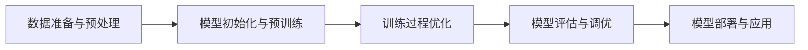

# YOLOv8训练策略：打造高效稳定的训练流程

## 1. 背景介绍
### 1.1 YOLOv8的发展历程
#### 1.1.1 YOLO系列的演进
#### 1.1.2 YOLOv8的特点与优势
### 1.2 训练策略的重要性
#### 1.2.1 高效训练的意义
#### 1.2.2 稳定训练的必要性

## 2. 核心概念与联系
### 2.1 目标检测的基本原理
#### 2.1.1 目标检测的定义与任务
#### 2.1.2 目标检测的评价指标
### 2.2 YOLOv8的网络结构
#### 2.2.1 Backbone网络
#### 2.2.2 Neck网络
#### 2.2.3 Head网络
### 2.3 损失函数与优化器
#### 2.3.1 分类损失
#### 2.3.2 回归损失
#### 2.3.3 优化器选择

## 3. 核心算法原理具体操作步骤
### 3.1 数据准备与预处理
#### 3.1.1 数据集的选择与标注
#### 3.1.2 数据增强技术
#### 3.1.3 数据加载与批处理
### 3.2 模型初始化与预训练
#### 3.2.1 模型权重的初始化策略
#### 3.2.2 预训练模型的选择与使用
### 3.3 训练过程的优化
#### 3.3.1 学习率调度策略
#### 3.3.2 Batch Size与迭代次数的权衡
#### 3.3.3 正则化技术的应用

## 4. 数学模型和公式详细讲解举例说明
### 4.1 目标检测的数学建模
#### 4.1.1 边界框回归的数学表示
#### 4.1.2 分类概率的计算方法
### 4.2 损失函数的数学推导
#### 4.2.1 分类损失函数的推导
#### 4.2.2 回归损失函数的推导
### 4.3 优化算法的数学原理
#### 4.3.1 梯度下降法的数学原理
#### 4.3.2 动量法与AdamW优化器的数学原理

## 5. 项目实践：代码实例和详细解释说明
### 5.1 数据准备与加载
#### 5.1.1 数据集的组织与格式
#### 5.1.2 自定义数据集类的实现
#### 5.1.3 数据加载器的构建
### 5.2 模型构建与初始化
#### 5.2.1 YOLOv8模型的代码实现
#### 5.2.2 模型权重的加载与初始化
### 5.3 训练循环的实现
#### 5.3.1 前向传播与损失计算
#### 5.3.2 反向传播与参数更新
#### 5.3.3 学习率调度与模型保存

## 6. 实际应用场景
### 6.1 自动驾驶中的目标检测
#### 6.1.1 行人与车辆检测
#### 6.1.2 交通标志与信号灯检测
### 6.2 安防监控中的目标检测
#### 6.2.1 人员入侵检测
#### 6.2.2 异常行为检测
### 6.3 工业缺陷检测
#### 6.3.1 表面缺陷检测
#### 6.3.2 零件缺失检测

## 7. 工具和资源推荐
### 7.1 数据标注工具
#### 7.1.1 LabelImg
#### 7.1.2 CVAT
### 7.2 深度学习框架
#### 7.2.1 PyTorch
#### 7.2.2 TensorFlow
### 7.3 预训练模型资源
#### 7.3.1 COCO预训练模型
#### 7.3.2 ImageNet预训练模型

## 8. 总结：未来发展趋势与挑战
### 8.1 模型轻量化与加速
#### 8.1.1 模型剪枝与量化
#### 8.1.2 模型蒸馏与知识蒸馏
### 8.2 小样本学习与迁移学习
#### 8.2.1 少样本学习方法
#### 8.2.2 跨域迁移学习技术
### 8.3 端侧部署与实时推理
#### 8.3.1 模型转换与优化
#### 8.3.2 推理引擎与部署框架

## 9. 附录：常见问题与解答
### 9.1 数据集标注的常见问题
#### 9.1.1 标注格式与规范
#### 9.1.2 标注工具的选择与使用
### 9.2 模型训练的常见问题
#### 9.2.1 过拟合与欠拟合的判断与解决
#### 9.2.2 训练不收敛的原因与对策
### 9.3 模型部署的常见问题
#### 9.3.1 模型转换与优化的注意事项
#### 9.3.2 推理速度与精度的权衡

YOLOv8作为目标检测领域的先进算法，其出色的性能离不开合理的训练策略。本文从数据准备、模型初始化、训练优化等方面入手，详细阐述了如何打造一个高效稳定的YOLOv8训练流程。

首先，数据准备与预处理是训练的基础。选择合适的数据集并进行标注是关键的第一步。数据增强技术如随机裁剪、旋转、平移等可以有效扩充训练样本，提高模型的泛化能力。数据加载与批处理需要合理设置，以充分利用硬件资源。

其次，模型初始化与预训练可以加速收敛并提升性能。合理的权重初始化策略如Xavier初始化、Kaiming初始化等可以帮助模型更快地收敛。使用在大规模数据集上预训练的模型进行迁移学习，可以显著减少训练时间并提高精度。

再次，训练过程的优化是提升性能的关键。学习率调度策略如Warmup、CosineAnnealing等可以帮助模型更平稳地收敛。Batch Size与迭代次数需要权衡，以在训练效率与精度之间取得平衡。正则化技术如L2正则化、Dropout等可以有效缓解过拟合问题。

在数学建模方面，目标检测可以表示为边界框回归与分类概率的组合。损失函数的设计与优化算法的选择都有严格的数学推导与证明。深入理解这些数学原理，有助于我们更好地把控训练过程。

项目实践部分给出了详细的代码实例，展示了如何使用PyTorch实现YOLOv8的训练流程。从数据准备、模型构建到训练循环，每个环节都有详尽的解释说明，帮助读者快速上手。

YOLOv8在自动驾驶、安防监控、工业缺陷检测等领域都有广泛的应用。了解这些实际场景，有助于我们更好地理解算法的实用价值，并针对性地进行优化。

在工具和资源方面，文中推荐了常用的数据标注工具、深度学习框架以及预训练模型资源。合理利用这些工具和资源，可以极大地提升我们的开发效率。

展望未来，YOLOv8的发展还面临着诸多挑战。模型轻量化与加速、小样本学习与迁移学习、端侧部署与实时推理等都是亟待攻克的难题。只有不断创新算法、优化流程，才能推动目标检测技术的进一步发展。

最后，文章的附录部分列出了一些常见问题与解答，帮助读者解决在数据标注、模型训练、模型部署等环节可能遇到的困惑。

总之，打造高效稳定的YOLOv8训练流程需要从数据、模型、优化等多个角度入手。通过合理的策略设计与流程优化，我们可以充分发挥YOLOv8的性能优势，在各类场景中实现精准、实时的目标检测。让我们一起探索YOLOv8的无限可能，为人工智能的发展贡献自己的力量！

作者：禅与计算机程序设计艺术 / Zen and the Art of Computer Programming