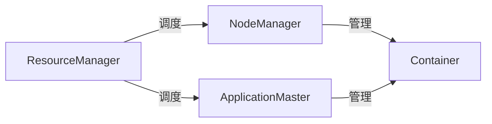

## 1.背景介绍

Yarn，全称Yet Another Resource Negotiator，即另一种资源协调者，是Apache Hadoop的一个子项目，用于进行集群资源管理和调度。Yarn作为Hadoop的第二代MapReduce（MRv2）架构，解决了第一代MapReduce框架在资源管理和调度方面的不足，提高了Hadoop的性能和可扩展性。

## 2.核心概念与联系

Yarn的核心概念主要包括ResourceManager（RM）、NodeManager（NM）、ApplicationMaster（AM）和Container。其中，ResourceManager负责整个系统的资源管理和调度；NodeManager负责单个节点上的资源和任务管理；ApplicationMaster负责单个应用的管理和调度；Container是Yarn中的资源抽象，包括CPU、内存等资源。

这四个核心组件之间的关系可以用下面的Mermaid流程图来表示：



## 3.核心算法原理具体操作步骤

Yarn的资源管理和调度过程主要包括以下步骤：

1. 客户端向ResourceManager提交任务。
2. ResourceManager根据资源情况选择一个NodeManager，启动一个Container运行ApplicationMaster。
3. ApplicationMaster向ResourceManager申请运行任务所需的资源。
4. ResourceManager根据调度策略分配资源，向ApplicationMaster返回资源分配结果。
5. ApplicationMaster与对应的NodeManager通信，启动Container运行任务。
6. 任务运行完毕，ApplicationMaster向ResourceManager注销并释放资源。

## 4.数学模型和公式详细讲解举例说明

在Yarn中，资源调度的核心是公平调度器（FairScheduler）。公平调度器的主要目标是在所有应用之间实现公平的资源分配。公平调度器的工作原理可以用以下公式来表示：

设$R$为系统总资源，$n$为应用数，$r_i$为第$i$个应用获取的资源，$f_i$为第$i$个应用的公平份额，则有：

$$f_i = \frac{R}{n}$$

公平调度器的目标是使每个应用的资源$r_i$尽可能接近其公平份额$f_i$。公平调度器通过调整资源分配，使得应用的资源使用情况满足以下公式：

$$\max_i \frac{r_i}{f_i} \leq 1$$

## 5.项目实践：代码实例和详细解释说明

以下是一个使用Yarn的Java代码示例，用于提交一个MapReduce任务：

```java
Configuration conf = new Configuration();
YarnClient yarnClient = YarnClient.createYarnClient();
yarnClient.init(conf);
yarnClient.start();
YarnClusterMetrics clusterMetrics = yarnClient.getYarnClusterMetrics();
int numNodeManagers = clusterMetrics.getNumNodeManagers();
ApplicationSubmissionContext appContext = yarnClient.createApplication().getSubmissionContext();
appContext.setApplicationName("my-app");
ContainerLaunchContext amContainer = Records.newRecord(ContainerLaunchContext.class);
amContainer.setCommands(Arrays.asList("my-command"));
appContext.setAMContainerSpec(amContainer);
yarnClient.submitApplication(appContext);
```

## 6.实际应用场景

Yarn广泛应用于大数据处理领域，包括数据仓库、实时分析、机器学习等。例如，Hadoop、Spark、Flink等大数据处理框架都支持运行在Yarn上。

## 7.工具和资源推荐

如果你想深入学习和使用Yarn，可以参考以下资源：

- Apache Hadoop官方文档：提供了详细的Yarn介绍和使用指南。
- Hadoop: The Definitive Guide：这本书详细介绍了Hadoop和Yarn的原理和使用方法。

## 8.总结：未来发展趋势与挑战

随着大数据处理需求的增长，Yarn将面临更大的挑战，包括资源管理的效率和灵活性、调度策略的公平性和合理性、系统的稳定性和可扩展性等。同时，Yarn也将持续发展和改进，以满足更多复杂和高性能的大数据处理需求。

## 9.附录：常见问题与解答

1. 问题：Yarn和Hadoop有什么关系？
   答案：Yarn是Hadoop的一个子项目，是Hadoop的第二代MapReduce（MRv2）架构。

2. 问题：Yarn如何进行资源管理和调度？
   答案：Yarn通过ResourceManager、NodeManager、ApplicationMaster和Container四个核心组件进行资源管理和调度。

作者：禅与计算机程序设计艺术 / Zen and the Art of Computer Programming