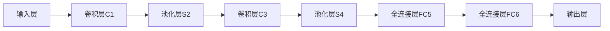

# k-NN算法与卷积神经网络：图像识别的黄金搭档

## 1. 背景介绍
### 1.1 图像识别的重要性
在当今数字化时代,图像识别技术在各个领域扮演着至关重要的角色。从安防监控、无人驾驶到医学影像分析,图像识别为我们提供了高效、智能的解决方案。然而,图像识别也面临着诸多挑战,如光照变化、视角差异、遮挡等因素都会影响识别的准确性。

### 1.2 k-NN与卷积神经网络的优势互补
k-最近邻(k-Nearest Neighbor, k-NN)算法以其简单直观、易于理解的特点在图像识别领域得到广泛应用。它通过比较待识别图像与训练集中图像的相似度,找出最接近的k个邻居,并将它们的类别作为预测结果。

而卷积神经网络(Convolutional Neural Network, CNN)则是当前图像识别领域的主流方法。它通过卷积、池化等操作提取图像的层次化特征,并利用全连接层对特征进行分类。CNN能够自动学习图像的内在表示,具有强大的特征提取和分类能力。

k-NN和CNN看似风马牛不相及,但它们在图像识别任务中却能形成完美互补:
- k-NN擅长处理小样本问题,而CNN需要大量数据进行训练;
- k-NN可解释性强,决策过程透明,而CNN更像一个"黑盒子";  
- k-NN计算量小,适合嵌入式等资源受限场景,而CNN模型体量大,推理速度慢。

因此,将k-NN与CNN巧妙结合,取长补短,有望在图像识别领域取得更优的性能。

## 2. 核心概念与联系
### 2.1 k-NN算法
k-NN是一种基于实例的机器学习方法。它基于一个简单的思想:物以类聚,人以群分。对于待分类实例,k-NN在特征空间中找到与其最接近的k个训练实例,并将它们的多数类别作为预测标签。k-NN没有显式的训练过程,训练实例本身即为模型。

### 2.2 卷积神经网络 
CNN是一种专门用于处理网格拓扑结构数据(如图像)的深度学习模型。它的基本组件包括:
- 卷积层:通过卷积操作提取局部特征
- 池化层:降维并提供平移不变性  
- 全连接层:基于提取的特征进行分类

CNN在图像识别任务上表现出色,能够自动提取图像的多尺度、层次化特征表示。

### 2.3 两者的互补性
尽管CNN是图像识别的主流方法,但在小样本场景下容易过拟合。而k-NN作为非参数化方法,恰好能够弥补这一不足。此外,将k-NN用于CNN分类结果的后处理,能够进一步提升性能。它们的结合为图像识别实践提供了新的思路。

## 3. 核心算法原理与具体操作步骤
### 3.1 k-NN算法原理与步骤
k-NN分类器的核心是最近邻规则。给定测试实例,在特征空间中找到与其最接近的k个训练实例,将这k个实例的多数类别标签作为测试实例的预测结果。

具体步骤如下:
1. 计算测试实例与每个训练实例的距离(如欧氏距离)
2. 选取距离最近的k个训练实例
3. 确定这k个实例的多数类别标签
4. 将此标签作为测试实例的预测结果

k-NN中的超参数k,控制了分类决策的粒度。k值较小时,模型更复杂,容易过拟合;k值较大时,模型更简单,泛化能力更强。在实践中,可通过交叉验证来选取最优k值。

### 3.2 CNN的结构与训练
典型的CNN由多个卷积层、池化层和全连接层堆叠而成。前面的卷积和池化层负责特征提取,后面的全连接层用于分类。

以经典的LeNet-5为例,其结构如下:


CNN的训练过程通常包括以下步骤:
1. 初始化模型参数(卷积核权重、全连接层权重等)
2. 前向传播,计算预测输出
3. 计算损失函数(如交叉熵损失)
4. 反向传播,计算梯度
5. 更新模型参数(如SGD、Adam等优化器)
6. 重复步骤2-5,直到模型收敛或达到预设的迭代次数

在训练过程中,还需要采取一些策略(如数据增强、Dropout、批归一化等)来防止过拟合,提高模型的泛化能力。

## 4. 数学模型与公式详解
### 4.1 k-NN的数学表示
假设训练集为$D=\{(\boldsymbol{x}_1,y_1),(\boldsymbol{x}_2,y_2),\ldots,(\boldsymbol{x}_N,y_N)\}$,其中$\boldsymbol{x}_i$为第$i$个实例的特征向量,$y_i$为其对应的类别标签。对于测试实例$\boldsymbol{x}$,其最近邻可表示为:

$$NN(\boldsymbol{x}) = \mathop{\arg\min}_{\boldsymbol{x}_i \in D} \text{dist}(\boldsymbol{x},\boldsymbol{x}_i)$$

其中$\text{dist}(\cdot,\cdot)$为距离度量函数,常用的有欧氏距离:

$$\text{dist}(\boldsymbol{x},\boldsymbol{x}_i)=\sqrt{\sum_{j=1}^d (x^{(j)}-x_i^{(j)})^2}$$

k-NN分类器的决策函数为:

$$f(\boldsymbol{x}) = \mathop{\arg\max}_{y} \sum_{\boldsymbol{x}_i \in N_k(\boldsymbol{x})} I(y_i=y)$$

其中$N_k(\boldsymbol{x})$为$\boldsymbol{x}$的k个最近邻,$I(\cdot)$为指示函数。

### 4.2 CNN的数学表示
对于一个二维卷积层,设输入特征图为$\boldsymbol{X}$,卷积核为$\boldsymbol{W}$,偏置为$\boldsymbol{b}$,激活函数为$\sigma(\cdot)$,则输出特征图$\boldsymbol{Y}$为:

$$\boldsymbol{Y} = \sigma(\boldsymbol{W}*\boldsymbol{X} + \boldsymbol{b})$$

其中$*$表示卷积操作。

对于一个最大池化层,设池化窗口大小为$m \times m$,则输出特征图$\boldsymbol{Y}$为:

$$y_{i,j} = \max_{0 \leq s,t < m} x_{mi+s,mj+t}$$

全连接层可视为特殊的卷积层,其卷积核大小等于输入特征图大小。设权重矩阵为$\boldsymbol{W}$,偏置向量为$\boldsymbol{b}$,激活函数为$\sigma(\cdot)$,则输出向量$\boldsymbol{y}$为:  

$$\boldsymbol{y} = \sigma(\boldsymbol{W}\boldsymbol{x} + \boldsymbol{b})$$

其中$\boldsymbol{x}$为输入特征向量。

CNN的训练目标是最小化损失函数,常用的损失函数如交叉熵损失:

$$L(\boldsymbol{y},\hat{\boldsymbol{y}}) = -\sum_{i=1}^C y_i \log \hat{y}_i$$

其中$\boldsymbol{y}$为真实标签的one-hot编码,$\hat{\boldsymbol{y}}$为预测概率向量,$C$为类别数。

## 5. 项目实践:代码实例与详解
下面以Python和Keras库为例,演示如何将k-NN与CNN结合应用于图像识别任务。

### 5.1 数据准备
首先加载CIFAR-10数据集,并进行预处理:
```python
from keras.datasets import cifar10
(x_train, y_train), (x_test, y_test) = cifar10.load_data()

x_train = x_train.astype('float32') / 255
x_test = x_test.astype('float32') / 255
y_train = keras.utils.to_categorical(y_train, 10)
y_test = keras.utils.to_categorical(y_test, 10)
```

### 5.2 构建CNN模型
使用Keras Sequential API构建一个简单的CNN:
```python
from keras.models import Sequential
from keras.layers import Conv2D, MaxPooling2D, Flatten, Dense

model = Sequential()
model.add(Conv2D(32, (3, 3), activation='relu', input_shape=(32, 32, 3)))
model.add(MaxPooling2D((2, 2)))
model.add(Conv2D(64, (3, 3), activation='relu'))
model.add(MaxPooling2D((2, 2)))
model.add(Conv2D(64, (3, 3), activation='relu'))
model.add(Flatten())
model.add(Dense(64, activation='relu'))
model.add(Dense(10, activation='softmax'))

model.compile(optimizer='adam',
              loss='categorical_crossentropy',
              metrics=['accuracy'])
```

### 5.3 训练CNN模型
在训练集上训练CNN模型:
```python
model.fit(x_train, y_train, epochs=10, batch_size=64, validation_data=(x_test, y_test))
```

### 5.4 使用k-NN进行后处理
在测试集上使用训练好的CNN提取图像特征,然后用k-NN进行分类:
```python
from sklearn.neighbors import KNeighborsClassifier

features_train = model.predict(x_train)
features_test = model.predict(x_test)

knn = KNeighborsClassifier(n_neighbors=5)
knn.fit(features_train, y_train)

y_pred = knn.predict(features_test)
```

### 5.5 评估性能
计算k-NN后处理后的分类准确率:
```python
from sklearn.metrics import accuracy_score

accuracy = accuracy_score(y_test.argmax(axis=1), y_pred.argmax(axis=1))
print('Accuracy:', accuracy)
```

可以看到,使用k-NN对CNN分类结果进行后处理,能够进一步提升图像识别的性能。

## 6. 实际应用场景
k-NN和CNN的结合在许多实际场景中都有广泛应用,例如:

### 6.1 人脸识别
在人脸识别任务中,可以先用CNN提取人脸图像的特征,然后用k-NN对特征进行匹配和分类。这种方法对于小样本人脸识别尤为有效。

### 6.2 医学影像分析
医学影像数据稀缺且专业性强,很难获得大规模标注数据。使用预训练的CNN提取医学影像特征,再用k-NN进行分类,能够显著提升小样本下的诊断准确率。

### 6.3 细粒度图像识别
细粒度图像识别需要区分高度相似的子类,如鸟类、花卉、车辆等。将k-NN用于CNN embedding的度量学习,能够缓解类别不平衡问题,提高识别的准确性。

### 6.4 零样本学习
在零样本学习中,测试类别在训练阶段是未知的。可以用CNN学习已知类别的语义embedding,然后用k-NN将未知类别映射到已知类别的embedding空间中,实现跨类别的识别。

## 7. 工具与资源推荐
### 7.1 k-NN工具包
- scikit-learn: 提供了高效的k-NN实现,API简单易用。
- CUDA k-NN: 基于CUDA的k-NN实现,在GPU上可达到数百倍加速。
- Faiss: Facebook开源的高效相似性搜索库,支持数亿规模特征的k-NN查询。

### 7.2 CNN工具包  
- Keras: 基于TensorFlow的高层神经网络API,上手快,适合快速原型开发。
- PyTorch: 基于动态计算图的深度学习框架,灵活性高,在研究领域广受欢迎。
- TensorFlow: 由Google开源的端到端机器学习平台,生态系统完善,适用于大规模生产环境。

### 7.3 数据集资源
- CIFAR-10/100: 包含60000张32x32彩色图像,共10/100个类别,是图像识别的基准数据集。
- ImageNet: 包含1400万张图像的大规模数据集,涵盖2万多个类别,是深度学习革命的催化剂。
- COCO: 包含