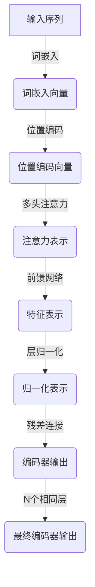
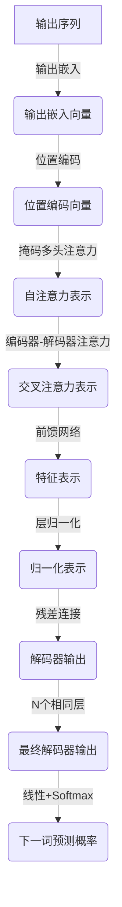

# transformer架构

## 1.背景介绍

在自然语言处理(NLP)和序列建模任务中,Transformer架构是一种革命性的新型神经网络模型,它完全依赖于注意力机制来捕捉输入和输出之间的全局依赖关系,而不使用循环和卷积。Transformer最初是在2017年由Google Brain团队的Vaswani等人提出,用于机器翻译任务,后来也被广泛应用于其他NLP任务,如文本生成、语音识别、对话系统等。

Transformer架构的出现,解决了传统序列模型(如RNN和LSTM)在长序列场景下存在的梯度消失/爆炸问题,提高了并行计算能力,显著提升了训练速度。同时,Transformer完全基于注意力机制,能够有效地学习输入序列中任意两个位置之间的长程依赖关系,大大提高了模型的表达能力。

## 2.核心概念与联系

### 2.1 注意力机制(Attention Mechanism)

注意力机制是Transformer架构的核心,它能够自适应地捕获输入序列中不同位置之间的依赖关系,并对它们进行加权,从而获得更有意义的表示。注意力机制包括以下几个关键概念:

1. **查询(Query)**: 表示当前需要处理的单词或序列位置。
2. **键(Key)**: 表示其他单词或序列位置,用于计算与查询的相关性。
3. **值(Value)**: 表示其他单词或序列位置的值向量,用于生成注意力加权后的表示。
4. **缩放点积注意力(Scaled Dot-Product Attention)**: 计算查询与所有键的相似性,并对值向量进行加权求和,得到注意力表示。

缩放点积注意力的计算公式如下:

$$\mathrm{Attention}(Q, K, V) = \mathrm{softmax}(\frac{QK^T}{\sqrt{d_k}})V$$

其中,Q、K、V分别表示查询、键和值;$d_k$是键的维度,用于缩放点积,防止过大的值导致softmax函数饱和。

### 2.2 多头注意力(Multi-Head Attention)

为了捕捉不同子空间的信息,Transformer使用了多头注意力机制,将查询、键和值进行线性变换后,分别计算多个注意力表示,最后将它们拼接起来,得到最终的注意力表示。多头注意力的计算公式如下:

$$\mathrm{MultiHead}(Q, K, V) = \mathrm{Concat}(head_1, ..., head_h)W^O$$
$$\text{where } head_i = \mathrm{Attention}(QW_i^Q, KW_i^K, VW_i^V)$$

其中,$W_i^Q$、$W_i^K$、$W_i^V$和$W^O$是可学习的线性变换矩阵。

### 2.3 位置编码(Positional Encoding)

由于Transformer完全基于注意力机制,没有捕捉序列顺序的能力,因此需要引入位置编码来赋予序列元素位置信息。位置编码是一个位置相关的向量,它将被加到输入的嵌入向量中。位置编码的计算公式如下:

$$PE_{(pos, 2i)} = \sin(pos / 10000^{2i / d_{model}})$$
$$PE_{(pos, 2i+1)} = \cos(pos / 10000^{2i / d_{model}})$$

其中,pos是序列位置的索引,i是维度的索引,$d_{model}$是模型的维度大小。

## 3.核心算法原理具体操作步骤

Transformer的核心算法原理可以分为编码器(Encoder)和解码器(Decoder)两个部分。

### 3.1 编码器(Encoder)

编码器的作用是将输入序列映射为一系列连续的表示,主要包括以下步骤:

1. **词嵌入(Word Embedding)**: 将输入序列的每个单词映射为一个连续的向量表示。
2. **位置编码(Positional Encoding)**: 将位置编码加到词嵌入向量中,赋予序列元素位置信息。
3. **多头注意力(Multi-Head Attention)**: 在编码器内部,计算输入序列中每个位置与其他所有位置的注意力表示。
4. **前馈网络(Feed-Forward Network)**: 对注意力表示进行非线性变换,捕捉更复杂的特征。
5. **层归一化(Layer Normalization)**: 对每一层的输出进行归一化,加快训练收敛速度。
6. **残差连接(Residual Connection)**: 将上一层的输出与当前层的输出相加,缓解梯度消失/爆炸问题。

编码器中包含N个相同的层,每一层都重复执行上述步骤。最终,编码器输出一系列连续的向量表示,捕捉了输入序列的全局信息。

### 3.2 解码器(Decoder)

解码器的作用是根据编码器的输出和输入序列,生成目标序列。解码器的步骤与编码器类似,但有以下不同:

1. 在多头注意力计算之前,解码器还需要计算一个"掩码(Masked)"多头注意力,用于捕捉当前位置之前的序列信息。
2. 解码器需要计算一个"编码器-解码器注意力",将编码器的输出与解码器的输出进行注意力计算,捕捉输入序列与输出序列之间的依赖关系。

解码器的具体步骤如下:

1. **输出嵌入(Output Embedding)**: 将上一时刻的输出序列映射为连续向量表示。
2. **位置编码(Positional Encoding)**: 将位置编码加到输出嵌入向量中,赋予序列元素位置信息。
3. **掩码多头注意力(Masked Multi-Head Attention)**: 计算当前位置之前的序列信息。
4. **编码器-解码器注意力(Encoder-Decoder Attention)**: 计算输入序列与输出序列之间的注意力表示。
5. **前馈网络(Feed-Forward Network)**: 对注意力表示进行非线性变换,捕捉更复杂的特征。
6. **层归一化(Layer Normalization)**: 对每一层的输出进行归一化,加快训练收敛速度。
7. **残差连接(Residual Connection)**: 将上一层的输出与当前层的输出相加,缓解梯度消失/爆炸问题。

解码器中也包含N个相同的层,每一层都重复执行上述步骤。最终,解码器输出一个概率分布,表示下一个单词的预测概率。

## 4.数学模型和公式详细讲解举例说明

在Transformer架构中,有几个关键的数学模型和公式需要详细讲解。

### 4.1 缩放点积注意力(Scaled Dot-Product Attention)

缩放点积注意力是Transformer中最核心的注意力机制,它计算查询向量与所有键向量的相似性,并对值向量进行加权求和,得到注意力表示。具体计算公式如下:

$$\mathrm{Attention}(Q, K, V) = \mathrm{softmax}(\frac{QK^T}{\sqrt{d_k}})V$$

其中,Q、K、V分别表示查询(Query)、键(Key)和值(Value)矩阵;$d_k$是键的维度,用于缩放点积,防止过大的值导致softmax函数饱和。

例如,假设我们有一个查询向量$q \in \mathbb{R}^{d_k}$,以及一组键向量$K = [k_1, k_2, ..., k_n] \in \mathbb{R}^{n \times d_k}$和值向量$V = [v_1, v_2, ..., v_n] \in \mathbb{R}^{n \times d_v}$,其中n是序列长度,$d_v$是值向量的维度。

首先,我们计算查询向量与每个键向量的点积:

$$e_i = \frac{q \cdot k_i}{\sqrt{d_k}}$$

然后,对点积结果进行softmax操作,得到注意力权重:

$$a_i = \frac{\exp(e_i)}{\sum_{j=1}^n \exp(e_j)}$$

最后,将注意力权重与值向量进行加权求和,得到注意力表示:

$$\mathrm{Attention}(q, K, V) = \sum_{i=1}^n a_i v_i$$

通过缩放点积注意力,Transformer能够自适应地捕获输入序列中任意两个位置之间的依赖关系,并对它们进行加权,从而获得更有意义的表示。

### 4.2 多头注意力(Multi-Head Attention)

为了捕捉不同子空间的信息,Transformer使用了多头注意力机制。多头注意力将查询、键和值进行线性变换后,分别计算多个注意力表示,最后将它们拼接起来,得到最终的注意力表示。具体计算公式如下:

$$\mathrm{MultiHead}(Q, K, V) = \mathrm{Concat}(head_1, ..., head_h)W^O$$
$$\text{where } head_i = \mathrm{Attention}(QW_i^Q, KW_i^K, VW_i^V)$$

其中,$W_i^Q \in \mathbb{R}^{d_{model} \times d_q}$、$W_i^K \in \mathbb{R}^{d_{model} \times d_k}$、$W_i^V \in \mathbb{R}^{d_{model} \times d_v}$和$W^O \in \mathbb{R}^{hd_v \times d_{model}}$是可学习的线性变换矩阵;$d_{model}$是模型的隐藏维度;h是注意力头的数量。

例如,假设我们有一个查询矩阵$Q \in \mathbb{R}^{n \times d_{model}}$,键矩阵$K \in \mathbb{R}^{n \times d_{model}}$和值矩阵$V \in \mathbb{R}^{n \times d_{model}}$,其中n是序列长度。我们设置注意力头的数量为h=4,查询、键和值的维度分别为$d_q=d_k=d_v=64$。

首先,我们对查询、键和值进行线性变换:

$$Q_i = QW_i^Q, K_i = KW_i^K, V_i = VW_i^V, \quad i=1,2,3,4$$

然后,对每个线性变换后的查询、键和值计算缩放点积注意力:

$$head_i = \mathrm{Attention}(Q_i, K_i, V_i), \quad i=1,2,3,4$$

最后,将所有注意力头的输出拼接起来,并进行线性变换,得到多头注意力的输出:

$$\mathrm{MultiHead}(Q, K, V) = \mathrm{Concat}(head_1, head_2, head_3, head_4)W^O$$

通过多头注意力机制,Transformer能够从不同的子空间捕捉不同的特征,提高了模型的表达能力。

### 4.3 位置编码(Positional Encoding)

由于Transformer完全基于注意力机制,没有捕捉序列顺序的能力,因此需要引入位置编码来赋予序列元素位置信息。位置编码是一个位置相关的向量,它将被加到输入的嵌入向量中。位置编码的计算公式如下:

$$PE_{(pos, 2i)} = \sin(pos / 10000^{2i / d_{model}})$$
$$PE_{(pos, 2i+1)} = \cos(pos / 10000^{2i / d_{model}})$$

其中,pos是序列位置的索引,i是维度的索引,$d_{model}$是模型的维度大小。

例如,假设我们有一个长度为5的序列,模型的维度为$