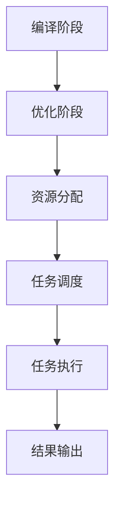
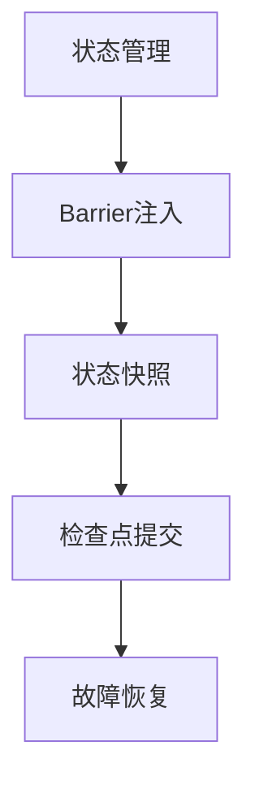
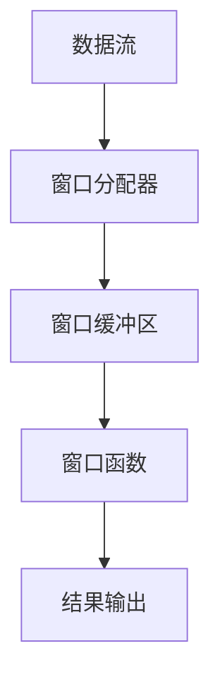
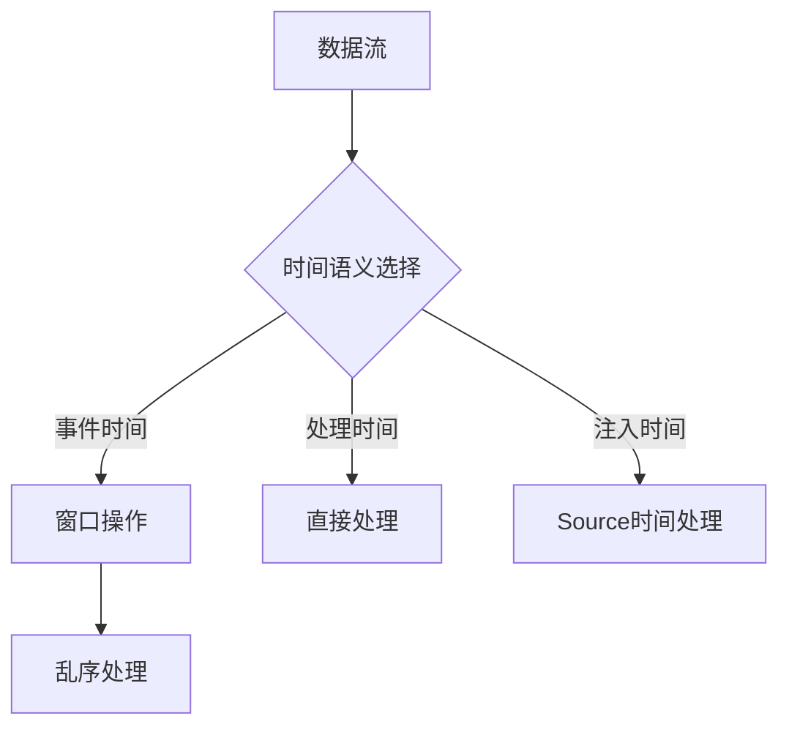

# 【AI大数据计算原理与代码实例讲解】Flink

## 1.背景介绍

### 1.1 大数据时代的到来

随着互联网、物联网、移动互联网等新兴技术的快速发展,数据呈现出爆炸式增长趋势,传统的数据处理方式已经无法满足现代应用对数据处理的需求。大数据时代的到来,对数据处理提出了更高的要求,需要一种全新的数据处理架构和计算模型来应对海量数据、高并发、低延迟等挑战。

### 1.2 流式计算的兴起

为了解决大数据场景下的实时计算需求,流式计算应运而生。与传统的批处理计算不同,流式计算以数据流的形式持续不断地获取数据,并实时对数据进行处理和分析。流式计算具有低延迟、高吞吐量、容错性强等特点,非常适合处理实时数据流,如物联网设备数据、日志数据、金融交易数据等。

### 1.3 Apache Flink 简介

Apache Flink 是一个开源的分布式流式数据处理引擎,能够对有界和无界数据流进行有状态计算。Flink 具有低延迟、高吞吐量、精确一次语义等优势,已经被广泛应用于实时数据分析、数据管道、事件驱动应用等领域。Flink 不仅支持纯流式处理,还支持批处理,可以统一批流处理。

## 2.核心概念与联系

### 2.1 流式数据处理

Flink 的核心是流式数据处理,它将数据抽象为无限流的形式进行处理。流式数据处理的基本概念包括:

- **数据流(Data Stream)**: 一个无限的、不可变的数据记录序列。
- **流分区(Stream Partitions)**: 数据流可以被划分为多个逻辑分区,每个分区包含数据流的一部分数据。
- **算子(Operator)**: 对数据流执行特定操作的函数,如过滤、转换、聚合等。
- **任务(Task)**: 算子的并行实例,负责处理数据流的一个或多个分区。

### 2.2 有状态计算

Flink 支持有状态计算,可以维护和访问算子的状态,这使得 Flink 能够支持更复杂的计算场景,如窗口操作、连接操作等。有状态计算的核心概念包括:

- **键控状态(Keyed State)**: 基于键值对的状态,状态是作用于特定的键上的。
- **操作符状态(Operator State)**: 作用于整个算子上的状态,不区分键。
- **状态后端(State Backend)**: 用于管理和存储状态的组件,支持内存、文件系统、RocksDB 等多种状态存储方式。

### 2.3 时间语义

Flink 支持三种时间语义:事件时间(Event Time)、处理时间(Processing Time)和注入时间(Ingestion Time),可以根据应用场景选择合适的时间语义。时间语义对于处理乱序数据、实现窗口操作等具有重要意义。

### 2.4 容错机制

Flink 采用了基于流水线执行模型的分布式快照机制,能够在发生故障时恢复作业并保证精确一次语义。容错机制的核心概念包括:

- **Barrier(栅栏)**: 用于标记数据流中的一致性快照边界。
- **Checkpoint(检查点)**: 作业状态的一致性快照,用于故障恢复。

### 2.5 核心架构

Flink 采用了主从架构,包括三个核心组件:

- **JobManager(主服务器)**: 负责协调分布式执行,调度任务、协调检查点等。
- **TaskManager(工作节点)**: 执行具体的数据处理任务,在 TaskManager 上运行 Task。
- **ResourceManager(资源管理器)**: 负责管理任务执行的资源(CPU、内存等),并向 JobManager 提供资源。

## 3.核心算法原理具体操作步骤

### 3.1 流执行模型

Flink 采用了基于流水线的执行模型,整个执行流程可以分为以下几个步骤:

1. **编译阶段**: 根据用户编写的程序构建执行计划(StreamGraph)。
2. **优化阶段**: 对执行计划进行优化,如算子链接、数据流分区等。
3. **资源分配**: ResourceManager 根据执行计划分配所需资源。
4. **任务调度**: JobManager 将任务调度到 TaskManager 上执行。
5. **任务执行**: TaskManager 执行任务,生成数据流。
6. **结果输出**: 将计算结果输出到指定的 Sink 中。



### 3.2 有状态计算

Flink 的有状态计算主要依赖于状态后端和检查点机制。具体步骤如下:

1. **状态管理**: 算子的状态由状态后端进行管理,可以选择内存、文件系统或 RocksDB 等存储方式。
2. **Barrier 注入**: 在数据流中注入 Barrier,标记一致性快照边界。
3. **状态快照**: 当 Barrier 到达算子时,算子会对当前状态进行快照,并传递给下游算子。
4. **检查点提交**: 当所有算子的状态快照完成后,JobManager 会将这些快照持久化,形成一个全局一致的检查点。
5. **故障恢复**: 当发生故障时,Flink 会从最近的检查点重新启动作业,恢复算子状态。



### 3.3 窗口操作

Flink 支持多种窗口操作,如滚动窗口、滑动窗口、会话窗口等。窗口操作的核心步骤如下:

1. **窗口分配器**: 根据时间或计数规则,将数据流分配到不同的窗口中。
2. **窗口缓冲区**: 每个窗口对应一个缓冲区,用于存储属于该窗口的数据。
3. **窗口函数**: 在窗口关闭时,对窗口缓冲区中的数据执行用户定义的窗口函数,如聚合、连接等。
4. **结果输出**: 将窗口函数的计算结果输出到下游算子。



### 3.4 时间语义

Flink 支持三种时间语义,具体处理步骤如下:

1. **事件时间**: 根据事件自身携带的时间戳进行处理,需要处理乱序数据。
   - 使用窗口操作对乱序数据进行缓冲和重排序。
   - 设置允许的最大乱序程度,超过该阈值的数据将被丢弃。
2. **处理时间**: 根据数据进入 Flink 的系统时间进行处理,无需处理乱序数据。
3. **注入时间**: 根据数据进入 Source 的时间进行处理,介于事件时间和处理时间之间。



## 4.数学模型和公式详细讲解举例说明

### 4.1 窗口模型

窗口操作是 Flink 的核心功能之一,它将无限数据流划分为有限的窗口,并对每个窗口内的数据进行计算。窗口模型可以用数学表达式来描述。

设无限数据流为 $S = \{e_1, e_2, e_3, \ldots\}$,其中 $e_i$ 表示第 i 个事件。

定义窗口分配函数 $W: S \rightarrow \mathbb{N}$,将每个事件映射到一个窗口编号。

对于任意窗口编号 $w \in \mathbb{N}$,窗口 $W_w$ 包含的事件集合为:

$$W_w = \{e_i \in S | W(e_i) = w\}$$

窗口函数 $F_w$ 对窗口 $W_w$ 内的事件进行计算,输出结果 $r_w$:

$$r_w = F_w(W_w)$$

Flink 支持多种窗口模型,如滚动窗口、滑动窗口、会话窗口等,它们的窗口分配函数 $W$ 不同。

### 4.2 乱序处理模型

在事件时间语义下,由于网络延迟、数据重传等原因,事件可能会乱序到达 Flink。乱序处理模型用于处理这种情况。

设事件 $e_i$ 的事件时间戳为 $t_i$,允许的最大乱序程度为 $\delta$。

定义乱序等级函数 $D(e_i, t)$,表示事件 $e_i$ 相对于水位线 $t$ 的乱序程度:

$$D(e_i, t) = t - t_i$$

事件 $e_i$ 被认为是乱序事件,当且仅当:

$$D(e_i, t) > \delta$$

对于乱序事件,Flink 会将其缓冲在窗口缓冲区中,等待重排序后再进行处理。

### 4.3 检查点模型

Flink 的检查点机制用于实现精确一次语义和容错恢复。检查点模型可以用数学表达式来描述。

设算子链路为 $O_1 \xrightarrow{S_1} O_2 \xrightarrow{S_2} \ldots \xrightarrow{S_{n-1}} O_n$,其中 $O_i$ 表示第 i 个算子,$S_i$ 表示算子之间的数据流。

在时间 $t_k$,系统会触发一个检查点,生成一个全局一致的状态快照 $C_k$:

$$C_k = \{s_1^k, s_2^k, \ldots, s_n^k\}$$

其中 $s_i^k$ 表示算子 $O_i$ 在时间 $t_k$ 的状态快照。

如果发生故障,Flink 可以从最近的检查点 $C_k$ 恢复,重新启动作业,并重放从 $t_k$ 开始的数据流,保证精确一次语义。

## 5.项目实践：代码实例和详细解释说明

### 5.1 WordCount 示例

WordCount 是 Flink 中最经典的示例程序,它统计给定文本中每个单词出现的次数。下面是 Scala 版本的代码示例:

```scala
import org.apache.flink.api.scala._

object WordCount {
  def main(args: Array[String]): Unit = {
    val env = ExecutionEnvironment.getExecutionEnvironment
    val text = env.fromElements("To be or not to be")
    val counts = text.flatMap(_.toLowerCase.split("\\W+"))
                     .map((_, 1))
                     .groupBy(0)
                     .sum(1)
    counts.print()
  }
}
```

代码解释:

1. 创建执行环境 `ExecutionEnvironment`。
2. 从给定的字符串创建数据源 `DataSet`。
3. 使用 `flatMap` 将字符串拆分为单词,并转换为小写。
4. 使用 `map` 将每个单词映射为 `(word, 1)` 的元组。
5. 使用 `groupBy` 按单词分组,使用 `sum` 对每个组内的值求和,得到每个单词的计数。
6. 调用 `print` 输出结果。

### 5.2 实时流处理示例

下面是一个实时流处理的示例,它从 Socket 接收数据流,并统计每个单词出现的次数:

```scala
import org.apache.flink.streaming.api.scala._

object SocketWordCount {
  def main(args: Array[String]): Unit = {
    val env = StreamExecutionEnvironment.getExecutionEnvironment
    val text = env.socketTextStream("localhost", 9999)
    val counts = text.flatMap(_.toLowerCase.split("\\W+"))
                     .map((_, 1))
                     .keyBy(0)
                     .sum(1)
    counts.print()
    env.execute("Socket Window WordCount")
  }
}
```

代码解释:

1. 