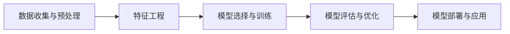

# 【AI大数据计算原理与代码实例讲解】机器学习

## 1.背景介绍
### 1.1 人工智能与机器学习
人工智能(Artificial Intelligence,AI)是计算机科学的一个分支,旨在开发能够模拟人类智能的计算机系统。机器学习(Machine Learning,ML)是实现人工智能的关键途径和核心技术之一。通过机器学习,计算机无需明确编程,就可以通过数据样本来学习规律,具备学习和适应能力。

### 1.2 机器学习的发展历程
机器学习的概念最早由IBM的Arthur Samuel在1959年提出。此后,随着计算机性能的提升和大数据时代的来临,机器学习得到了长足的发展。一些里程碑式的事件包括:
- 1997年,IBM深蓝战胜国际象棋世界冠军卡斯帕罗夫 
- 2006年,Geoffrey Hinton提出深度信念网络(DBN),开创深度学习的先河
- 2016年,AlphaGo战胜围棋世界冠军李世石
- 2022年,Deepmind的AlphaFold准确预测蛋白质结构,为生物医学研究带来突破

### 1.3 机器学习的应用前景
如今,机器学习已广泛应用于各行各业,如计算机视觉、自然语言处理、语音识别、推荐系统、自动驾驶、医疗诊断、金融风控等领域。展望未来,机器学习将持续推动人工智能的发展,为人类生活带来更多便利。同时,机器学习也面临着诸多挑战,如数据质量、模型可解释性、算法偏见等问题亟待解决。

## 2.核心概念与联系
### 2.1 监督学习、无监督学习和强化学习
根据学习方式的不同,机器学习主要分为以下三类:
- 监督学习(Supervised Learning):训练数据带有标签,算法通过学习输入和输出之间的映射关系来预测新样本的输出。常见算法包括线性回归、逻辑回归、支持向量机、决策树、随机森林等。
- 无监督学习(Unsupervised Learning):训练数据没有标签,算法通过发现数据内在的结构和关联来学习数据的特征表示。常见算法包括聚类、降维、异常检测等。
- 强化学习(Reinforcement Learning):通过与环境的交互来学习最优策略,根据采取的行动获得奖励或惩罚,目标是最大化累积奖励。常见算法包括Q-Learning、Sarsa、Policy Gradient等。

### 2.2 机器学习的基本流程
一个完整的机器学习项目通常包括以下步骤:


- 数据收集与预处理:获取原始数据,并进行清洗、集成、转换等操作,为后续步骤做准备。
- 特征工程:从原始数据中提取、选择和构建最能代表样本特点的特征。
- 模型选择与训练:根据任务类型和数据特点选择合适的模型,并使用训练集对模型进行训练。
- 模型评估与优化:使用验证集评估模型性能,并通过调参、正则化等方法对模型进行优化。
- 模型部署与应用:将训练好的模型部署到生产环境,并应用于实际任务中。

### 2.3 损失函数、优化算法和评估指标
机器学习的核心是通过最小化损失函数来学习最优模型参数。常见的损失函数包括:
- 均方误差(Mean Squared Error,MSE):$L(y,\hat{y})=\frac{1}{n}\sum_{i=1}^n(y_i-\hat{y}_i)^2$
- 交叉熵(Cross Entropy):$L(y,\hat{y})=-\frac{1}{n}\sum_{i=1}^n[y_i\log\hat{y}_i+(1-y_i)\log(1-\hat{y}_i)]$

为了最小化损失函数,需要使用优化算法来更新模型参数。常见的优化算法包括:
- 梯度下降(Gradient Descent)
- 随机梯度下降(Stochastic Gradient Descent,SGD)
- Adam

模型训练完成后,需要使用评估指标来衡量模型性能。常见的评估指标包括:
- 准确率(Accuracy)
- 精确率(Precision)、召回率(Recall)和F1分数
- ROC曲线和AUC值
- 均方根误差(Root Mean Squared Error,RMSE)

## 3.核心算法原理具体操作步骤
### 3.1 线性回归
线性回归是一种监督学习算法,用于拟合连续型目标值。其基本思想是找到一个线性函数,使得预测值与真实值之间的误差最小。
$$\hat{y}=w^Tx+b$$
其中,$\hat{y}$为预测值,$w$为权重向量,$x$为输入特征向量,$b$为偏置项。

线性回归的具体步骤如下:
1. 数据预处理:对数据进行归一化、缺失值处理等。
2. 定义模型:初始化权重和偏置。
3. 定义损失函数:常用均方误差。
4. 定义优化算法:常用梯度下降法。
5. 模型训练:迭代更新权重和偏置,直到损失函数收敛或达到最大迭代次数。
6. 模型评估:使用测试集计算评估指标,如RMSE、R平方等。

### 3.2 逻辑回归
逻辑回归是一种常用的二分类算法,通过Sigmoid函数将线性函数的输出映射到(0,1)区间,表示样本属于正类的概率。
$$P(y=1|x)=\frac{1}{1+e^{-(w^Tx+b)}}$$

逻辑回归的具体步骤如下:
1. 数据预处理:对特征进行归一化、独热编码等。
2. 定义模型:初始化权重和偏置。
3. 定义损失函数:常用交叉熵损失。
4. 定义优化算法:常用梯度下降法。
5. 模型训练:迭代更新权重和偏置,直到损失函数收敛或达到最大迭代次数。
6. 模型评估:使用测试集计算评估指标,如准确率、AUC值等。

### 3.3 支持向量机
支持向量机(Support Vector Machine,SVM)是一种常用的分类算法,特别适用于小样本、非线性、高维数据。其基本思想是在特征空间中寻找一个最大间隔超平面,使得不同类别的样本能够被超平面很好地分开。

对于线性可分数据,SVM的目标函数为:
$$\min_{w,b} \frac{1}{2}||w||^2 \quad s.t. \quad y_i(w^Tx_i+b) \geq 1, i=1,2,...,n$$

对于线性不可分数据,引入松弛变量$\xi_i$和惩罚系数$C$,目标函数变为:
$$\min_{w,b,\xi} \frac{1}{2}||w||^2+C\sum_{i=1}^n\xi_i \quad s.t. \quad y_i(w^Tx_i+b) \geq 1-\xi_i, \xi_i \geq 0, i=1,2,...,n$$

SVM的具体步骤如下:
1. 数据预处理:对特征进行归一化。
2. 选择核函数:常用线性核、多项式核、高斯核等。
3. 定义模型:初始化权重、偏置和其他参数。
4. 定义损失函数:常用合页损失。
5. 定义优化算法:常用序列最小优化(SMO)算法。
6. 模型训练:迭代更新权重和偏置,直到达到收敛条件。
7. 模型评估:使用测试集计算评估指标,如准确率、F1分数等。

## 4.数学模型和公式详细讲解举例说明
### 4.1 线性回归的数学模型
线性回归的目标是学习一个线性模型$\hat{y}=w^Tx+b$,使得预测值与真实值之间的均方误差最小。
$$L(w,b)=\frac{1}{n}\sum_{i=1}^n(w^Tx_i+b-y_i)^2$$

为了求解最优的$w$和$b$,需要对损失函数求偏导并令其等于0:
$$\frac{\partial L}{\partial w}=\frac{2}{n}\sum_{i=1}^n(w^Tx_i+b-y_i)x_i=0$$
$$\frac{\partial L}{\partial b}=\frac{2}{n}\sum_{i=1}^n(w^Tx_i+b-y_i)=0$$

求解上述方程组,可得:
$$w=\frac{\sum_{i=1}^n(x_i-\bar{x})(y_i-\bar{y})}{\sum_{i=1}^n(x_i-\bar{x})^2}$$
$$b=\bar{y}-w\bar{x}$$
其中,$\bar{x}$和$\bar{y}$分别为$x$和$y$的均值。

举例说明:假设我们要根据房屋面积预测房价,已知样本数据如下:

| 面积(平方米) | 价格(万元) |
| :----: | :----: |
| 80 | 200 |
| 100 | 250 |
| 120 | 300 |
| 140 | 350 |
| 160 | 400 |

根据公式计算可得:
$$\bar{x}=120, \bar{y}=300$$
$$w=\frac{(80-120)(200-300)+(100-120)(250-300)+...+(160-120)(400-300)}{(80-120)^2+(100-120)^2+...+(160-120)^2}=2.5$$
$$b=300-2.5 \times 120=0$$

因此,预测房价的线性模型为:$\hat{y}=2.5x$。例如,一套面积为110平方米的房子,预测价格为$2.5 \times 110=275$万元。

### 4.2 逻辑回归的数学模型
逻辑回归通过Sigmoid函数将线性函数的输出压缩到(0,1)区间,得到样本属于正类的概率:
$$P(y=1|x)=\frac{1}{1+e^{-(w^Tx+b)}}$$

对于二分类问题,逻辑回归的损失函数为:
$$L(w,b)=-\frac{1}{n}\sum_{i=1}^n[y_i\log P(y=1|x_i)+(1-y_i)\log(1-P(y=1|x_i))]$$

为了求解最优的$w$和$b$,常用梯度下降法迭代更新参数:
$$w:=w-\alpha\frac{\partial L}{\partial w}$$
$$b:=b-\alpha\frac{\partial L}{\partial b}$$
其中,$\alpha$为学习率。

举例说明:假设我们要根据学生的考试成绩预测其是否能够通过考试(分数大于等于60分为通过),已知样本数据如下:

| 分数 | 是否通过 |
| :----: | :----: |
| 50 | 0 |
| 55 | 0 |
| 60 | 1 |
| 65 | 1 |
| 70 | 1 |

根据梯度下降法迭代更新参数,最终得到模型为:
$$P(y=1|x)=\frac{1}{1+e^{-(0.2x-10)}}$$

例如,一个学生的考试成绩为58分,则其通过考试的概率为:
$$P(y=1|x=58)=\frac{1}{1+e^{-(0.2 \times 58-10)}}=0.27$$

因此,预测该学生不能通过考试。

## 5.项目实践:代码实例和详细解释说明
下面以Python语言为例,演示如何使用scikit-learn库实现线性回归和逻辑回归。
### 5.1 线性回归代码实例
```python
from sklearn.linear_model import LinearRegression
from sklearn.datasets import make_regression
from sklearn.model_selection import train_test_split
from sklearn.metrics import mean_squared_error

# 生成随机数据集
X, y = make_regression(n_samples=100, n_features=1, noise=20, random_state=42)

# 划分训练集和测试集
X_train, X_test, y_train, y_test = train_test_split(X, y, test_size=0.2, random_state=42)

# 创建线性回归模型
model = LinearRegression()

# 训练模型
model.fit(X_train, y_train)

# 预测测试集
y_pred = model.predict(X_test)

# 计算均方误差
mse