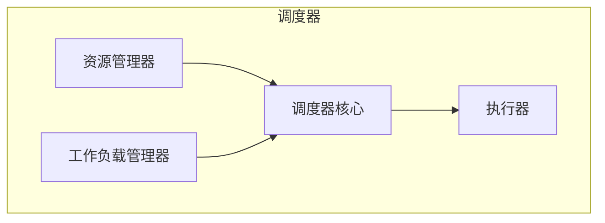

# 【AI大数据计算原理与代码实例讲解】调度器

## 1.背景介绍

在现代计算机系统中,调度器扮演着至关重要的角色。它负责管理和分配系统资源,确保多个进程能够公平、高效地运行。随着人工智能(AI)和大数据技术的快速发展,调度器的设计和实现也面临着新的挑战。

传统的调度器通常基于简单的先来先服务(FCFS)、shortest job first(SJF)等算法,但这些算法在处理AI和大数据工作负载时可能会导致低效或不公平的资源分配。AI和大数据应用程序通常具有以下特点:

- **计算密集型**: 需要大量CPU和GPU资源进行训练和推理
- **数据密集型**: 需要大量内存和存储资源来处理海量数据
- **长时间运行**: 训练过程可能持续数小时或数天
- **不确定性**: 工作负载的资源需求可能会随时间动态变化

因此,我们需要设计更加智能和动态的调度器,能够根据工作负载的特征和系统状态进行精细化的资源管理和调度决策。

## 2.核心概念与联系

在深入探讨调度器的算法和实现之前,我们先介绍一些核心概念:

### 2.1 资源管理

资源管理是调度器的核心职责之一。它包括:

- **资源发现**: 自动发现集群中的可用资源(CPU、GPU、内存、存储等)
- **资源模型**: 将物理资源抽象为逻辑资源模型,方便调度和分配
- **资源分配**: 根据工作负载的需求,动态分配和回收资源

### 2.2 工作负载管理

除了资源管理,调度器还需要对工作负载进行合理管理,包括:

- **工作负载提交**: 用户将AI或大数据作业提交到集群
- **工作负载队列**: 将提交的作业暂存在队列中,等待调度
- **工作负载监控**: 跟踪作业的执行状态和资源使用情况

### 2.3 调度策略

调度策略决定了如何将工作负载分配到可用资源上。常见的调度策略包括:

- **公平共享调度**: 根据作业优先级,公平分配资源
- **容量调度**: 基于资源配额,为不同的团队或项目预留资源
- **机会调度**: 优先选择可以快速运行完成的短作业
- **保守调度**: 避免资源过度使用,预留一部分资源用于处理突发负载

### 2.4 系统架构

现代调度器通常采用微服务架构,由多个模块协同工作:

- **资源管理器**: 负责资源发现、模型和分配
- **工作负载管理器**: 负责作业提交、队列和监控
- **调度器核心**: 根据调度策略做出调度决策
- **执行器**: 在工作节点上启动和管理作业容器



这些模块通过高效的通信机制(如RPC、消息队列等)相互协作,共同实现智能调度的目标。

## 3.核心算法原理具体操作步骤  

调度器的核心是调度算法,它决定了如何将工作负载分配到资源上。我们将介绍两种常用的调度算法:公平共享调度和机会调度。

### 3.1 公平共享调度

公平共享调度(Fair Sharing Scheduling)的目标是根据作业优先级,公平分配资源。它的核心思想是将集群资源视为一个可共享的资源池,并根据作业的权重动态调整资源分配。

具体算法步骤如下:

1. **计算集群资源容量**:统计集群中所有可用的CPU、GPU、内存等资源。
2. **计算作业资源需求**:估计每个作业对CPU、GPU、内存等资源的需求。
3. **计算作业权重**:根据作业优先级、队列优先级等因素,为每个作业分配一个权重值。
4. **计算作业理想资源分配**:根据作业权重和集群资源容量,计算每个作业在理想情况下应该获得的资源份额。
5. **实际资源分配**:尽可能接近理想资源分配,同时考虑资源的可分割性和位置亲和性等约束。
6. **动态调整**:当有新的作业到达或资源发生变化时,重新计算理想资源分配并调整实际分配。

该算法的优点是可以实现资源的公平共享,防止某些作业长期占用大量资源。但缺点是对短作业的响应时间可能较长。

### 3.2 机会调度

机会调度(Opportunity Scheduling)的目标是优先运行可以快速完成的短作业,从而提高集群吞吐量。它基于这样一个观察:在大型集群中,通常存在大量由于资源不足而长期等待的作业,而同时也有部分资源由于资源碎片化而闲置。机会调度就是试图在这些闲置资源上运行短作业,充分利用资源。

具体算法步骤如下:

1. **作业分类**:根据作业的运行时间估计,将作业分为长作业和短作业两类。
2. **资源划分**:将集群资源划分为两部分,分别用于运行长作业和短作业。
3. **长作业调度**:使用公平共享调度等传统算法,将长作业调度到长作业资源池中。
4. **短作业调度**:
    - 统计短作业资源池中的空闲资源
    - 从等待队列中选取资源需求可以匹配空闲资源的短作业
    - 将选中的短作业调度到空闲资源上运行
5. **资源回收**:当短作业完成后,将占用的资源返回短作业资源池,用于调度下一批短作业。
6. **动态调整**:根据长短作业的实际运行时间,动态调整作业分类和资源划分。

该算法的优点是可以提高短作业的响应时间和集群吞吐量,但也可能导致长作业长期等待资源,出现饥饿现象。

## 4.数学模型和公式详细讲解举例说明

在调度算法中,我们需要对资源需求、资源分配等进行数学建模,以便进行量化计算和优化。下面我们将介绍一些常用的数学模型。

### 4.1 资源需求模型

我们可以使用向量来表示作业对各种资源的需求:

$$\vec{R}_j = (r_{j1}, r_{j2}, \ldots, r_{jn})$$

其中$\vec{R}_j$表示作业j对n种资源的需求,如CPU核数、GPU数量、内存大小等。

对于AI和大数据作业,资源需求通常取决于输入数据和模型大小。我们可以使用如下公式对资源需求进行估计:

$$r_{jk} = f_k(D, M)$$

其中$r_{jk}$表示作业j对第k种资源的需求,$D$表示输入数据大小,$M$表示模型大小,$f_k$是一个估计函数,可以通过监控历史作业获得。

### 4.2 资源分配模型

假设集群中有m种资源,n个节点,我们可以使用矩阵$\mathbf{C}$来表示集群资源容量:

$$\mathbf{C} = \begin{bmatrix}
    c_{11} & c_{12} & \cdots & c_{1n} \\
    c_{21} & c_{22} & \cdots & c_{2n} \\
    \vdots & \vdots & \ddots & \vdots \\
    c_{m1} & c_{m2} & \cdots & c_{mn}
\end{bmatrix}$$

其中$c_{ij}$表示第i种资源在第j个节点上的容量。

我们的目标是找到一种资源分配方案$\mathbf{X}$,使得所有作业的资源需求都得到满足,同时资源利用率最大化:

$$\max \sum_{i=1}^m\sum_{j=1}^n x_{ij}$$
$$\text{s.t.} \quad \sum_{j=1}^n x_{ij} \leq c_{ij}, \forall i$$
$$\sum_{i=1}^m x_{ij} \leq \vec{R}_k, \forall j\in \mathcal{J}_k$$

其中$\mathcal{J}_k$表示分配给作业k的节点集合,$\vec{R}_k$表示作业k的资源需求向量。

这是一个经典的整数线性规划问题,可以使用各种求解算法(如分支定界法)来获得最优解或近似解。

### 4.3 公平性度量

在公平共享调度中,我们需要度量资源分配的公平性。一种常用的度量方法是使用夸脱公平(max-min fairness)原则。

对于每种资源$i$,我们定义作业j的dominant share $D_{ij}$为:

$$D_{ij} = \frac{x_{ij}}{\sum_{k\in\mathcal{J}}w_k r_{ki}}$$

其中$w_k$表示作业k的权重,通常取决于作业优先级。

我们的目标是最大化所有作业的最小dominant share:

$$\max \min_{j\in\mathcal{J}} \min_{i} D_{ij}$$

这样可以确保资源分配对所有作业都是公平的。

我们还可以定义作业j的overall dominant share:

$$D_j = \min_i D_{ij}$$

并将其作为调度决策的依据。当$D_j$较小时,表明作业j获得的资源份额较少,应当优先考虑为其分配更多资源。

## 5.项目实践:代码实例和详细解释说明

为了更好地理解调度器的实现,我们将通过一个简单的Python示例来模拟公平共享调度算法。

### 5.1 作业和资源模型

首先,我们定义作业和资源的数据结构:

```python
from collections import namedtuple

# 资源类型
Resource = namedtuple("Resource", ["cpu", "mem"])

# 作业
Job = namedtuple("Job", ["id", "weight", "resource"])
```

其中,`Resource`是一个命名元组,表示CPU和内存资源;`Job`也是一个命名元组,包含作业ID、权重和资源需求。

### 5.2 集群和调度器

接下来,我们定义集群和调度器:

```python
class Cluster:
    def __init__(self, cpu, mem):
        self.resources = Resource(cpu, mem)
        self.jobs = []

    def add_job(self, job):
        self.jobs.append(job)

class FairShareScheduler:
    def __init__(self, cluster):
        self.cluster = cluster

    def schedule(self):
        # 计算集群资源容量
        total_cpu = self.cluster.resources.cpu
        total_mem = self.cluster.resources.mem

        # 计算作业权重总和
        total_weight = sum(job.weight for job in self.cluster.jobs)

        # 计算每个作业的理想资源分配
        ideal_allocations = []
        for job in self.cluster.jobs:
            cpu_share = total_cpu * job.weight / total_weight
            mem_share = total_mem * job.weight / total_weight
            ideal_allocations.append(Resource(cpu_share, mem_share))

        # 实际资源分配
        allocations = []
        remaining_cpu = total_cpu
        remaining_mem = total_mem
        for job, ideal in zip(self.cluster.jobs, ideal_allocations):
            cpu_alloc = min(ideal.cpu, remaining_cpu, job.resource.cpu)
            mem_alloc = min(ideal.mem, remaining_mem, job.resource.mem)
            allocations.append(Resource(cpu_alloc, mem_alloc))
            remaining_cpu -= cpu_alloc
            remaining_mem -= mem_alloc

        return allocations
```

`Cluster`类表示一个集群,包含CPU和内存资源,以及提交的作业列表。`FairShareScheduler`类实现了公平共享调度算法:

1. 计算集群资源容量和作业权重总和
2. 计算每个作业的理想资源分配,即按权重比例分配资源
3. 进行实际资源分配,确保不超过作业需求和集群容量

### 5.3 示例用法

最后,我们来看一个使用示例:

```python
# 创建集群
cluster = Cluster(cpu=16, mem=64)

# 添加作业
job1 = Job(id=1, weight=1, resource=Resource(cpu=4, mem=16))
job2 = Job(id=2, weight=2, resource=Resource(cpu=8, mem=32))
job3 = Job(id=3, weight=3, resource=Resource(cpu=12, mem=48))
cluster.add_job(job1)
cluster.add_job(job2)
cluster.add_job(job3)

# 创建调度器并进行调度