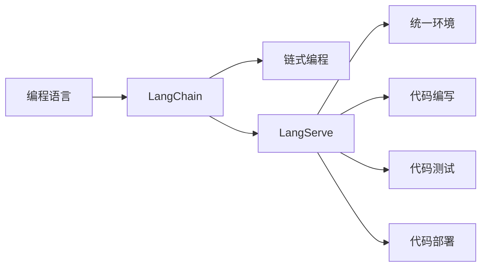

## 1.背景介绍

在当前的计算机科学领域，编程语言是一种特殊的工具，它让我们能够与计算机进行交流，表达我们的思想和创新。在这个领域中，有一种新的编程语言正在崭露头角，它名为LangChain。LangChain是一种基于链式编程理念的编程语言，它的核心服务LangServe为开发者提供了一个全新的编程范式。

## 2.核心概念与联系

LangChain的核心理念是链式编程，也就是说，通过链式的方式，将代码的各个部分连接起来，形成一个完整的程序。这种方式的优点在于，它可以让代码更加清晰，更易于理解和维护。在这个基础上，LangServe提供了一种新的服务模型，它允许开发者在一个统一的环境中，进行代码的编写、测试和部署。



## 3.核心算法原理具体操作步骤

LangChain的核心算法是基于图论的，它通过构建一个代码的依赖图，来实现代码的执行和调试。具体来说，每一段代码都被视为一个节点，而节点之间的依赖关系则通过边来表示。在执行代码时，LangChain会从依赖图的某个节点开始，沿着依赖关系执行代码，直到整个程序执行完毕。

## 4.数学模型和公式详细讲解举例说明

在LangChain中，代码依赖图的构建是基于图论的基本概念。图论中的图可以表示为$G=(V, E)$，其中$V$是节点集，$E$是边集。在LangChain中，每一段代码就是一个节点，节点之间的依赖关系就是边。因此，我们可以将代码依赖图表示为$G=(C, D)$，其中$C$是代码集，$D$是依赖关系集。

## 5.项目实践：代码实例和详细解释说明

下面我们来看一个简单的LangChain代码实例。这个例子中，我们将创建一个简单的链式函数，用于计算两个数字的和。

```langchain
function add(a, b) {
  return a + b;
}

let result = add(1, 2);
```

在这个例子中，`add`函数就是一个节点，而`result`就是依赖于`add`的一个节点。在执行这段代码时，LangChain会首先执行`add`函数，然后再执行`result`。

## 6.实际应用场景

LangChain在许多实际应用场景中都发挥了重要作用。例如，在大数据处理中，我们可以使用LangChain来构建数据处理的工作流，每个数据处理任务都可以看作是一个节点，而任务之间的依赖关系就是边。又如，在微服务架构中，我们可以使用LangChain来管理服务之间的依赖关系，使得服务的管理和维护更加方便。

## 7.工具和资源推荐

如果你对LangChain感兴趣，我推荐你使用以下的工具和资源来学习和实践：

- LangChain官方网站：你可以在这里找到最新的LangChain版本，以及详细的文档和教程。
- LangServe开发环境：这是一个专为LangChain设计的开发环境，它提供了代码编辑、调试和部署的一体化解决方案。

## 8.总结：未来发展趋势与挑战

LangChain作为一种新的编程语言，它的发展趋势是充满了潜力和机遇。然而，作为一种新的技术，LangChain也面临着许多挑战，例如如何提高其性能，如何提高其易用性等。但是，我相信，随着技术的发展和社区的成长，LangChain将会越来越成熟，越来越被广大开发者所接受。

## 9.附录：常见问题与解答

1. **问：LangChain适用于哪些类型的项目？**
答：LangChain适用于需要高度模块化和可重用性的项目，例如大数据处理、微服务架构等。

2. **问：LangChain的性能如何？**
答：LangChain的性能取决于具体的使用场景和代码结构。在一些场景下，LangChain的性能可能不如传统的编程语言，但在其他场景下，LangChain可能会有更好的性能。

3. **问：如何学习LangChain？**
答：你可以通过LangChain的官方网站，以及各种在线教程和书籍来学习LangChain。

作者：禅与计算机程序设计艺术 / Zen and the Art of Computer Programming