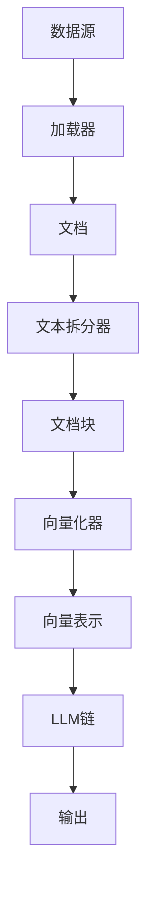

# 【LangChain编程：从入门到实践】加载器

## 1.背景介绍

在构建基于人工智能的应用程序时，处理和加载数据是一个关键步骤。无论是从本地文件、网页、PDF文档还是数据库中获取数据,都需要一种高效且易于使用的方式来加载和预处理数据。LangChain是一个强大的Python库,旨在简化人工智能应用程序的开发过程,其中加载器(Loaders)模块提供了一种统一的方式来加载各种数据源。

### 1.1 什么是LangChain

LangChain是一个用于构建大型语言模型(LLM)应用程序的框架。它提供了一组模块化的Python组件,可以轻松地将LLM与其他系统(如数据库、API和文件系统)集成。LangChain的目标是使开发人员能够快速构建可靠且生产就绪的LLM应用程序。

### 1.2 加载器在LangChain中的作用

在LangChain中,加载器负责从各种数据源加载数据,并将其转换为LangChain可以理解和处理的格式。加载器模块提供了一系列预构建的加载器,可以处理常见的数据格式,如文本文件、PDF、网页等。此外,开发人员还可以创建自定义加载器来满足特定的需求。

加载器在LangChain中扮演着关键角色,因为它们是数据处理管道的入口点。加载器的输出将被传递给其他LangChain组件,如文本拆分器、向量化器和LLM链。因此,选择合适的加载器对于确保数据被正确处理和利用至关重要。

## 2.核心概念与联系

在探讨LangChain加载器的细节之前,让我们先了解一些核心概念和它们之间的关系。

### 2.1 文档(Document)

在LangChain中,文档(Document)是一个基本的数据结构,用于表示从数据源加载的数据。它包含以下主要属性:

- `page_content`: 文档的实际内容,通常是一个字符串。
- `metadata`: 与文档相关的任何元数据,如文件名、URL等。

文档对象是加载器的输出,并被用作后续处理步骤(如文本拆分、向量化等)的输入。

### 2.2 文本拆分器(Text Splitter)

文本拆分器(Text Splitter)是一个LangChain组件,用于将较长的文本分割成更小的段落或块。这是一个关键步骤,因为大多数LLM模型都有输入长度的限制,无法直接处理过长的文本。

文本拆分器接受一个或多个文档作为输入,并输出一系列较短的文档块。这些文档块可以被后续的LangChain组件(如向量化器和LLM链)进一步处理。

### 2.3 向量化器(Vectorizer)

向量化器(Vectorizer)是另一个LangChain组件,用于将文本转换为数值向量表示。这种表示形式可以被机器学习模型(如LLM)更好地理解和处理。

向量化器接受文档块作为输入,并输出相应的向量表示。这些向量可以被用于各种任务,如相似性搜索、聚类和文本分类。

### 2.4 LLM链(LLM Chain)

LLM链(LLM Chain)是LangChain中的核心组件之一,它将加载器、文本拆分器、向量化器等模块组合在一起,构建端到端的LLM应用程序。

LLM链接受加载器输出的文档作为输入,并将它们传递给文本拆分器和向量化器进行预处理。然后,它将预处理后的数据输入到LLM模型中,并根据模型的输出执行相应的操作,如生成文本、回答问题或进行任务。

下面是一个简单的Mermaid流程图,展示了这些核心概念之间的关系:



## 3.核心算法原理具体操作步骤

现在,让我们深入探讨LangChain加载器的工作原理和使用方法。

### 3.1 加载器的类型

LangChain提供了多种预构建的加载器,可以处理各种数据源。以下是一些常见的加载器类型:

1. **文本文件加载器(TextLoader)**: 用于加载纯文本文件(.txt)。
2. **PDF加载器(PDFLoader)**: 用于加载PDF文档。
3. **CSV加载器(CSVLoader)**: 用于加载CSV文件。
4. **PowerPoint加载器(PowerPointLoader)**: 用于加载PowerPoint演示文稿。
5. **网页加载器(WebLoader)**: 用于加载网页内容。
6. **Python加载器(PythonLoader)**: 用于加载Python源代码文件。

除了这些预构建的加载器之外,LangChain还提供了一个基类`BaseLoader`,开发人员可以基于它创建自定义加载器来满足特定的需求。

### 3.2 使用加载器

使用加载器的基本步骤如下:

1. **导入所需的加载器**
2. **实例化加载器对象**
3. **调用加载器的`load()`方法,传入数据源路径或URL**
4. **处理加载器返回的文档对象**

以下是一个使用`TextLoader`加载本地文本文件的示例:

```python
from langchain.document_loaders import TextLoader

# 实例化加载器
loader = TextLoader('path/to/file.txt')

# 加载文件
docs = loader.load()

# 处理文档对象
for doc in docs:
    print(doc.page_content)
```

对于其他类型的加载器,步骤是类似的,只需要导入正确的加载器类并提供相应的数据源路径或URL。

### 3.3 加载器的配置选项

许多加载器都提供了额外的配置选项,可以根据需要进行定制。例如,`PDFLoader`允许您指定是否应该加载PDF文件的书签、是否应该对文本进行OCR处理等。

以下是一个使用`PDFLoader`并配置选项的示例:

```python
from langchain.document_loaders import PDFLoader

# 实例化加载器并设置选项
loader = PDFLoader('path/to/file.pdf', load_bookmarks=True, ocr_mode='auto')

# 加载PDF文件
docs = loader.load()
```

您可以查阅LangChain文档或加载器类的源代码,了解每个加载器提供的配置选项。

### 3.4 自定义加载器

如果预构建的加载器无法满足您的需求,您可以创建自定义加载器。这需要继承`BaseLoader`类并实现`load()`方法。

以下是一个简单的自定义加载器示例,用于加载JSON文件:

```python
from langchain.document_loaders import BaseLoader
import json

class JSONLoader(BaseLoader):
    def __init__(self, file_path):
        self.file_path = file_path

    def load(self):
        with open(self.file_path, 'r') as f:
            data = json.load(f)

        docs = []
        for item in data:
            metadata = {"source": self.file_path}
            docs.append(Document(page_content=str(item), metadata=metadata))

        return docs
```

在这个示例中,我们定义了一个`JSONLoader`类,它继承自`BaseLoader`并实现了`load()`方法。`load()`方法读取JSON文件,遍历数据项,并为每个项目创建一个`Document`对象。

您可以根据需要定制加载器的行为,例如处理不同的数据格式、添加额外的元数据等。

## 4.数学模型和公式详细讲解举例说明

在处理某些类型的数据时,可能需要使用数学模型和公式来提高加载器的性能和准确性。以下是一些常见的情况和相关的数学模型:

### 4.1 文本向量化

在将文本数据输入到LLM模型之前,通常需要将其转换为数值向量表示。这个过程称为文本向量化,可以使用各种模型和技术来实现,如Word2Vec、GloVe、BERT等。

Word2Vec是一种流行的词嵌入模型,它将每个单词映射到一个固定长度的向量空间中。Word2Vec模型的目标是捕捉单词之间的语义和句法关系,使得具有相似含义或上下文的单词在向量空间中彼此靠近。

Word2Vec模型的核心思想是使用浅层神经网络来学习单词的向量表示。它有两种主要的模型架构:连续词袋模型(CBOW)和Skip-Gram模型。

**CBOW模型**:

CBOW模型的目标是根据上下文单词来预测目标单词。给定一个上下文窗口大小 $C$,对于每个目标单词 $w_t$,模型会考虑它前后 $C$ 个单词作为上下文,并尝试预测 $w_t$。

CBOW模型的目标函数可以表示为:

$$J = \frac{1}{T}\sum_{t=1}^{T}\log P(w_t|w_{t-C}, \dots, w_{t-1}, w_{t+1}, \dots, w_{t+C})$$

其中 $T$ 是语料库中的单词总数。

**Skip-Gram模型**:

与CBOW模型相反,Skip-Gram模型的目标是根据目标单词来预测上下文单词。给定一个目标单词 $w_t$,模型会尝试预测它周围 $C$ 个单词。

Skip-Gram模型的目标函数可以表示为:

$$J = \frac{1}{T}\sum_{t=1}^{T}\sum_{-C \leq j \leq C, j \neq 0}\log P(w_{t+j}|w_t)$$

在实践中,Word2Vec模型通常使用负采样或层序Softmax等技术来加速训练过程。

通过训练Word2Vec模型,每个单词都会被映射到一个固定长度的向量空间中,这些向量可以被用作文本数据的数值表示,并输入到下游的LLM模型中进行进一步处理。

### 4.2 文本相似度计算

在某些应用场景中,需要计算不同文本之间的相似度。这可以通过比较它们的向量表示来实现。

一种常见的文本相似度度量是余弦相似度(Cosine Similarity)。给定两个向量 $\vec{a}$ 和 $\vec{b}$,它们的余弦相似度定义为:

$$\text{sim}(\vec{a}, \vec{b}) = \cos(\theta) = \frac{\vec{a} \cdot \vec{b}}{\|\vec{a}\| \|\vec{b}\|} = \frac{\sum_{i=1}^{n}a_i b_i}{\sqrt{\sum_{i=1}^{n}a_i^2} \sqrt{\sum_{i=1}^{n}b_i^2}}$$

其中 $\theta$ 是两个向量之间的夹角, $n$ 是向量的维数。

余弦相似度的取值范围是 $[-1, 1]$,值越接近 1 表示两个向量越相似,值越接近 -1 表示两个向量越不相似。

在LangChain中,您可以使用`sentence_transformer`库来计算文本之间的余弦相似度。以下是一个示例:

```python
from sentence_transformers import SentenceTransformer, util

# 加载预训练的句子编码模型
model = SentenceTransformer('all-MiniLM-L6-v2')

# 定义两个文本
text1 = "This is a sample text."
text2 = "Another example sentence."

# 计算文本的向量表示
embeddings1 = model.encode(text1, convert_to_tensor=True)
embeddings2 = model.encode(text2, convert_to_tensor=True)

# 计算余弦相似度
cosine_score = util.cos_sim(embeddings1, embeddings2)
print(f"Cosine similarity: {cosine_score.item()}")
```

在这个示例中,我们首先加载一个预训练的句子编码模型(`all-MiniLM-L6-v2`)。然后,我们使用该模型计算两个文本的向量表示。最后,我们使用`sentence_transformers`库提供的`util.cos_sim`函数计算两个向量之间的余弦相似度。

通过计算文本的相似度,您可以在各种应用场景中进行文本匹配、聚类和推荐等操作。

## 5.项目实践:代码实例和详细解释说明

为了更好地理解如何在实际项目中使用LangChain加载器,让我们通过一个示例项目来演示。在这个示例中,我们将构建一个简单的问答系统,它可以从本地PDF文件中加载数据,并回答与文件内容相关