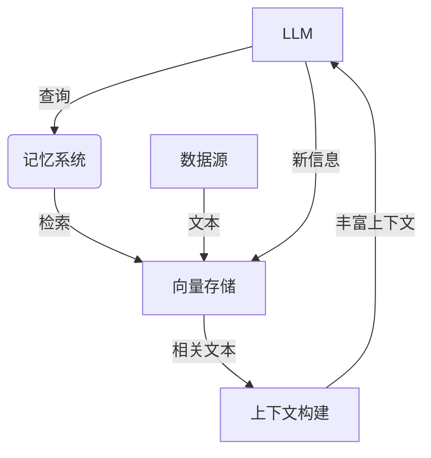

# 【LangChain编程：从入门到实践】构建记忆系统

## 1. 背景介绍

### 1.1 人工智能的新时代

随着人工智能技术的不断发展,我们正处于一个令人兴奋的新时代。大型语言模型(LLM)的出现,为构建智能应用系统提供了新的可能性。LLM具有理解和生成自然语言的能力,可以用于各种任务,如问答、总结、翻译等。然而,单独使用LLM存在一些局限性,例如缺乏持久记忆和上下文理解能力。

### 1.2 LangChain:构建智能应用的新范式

LangChain是一个强大的Python库,旨在简化LLM与其他组件(如知识库、检索系统等)的集成,从而构建具有记忆和上下文理解能力的智能应用。它提供了一种模块化的方式来组合不同的组件,并通过链(Chain)的概念将它们连接起来。这种方法使得开发人员可以专注于应用程序的逻辑,而不必过多关注底层细节。

### 1.3 记忆系统:增强LLM的能力

记忆系统是LangChain中一个关键概念,它允许LLM与外部数据源进行交互,从而获取和存储相关信息。通过记忆系统,LLM可以访问更广泛的知识库,并在处理任务时利用这些信息。这极大地增强了LLM的能力,使其能够解决更复杂的问题,并提供更准确和相关的响应。

## 2. 核心概念与联系

### 2.1 LangChain的核心组件

LangChain由几个核心组件组成,它们协同工作以实现智能应用的构建。以下是一些关键组件:

1. **LLM(Large Language Model)**: 这是整个系统的核心,负责理解和生成自然语言。LangChain支持多种LLM,如GPT-3、BLOOM等。

2. **Prompt(提示)**: 提示是向LLM提供输入的方式,它指导LLM完成特定任务。LangChain提供了多种Prompt模板和工具,以便于构建高质量的提示。

3. **Agent(智能体)**: Agent是一种特殊的链,它可以根据当前状态和目标自主决策和执行操作。这使得构建具有一定自主性的智能系统成为可能。

4. **Memory(记忆)**: 记忆系统允许LLM与外部数据源交互,存储和检索相关信息。这是实现持久记忆和上下文理解的关键。

5. **Tools(工具)**: 工具是一组可执行的函数,用于完成特定任务,如数据检索、计算等。Agent可以调用这些工具来执行操作。

6. **Chain(链)**: 链是将上述组件连接在一起的机制。它定义了组件之间的交互方式,从而实现复杂的应用程序逻辑。

### 2.2 记忆系统的工作原理

记忆系统是LangChain中一个非常重要的概念,它赋予LLM持久记忆和上下文理解的能力。记忆系统的工作原理如下:

1. **数据源**: 记忆系统可以与各种数据源集成,如文本文件、PDF、网页、数据库等。这些数据源构成了LLM可以访问的知识库。

2. **向量存储**: 为了高效地检索相关信息,记忆系统将数据源中的文本转换为向量表示,并存储在向量数据库中。这种向量表示捕捉了文本的语义信息,使得相似文本具有相近的向量表示。

3. **查询和检索**: 当LLM需要获取相关信息时,它会将查询转换为向量表示,然后在向量数据库中搜索最相似的向量(即最相关的文本片段)。

4. **上下文构建**: 检索到的相关文本片段将与LLM的输入组合,形成一个丰富的上下文。LLM可以利用这个上下文来生成更准确和相关的响应。

5. **记忆更新**: 在某些情况下,LLM的输出可能包含新的相关信息。记忆系统可以将这些新信息添加到向量数据库中,从而持续扩展和更新LLM的知识库。

通过这种方式,记忆系统赋予LLM持久的记忆能力,使其能够在广泛的知识领域中获取和利用相关信息,从而提高任务处理的准确性和效率。

## 3. 核心算法原理具体操作步骤

### 3.1 向量化和相似性搜索

记忆系统的核心算法原理是基于向量化和相似性搜索。具体操作步骤如下:

1. **文本分块**: 将数据源中的文本划分为多个文本块(chunks),每个文本块通常包含几百个单词。这是为了便于向量化和检索。

2. **向量化**: 使用预训练的语义模型(如Sentence-BERT)将每个文本块转换为固定长度的向量表示。这种向量表示捕捉了文本的语义信息。

3. **向量存储**: 将文本块的向量表示存储在高效的向量数据库中,如FAISS或Weaviate。这些数据库支持快速的相似性搜索。

4. **查询向量化**: 当LLM发出查询时,将查询转换为向量表示。

5. **相似性搜索**: 在向量数据库中搜索与查询向量最相似的顶部K个向量,即最相关的文本块。

6. **上下文构建**: 将检索到的相关文本块与LLM的原始输入组合,形成丰富的上下文。

7. **LLM响应**: 基于构建的上下文,LLM生成相关的响应。

8. **记忆更新(可选)**: 如果LLM的响应包含新的相关信息,可以将其添加到向量数据库中,以扩展记忆系统的知识库。

这种基于向量化和相似性搜索的方法,使得记忆系统能够高效地从大规模数据源中检索相关信息,并为LLM提供丰富的上下文,从而提高其响应的准确性和相关性。

### 3.2 语义哈希

除了使用预训练的语义模型进行向量化外,LangChain还支持使用语义哈希(Semantic Hashing)技术。语义哈希是一种将文本映射到固定长度哈希值的方法,具有以下特点:

1. **局部敏感性**: 对文本进行微小修改会导致哈希值发生较大变化。
2. **相似性保留**: 相似的文本会产生相似的哈希值。

语义哈希的操作步骤如下:

1. **文本预处理**: 对文本进行标准化预处理,如大小写转换、去除标点符号等。
2. **Token化**: 将文本拆分为一系列Token(通常是单词或子词)。
3. **Token嵌入**: 使用预训练的Token嵌入模型(如Word2Vec或BERT)将每个Token映射到一个固定长度的向量。
4. **哈希计算**: 对Token向量序列应用一种特殊的哈希函数(如SimHash或HashingTrick),生成固定长度的哈希值。

语义哈希的优点是计算效率高,可以快速对大量文本进行向量化。但它也有一些局限性,如无法很好地捕捉长范围的语义信息。因此,在实践中通常需要结合使用语义哈希和预训练语义模型,以获得更好的性能。

### 3.3 相关性评分

在检索到多个相关文本块后,记忆系统需要对它们进行排序,以确定哪些文本块与查询最相关。LangChain提供了多种相关性评分方法,包括:

1. **向量相似度**: 计算查询向量与每个文本块向量之间的余弦相似度,相似度越高,相关性越大。
2. **BM25**: BM25是一种经典的相关性评分算法,它考虑了词频(TF)和逆文档频率(IDF)等因素。
3. **语义内核**: 语义内核是一种基于预训练语言模型的相关性评分方法,它可以捕捉更深层次的语义相关性。

根据具体应用场景和需求,可以选择合适的相关性评分方法。LangChain还支持组合多种评分方法,以获得更准确的相关性排序。

## 4. 数学模型和公式详细讲解举例说明

### 4.1 向量空间模型

记忆系统中的向量化和相似性搜索操作是基于向量空间模型(Vector Space Model)的。在这个模型中,每个文本块被表示为一个固定长度的向量,位于高维向量空间中的一个点。相似的文本块在向量空间中彼此靠近,而不相似的文本块则相距较远。

向量空间模型的数学表示如下:

设有一个语料库 $D$,包含 $N$ 个文本块 $\{d_1, d_2, \ldots, d_N\}$。每个文本块 $d_i$ 被表示为一个 $M$ 维向量 $\vec{v_i} = (w_{i1}, w_{i2}, \ldots, w_{iM})$,其中 $w_{ij}$ 表示第 $j$ 个特征(如词频或语义嵌入)在文本块 $d_i$ 中的权重。

在这个向量空间中,文本块之间的相似度可以使用余弦相似度来计算:

$$\text{sim}(\vec{v_i}, \vec{v_j}) = \frac{\vec{v_i} \cdot \vec{v_j}}{||\vec{v_i}|| \cdot ||\vec{v_j}||} = \frac{\sum_{k=1}^{M} w_{ik} w_{jk}}{\sqrt{\sum_{k=1}^{M} w_{ik}^2} \cdot \sqrt{\sum_{k=1}^{M} w_{jk}^2}}$$

其中 $\vec{v_i} \cdot \vec{v_j}$ 表示向量的点积,而 $||\vec{v_i}||$ 和 $||\vec{v_j}||$ 分别表示向量的范数(通常使用欧几里得范数)。余弦相似度的取值范围为 $[-1, 1]$,值越接近 1,表示两个向量越相似。

在相似性搜索中,我们可以计算查询向量与每个文本块向量之间的余弦相似度,并返回相似度最高的 $K$ 个文本块作为最相关结果。

### 4.2 BM25 相关性评分

BM25是一种经典的相关性评分算法,它综合考虑了词频(TF)、逆文档频率(IDF)和文档长度等因素。BM25的计算公式如下:

$$\text{BM25}(d, q) = \sum_{t \in q} \text{IDF}(t) \cdot \frac{f(t, d) \cdot (k_1 + 1)}{f(t, d) + k_1 \cdot (1 - b + b \cdot \frac{|d|}{avgdl})}$$

其中:

- $d$ 表示文档(文本块)
- $q$ 表示查询
- $t$ 表示查询中的词项
- $f(t, d)$ 表示词项 $t$ 在文档 $d$ 中出现的次数
- $|d|$ 表示文档 $d$ 的长度(词数)
- $avgdl$ 表示语料库中所有文档的平均长度
- $k_1$ 和 $b$ 是可调参数,用于控制词频和文档长度的影响程度

$\text{IDF}(t)$ 表示词项 $t$ 的逆文档频率,计算公式如下:

$$\text{IDF}(t) = \log \frac{N - n(t) + 0.5}{n(t) + 0.5}$$

其中 $N$ 表示语料库中文档的总数,而 $n(t)$ 表示包含词项 $t$ 的文档数。

BM25算法综合了多个因素,可以较好地评估文档与查询之间的相关性。在实践中,通常需要调整 $k_1$ 和 $b$ 参数以获得最佳性能。

## 5. 项目实践:代码实例和详细解释说明

在本节中,我们将通过一个实际项目来演示如何使用LangChain构建一个记忆系统。我们将使用Python和LangChain库,并集成向量数据库Weaviate来存储和检