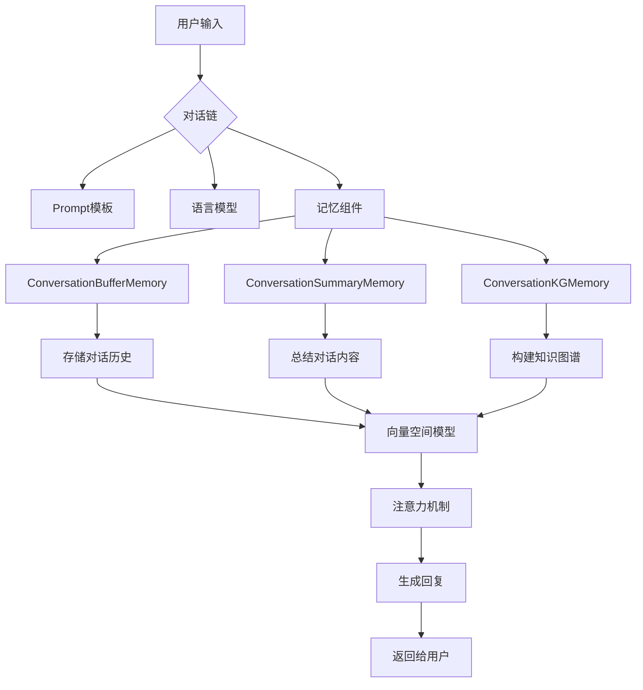

# 【LangChain编程：从入门到实践】记忆组件实战

## 1. 背景介绍
### 1.1 人工智能对话系统的发展历程
#### 1.1.1 早期的规则和模板驱动的对话系统
#### 1.1.2 基于机器学习的对话系统
#### 1.1.3 大语言模型时代的对话系统
### 1.2 LangChain框架介绍
#### 1.2.1 LangChain的起源和发展
#### 1.2.2 LangChain的核心理念
#### 1.2.3 LangChain的主要功能和组件

## 2. 核心概念与联系
### 2.1 LangChain中的链式调用
#### 2.1.1 链的定义和作用
#### 2.1.2 不同类型的链
#### 2.1.3 链的组合与嵌套
### 2.2 LangChain中的Prompt模板
#### 2.2.1 Prompt的概念和作用
#### 2.2.2 创建和使用Prompt模板
#### 2.2.3 Prompt模板的高级用法
### 2.3 LangChain中的记忆组件
#### 2.3.1 记忆组件的定义和作用
#### 2.3.2 不同类型的记忆组件
#### 2.3.3 记忆组件在对话系统中的应用

## 3. 核心算法原理具体操作步骤
### 3.1 ConversationBufferMemory
#### 3.1.1 ConversationBufferMemory的工作原理
#### 3.1.2 创建和配置ConversationBufferMemory
#### 3.1.3 在对话链中使用ConversationBufferMemory
### 3.2 ConversationSummaryMemory
#### 3.2.1 ConversationSummaryMemory的工作原理
#### 3.2.2 创建和配置ConversationSummaryMemory
#### 3.2.3 在对话链中使用ConversationSummaryMemory
### 3.3 ConversationKGMemory
#### 3.3.1 ConversationKGMemory的工作原理
#### 3.3.2 创建和配置ConversationKGMemory
#### 3.3.3 在对话链中使用ConversationKGMemory

## 4. 数学模型和公式详细讲解举例说明
### 4.1 记忆组件中的向量空间模型
#### 4.1.1 向量空间模型的数学定义
#### 4.1.2 向量空间模型在记忆组件中的应用
#### 4.1.3 相似度计算公式及其解释
### 4.2 记忆组件中的注意力机制
#### 4.2.1 注意力机制的数学定义
#### 4.2.2 注意力机制在记忆组件中的应用
#### 4.2.3 注意力权重计算公式及其解释

## 5. 项目实践：代码实例和详细解释说明
### 5.1 使用ConversationBufferMemory构建对话系统
#### 5.1.1 创建和配置ConversationBufferMemory
#### 5.1.2 构建对话链并集成ConversationBufferMemory
#### 5.1.3 运行对话系统并分析结果
### 5.2 使用ConversationSummaryMemory构建对话系统
#### 5.2.1 创建和配置ConversationSummaryMemory
#### 5.2.2 构建对话链并集成ConversationSummaryMemory
#### 5.2.3 运行对话系统并分析结果
### 5.3 使用ConversationKGMemory构建对话系统
#### 5.3.1 创建和配置ConversationKGMemory
#### 5.3.2 构建对话链并集成ConversationKGMemory 
#### 5.3.3 运行对话系统并分析结果

## 6. 实际应用场景
### 6.1 客户服务聊天机器人
#### 6.1.1 客户服务场景的特点和需求
#### 6.1.2 使用LangChain记忆组件构建客服聊天机器人
#### 6.1.3 客服聊天机器人的优势和局限性
### 6.2 个人助理聊天机器人
#### 6.2.1 个人助理场景的特点和需求
#### 6.2.2 使用LangChain记忆组件构建个人助理聊天机器人
#### 6.2.3 个人助理聊天机器人的优势和局限性
### 6.3 知识问答系统
#### 6.3.1 知识问答场景的特点和需求
#### 6.3.2 使用LangChain记忆组件构建知识问答系统
#### 6.3.3 知识问答系统的优势和局限性

## 7. 工具和资源推荐
### 7.1 LangChain官方文档和示例
#### 7.1.1 LangChain官方网站
#### 7.1.2 LangChain Github仓库
#### 7.1.3 LangChain示例项目
### 7.2 相关的开源项目和工具
#### 7.2.1 Hugging Face的Transformers库
#### 7.2.2 OpenAI的GPT系列模型
#### 7.2.3 Rasa对话框架
### 7.3 学习资源和社区
#### 7.3.1 LangChain官方论坛
#### 7.3.2 相关的在线课程和教程
#### 7.3.3 LangChain开发者社区

## 8. 总结：未来发展趋势与挑战
### 8.1 LangChain的未来发展方向
#### 8.1.1 与其他AI框架的集成
#### 8.1.2 支持更多的语言模型和数据源
#### 8.1.3 提供更加灵活和可定制的组件
### 8.2 记忆组件的研究前景
#### 8.2.1 探索新的记忆机制和算法
#### 8.2.2 提高记忆组件的效率和可扩展性
#### 8.2.3 增强记忆组件的解释性和可解释性
### 8.3 对话系统面临的挑战
#### 8.3.1 提高对话的连贯性和上下文理解能力
#### 8.3.2 处理多轮对话和复杂问题
#### 8.3.3 保证对话系统的安全性和伦理性

## 9. 附录：常见问题与解答
### 9.1 如何选择合适的记忆组件？
### 9.2 记忆组件的性能如何优化？
### 9.3 如何处理记忆组件中的噪声和错误信息？
### 9.4 记忆组件与其他对话组件如何协同工作？
### 9.5 如何评估记忆组件的效果和性能？

以上是使用LangChain框架构建对话系统，重点介绍记忆组件的文章大纲。在这篇文章中，我们首先介绍了人工智能对话系统的发展历程和LangChain框架的基本概念。然后重点讲解了LangChain中的记忆组件，包括ConversationBufferMemory、ConversationSummaryMemory和ConversationKGMemory，并详细说明了它们的工作原理和使用方法。

在数学模型部分，我们介绍了记忆组件中常用的向量空间模型和注意力机制，并给出了相关的数学公式和解释。在项目实践部分，我们通过代码实例展示了如何使用不同的记忆组件构建对话系统，并对结果进行了分析。

接下来，我们探讨了记忆组件在客户服务、个人助理和知识问答等实际应用场景中的应用，并推荐了一些有用的工具和学习资源。最后，我们总结了LangChain和记忆组件的未来发展趋势和面临的挑战，并在附录中解答了一些常见问题。

通过这篇文章，读者可以全面了解LangChain框架中记忆组件的原理和应用，掌握使用记忆组件构建智能对话系统的方法，并对人工智能对话系统的发展有更深入的认识。希望这篇文章能为从事对话系统研究和开发的读者提供有价值的参考和指导。

作者：禅与计算机程序设计艺术 / Zen and the Art of Computer Programming