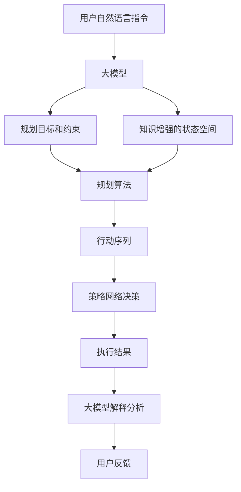
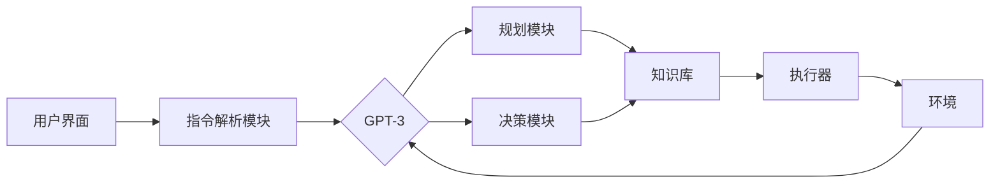

# 【大模型应用开发 动手做AI Agent】Agent的规划和决策能力

## 1. 背景介绍
### 1.1 大模型与AI Agent的兴起
近年来,随着深度学习技术的飞速发展,大规模语言模型(Large Language Models, LLMs)在自然语言处理领域取得了突破性进展。GPT-3、PaLM、LaMDA等大模型展现出了惊人的语言理解和生成能力,为构建更加智能化的AI Agent奠定了基础。

### 1.2 Agent的规划与决策能力
一个真正智能的AI Agent不仅需要具备语言交互能力,更需要拥有规划(Planning)和决策(Decision Making)的能力。规划能力使Agent能够根据目标制定行动计划,而决策能力则赋予Agent在面对不确定性时做出最优选择的智慧。这两项能力是打造高级AI Agent不可或缺的关键要素。

### 1.3 大模型赋能Agent的规划决策
传统的规划和决策算法,如启发式搜索、动态规划等,在处理复杂任务时往往面临计算复杂度高、领域适应性差等挑战。而大模型强大的知识表征和推理能力,为克服这些难题提供了新的思路。通过大模型,我们可以构建拥有更强规划决策能力的AI Agent,推动人工智能在更广泛领域的应用。

## 2. 核心概念与联系
### 2.1 大模型(Large Language Models)
大模型是指参数量达到数亿、数十亿甚至更多的超大规模语言模型。它们通过在海量文本数据上进行预训练,习得了丰富的语言知识和常识推理能力。代表性的大模型有GPT系列、BERT系列、PaLM、LaMDA等。

### 2.2 规划(Planning)
规划是指根据给定的初始状态、目标状态以及可执行的行动,寻找一系列行动序列以达成目标的过程。经典的规划问题包括路径规划、任务规划等。规划过程通常涉及状态空间搜索,需要考虑行动的前提条件和效果。

### 2.3 决策(Decision Making)  
决策是指在面临多个选择方案时,根据一定的策略或价值判断,选择最优方案的过程。马尔可夫决策过程(Markov Decision Process, MDP)是描述决策问题的经典框架,包含状态、行动、转移概率和奖励函数等要素。

### 2.4 大模型与规划决策的结合
大模型可以通过多种方式增强Agent的规划决策能力:
1. 语言指令理解:大模型可以准确理解用户的自然语言指令,将其转化为明确的规划目标和约束条件。
2. 知识引导的搜索:大模型蕴含的海量知识可以指导规划算法进行更高效的搜索,缩小搜索空间。
3. 策略学习:大模型可以作为策略网络,通过强化学习等方法学习最优决策策略。
4. 推理与决策解释:大模型可以对规划决策的结果进行解释和分析,增强系统的可解释性和可信度。

下图展示了大模型与规划决策结合的整体架构:



## 3. 核心算法原理与操作步骤
### 3.1 基于大模型的规划算法
#### 3.1.1 语言指令理解
1. 利用大模型对用户输入的自然语言指令进行编码,得到指令表示向量。
2. 使用指令解析模块将指令向量解析为结构化的规划目标和约束条件。
3. 将解析结果传递给下游的规划算法。

#### 3.1.2 知识引导的启发式搜索
1. 将当前状态编码为向量表示,输入大模型。  
2. 大模型根据状态向量和内部知识,生成下一步可能的行动及其优先级。
3. 根据大模型的输出,选择优先级最高的行动进行扩展搜索。
4. 重复步骤1-3,直到达到目标状态或满足终止条件。

### 3.2 基于大模型的决策算法
#### 3.2.1 马尔可夫决策过程求解
1. 使用大模型作为策略网络,根据当前状态生成行动概率分布。
2. 根据行动概率分布采样得到具体行动,或选择概率最大的行动。
3. 执行选定的行动,环境进入下一个状态,并获得相应的奖励。 
4. 利用TD学习或策略梯度等方法更新策略网络(大模型)的参数。
5. 重复步骤1-4,直到策略网络收敛或达到预设的训练轮数。

#### 3.2.2 蒙特卡洛树搜索(MCTS)
1. 从根节点(当前状态)出发,使用大模型生成可能的行动。
2. 对每个行动,递归执行选择、扩展、模拟、回溯四个步骤:
   - 选择:基于UCB等策略选择最优子节点
   - 扩展:使用大模型生成所选节点的后继状态
   - 模拟:从新扩展的节点开始,使用大模型快速模拟对局直到终止
   - 回溯:将模拟结果更新到路径上的所有节点   
3. 重复步骤2,直到满足迭代次数或时间限制。
4. 根据根节点处的访问次数或平均价值,选择最优行动。

## 4. 数学模型与公式详解
### 4.1 马尔可夫决策过程(MDP)
MDP由四元组 $<S,A,P,R>$ 定义:
- $S$:状态集合
- $A$:行动集合 
- $P$:状态转移概率函数,$P(s'|s,a)$表示在状态$s$下执行行动$a$后转移到状态$s'$的概率
- $R$:奖励函数,$R(s,a)$表示在状态$s$下执行行动$a$获得的即时奖励

求解MDP的目标是寻找最优策略 $\pi^*$,使得期望累积奖励最大化:

$$\pi^* = \arg\max_\pi E[\sum_{t=0}^{\infty} \gamma^t R(s_t,a_t)|s_0,\pi]$$

其中,$\gamma \in [0,1]$为折扣因子。

### 4.2 MCTS中的UCB公式
UCB(Upper Confidence Bound)用于平衡探索和利用,选择最优子节点:

$$UCB(s,a) = \frac{Q(s,a)}{N(s,a)} + c \sqrt{\frac{\ln N(s)}{N(s,a)}}$$

其中:
- $Q(s,a)$:节点的平均价值 
- $N(s,a)$:节点的访问次数
- $c$:探索常数,控制探索的程度

## 5. 项目实践:基于GPT-3的自动规划决策系统
### 5.1 系统架构


### 5.2 核心代码
#### 5.2.1 指令解析
```python
import openai

def parse_instruction(instruction):
    prompt = f"请将以下指令解析为结构化的规划目标和约束条件:\n{instruction}"
    response = openai.Completion.create(
        engine="text-davinci-002",
        prompt=prompt,
        max_tokens=100,
        n=1,
        stop=None,
        temperature=0.5,
    )
    
    parsed_result = response.choices[0].text.strip()
    return parsed_result
```

#### 5.2.2 知识引导的搜索
```python
def knowledge_guided_search(state):
    prompt = f"当前状态:{state}\n基于你的知识,请给出下一步最优行动及其优先级:"
    response = openai.Completion.create(
        engine="text-davinci-002",
        prompt=prompt,
        max_tokens=50,
        n=1,
        stop=None,
        temperature=0.7,
    )
    
    action_priority = response.choices[0].text.strip()
    return action_priority
```

#### 5.2.3 基于GPT-3的MCTS
```python
class GPT3MCTS:
    def __init__(self, state, num_iterations):
        self.root = Node(state)
        self.num_iterations = num_iterations
        
    def search(self):
        for _ in range(self.num_iterations):
            node = self.select(self.root)
            if not node.is_terminal():
                node = self.expand(node)
            reward = self.simulate(node)
            self.backpropagate(node, reward)
        return self.best_action(self.root)
    
    def select(self, node):
        while not node.is_terminal():
            if not node.is_fully_expanded():
                return node
            node = node.best_child()
        return node
    
    def expand(self, node):
        actions = self.generate_actions(node.state)
        for action in actions:
            child_state = self.get_next_state(node.state, action)
            child_node = Node(child_state, parent=node, action=action)
            node.children.append(child_node)
        return node.best_child()
    
    def simulate(self, node):
        state = node.state
        while not self.is_terminal(state):
            action = self.generate_action(state)
            state = self.get_next_state(state, action)
        return self.get_reward(state)
    
    def backpropagate(self, node, reward):
        while node is not None:
            node.update(reward)
            node = node.parent
            
    def best_action(self, node):
        return max(node.children, key=lambda c: c.value()).action
    
    def generate_actions(self, state):
        prompt = f"当前状态:{state}\n请列出所有可能的下一步行动:"
        response = openai.Completion.create(
            engine="text-davinci-002",
            prompt=prompt,
            max_tokens=100,
            n=1,
            stop=None,
            temperature=0.7,
        )
        actions = response.choices[0].text.strip().split('\n')
        return actions
    
    def generate_action(self, state):
        prompt = f"当前状态:{state}\n请给出下一步最优行动:"
        response = openai.Completion.create(
            engine="text-davinci-002",
            prompt=prompt,
            max_tokens=20,
            n=1,
            stop=None,
            temperature=0.7,
        )
        action = response.choices[0].text.strip()
        return action
    
    def get_next_state(self, state, action):
        prompt = f"当前状态:{state}\n执行行动:{action}\n请给出执行后的新状态:"
        response = openai.Completion.create(
            engine="text-davinci-002",
            prompt=prompt,
            max_tokens=50,
            n=1,
            stop=None,
            temperature=0.5,
        )
        next_state = response.choices[0].text.strip()
        return next_state
    
    def is_terminal(self, state):
        prompt = f"当前状态:{state}\n请判断这个状态是否是终止状态,是则返回'是',否则返回'否':"
        response = openai.Completion.create(
            engine="text-davinci-002",
            prompt=prompt,
            max_tokens=1,
            n=1,
            stop=None,
            temperature=0.5,
        )
        is_terminal = response.choices[0].text.strip() == '是'
        return is_terminal
    
    def get_reward(self, state):
        prompt = f"当前状态:{state}\n请返回该终止状态下的奖励值,范围为0到1:"
        response = openai.Completion.create(
            engine="text-davinci-002",
            prompt=prompt,
            max_tokens=1,
            n=1,
            stop=None,
            temperature=0.5,
        )
        reward = float(response.choices[0].text.strip())
        return reward

class Node:
    def __init__(self, state, parent=None, action=None):
        self.state = state
        self.parent = parent
        self.action = action
        self.children = []
        self.visits = 0
        self.value_sum = 0
        
    def is_fully_expanded(self):
        return len(self.children) > 0
    
    def best_child(self, c=1.4):
        weights = [child.value() + c * (np.log(self.visits) / child.visits) ** 0.5 
                   for child in self.children]
        return self.children[np.argmax(weights)]
    
    def value(self):
        if self.visits == 0:
            return 0
        return self.value_sum / self.visits
    
    def update(self, reward):
        self.visits += 1
        self.value_sum += reward
        
    def