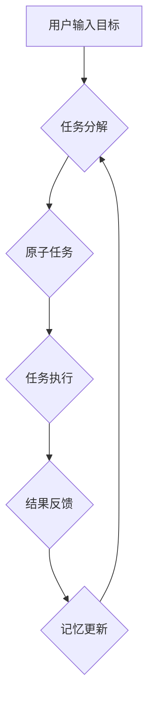

# 【大模型应用开发 动手做AI Agent】BabyAGI简介

## 1. 背景介绍
### 1.1 大语言模型的兴起
近年来,随着深度学习技术的飞速发展,大语言模型(Large Language Model, LLM)在自然语言处理领域取得了突破性进展。从GPT-3到ChatGPT,LLM展现出了惊人的语言理解和生成能力,引发了学术界和工业界的广泛关注。

### 1.2 AI Agent的概念
AI Agent是一种能够感知环境、自主决策并采取行动的智能体系统。它综合运用了人工智能、机器学习等技术,旨在模拟人类的认知和决策过程,实现智能化的交互和任务处理。

### 1.3 BabyAGI的提出
在LLM蓬勃发展的背景下,一个名为BabyAGI的开源项目应运而生。BabyAGI尝试将LLM与AI Agent结合,探索如何利用大模型构建实用的智能应用。它为开发者提供了一个简洁而强大的框架,帮助大家快速上手AI Agent开发。

## 2. 核心概念与联系
### 2.1 任务分解(Task Decomposition) 
任务分解是将复杂任务拆解为多个子任务的过程。BabyAGI采用递归的方式,通过LLM对用户输入的高层次目标进行逐步细化,直到分解出可执行的原子任务。

### 2.2 任务执行(Task Execution)
在得到原子任务后,BabyAGI利用LLM的语言生成能力,根据任务描述产生对应的动作指令。这些指令可以是信息检索、数据分析、知识推理等,通过API接口调用外部工具完成。

### 2.3 记忆与上下文(Memory & Context)
BabyAGI引入了记忆机制,用于存储Agent执行任务过程中的中间状态和上下文信息。这使得Agent能够在连续的交互中保持对话的连贯性,并根据历史信息动态调整任务执行策略。

### 2.4 反馈与迭代优化(Feedback & Iterative Optimization) 
BabyAGI支持对Agent的行为进行评估和反馈。用户可以对执行结果的质量打分,Agent会基于反馈对自身的任务分解和执行策略进行迭代优化,不断提升性能。

### 2.5 Mermaid流程图
下面是BabyAGI的核心工作流程:



## 3. 核心算法原理与操作步骤
### 3.1 任务分解算法
BabyAGI采用启发式的任务分解算法,主要步骤如下:

1. 将用户输入的目标作为初始任务,加入任务队列 
2. 循环执行以下步骤,直到任务队列为空:
   a. 从队列中取出当前任务
   b. 使用LLM对当前任务进行分解,生成子任务
   c. 如果子任务可直接执行,则执行并记录结果
   d. 否则,将子任务加入任务队列,继续分解
3. 将所有任务的执行结果进行整合,输出最终结果

### 3.2 任务执行流程
BabyAGI的任务执行流程如下:

1. 根据原子任务的描述,使用LLM生成对应的动作指令
2. 调用相应的API接口,传入动作指令并获取执行结果  
3. 对执行结果进行解析和提取,更新Agent的记忆
4. 如果当前任务未完成,则根据新的状态信息生成后续指令,重复步骤2-4
5. 任务完成后,将执行结果返回给上层任务

### 3.3 记忆存储与检索
BabyAGI使用Key-Value形式的记忆存储,每个任务执行过程中的状态信息都会以<Task ID, State>的形式保存。在生成动作指令时,Agent会检索与当前任务相关的历史记忆,作为上下文信息辅助决策。记忆的更新遵循FIFO原则,当存储空间不足时,优先替换最早的记录。

## 4. 数学模型与公式说明
### 4.1 目标分解模型
我们可以将目标分解过程抽象为一个树形结构。设初始目标为根节点 $G_0$,经过 $n$ 轮分解后,第 $i$ 轮分解得到的子任务集合为 $\mathbb{G}_i$。则有:

$$
\mathbb{G}_i=\{G_{i1},G_{i2},...,G_{im}\}, i=1,2,...,n
$$

其中, $G_{ij}$ 表示第 $i$ 轮分解得到的第 $j$ 个子任务。任务分解的终止条件是: $\forall G_{ij} \in \mathbb{G}_n$ , $G_{ij}$ 都是可直接执行的原子任务。

### 4.2 任务执行模型
假设Agent的动作空间为 $\mathbb{A}$,则任务 $G_{ij}$ 经LLM映射得到的动作指令为 $a_{ij} \in \mathbb{A}$。执行 $a_{ij}$ 后,环境状态从 $s$ 转移到 $s'$,并产生奖励 $r$。这可以用一个状态转移函数 $\mathcal{T}$ 表示:

$$
\mathcal{T}(s,a_{ij})=(s',r)
$$

Agent的目标是最大化累积奖励:

$$
R=\sum_{t=0}^{T} \gamma^t r_t
$$

其中, $\gamma \in [0,1]$ 是折扣因子, $T$ 是任务的时间步长。

### 4.3 记忆更新公式
设Agent的记忆空间为 $\mathbb{M}$,则在时间步 $t$,记忆 $M_t \in \mathbb{M}$ 的更新公式为:

$$
M_t=\begin{cases}
M_{t-1} \cup (G_{ij},s_t), & \text{if } |\mathbb{M}| < K \\
(M_{t-1} \setminus M_0) \cup (G_{ij},s_t), & \text{otherwise}
\end{cases}
$$

其中, $K$ 是记忆空间的最大容量, $M_0$ 是 $\mathbb{M}$ 中最早的记录。

## 5. 项目实践:代码实例与说明
下面是BabyAGI的核心代码实现,基于Python和OpenAI API:

```python
import openai
from collections import deque

class BabyAGI:
    def __init__(self, api_key, max_memory=10):
        openai.api_key = api_key
        self.memory = deque(maxlen=max_memory)
        
    def decompose_task(self, task):
        prompt = f"Please decompose the following task into subtasks: {task}"
        response = openai.Completion.create(
            engine="text-davinci-002",
            prompt=prompt,
            max_tokens=100,
            n=1,
            stop=None,
            temperature=0.5,
        )
        subtasks = response.choices[0].text.strip().split("\n")
        return subtasks
    
    def execute_task(self, task):
        self.memory.append(task)
        context = "\n".join(self.memory)
        prompt = f"Given the task '{task}' and the following context:\n{context}\nPlease provide the next action to take."
        response = openai.Completion.create(
            engine="text-davinci-002",
            prompt=prompt,
            max_tokens=50,
            n=1,
            stop=None,
            temperature=0.5,
        )
        action = response.choices[0].text.strip()
        # Execute the action using appropriate APIs
        # ...
        result = "Action executed successfully"
        self.memory.append(result)
        return result
    
    def run(self, goal):
        tasks = [goal]
        while tasks:
            task = tasks.pop(0)
            subtasks = self.decompose_task(task)
            if len(subtasks) == 1 and subtasks[0].lower() == task.lower():
                result = self.execute_task(task)
                print(f"Task '{task}' executed with result: {result}")
            else:
                tasks.extend(subtasks)
        print("All tasks completed!")

```

在上述代码中,我们定义了`BabyAGI`类,其中:

- `__init__`方法初始化了OpenAI API密钥和Agent的记忆空间
- `decompose_task`方法使用LLM对任务进行分解,返回子任务列表
- `execute_task`方法根据任务生成动作指令并执行,同时更新记忆
- `run`方法实现了完整的任务分解与执行逻辑,直到所有任务完成

可以看到,BabyAGI的实现非常简洁,主要依赖于OpenAI提供的LLM接口。开发者可以基于这个框架,快速搭建起自己的AI Agent应用。

## 6. 实际应用场景
BabyAGI的潜在应用场景非常广泛,包括但不限于:

### 6.1 智能客服
利用BabyAGI构建的智能客服Agent可以自动解析用户问题,并通过任务分解和知识检索,提供准确、全面的解答。相比传统的规则或检索式客服,BabyAGI能够处理更加复杂和开放式的问题,大大提升用户体验。

### 6.2 个人助理
BabyAGI可以作为智能个人助理,帮助用户管理日程、处理邮件、安排会议等日常事务。用户只需用自然语言描述高层次的需求,BabyAGI就能自动拆解任务并执行,极大提高工作和生活效率。

### 6.3 智能教育
将BabyAGI应用于教育领域,可以实现个性化的智能教学。学生可以与AI老师进行交互,获得针对性的学习指导和问题解答。BabyAGI还可以根据学生的学习进度和反馈,动态调整教学策略,因材施教。

### 6.4 医疗诊断
医疗领域知识庞杂,诊断流程复杂。BabyAGI可以作为医生的智能助手,帮助医生进行初步的病情分析和鉴别诊断。通过任务分解,BabyAGI能够梳理诊断思路,提示医生可能遗漏的关键信息,提高诊断效率和准确性。

## 7. 工具与资源推荐
### 7.1 OpenAI API
OpenAI提供了功能强大的LLM接口,包括Davinci、Curie等不同性能的模型。开发者可以根据需求选择合适的模型,并通过API调用实现各种NLP任务。

官网:https://www.openai.com/

### 7.2 Hugging Face
Hugging Face是一个开源的NLP社区和工具平台。它提供了大量预训练的语言模型和NLP工具包,如BERT、GPT、Transformers等。开发者可以利用这些资源快速构建自己的NLP应用。

官网:https://huggingface.co/

### 7.3 LangChain
LangChain是一个基于LLM的应用开发框架,它封装了对话管理、知识检索、代码执行等常用功能模块,帮助开发者更高效地构建LLM应用。BabyAGI就是受LangChain启发而诞生的。

官网:https://www.langchain.dev/

### 7.4 AutoGPT
AutoGPT是一个开源的自主AI Agent项目,它展示了如何利用LLM实现自动任务规划、执行和迭代优化。AutoGPT的代码结构清晰,易于理解和扩展,是学习构建AI Agent的优秀范例。

Github:https://github.com/Significant-Gravitas/Auto-GPT

## 8. 总结:未来发展与挑战
BabyAGI代表了LLM在智能应用开发领域的一次有益探索。它简洁的架构和强大的功能,为开发者提供了一种新的思路:如何将语言理解、任务规划、知识推理等AI能力整合到实际应用中去。

未来,BabyAGI还有许多改进和优化的空间,例如:

- 引入更先进的任务分解算法,如层次化任务网络(HTN)等,实现更高效、更鲁棒的任务规划
- 集成语音识别和语音合成等多模态交互能力,打造更自然、更人性化的交互体验
- 探索LLM与知识图谱、因果推理等技术的结合,赋予Agent更强的逻辑推理和决策能力
- 在数据安全和隐私保护方面进行专门设计,确保Agent在处理敏感数据时合规可控

当然,BabyAGI的发展也面临着一些挑战:

- 如何在有限