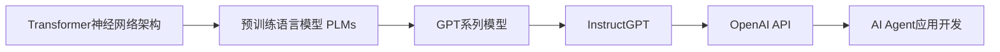

# 【大模型应用开发 动手做AI Agent】OpenAI API的聊天程序示例

## 1. 背景介绍
### 1.1 大语言模型的崛起
近年来,随着深度学习技术的飞速发展,自然语言处理(NLP)领域取得了突破性的进展。尤其是以Transformer为基础的大规模预训练语言模型(Pre-trained Language Models, PLMs)的出现,如BERT、GPT系列等,极大地提升了各类NLP任务的性能,引领了NLP技术的变革浪潮。这些大语言模型通过在海量文本数据上进行自监督学习,习得了丰富的语言知识和常识,具备强大的语义理解和语言生成能力,为构建更加智能化的对话系统和知识服务应用奠定了基础。

### 1.2 OpenAI的创新之路  
作为人工智能领域的领军企业之一,OpenAI一直致力于通过技术创新推动人工智能的发展。2015年,OpenAI由Elon Musk、Sam Altman等硅谷大佬联合创立,旨在开发安全、透明、有益于全人类的通用人工智能(AGI)。多年来,OpenAI在语言模型、强化学习、机器人控制等方面取得了一系列重大突破,代表作包括GPT系列语言模型、DALL·E图像生成模型、CLIP视觉语言模型等。2020年,OpenAI发布了功能强大的自然语言处理API,允许开发者以更低的门槛接入并应用OpenAI的尖端语言模型,极大地推动了NLP技术的普及和落地。

### 1.3 AI Agent的应用前景
人工智能助手(AI Agent)是自然语言交互的重要应用场景之一。它以对话的形式为用户提供个性化的信息查询、任务协助、知识问答等服务,提升人机交互的效率和体验。传统的AI Agent如Apple Siri、微软小冰等,主要基于规则或浅层机器学习模型,在语义理解、多轮交互等方面仍存在局限性。随着大语言模型的发展,尤其是OpenAI等机构开放了功能丰富的NLP API,为开发更加智能的AI Agent创造了契机。通过API方式接入行业领先的语言模型,并结合特定领域数据进行微调,开发者可以快速构建出具备强大对话交互能力的AI Agent,应用于客服、教育、金融、医疗等各行各业,为企业和用户创造价值。

## 2. 核心概念与联系
### 2.1 Transformer与预训练语言模型
Transformer是一种基于自注意力机制(Self-Attention)的神经网络结构,最早由Google于2017年提出,用于机器翻译任务。与传统的RNN、CNN等结构相比,Transformer能够更好地捕捉长距离依赖关系,且具有并行计算的优势,成为后来各类预训练语言模型的核心架构。

预训练语言模型(PLMs)是指在大规模无标注文本语料上,通过自监督学习方式预训练得到的通用语言表示模型。PLMs一般采用Transformer编码器结构,通过掩码语言建模(Masked Language Modeling,MLM)或自回归语言建模(Autoregressive Language Modeling,ALM)等预训练任务,学习词语和句子的上下文语义表示。预训练后的模型蕴含了丰富的语言知识,可以进一步用于下游的各类NLP任务,如文本分类、命名实体识别、机器阅读理解等,大幅提升任务性能。

### 2.2 GPT系列模型与InstructGPT
GPT(Generative Pre-trained Transformer)是OpenAI开发的一系列大规模语言模型,通过自回归方式在海量无标注文本上进行预训练。与BERT等双向语言模型不同,GPT采用单向的Transformer解码器结构,从左到右生成文本序列。GPT系列模型包括GPT-1、GPT-2、GPT-3等,其参数量和语料规模不断增大,语言建模和文本生成能力也随之大幅提升。

2022年,OpenAI在GPT-3的基础上开发了InstructGPT模型。不同于无监督预训练的GPT-3,InstructGPT引入了指令微调(Instruction Tuning)和奖励建模(Reward Modeling)技术,在人类反馈数据上进行训练,使模型能够更好地理解和执行人类指令,生成高质量、符合人类偏好的文本回复。InstructGPT极大地提升了语言模型在开放域对话、知识问答等任务上的表现,成为构建AI Agent的理想基础模型。

### 2.3 API调用与应用开发
API(Application Programming Interface)是一组定义良好的编程接口规范,允许不同软件系统之间进行通信和交互。OpenAI提供了功能丰富的自然语言处理API,封装了InstructGPT等大语言模型,使开发者无需搭建复杂的机器学习环境和训练流程,即可方便地接入和使用这些尖端模型的能力。

通过API调用的方式,开发者可以将用户的自然语言请求发送给OpenAI的语言模型进行处理,并获取模型生成的智能回复。基于此,开发者可以快速构建各类AI应用,如智能客服、虚拟助手、知识问答系统等。同时,OpenAI还提供了微调(Fine-tuning)接口,允许开发者在特定领域数据上微调模型,从而获得更加个性化和专业化的语言服务能力。

### 2.4 核心概念关系图
以下是Transformer、预训练语言模型、GPT、InstructGPT、API等核心概念之间的关系示意图:


## 3. 核心算法原理与操作步骤
### 3.1 Transformer的自注意力机制
Transformer的核心是自注意力机制(Self-Attention),它允许模型中的每个位置关注输入序列中的任意其他位置,从而有效捕捉长距离依赖关系。具体而言,自注意力计算过程如下:

1. 将输入序列的每个位置映射为查询向量(Query)、键向量(Key)和值向量(Value)
2. 对于每个位置的查询向量,计算其与所有位置的键向量的点积相似度,得到注意力分布
3. 将注意力分布与对应的值向量加权求和,得到该位置的注意力输出
4. 将所有位置的注意力输出拼接,并经过前馈神经网络,得到最终的自注意力层输出

Transformer采用多头自注意力(Multi-head Self-Attention)机制,即并行计算多组不同的注意力函数,然后将结果拼接起来,增强模型的表达能力。

### 3.2 预训练语言模型的训练范式
预训练语言模型的训练通常分为两个阶段:预训练阶段和微调阶段。

在预训练阶段,模型在大规模无标注文本语料上进行自监督学习,常见的预训练任务包括:

- 掩码语言建模(MLM):随机掩盖部分输入词语,让模型根据上下文预测被掩盖词语,如BERT采用的训练方式
- 自回归语言建模(ALM):让模型根据前面的词语预测下一个词语,如GPT采用的训练方式 
- 句子连续性判别:打乱句子的顺序,让模型判断句子是否连贯,如ALBERT采用的句子级任务

通过这些预训练任务,模型可以学习到通用的语言表示和语法语义知识。

在微调阶段,将预训练模型应用于下游的具体NLP任务,在带标签的任务数据上进一步训练模型。微调一般只需要较少的训练样本和迭代轮数,即可在目标任务上取得不错的性能,体现了预训练语言模型的迁移学习能力。常见的微调技术包括:

- 特定任务微调:在下游任务的训练数据上,通过梯度下降等优化算法微调整个模型的参数
- 提示学习(Prompt Learning):将下游任务转化为预训练阶段的任务形式(如用MLM的方式预测分类标签),以更好地利用预训练知识
- 前缀微调(Prefix Tuning):只微调输入序列的前缀嵌入向量,保持预训练模型参数不变,更高效且能防止过拟合

### 3.3 InstructGPT的RLHF训练方法
InstructGPT采用了基于人类反馈的强化学习(Reinforcement Learning with Human Feedback, RLHF)方法来训练模型,主要分为三个步骤:

1. 监督微调(Supervised Fine-tuning):在人类书写的指令-回复数据上对GPT-3进行微调,使其能够根据指令生成回复
2. 奖励建模(Reward Modeling):收集人类对模型生成回复的排序偏好数据,训练一个奖励模型来预测人类偏好
3. 基于人类反馈的强化学习:通过近端策略优化(Proximal Policy Optimization,PPO)算法,结合奖励模型打分,训练InstructGPT模型生成符合人类偏好的高质量回复

通过RLHF训练,InstructGPT在遵循指令、生成安全合适内容、维护对话一致性等方面取得了显著提升,为构建可控、有用的AI交互系统铺平了道路。

### 3.4 OpenAI API调用流程
OpenAI提供了简单易用的RESTful API接口,支持主流编程语言如Python、Java等。以Python为例,调用OpenAI API的基本流程如下:

1. 安装openai库:
```
pip install openai
```

2. 设置API密钥:
```python
import openai
openai.api_key = "your_api_key"
```

3. 调用API接口,如使用Completion接口生成文本:
```python
prompt = "用一句话描述地球为什么是独一无二的?"
response = openai.Completion.create(
    engine="text-davinci-003",
    prompt=prompt,
    max_tokens=50,
    n=1,
    stop=None,
    temperature=0.7,
)
print(response.choices[0].text.strip())
```

4. 获取并解析API返回的JSON格式结果,提取生成的文本内容

开发者可以根据应用场景的需求,灵活地调用OpenAI提供的各类API接口,如文本补全(Completion)、文本嵌入(Embedding)、文本编辑(Edit)、图像生成(Image)等,快速构建AI驱动的应用程序。

## 4. 数学建模与公式推导
### 4.1 Transformer的注意力计算公式
Transformer的自注意力计算可以用以下数学公式表示:

对于输入序列的第 $i$ 个位置,令其词嵌入向量为 $x_i$,注意力计算过程为:

1. 计算查询向量 $q_i$、键向量 $k_i$ 和值向量 $v_i$:

$$
q_i = W_Q x_i \\
k_i = W_K x_i \\ 
v_i = W_V x_i
$$

其中 $W_Q, W_K, W_V$ 为可学习的参数矩阵。

2. 计算查询向量 $q_i$ 与所有键向量 $k_j$ 的点积注意力分布:

$$
\alpha_{ij} = \frac{\exp(q_i^T k_j / \sqrt{d_k})}{\sum_{j=1}^n \exp(q_i^T k_j / \sqrt{d_k})}
$$

其中 $d_k$ 为查询/键向量的维度,用于缩放点积结果。

3. 将注意力分布 $\alpha_{ij}$ 与值向量 $v_j$ 加权求和,得到位置 $i$ 的注意力输出:

$$
z_i = \sum_{j=1}^n \alpha_{ij} v_j
$$

4. 将所有位置的注意力输出 $z_i$ 拼接为矩阵 $Z$,经过线性变换和残差连接,得到多头注意力的最终输出:

$$
MultiHead(X) = Concat(head_1, ..., head_h) W^O \\
X_{attn} = LayerNorm(X + MultiHead(X))
$$

其中 $head_i$ 为第 $i$ 个注意力头的输出,$W^O$ 为输出层参数矩阵。

### 4.2 语言模型的概率公式
假设语言模型的输入为词语序列 $w_{1:T} = [w_1, w_2, ..., w_T]$,语言模型的目标是估计