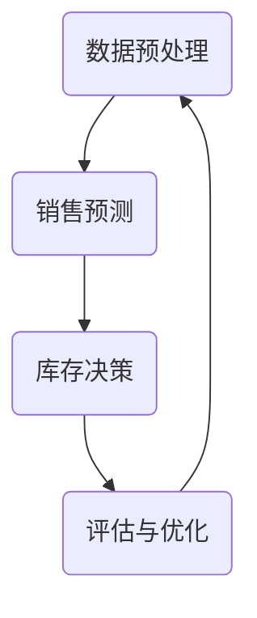

## 1.背景介绍

随着人工智能（AI）的发展，越来越多的企业开始将AI技术应用到业务流程中，以提升效率和减少人力成本。在这个趋势下，自动库存调度成为了一个热门的应用领域。通过使用AI Agent，企业可以实现自动化库存管理，从而提升库存管理效率，减少库存成本，提升服务水平。本文将详细介绍如何为AI Agent定义一系列进行自动库存调度的工具。

## 2.核心概念与联系

在进行自动库存调度的过程中，我们需要了解以下几个核心概念：

- **AI Agent**：AI Agent是一个可以感知环境并根据其感知进行行动的实体。在库存管理中，AI Agent可以根据库存信息、销售预测等数据进行库存调度。

- **库存调度**：库存调度是指根据销售预测和库存信息，决定何时采购、采购多少的过程。库存调度的目标是保证服务水平的同时，最小化库存成本。

- **服务水平**：服务水平是指企业满足客户需求的能力。在库存管理中，服务水平通常用缺货率或者满足率来度量。

- **库存成本**：库存成本包括持有成本、缺货成本和订货成本。持有成本是指持有库存所产生的成本，如仓储费、资金占用费等；缺货成本是指由于缺货而导致的损失，如丢失销售、客户流失等；订货成本是指进行一次订货所产生的成本，如运输费、处理费等。

在自动库存调度中，AI Agent需要根据服务水平和库存成本的目标，进行库存决策。AI Agent的决策过程可以用一系列工具来实现，这些工具包括数据预处理工具、预测模型、决策模型等。

## 3.核心算法原理具体操作步骤

AI Agent进行自动库存调度的过程主要包括以下几个步骤：

1. 数据预处理：AI Agent首先需要对库存信息、销售数据等进行预处理，将其转化为可以用于模型训练和预测的格式。

2. 销售预测：AI Agent需要对未来的销售进行预测，这通常可以通过时间序列预测模型来实现。

3. 库存决策：根据销售预测和库存信息，AI Agent需要决定何时采购、采购多少。这通常可以通过库存决策模型来实现。

4. 评估与优化：AI Agent需要对其决策进行评估，看是否达到了服务水平和库存成本的目标。如果没有达到目标，AI Agent需要调整其决策模型，进行优化。

这个过程可以用以下的Mermaid流程图来表示：



## 4.数学模型和公式详细讲解举例说明

在自动库存调度中，我们通常会使用到以下几种数学模型：

- **时间序列预测模型**：时间序列预测模型是用来预测未来销售的模型。其中，ARIMA模型是一种常用的时间序列预测模型。ARIMA模型的全称是自回归差分移动平均模型，它包括三个部分：自回归（AR）、差分（I）和移动平均（MA）。ARIMA模型可以用以下公式来表示：

$$
Y_t = \phi_1Y_{t-1} + \cdots + \phi_pY_{t-p} + \theta_1\epsilon_{t-1} + \cdots + \theta_q\epsilon_{t-q} + \epsilon_t
$$

其中，$Y_t$是时间$t$的销售，$\phi_1,\cdots,\phi_p$是自回归参数，$\theta_1,\cdots,\theta_q$是移动平均参数，$\epsilon_t$是时间$t$的误差项。

- **库存决策模型**：库存决策模型是用来决定何时采购、采购多少的模型。其中，新闻售货员问题（Newsvendor Problem）是一种常用的库存决策模型。在新闻售货员问题中，我们需要决定订货量$Q$，以最小化预期成本：

$$
\min_Q \ E(C(Q)) = \min_Q \ E(CoD + Ch(Q - D)^+ + Cp(D - Q)^+)
$$

其中，$D$是需求，$Co$是订货成本，$Ch$是持有成本，$Cp$是缺货成本，$(x)^+ = \max(x, 0)$。

## 5.项目实践：代码实例和详细解释说明

在实际项目中，我们可以使用Python来实现AI Agent进行自动库存调度。以下是一个简单的示例：

```python
# 导入所需的库
import pandas as pd
from statsmodels.tsa.arima.model import ARIMA
from scipy.stats import norm

# 读取数据
data = pd.read_csv('sales_data.csv')

# 数据预处理
data['sales'] = data['sales'].astype(float)

# 销售预测
model = ARIMA(data['sales'], order=(1, 1, 1))
model_fit = model.fit()
forecast = model_fit.forecast(steps=1)

# 库存决策
Co = 1
Ch = 0.1
Cp = 0.9
Q = norm.ppf(Cp / (Cp + Ch), loc=forecast[0], scale=forecast[1])

# 输出订货量
print(Q)
```

在这个示例中，我们首先读取销售数据，然后使用ARIMA模型进行销售预测，最后根据新闻售货员问题的解析解决定订货量。

## 6.实际应用场景

自动库存调度可以应用在各种需要库存管理的场景中，如零售、制造、物流等。通过使用AI Agent进行自动库存调度，企业可以提升库存管理效率，减少库存成本，提升服务水平。例如，亚马逊就使用AI技术进行库存管理，以实现24小时内送达的服务。

## 7.工具和资源推荐

在进行自动库存调度的过程中，以下工具和资源可能会有所帮助：

- **Python**：Python是一种广泛用于数据分析和机器学习的编程语言。Python有丰富的库，如pandas用于数据处理，statsmodels用于统计模型，scipy用于科学计算，都是进行自动库存调度的好帮手。

- **Jupyter Notebook**：Jupyter Notebook是一个可以编写和执行Python代码的交互式环境，非常适合数据分析和模型开发。

- **Google Colab**：Google Colab是一个提供免费GPU计算资源的云端Jupyter Notebook环境，可以用来训练大型机器学习模型。

- **Kaggle**：Kaggle是一个数据科学竞赛平台，上面有很多关于销售预测和库存管理的竞赛和数据集，可以用来学习和实践。

## 8.总结：未来发展趋势与挑战

随着AI技术的发展，自动库存调度的应用将越来越广泛。然而，自动库存调度也面临着一些挑战，如如何处理不确定性，如何处理大规模问题，如何处理多级库存系统等。未来，我们需要更先进的算法和更强大的计算能力来解决这些挑战。

## 9.附录：常见问题与解答

- **Q：AI Agent如何处理不确定性？**

  A：AI Agent可以通过概率模型来处理不确定性。例如，AI Agent可以使用概率预测模型来预测未来销售，然后根据预测的概率分布进行库存决策。

- **Q：AI Agent如何处理大规模问题？**

  A：AI Agent可以通过分解和近似方法来处理大规模问题。例如，AI Agent可以将大规模问题分解为多个小规模问题，然后分别解决；或者AI Agent可以使用近似算法，如蒙特卡洛模拟，来近似解决大规模问题。

- **Q：AI Agent如何处理多级库存系统？**

  A：AI Agent可以通过层次化方法来处理多级库存系统。例如，AI Agent可以首先在上一级进行库存决策，然后根据上一级的决策在下一级进行库存决策。

作者：禅与计算机程序设计艺术 / Zen and the Art of Computer Programming
