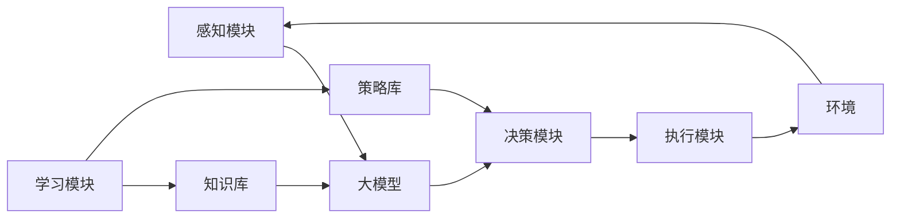

# 【大模型应用开发 动手做AI Agent】基于大模型的Agent技术框架

## 1. 背景介绍

### 1.1 人工智能与大模型的发展历程

人工智能(Artificial Intelligence, AI)自1956年达特茅斯会议提出以来，经历了几次起起伏伏的发展历程。近年来，随着深度学习技术的突破和计算能力的飞速发展，AI再次迎来了爆发式增长。其中，大模型(Large Language Models, LLMs)的出现，更是将AI技术推向了一个新的高度。

从2017年谷歌发布的Transformer模型，到2018年OpenAI推出的GPT模型，再到2019年的GPT-2和2020年的GPT-3，大模型不断刷新着人们对AI的认知。特别是GPT-3的问世，其1750亿参数的规模和强大的自然语言处理能力，让业界为之震惊。

### 1.2 Agent技术与大模型的结合

Agent是人工智能领域的一个重要分支，旨在开发能够自主感知环境、推理决策并采取行动的智能体系统。传统的Agent系统大多基于符号主义方法，通过人工设计知识库、推理规则等来实现。

而随着大模型的兴起，研究者们开始探索将大模型与Agent技术相结合，利用大模型强大的语义理解和生成能力，来构建更加智能、灵活的Agent系统。这种基于大模型的Agent技术框架，有望突破传统方法的局限，实现更高水平的自主智能。

### 1.3 本文的主要内容

本文将围绕基于大模型的Agent技术框架展开深入讨论。主要内容包括：

1. 介绍Agent系统的核心概念及其与大模型的联系
2. 阐述基于大模型的Agent系统的核心算法原理和操作步骤 
3. 详细讲解相关的数学模型和公式
4. 给出具体的代码实例和详细解释
5. 分析该技术框架的实际应用场景
6. 推荐相关的开发工具和学习资源
7. 总结全文并展望未来发展趋势与挑战
8. 附录中解答一些常见问题

通过本文的学习，读者将对基于大模型的Agent技术框架有一个全面深入的认识，并能初步掌握相关的开发技能，为进一步研究和应用打下基础。

## 2. 核心概念与联系

### 2.1 Agent的定义与特征

Agent是人工智能领域的一个核心概念，泛指能够感知环境并做出自主行为的实体。一个典型的Agent系统通常具有以下特征：

1. 自主性：能够独立地感知外界环境，并根据自身的目标和知识做出决策与行动，无需人为直接控制。

2. 社会性：能够与环境中的其他Agent或人类进行交互与协作，理解并遵循一定的交互规则。

3. 反应性：能够及时地感知环境的变化并做出相应的反应。

4. 主动性：不满足于被动地响应环境，而是会主动地执行任务，追求自身目标的实现。

5. 连续性：具有持续的生命周期，能够在一段时间内保持自身的运转。

### 2.2 大模型的定义与能力

大模型是指参数量极其庞大(通常在数十亿到上千亿量级)的机器学习模型，尤其是自然语言处理领域的模型如GPT系列、BERT等。它们通过在海量文本数据上进行预训练，习得了强大的语言理解和生成能力。大模型的主要能力包括：

1. 语言理解：能够准确把握文本的语义信息，完成分类、情感分析、命名实体识别、关系抽取等任务。

2. 语言生成：能够根据上下文生成连贯、通顺的文本，完成对话生成、文章写作、代码生成等任务。

3. 知识存储：通过预训练习得了大量的世界知识和常识性知识，具备一定的知识库功能。

4. 推理能力：能够在给定的文本基础上，进行逻辑推理、常识推理、类比推理等，得出合理的结论。

5. 少样本学习：在少量样本的指导下，即可快速适应新的任务，无需大量的微调数据。

### 2.3 大模型赋能Agent系统

大模型为Agent系统的构建带来了新的契机。传统的Agent系统在感知、认知、决策等方面往往依赖于人工设计的知识库和规则，难以应对复杂多变的现实环境。而大模型所具备的强大语义理解和知识存储能力，恰好可以弥补这一不足。

通过将大模型引入Agent系统，可以实现：

1. 语言交互：Agent可以通过自然语言与人类或其他Agent进行流畅的交流，理解对方的意图并给出恰当的回应。

2. 知识获取：Agent可以从大模型中获取所需的世界知识和常识，用于支撑自身的决策与行为。

3. 策略生成：结合大模型的语言生成能力，Agent可以动态地生成应对不同情况的策略和计划。

4. 场景理解：通过对话语的语义理解，Agent可以准确把握所处场景的上下文信息。

5. 持续学习：利用大模型的少样本学习特性，Agent可以在执行任务的过程中不断积累新知识，实现持续进化。

下图展示了一个基于大模型的Agent系统的基本架构：



可以看到，大模型作为连接感知、决策、执行的核心枢纽，协调各个模块的工作，最终使Agent能够在复杂环境中自主地完成任务。

## 3. 核心算法原理与操作步骤

### 3.1 基于Prompt的few-shot学习

要让大模型能够适应Agent系统的特定任务，需要对其进行一定的微调。传统的微调方式需要大量的标注数据，而few-shot学习则可以在很少的样本上完成适配。其中，基于Prompt的方法是目前最为有效的few-shot学习范式之一。

Prompt是指一段包含任务描述、输入示例和需要填充的位置的模板文本。通过将任务转化为语言建模问题，Prompt可以充分发挥大模型在语言理解和生成方面的先天优势。一个典型的Prompt示例如下：

```
任务：情感分类
输入：这部电影的剧情非常吸引人，演员的表演也很到位，强烈推荐！
输出：正面

输入：这次购物的体验非常糟糕，客服态度恶劣，商品质量也不过关。
输出：负面

输入：这家餐厅的环境一般，但食物的味道还不错，性价比挺高的。
输出：
```

通过这种形式，大模型可以快速理解任务要求，并根据给定的少量示例生成相应的结果。

### 3.2 基于Prompt的Agent决策

在Agent系统中，我们可以利用Prompt来实现基于大模型的决策。具体步骤如下：

1. 场景理解：根据Agent感知到的环境信息，生成描述当前场景的文本。

2. 策略生成：将场景描述文本与预设的策略生成Prompt模板结合，生成多个可能的策略文本。

3. 策略评估：将每个策略文本与预设的策略评估Prompt模板结合，由大模型生成相应的评分。

4. 策略选择：根据评分选择最优策略，生成具体的行动指令。

5. 执行与反馈：执行选定的策略，并根据执行结果更新场景描述，进入下一决策循环。

例如，对于一个自动驾驶Agent，其决策过程可以表示为：

```
场景描述：前方100米处有一个红绿灯，当前为绿灯，但即将转黄。道路右侧有一辆自行车。

策略生成Prompt：
根据以下场景描述，生成3条可能的策略：
{{场景描述}}
策略1：
策略2：
策略3：

策略评估Prompt：
根据以下场景描述和策略，评估该策略的合理性，给出1-5分的评分：
场景描述：{{场景描述}}
策略：{{策略}}
评分：

决策结果：
场景描述：前方100米处有一个红绿灯，当前为绿灯，但即将转黄。道路右侧有一辆自行车。
策略1：继续保持当前速度通过路口。评分：2
策略2：减速慢行，等红绿灯转黄后停车等待。评分：4
策略3：立即减速，缓慢接近路口，注意避让自行车。评分：5
执行策略：立即减速，缓慢接近路口，注意避让自行车。
```

通过这种Prompt形式的决策过程，Agent可以充分利用大模型的语言理解和生成能力，根据实时场景做出最优决策。同时，通过不断地执行与反馈，Agent可以持续优化自身的策略，实现在复杂环境中的自主行动能力。

### 3.3 基于反馈的策略优化

除了单步决策外，Agent还需要能够根据一段时间内的执行情况，对策略进行整体的优化。这可以通过引入反馈机制来实现。

具体而言，在执行了一系列决策后，我们可以将执行过程的场景描述、采取的策略以及最终的评估结果整理成一个反馈报告。然后，利用这个反馈报告来微调策略生成和评估的Prompt模板，使其能够生成更加优质的策略。

例如，对于上述自动驾驶的例子，反馈报告可能是这样的：

```
反馈报告：
第1步：
场景描述：前方100米处有一个红绿灯，当前为绿灯，但即将转黄。道路右侧有一辆自行车。
策略：立即减速，缓慢接近路口，注意避让自行车。
评估：安全通过路口，没有影响其他车辆和行人。

第2步：
场景描述：前方路口较拥堵，有多辆车辆正在等待通行。
策略：保持车距，缓慢行驶，等待前车通过路口。
评估：通过路口较慢，后方车辆有轻微不耐烦情绪。

第3步：
场景描述：前方为双向四车道，对向有车辆正常行驶。
策略：保持在本车道内行驶，与对向车辆保持安全距离。
评估：安全正常行驶。

总体评估：3次决策中，2次安全正常，1次效率略有降低。建议在保证安全的前提下，适当提高通过拥堵路口的效率。
```

我们可以将这个反馈报告整合到之前的场景描述和策略生成Prompt中，生成优化后的Prompt模板：

```
场景描述：前方路口较拥堵，有多辆车辆正在等待通行。参考以下反馈报告，在保证安全的前提下提高通行效率：
{{反馈报告}}

策略生成Prompt：
根据以下优化后的场景描述，生成3条可能的策略：
{{优化后的场景描述}}
策略1：
策略2：
策略3：
```

通过这种方式，Agent可以不断地根据自身的执行情况来优化策略，提高在复杂环境中的适应能力和执行效率。同时，这种基于反馈的优化也使得Agent具备了一定的自我学习和进化能力，能够随着时间的推移不断地完善自身的行为策略。

## 4. 数学模型与公式推导

在上述的算法原理中，我们主要利用了大模型在语言理解和生成方面的能力。这里，我们将从数学角度对其中的关键环节进行更加细致的分析和推导。

### 4.1 语言模型的概率基础

大模型的核心是语言模型，其目标是学习文本序列的概率分布。给定一个由$n$个词组成的文本序列$w_{1:n} = [w_1, w_2, \cdots, w_n]$，语言模型的目标是估计该序列的概率$P(w_{1:n})$。根据概率论的链式法则，这个概率可以分解为：

$$
P(w_{1:n}) = P(w_1) P(w_2|w_1) P(w_3|w_{1:2}) \c