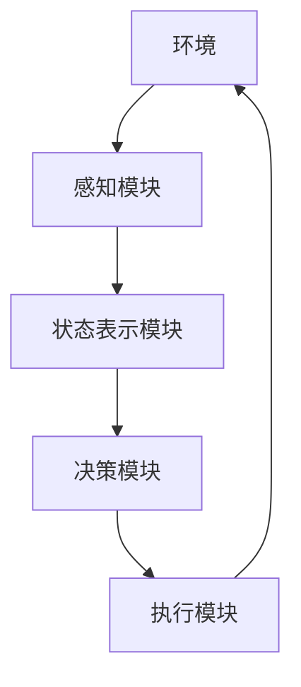
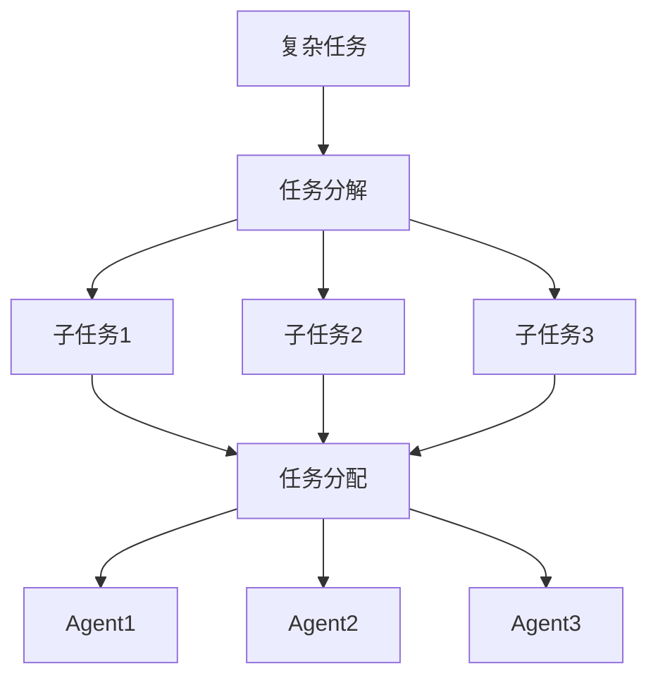
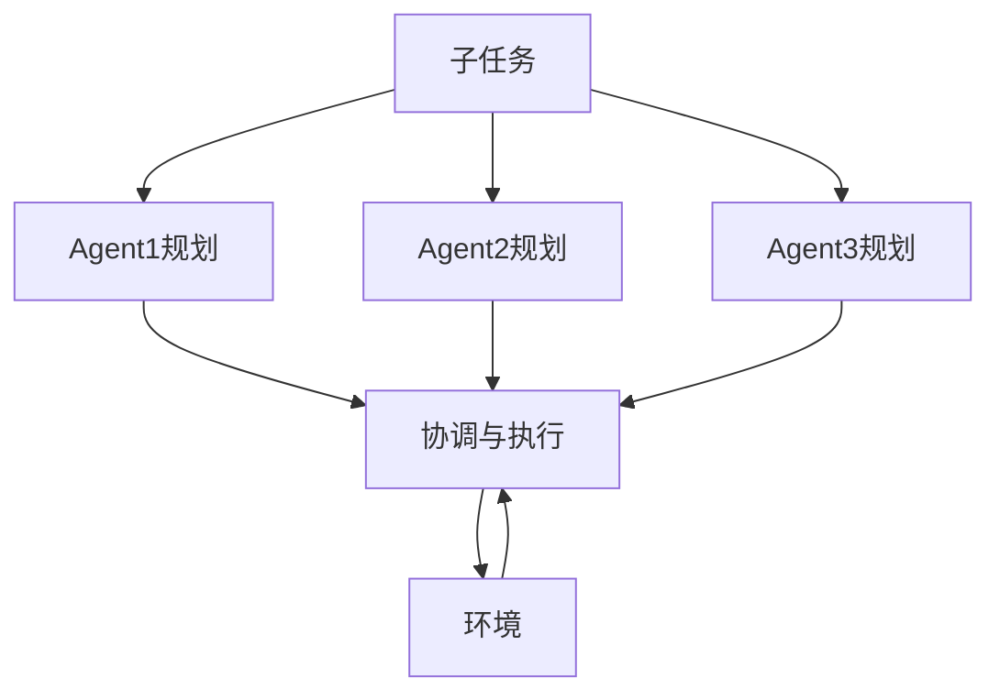
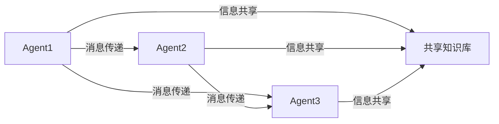
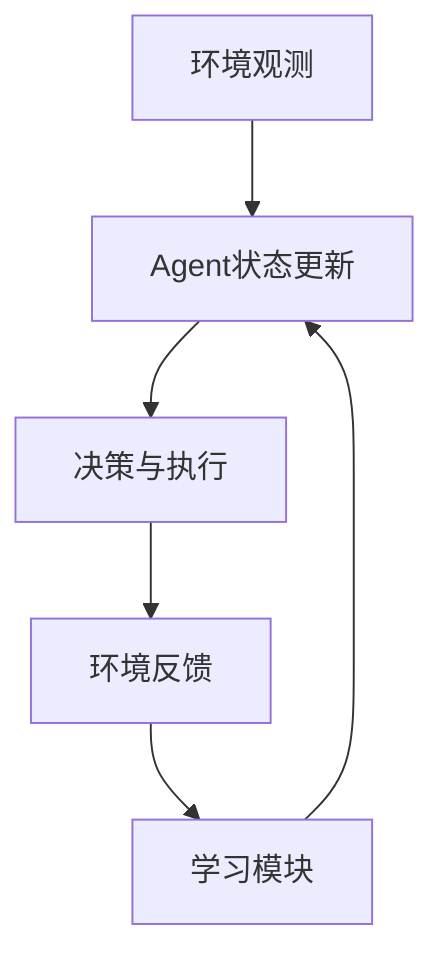

# 【大模型应用开发 动手做AI Agent】多Agent协作

## 1. 背景介绍

### 1.1 大模型时代的到来

近年来,大型语言模型(Large Language Models,LLMs)在自然语言处理领域取得了令人瞩目的成就。这些模型通过在海量文本数据上进行预训练,学习了丰富的语言知识和上下文关联能力。著名的大模型包括GPT-3、PaLM、ChatGPT等,展现出了强大的文本生成、问答、文本摘要等能力,引发了人工智能领域的新一轮热潮。

### 1.2 AI Agent的兴起

随着大模型的不断发展,人们开始探索如何将这些模型应用于实际场景,并与人类协作完成复杂任务。这催生了AI Agent(智能代理)的概念。AI Agent是一种智能系统,能够感知环境、做出决策并执行行动,以达成特定目标。通过将大模型与其他AI技术(如计算机视觉、规划与控制等)相结合,AI Agent可以在多个领域发挥作用,如智能助手、游戏AI、机器人控制等。

### 1.3 多Agent协作的必要性

然而,单个AI Agent通常难以完成复杂的任务。这就需要多个Agent通过协作来分担工作负载,发挥各自的专长,从而提高整体系统的性能和鲁棒性。多Agent协作系统能够处理更加动态和不确定的环境,具有更强的适应性和扩展性。因此,研究多Agent协作机制对于推动AI Agent的实际应用至关重要。

## 2. 核心概念与联系

### 2.1 Agent及其架构

Agent是一个感知环境、做出决策并执行行动的自主实体。一个典型的Agent架构包括以下几个核心模块:

- 感知模块(Perception Module):接收来自环境的观测数据,如视觉、语音等信息。
- 状态表示模块(State Representation):将观测数据转换为Agent可理解的内部状态表示。
- 决策模块(Decision Module):根据当前状态和目标,做出行动决策。
- 执行模块(Action Module):将决策转化为具体的行动,并反馈给环境。



### 2.2 多Agent系统(Multi-Agent System, MAS)

多Agent系统由多个Agent组成,这些Agent通过协作来完成共同的目标。在MAS中,每个Agent都有自己的感知、决策和行动能力,但同时也需要与其他Agent进行信息交换和行动协调。

MAS中的主要挑战包括:

- 分工与协作机制:如何合理分配任务,确保Agent之间高效协作。
- 通信与信息共享:Agent如何交换信息,建立共享的环境表示。
- 冲突检测与解决:当多个Agent的行动存在冲突时,如何进行协商和调解。
- 分布式控制:在缺乏集中控制的情况下,如何实现高效的多Agent协调。

### 2.3 大模型在多Agent系统中的作用

大模型凭借其强大的语言理解和生成能力,可以在多Agent系统中发挥重要作用:

- 自然语言交互:Agent可以使用大模型与人类进行自然语言交互,接收指令和反馈信息。
- 语义理解与推理:利用大模型对语义信息进行深度理解和推理,支持更高层次的决策。
- 多模态融合:将视觉、语音等多模态信息与文本信息相结合,实现更全面的环境感知。
- 知识库构建:大模型可用于从海量数据中提取和构建领域知识库,为Agent决策提供知识支持。

通过将大模型与其他AI技术相结合,我们可以构建出更加智能、通用和人性化的多Agent协作系统。

## 3. 核心算法原理具体操作步骤

多Agent协作系统的核心算法主要包括以下几个方面:

### 3.1 任务分解与分配

对于复杂任务,我们需要将其分解为多个子任务,并合理分配给不同的Agent。常见的任务分解方法包括层次分解、时序分解等。任务分配则需要考虑每个Agent的能力、资源约束等因素,通常可以采用市场机制、组合优化等方法进行求解。



### 3.2 协作规划与执行

在分配好子任务后,各个Agent需要协调规划自身的行动策略,以完成分配的任务。常见的协作规划算法包括分布式约束优化(Distributed Constraint Optimization)、马尔可夫决策过程(Markov Decision Processes)等。在执行阶段,Agent需要根据环境变化动态调整策略,并与其他Agent进行信息交换和行动协调。



### 3.3 通信与信息共享

为了实现高效协作,Agent之间需要进行通信和信息共享。常见的通信协议包括基于消息传递的协议(如KQML、FIPA-ACL等)和基于共享环境的协议。信息共享则需要建立一致的语义表示,可以采用本体论(Ontology)、知识图谱等方法来构建共享的知识库。



### 3.4 学习与自适应

在动态环境中,Agent需要具备学习和自适应的能力,以应对不确定性和变化。常见的学习算法包括强化学习、多智能体学习(Multi-Agent Learning)等。通过学习,Agent可以逐步优化自身的决策策略,提高协作效率。同时,Agent还需要能够检测环境变化,并相应地调整协作机制。



## 4. 数学模型和公式详细讲解举例说明

在多Agent协作系统中,常常需要使用数学模型和公式来描述和求解各种问题。下面我们将介绍一些常见的数学模型和公式。

### 4.1 马尔可夫决策过程(Markov Decision Process, MDP)

马尔可夫决策过程是一种广泛应用于决策理论和强化学习的数学框架。它描述了一个决策过程,其中Agent的当前状态只依赖于前一个状态和执行的行动,而与更早的历史无关。

在MDP中,我们定义以下元素:

- 状态集合 $\mathcal{S}$
- 行动集合 $\mathcal{A}$
- 转移概率 $P(s' \mid s, a)$,表示在状态 $s$ 执行行动 $a$ 后,转移到状态 $s'$ 的概率
- 奖励函数 $R(s, a, s')$,表示在状态 $s$ 执行行动 $a$ 后,转移到状态 $s'$ 所获得的奖励

目标是找到一个策略 $\pi: \mathcal{S} \rightarrow \mathcal{A}$,使得期望累积奖励最大化:

$$
\max_\pi \mathbb{E}\left[\sum_{t=0}^\infty \gamma^t R(s_t, a_t, s_{t+1})\right]
$$

其中 $\gamma \in [0, 1]$ 是折现因子,用于权衡即时奖励和长期奖励的重要性。

MDP可以通过动态规划算法(如值迭代、策略迭代)或强化学习算法(如Q-Learning、策略梯度)来求解。

### 4.2 分布式约束优化问题(Distributed Constraint Optimization Problem, DCOP)

分布式约束优化问题是一种描述多Agent协作问题的数学模型。在DCOP中,我们需要为每个Agent分配一个值,使得所有Agent之间的约束条件得到满足,同时优化一个全局目标函数。

形式上,DCOP可以表示为一个三元组 $\langle\mathcal{A}, \mathcal{X}, \mathcal{C}, f\rangle$:

- $\mathcal{A}$ 是Agent集合
- $\mathcal{X}$ 是变量集合,每个变量 $x_i \in \mathcal{X}$ 由一个Agent控制
- $\mathcal{C}$ 是约束集合,每个约束 $c_{ij} \in \mathcal{C}$ 涉及两个变量 $x_i$ 和 $x_j$
- $f$ 是需要优化的目标函数,通常是所有约束函数的总和

目标是找到一个值分配 $\boldsymbol{\alpha}^*$,使得:

$$
\boldsymbol{\alpha}^* = \arg\min_{\boldsymbol{\alpha}} f(\boldsymbol{\alpha}) = \arg\min_{\boldsymbol{\alpha}} \sum_{c_{ij} \in \mathcal{C}} c_{ij}(\alpha_i, \alpha_j)
$$

满足所有约束条件的同时,最小化目标函数的值。

DCOP可以通过各种分布式算法来求解,如ADOPT、DPOP等。这些算法通过Agent之间的信息交换和协调,逐步缩小搜索空间,最终找到最优解。

### 4.3 多智能体学习(Multi-Agent Learning)

多智能体学习是一种允许多个Agent同时学习的范式。与单智能体学习不同,多智能体学习需要考虑Agent之间的相互影响,以及非静态环境带来的挑战。

在多智能体学习中,我们可以将环境建模为一个马尔可夫游戏(Markov Game)。对于每个Agent $i$,它的状态转移和奖励不仅取决于自身的行动,还取决于其他Agent的行动。因此,每个Agent需要学习一个条件策略 $\pi_i(a_i \mid s, \boldsymbol{a}_{-i})$,表示在状态 $s$ 和其他Agent执行行动 $\boldsymbol{a}_{-i}$ 的条件下,Agent $i$ 执行行动 $a_i$ 的概率。

多智能体学习算法可以分为两大类:基于价值函数的算法(如多智能体Q-Learning)和基于策略梯度的算法。前者试图直接学习最优的行动价值函数,后者则是通过策略搜索的方式来优化策略参数。

此外,还需要考虑Agent之间的合作或竞争关系。在完全合作的情况下,所有Agent共享同一个奖励信号;而在竞争环境中,Agent之间的奖励存在零和博弈关系。不同的场景需要采用不同的学习算法和目标函数。

## 5. 项目实践:代码实例和详细解释说明

为了更好地理解多Agent协作系统的实现,我们将通过一个具体的项目实例来演示相关的代码和细节。在这个项目中,我们将构建一个基于强化学习的多Agent协作系统,用于控制多个机器人在一个网格世界中执行任务。

### 5.1 环境设置

我们使用Python和OpenAI Gym库来构建环境。环境是一个 $N \times N$ 的网格世界,其中有多个机器人Agent、目标点和障碍物。每个Agent的观测包括自身位置、目标点位置和局部视野内的障碍物信息。Agent的行动空间包括上下左右四个方向的移动。

当一个Agent到达目标点时,它将获得正向奖励;如果多个Agent同时到达同一个目标点,它们将共享奖励。如果Agent撞到障碍物或其他Agent,它将获得负向奖励。

```python
import gym
import numpy as np

class MultiAgentGridWorld(gym.Env):
    def __init__(self, n_agents, size=10):
        # 初始化环境
        ...

    def reset(self):
        # 重置环境状态
        ...

    def step(self, actions):
        # 执行Agent行动,更新环境状态
        ...

    def render(