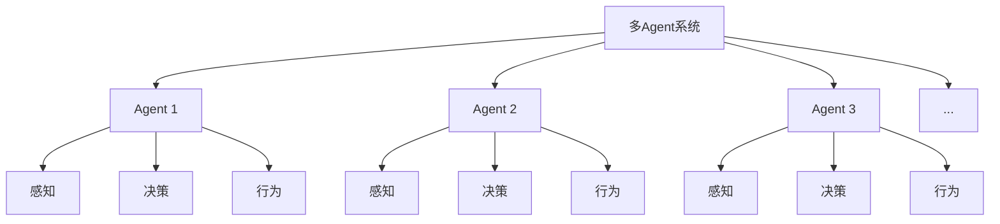
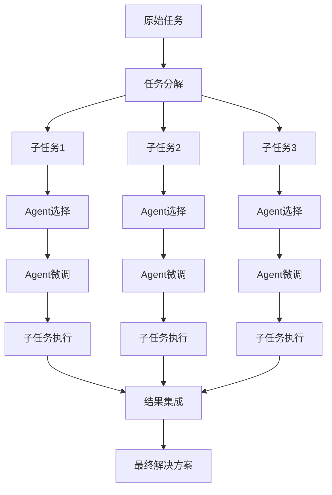
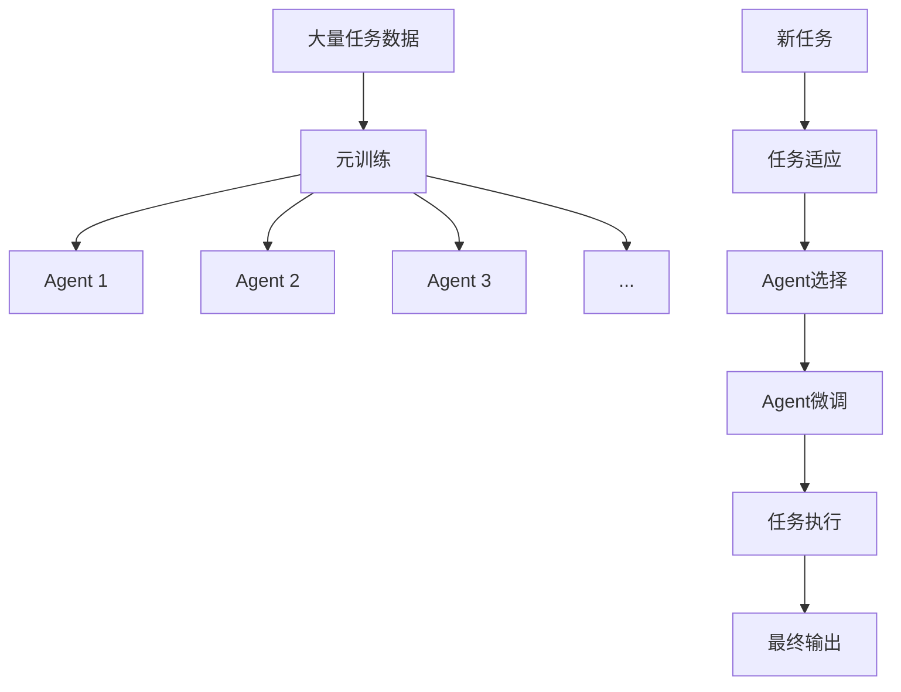

# 【大模型应用开发 动手做AI Agent】多Agent框架——AutoGen和MetaGPT

## 1. 背景介绍

### 1.1 人工智能发展历程

人工智能(Artificial Intelligence, AI)是当代科技发展的热点领域之一,它致力于赋予机器智能,使其能够模仿人类的感知、学习、推理和行为能力。AI的发展可以追溯到20世纪50年代,当时它被正式定义为"使机器能够模仿人类智能行为的科学与技术"。

### 1.2 大模型兴起

近年来,随着计算能力的不断提升和大数据时代的到来,大型神经网络模型(大模型)在自然语言处理、计算机视觉等领域展现出了令人惊艳的能力。GPT(Generative Pre-trained Transformer)、BERT(Bidirectional Encoder Representations from Transformers)、DALL-E等大模型的出现,推动了AI的飞速发展。

### 1.3 多Agent系统的需求

尽管大模型取得了巨大成功,但它们也存在一些局限性,例如单一模型难以完美处理所有任务、缺乏可解释性和可控性等。为了解决这些问题,研究人员提出了多Agent(智能体)系统的概念,旨在通过多个专门的Agent协同工作,发挥整体的智能。

## 2. 核心概念与联系

### 2.1 什么是Agent?

在人工智能领域,Agent被定义为能够感知环境、处理信息、做出决策并执行行为的自主实体。一个Agent可以是软件程序、机器人或其他具有一定智能的系统。

### 2.2 多Agent系统

多Agent系统(Multi-Agent System, MAS)是由多个相互作用的智能Agent组成的分布式系统。这些Agent可以是同构的(具有相同功能)或异构的(具有不同功能),它们通过协作、竞争或协调等方式完成复杂的任务。



### 2.3 AutoGen和MetaGPT

AutoGen和MetaGPT是两个新兴的多Agent框架,旨在利用大模型的强大能力,同时克服单一大模型的局限性。

- AutoGen(Automated Generation)是一个基于大语言模型的自动生成框架,它将复杂任务分解为多个子任务,由专门的Agent协作完成。
- MetaGPT(Generative Pretrained Transformer with Metalearning)则是一种元学习框架,通过训练多个专门化的Agent,使它们能够快速适应新任务并生成高质量的输出。

这两个框架都采用了多Agent的设计理念,通过组合多个专门化的Agent,实现了更强大、更灵活的人工智能系统。

## 3. 核心算法原理具体操作步骤  

### 3.1 AutoGen框架

AutoGen框架的核心思想是将复杂任务分解为多个子任务,由不同的Agent专门处理。它的工作流程如下:

1. **任务分解**:将原始任务分解为多个子任务,每个子任务由一个专门的Agent处理。
2. **Agent选择**:根据子任务的性质,选择合适的预训练Agent。
3. **Agent微调**:对选定的Agent进行微调,使其能够更好地完成特定子任务。
4. **子任务执行**:微调后的Agent并行执行各自的子任务。
5. **结果集成**:将多个Agent的输出结合起来,形成最终的任务解决方案。



### 3.2 MetaGPT框架

MetaGPT框架采用元学习的方法,通过训练多个专门化的Agent,使它们能够快速适应新任务并生成高质量的输出。它的工作流程如下:

1. **元训练**:使用大量的任务数据,对多个Agent进行联合训练,使它们学会快速适应新任务。
2. **任务适应**:当有新任务到来时,根据任务特征选择合适的Agent,并进行少量的微调,使Agent能够更好地完成该任务。
3. **任务执行**:微调后的Agent执行新任务,生成最终输出。



通过元训练,MetaGPT框架中的Agent能够学会快速适应新任务,从而提高了生成高质量输出的能力。与传统的单一大模型相比,MetaGPT框架具有更好的可解释性、可控性和灵活性。

## 4. 数学模型和公式详细讲解举例说明

在AutoGen和MetaGPT框架中,都涉及到了一些核心的数学模型和公式,下面将对它们进行详细的讲解和举例说明。

### 4.1 任务分解

在AutoGen框架中,任务分解是一个关键步骤。我们可以将原始任务表示为一个向量$\vec{x}$,需要将其分解为多个子任务向量$\vec{x}_1, \vec{x}_2, \ldots, \vec{x}_n$,使得:

$$\vec{x} = \sum_{i=1}^{n} \vec{x}_i$$

任务分解的目标是找到一种最优划分,使得每个子任务都能被高效地处理,同时子任务之间的相关性最小。这可以通过优化以下目标函数来实现:

$$\min_{\vec{x}_1, \vec{x}_2, \ldots, \vec{x}_n} \sum_{i=1}^{n} C(\vec{x}_i) + \lambda \sum_{i \neq j} S(\vec{x}_i, \vec{x}_j)$$

其中,$C(\vec{x}_i)$表示处理子任务$\vec{x}_i$的代价函数,$S(\vec{x}_i, \vec{x}_j)$表示子任务$\vec{x}_i$和$\vec{x}_j$之间的相似性,$\lambda$是一个权重参数,用于平衡这两个目标。

例如,假设我们需要处理一个自然语言处理任务,包括文本摘要、情感分析和命名实体识别等子任务。我们可以将原始文本表示为一个向量$\vec{x}$,然后将其分解为$\vec{x}_1$(文本摘要),$\vec{x}_2$(情感分析)和$\vec{x}_3$(命名实体识别)三个子任务向量。在分解过程中,我们需要考虑每个子任务的复杂度以及它们之间的相关性,以找到一种最优的划分方式。

### 4.2 Agent选择和微调

在AutoGen和MetaGPT框架中,Agent选择和微调都是非常重要的步骤。我们可以将Agent表示为一个函数$f_\theta$,其中$\theta$是Agent的参数。给定一个任务$\vec{x}$,我们希望找到一个合适的Agent $f_\theta$,使得它能够很好地完成该任务,即:

$$\max_\theta P(y | \vec{x}, f_\theta)$$

其中,$y$是期望的输出,$P(y | \vec{x}, f_\theta)$表示在给定输入$\vec{x}$和Agent $f_\theta$的情况下,输出$y$的概率。

为了找到最佳的Agent,我们可以在一个预训练的Agent集合中进行搜索,并对选定的Agent进行微调,以提高它在特定任务上的性能。微调过程可以表示为:

$$\theta^* = \arg\max_\theta \sum_{(\vec{x}, y) \in \mathcal{D}} \log P(y | \vec{x}, f_\theta)$$

其中,$\mathcal{D}$是任务数据集,$\theta^*$是微调后的最优参数。

例如,在自然语言处理任务中,我们可以从一组预训练的语言模型中选择一个合适的Agent,然后使用任务相关的数据对它进行微调,以提高它在特定任务(如文本摘要、情感分析等)上的性能。

### 4.3 元学习

在MetaGPT框架中,元学习是一个核心概念。元学习的目标是训练一个能够快速适应新任务的模型,即:

$$\max_\phi \mathbb{E}_{\mathcal{T} \sim p(\mathcal{T})} \left[ \max_\theta \sum_{(\vec{x}, y) \in \mathcal{D}_\mathcal{T}} \log P(y | \vec{x}, f_\theta) \right]$$

其中,$\phi$是元模型的参数,$\mathcal{T}$是一个任务,来自于任务分布$p(\mathcal{T})$,$\mathcal{D}_\mathcal{T}$是任务$\mathcal{T}$的数据集,$f_\theta$是一个由元模型生成的Agent,其参数$\theta$依赖于$\phi$。

元学习的过程可以分为两个阶段:

1. **元训练**:在大量的任务数据上训练元模型,使其能够生成适应不同任务的Agent。
2. **任务适应**:当有新任务到来时,使用元模型生成一个初始Agent,并在新任务的数据上进行少量的微调,以获得最终的Agent。

通过元学习,MetaGPT框架中的Agent能够快速适应新任务,从而提高了生成高质量输出的能力。

## 5. 项目实践:代码实例和详细解释说明

为了更好地理解AutoGen和MetaGPT框架,我们将通过一个实际项目来进行说明。在这个项目中,我们将构建一个多Agent系统,用于处理自然语言处理任务。

### 5.1 项目概述

我们的目标是构建一个多Agent系统,能够完成文本摘要、情感分析和命名实体识别等任务。我们将使用AutoGen框架将原始任务分解为多个子任务,并选择合适的预训练Agent进行微调。同时,我们也将探索使用MetaGPT框架,通过元学习的方式训练多个专门化的Agent。

### 5.2 代码实例

下面是一个使用AutoGen框架的代码示例,用于处理文本摘要任务:

```python
import autogen

# 定义任务
task = autogen.Task("text_summarization")

# 任务分解
subtasks = task.decompose()

# 选择和微调Agent
summarizer_agent = autogen.select_agent(subtasks[0], agent_pool)
summarizer_agent.finetune(summarization_data)

# 执行子任务
summary = summarizer_agent(input_text)

# 结果集成
final_output = autogen.integrate([summary])
```

在这个示例中,我们首先定义了一个文本摘要任务。然后,我们将任务分解为一个或多个子任务。接下来,我们从预训练的Agent池中选择一个合适的Agent,并使用文本摘要数据对它进行微调。微调后的Agent被用于执行文本摘要子任务,生成摘要结果。最后,我们将子任务的结果集成,得到最终的输出。

下面是一个使用MetaGPT框架的代码示例,用于训练一个能够快速适应新任务的元模型:

```python
import metagpt

# 定义元模型
meta_model = metagpt.MetaModel()

# 元训练
meta_model.meta_train(task_data)

# 任务适应
new_task = "named_entity_recognition"
ner_agent = meta_model.adapt(new_task, ner_data)

# 执行新任务
entities = ner_agent(input_text)
```

在这个示例中,我们首先定义了一个MetaGPT元模型。然后,我们使用大量的任务数据对元模型进行元训练,使其能够生成适应不同任务的Agent。当有新的命名实体识别任务到来时,我们使用元模型生成一个初始的Agent,并在命名实体识别数据上进行少量的微调。最