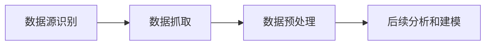

## 1.背景介绍

在当前的人工智能领域，大模型的应用开发已经成为了一个热门的话题。在这个领域中，AI Agent是一个重要的角色，它能够自动地完成一些特定的任务，如数据的收集与整理。这就是我们今天要关注的主题。

## 2.核心概念与联系

AI Agent是一种能够在环境中自主行动以达成预定目标的实体。在数据收集与整理的任务中，AI Agent的主要工作是从各种数据源中收集数据，然后对这些数据进行预处理，以便后续的分析和建模。

## 3.核心算法原理具体操作步骤

AI Agent的数据收集与整理工作主要包括以下几个步骤：

1. 数据源识别：AI Agent需要识别出可以提供数据的数据源。这些数据源可以是数据库、文件、网页、API接口等。
2. 数据抓取：AI Agent从识别出的数据源中抓取数据。这个过程可能需要处理各种问题，如网络延迟、数据源的访问权限等。
3. 数据预处理：AI Agent对抓取到的数据进行预处理，包括数据清洗、数据转换等操作。这个过程的目标是将数据转换为适合后续分析和建模的格式。



## 4.数学模型和公式详细讲解举例说明

在数据预处理的过程中，我们常常需要使用一些数学模型和公式。例如，我们可能需要使用缺失值填充模型来处理数据中的缺失值。这个模型的基本思想是使用数据中其他变量的信息来预测缺失值。假设我们有一个数据集$D$，其中有一个变量$X$有缺失值。我们可以使用数据集$D$中其他变量的信息来预测$X$的缺失值。这个过程可以用下面的公式来表示：

$$
X_{missing} = f(D - X)
$$

其中，$f$是一个预测模型，如线性回归模型、决策树模型等。

## 5.项目实践：代码实例和详细解释说明

下面，我们来看一个使用Python实现的AI Agent的数据收集与整理的示例。

```python
import requests
import pandas as pd

# 数据源识别
url = 'https://api.example.com/data'

# 数据抓取
response = requests.get(url)
data = response.json()

# 数据预处理
df = pd.DataFrame(data)
df.fillna(df.mean(), inplace=True)
```

在这个示例中，我们首先识别出数据源（一个API接口），然后使用requests库从这个接口抓取数据。抓取到的数据是JSON格式的，我们使用pandas库将其转换为DataFrame格式。然后，我们使用DataFrame的fillna方法对数据中的缺失值进行填充。

## 6.实际应用场景

AI Agent的数据收集与整理的能力在许多领域都有广泛的应用，如金融、医疗、电商等。例如，在金融领域，AI Agent可以从各种数据源中收集金融市场的数据，然后对这些数据进行预处理，以便后续的金融模型的建立和预测。

## 7.工具和资源推荐

在AI Agent的数据收集与整理的工作中，我们常常需要使用一些工具和资源，如Python、requests库、pandas库等。这些工具和资源都是开源的，可以方便地在网上找到。

## 8.总结：未来发展趋势与挑战

随着人工智能技术的发展，AI Agent的数据收集与整理的能力将会越来越强大。然而，这也带来了一些挑战，如数据的质量问题、数据的安全问题等。未来，我们需要在提升AI Agent的数据处理能力的同时，也要注意解决这些挑战。

## 9.附录：常见问题与解答

1. Q: AI Agent如何处理数据源的访问权限问题？
   A: 在处理数据源的访问权限问题时，AI Agent可以使用各种认证机制，如API key、OAuth等。

2. Q: 数据预处理的过程中有哪些常见的操作？
   A: 在数据预处理的过程中，常见的操作包括数据清洗、数据转换、缺失值处理、异常值处理等。

作者：禅与计算机程序设计艺术 / Zen and the Art of Computer Programming