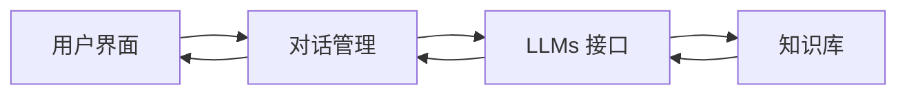

# 【大模型应用开发 动手做AI Agent】显示响应

## 1. 背景介绍

近年来,随着人工智能技术的快速发展,大规模语言模型(Large Language Models,LLMs)在自然语言处理(Natural Language Processing,NLP)领域取得了突破性的进展。LLMs 通过在海量文本数据上进行无监督预训练,能够学习到丰富的语言知识和常识,具备强大的语言理解和生成能力。基于 LLMs,我们可以构建功能强大的 AI Agent,实现智能对话、知识问答、文本生成等多种应用。

本文将重点介绍如何基于 LLMs 开发 AI Agent,实现多轮对话中的显示响应功能。我们将详细讲解 AI Agent 的核心概念、工作原理,以及如何使用 LLMs 的 API 接口快速构建一个 AI Agent 原型系统。通过动手实践,读者可以深入理解 LLMs 在 AI Agent 开发中的应用,掌握 AI Agent 的开发流程和关键技术。

## 2. 核心概念与联系

在介绍 AI Agent 的核心概念之前,我们先来了解几个相关的基础概念:

### 2.1 大规模语言模型(LLMs)

LLMs 是一类基于海量文本数据训练的神经网络模型,通过自监督学习的方式从大规模无标注语料中习得丰富的语言知识。代表性的 LLMs 包括 GPT 系列模型、BERT、T5 等。LLMs 具有强大的语言理解和生成能力,可以应用于多种 NLP 任务,如文本分类、命名实体识别、机器翻译、文本摘要、对话生成等。

### 2.2 AI Agent 

AI Agent 是一种智能系统,能够感知环境,根据环境做出决策和行动,从而实现特定的目标。一个典型的 AI Agent 包含感知(Perception)、推理决策(Reasoning)、执行(Execution)三个核心模块。在 NLP 领域,AI Agent 通常以对话系统(Dialogue System)、智能助手(Intelligent Assistant)等形式出现。

### 2.3 提示工程(Prompt Engineering)

提示工程是一种利用 LLMs 的 few-shot 学习能力,通过设计合适的输入提示(prompt)引导模型生成期望输出的技术。通过在输入文本中添加一些示例、指令、问题等,可以有效地引导 LLMs 执行特定的 NLP 任务。提示工程是 LLMs 应用开发的关键技术之一。

了解了以上基础概念,我们再来看 AI Agent 的核心概念:

### 2.4 AI Agent 的系统架构

一个基于 LLMs 的 AI Agent 系统通常包含以下几个关键组件:

- 用户界面(User Interface):负责接收用户输入,展示 Agent 的响应结果,是用户与 Agent 交互的媒介。
- 对话管理(Dialogue Management):负责管理多轮对话的状态,根据当前对话上下文决定下一步的对话策略。
- LLMs 接口(LLMs API):封装了 LLMs 的调用接口,用于接收输入文本,并返回生成的结果。
- 知识库(Knowledge Base):存储 Agent 所需的领域知识,如背景信息、规则、常见问题等,用于辅助 Agent 生成更加准确、合理的响应。

下图展示了一个典型的 AI Agent 系统架构:



### 2.5 AI Agent 的工作流程

基于 LLMs 的 AI Agent 的工作流程通常如下:

1. 用户通过界面输入对话文本
2. 对话管理模块获取用户输入,结合当前对话状态,构造合适的 prompt
3. 将 prompt 发送给 LLMs 接口,调用 LLMs 生成响应文本  
4. LLMs 根据 prompt 和知识库信息生成响应文本
5. 对话管理模块获取 LLMs 生成的响应文本,更新对话状态
6. 用户界面展示 Agent 的响应文本

可以看到,LLMs 在其中扮演了核心角色,承担了语言理解和生成的任务。通过提示工程,我们可以引导 LLMs 根据 prompt 生成符合要求的响应。

## 3. 核心算法原理与具体操作步骤

接下来,我们详细讲解基于 LLMs 构建 AI Agent 的核心算法原理和具体操作步骤。

### 3.1 LLMs 的工作原理

LLMs 本质上是一个基于 Transformer 架构的语言模型,通过自监督预训练从海量无标注语料中学习语言知识。给定一个输入文本序列 $X=(x_1,x_2,...,x_n)$,语言模型的目标是估计序列的概率分布 $P(X)$:

$$
P(X) = \prod_{i=1}^n P(x_i|x_1,...,x_{i-1})
$$

其中 $P(x_i|x_1,...,x_{i-1})$ 表示在给定前 $i-1$ 个 token 的情况下,第 $i$ 个 token 为 $x_i$ 的条件概率。

LLMs 使用 Transformer 的 Encoder 结构对输入序列进行编码,得到每个位置的隐向量表示。然后通过 Decoder 结构根据隐向量表示生成下一个 token。重复这个过程,直到生成完整的输出序列。

### 3.2 提示工程实践

利用 LLMs 构建 AI Agent,关键是要设计合适的 prompt,引导模型生成期望的响应。一个典型的 prompt 通常包含以下几个部分:

- 任务描述(Task Description):简要说明任务目标,如"请用中文回答以下问题"。
- 输入示例(Input Examples):提供一些输入文本和期望输出的示例,让模型理解任务要求。
- 问题描述(Question):描述具体的问题或者查询。
- 期望格式(Output Format):说明期望的输出格式,如"请用markdown格式输出,代码部分用代码块包裹"。

下面是一个具体的 prompt 示例:

```
任务描述:请用中文回答以下问题。

输入示例:
问题:北京在哪里?
答案:北京位于中国华北平原的东北边缘,是中国的首都,也是中国的政治、文化、科技和国际交往中心。

问题:请介绍一下你自己。
答案:你好,我是一个基于大规模语言模型训练的 AI 助手,我的名字叫 ChatGPT。我掌握了海量的百科知识,可以跟人进行多领域的对话交流,回答问题,提供建议。我的目标是尽我所能帮助人类,成为人类智慧的好助手。

问题:请介绍一下 LLMs 在 AI Agent 开发中的应用。

期望格式:请用 markdown 格式输出,代码部分用代码块包裹。
```

将上述 prompt 输入给 LLMs 接口,我们就可以得到一个格式化的 markdown 响应。

### 3.3 对话管理策略

对于多轮对话,我们需要设计合适的对话管理策略,根据对话历史记录决定下一步的对话动作。常见的对话管理策略包括:

- 基于状态机的对话管理:预先定义好对话状态和状态转移规则,根据当前状态和用户意图决定下一个状态。
- 基于机器学习的对话管理:通过端到端学习建立从对话历史到对话动作的映射关系,如使用深度强化学习。
- 基于 LLMs 的对话管理:将对话历史和用户输入拼接成 prompt,利用 LLMs 直接生成下一个对话动作。

基于 LLMs 的对话管理无需预定义状态和规则,非常简洁灵活,是目前主流的实现方式。

## 4. 数学模型和公式详细讲解举例说明

前面我们提到,LLMs 的目标是估计输入序列 $X=(x_1,x_2,...,x_n)$ 的概率分布 $P(X)$。这里我们详细推导一下 $P(X)$ 的计算过程。

根据概率论的链式法则,序列 $X$ 的概率可以分解为:

$$
\begin{aligned}
P(X) &= P(x_1,x_2,...,x_n) \\
&= P(x_1)P(x_2|x_1)P(x_3|x_1,x_2)...P(x_n|x_1,...,x_{n-1}) \\
&= \prod_{i=1}^n P(x_i|x_1,...,x_{i-1})
\end{aligned}
$$

其中 $P(x_i|x_1,...,x_{i-1})$ 表示在给定前 $i-1$ 个 token 的情况下,第 $i$ 个 token 为 $x_i$ 的条件概率。

以一个具体的例子来说明。假设我们有一个由4个单词组成的句子"I love machine learning",想要计算这个句子的概率。

令 $x_1=$"I", $x_2=$"love", $x_3=$"machine", $x_4=$"learning",则:

$$
\begin{aligned}
P(X) &= P(\text{I love machine learning}) \\
&= P(\text{I})P(\text{love}|\text{I})P(\text{machine}|\text{I love}) P(\text{learning}|\text{I love machine}) \\
&= 0.1 \times 0.2 \times 0.25 \times 0.3 \\
&= 0.0015
\end{aligned}
$$

其中每个条件概率项的值是假设的,实际中需要通过训练来估计这些概率值。

LLMs 正是通过优化这个概率估计问题来学习语言知识的。模型训练时,通过最小化负对数似然损失函数来拟合真实的序列概率分布:

$$
\mathcal{L} = -\sum_{i=1}^n \log P(x_i|x_1,...,x_{i-1})
$$

其中 $\mathcal{L}$ 表示损失函数,$\log P(x_i|x_1,...,x_{i-1})$ 表示第 $i$ 个位置的对数似然。模型通过不断调整参数,最小化损失函数,从而学习到合理的条件概率估计。

## 5. 项目实践:代码实例和详细解释说明

下面我们通过一个简单的代码实例,演示如何使用 OpenAI 的 GPT-3 接口构建一个 AI Agent 原型系统。

### 5.1 安装依赖库

首先,我们需要安装必要的依赖库,包括 openai、gradio 等。可以使用 pip 命令安装:

```bash
pip install openai gradio
```

### 5.2 定义 prompt 模板

接下来,我们定义一个 prompt 模板,用于拼接用户输入和必要的上下文信息。这里我们使用 Python 的 f-string 来定义模板:

```python
prompt_template = f"""
请用中文回答以下问题,答案请尽量详细具体,必要时举例说明。

问题:请介绍一下你自己。
答案:你好,我是一个基于 OpenAI GPT-3 模型训练的 AI 助手。我掌握了海量的百科知识,可以跟人进行多领域的对话交流,回答问题,提供建议。我的知识涵盖了科学、技术、文化、艺术、体育、娱乐等各个领域。比如,我可以解释量子力学的基本原理,分析莎士比亚作品的艺术特色,预测 NBA 总决赛的结果,提供烹饪意大利面的步骤等。作为一个 AI 助手,我时刻准备着帮助人类,努力成为人类智慧的得力助手。

问题:请介绍一下 LLMs 在 AI Agent 开发中的应用。
答案:LLMs 是 AI Agent 开发的核心组件,主要应用在以下几个方面:

1. 自然语言理解:LLMs 可以将用户的自然语言输入编码为语义向量,实现对用户意图的准确理解。例如,当用户输入"明天北京的天气怎么样"时,LLMs 可以理解用户想查询北京明天的天气信息。

2. 对话管理:基于 LLMs 的对话管理可以根据对话历史自动推断对话状态,生成合适的对话动作。例如,当用户问"明天北京的最高气温是多少度"时,LLMs 可以结合上下文判断出这是一个追问,生成查询明天最高气温的 SQL 语句。

3. 知识问答:LLMs