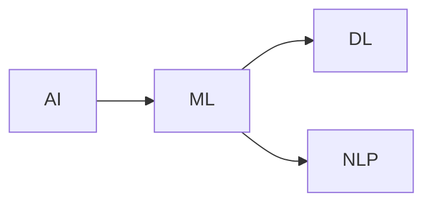

## 1. Background Introduction

In the rapidly evolving world of artificial intelligence (AI), the development of large models has become a hot topic. These models, such as BERT, GPT-3, and DALL-E, have demonstrated remarkable capabilities in various applications, from natural language processing (NLP) to image generation. However, the development of these models requires a deep understanding of AI, machine learning (ML), and deep learning (DL) principles, as well as significant computational resources.

This article aims to guide you through the process of creating your own AI agent, focusing on the self-generation of data insights. By the end of this article, you will have a solid understanding of the core concepts, algorithms, and practical implementation of an AI agent.

## 2. Core Concepts and Connections

Before diving into the development of an AI agent, it's essential to understand the core concepts and their interconnections.

### 2.1 Artificial Intelligence (AI)

AI refers to the simulation of human intelligence in machines that are programmed to think and learn like humans. It encompasses various subfields, including machine learning, deep learning, and natural language processing.

### 2.2 Machine Learning (ML)

ML is a subset of AI that focuses on the development of algorithms and statistical models that enable machines to learn from data. It involves supervised learning, unsupervised learning, reinforcement learning, and deep learning.

### 2.3 Deep Learning (DL)

DL is a subset of ML that uses artificial neural networks with multiple layers to learn and make decisions. It's particularly effective in handling complex tasks, such as image and speech recognition.

### 2.4 Natural Language Processing (NLP)

NLP is a subfield of AI that focuses on the interaction between computers and human language. It involves understanding, generating, and responding to human language in a valuable way.

### 2.5 Connection between AI, ML, DL, and NLP

AI encompasses ML, DL, and NLP. ML is a broader field that includes various learning techniques, while DL is a subset of ML that uses neural networks. NLP is a subfield of AI that focuses on human language understanding and generation.



## 3. Core Algorithm Principles and Specific Operational Steps

To create an AI agent, we'll focus on reinforcement learning, a type of ML where an agent learns to make decisions by interacting with its environment and receiving rewards or penalties.

### 3.1 Reinforcement Learning (RL)

RL is a type of ML where an agent learns to make decisions by interacting with its environment and receiving rewards or penalties. The goal is to learn a policy that maximizes the cumulative reward over time.

### 3.2 Specific Operational Steps

1. **Define the environment**: Describe the state space, action space, and reward function.
2. **Initialize the agent**: Set the initial policy, usually a random policy.
3. **Interact with the environment**: The agent takes actions based on its current policy and observes the new state and reward.
4. **Update the policy**: Use the observed data to update the policy, typically using Q-learning or policy gradient methods.
5. **Repeat**: Continue interacting with the environment and updating the policy until a satisfactory performance is achieved.

## 4. Detailed Explanation and Examples of Mathematical Models and Formulas

### 4.1 Q-Learning

Q-learning is a popular RL algorithm that estimates the expected cumulative reward for each state-action pair.

$$Q(s, a) \\leftarrow Q(s, a) + \\alpha [r + \\gamma \\max_{a'} Q(s', a') - Q(s, a)]$$

Where:
- $Q(s, a)$ is the estimated cumulative reward for state $s$ and action $a$.
- $\\alpha$ is the learning rate.
- $r$ is the immediate reward.
- $\\gamma$ is the discount factor.
- $s'$ and $a'$ are the new state and action after taking action $a$ in state $s$.

### 4.2 Policy Gradient

Policy gradient methods directly optimize the policy function to maximize the expected cumulative reward.

$$\\theta \\leftarrow \\theta + \\alpha \nabla_\\theta J(\\theta)$$

Where:
- $\\theta$ is the policy parameters.
- $\\alpha$ is the learning rate.
- $J(\\theta)$ is the expected cumulative reward under policy $\\theta$.
- $\nabla_\\theta J(\\theta)$ is the gradient of $J(\\theta)$ with respect to $\\theta$.

## 5. Project Practice: Code Examples and Detailed Explanations

In this section, we'll provide a simple example of implementing a Q-learning agent for a gridworld environment.

```python
import numpy as np

# Define the environment
states = [(0, 0), (0, 1), (0, 2), (1, 0), (1, 1), (1, 2)]
actions = [(0, -1), (0, 1), (-1, 0), (1, 0)]
rewards = {(0, 0): 1, (1, 2): 1, (1, 1): -1}

# Initialize the agent
Q = np.zeros((len(states), len(actions)))
epsilon = 0.1

# Interact with the environment
for episode in range(1000):
    state = np.random.choice(states)
    done = False

    while not done:
        if np.random.uniform(0, 1) < epsilon:
            action = np.random.choice(actions)
        else:
            action = np.argmax(Q[state, :])

        next_state, reward, done = step(state, action)

        Q[state, action] += alpha * (reward + gamma * np.max(Q[next_state, :]) - Q[state, action])
        state = next_state

# Update the policy
epsilon *= 0.999

```

## 6. Practical Application Scenarios

The AI agent developed in this article can be applied to various practical scenarios, such as:

- **Recommendation systems**: An AI agent can learn to recommend products or content based on user preferences and interactions.
- **Autonomous vehicles**: An AI agent can learn to navigate complex environments and make decisions to avoid obstacles and ensure safety.
- **Games**: An AI agent can learn to play games, such as chess or Go, by interacting with the game environment and learning from its mistakes.

## 7. Tools and Resources Recommendations

- **OpenAI Gym**: A popular tool for developing and testing RL agents.
- **TensorFlow**: A powerful open-source library for ML and DL.
- **PyTorch**: Another popular open-source library for ML and DL.
- **\"Reinforcement Learning: An Introduction\" by Richard S. Sutton and Andrew G. Barto**: A comprehensive book on reinforcement learning.

## 8. Summary: Future Development Trends and Challenges

The development of large models and AI agents is a rapidly evolving field. Future trends include:

- **Scalability**: Developing algorithms and architectures that can handle larger and more complex datasets.
- **Efficiency**: Improving the computational efficiency of AI agents to reduce training times and resource requirements.
- **Generalization**: Enabling AI agents to generalize their learning to new environments and tasks.

However, challenges remain, such as:

- **Interpretability**: Understanding how AI agents make decisions and ensuring they can be explained to humans.
- **Robustness**: Ensuring AI agents can handle unexpected situations and adapt to changing environments.
- **Ethics**: Addressing ethical concerns, such as bias and privacy, in the development and deployment of AI agents.

## 9. Appendix: Frequently Asked Questions and Answers

**Q: What is the difference between supervised learning and reinforcement learning?**

A: Supervised learning involves learning from labeled data, while reinforcement learning involves learning from interactions with an environment and receiving rewards or penalties.

**Q: What is the role of the discount factor in Q-learning?**

A: The discount factor $\\gamma$ determines the importance of future rewards compared to immediate rewards. A higher $\\gamma$ values place more emphasis on future rewards.

**Q: How can I improve the performance of my AI agent?**

A: You can improve the performance of your AI agent by increasing the number of episodes, adjusting the learning rate, and fine-tuning the discount factor.

**Q: What are some real-world applications of reinforcement learning?**

A: Reinforcement learning has applications in various fields, such as robotics, gaming, finance, and healthcare.

**Q: What are some ethical concerns related to AI agents?**

A: Ethical concerns related to AI agents include bias, privacy, and the potential misuse of AI technology. It's essential to address these concerns during the development and deployment of AI agents.

## Author: Zen and the Art of Computer Programming

I hope this article has provided you with a comprehensive understanding of creating an AI agent using reinforcement learning. Happy coding!