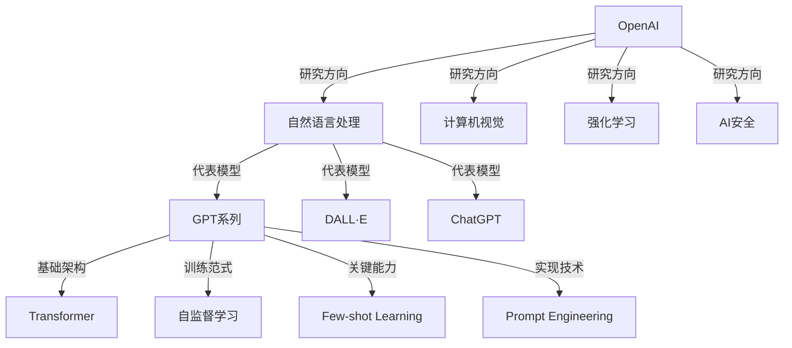

# 【大模型应用开发 动手做AI Agent】说说OpenAI这家公司

## 1. 背景介绍
### 1.1 OpenAI的创立与发展历程
#### 1.1.1 OpenAI的创立
OpenAI是一家非营利性人工智能研究公司,由Elon Musk、Sam Altman等人于2015年12月共同创立。公司的目标是促进和开发友好的人工智能,使人类整体受益。

#### 1.1.2 OpenAI的发展历程
- 2015年12月,OpenAI成立,获得Elon Musk、Reid Hoffman等人的10亿美元捐赠。
- 2016年4月,发布OpenAI Gym,一个用于开发和比较强化学习算法的工具包。  
- 2018年2月,发布了自然语言处理系统GPT(Generative Pre-trained Transformer)。
- 2019年2月,发布了GPT-2语言模型,引发了对AI生成虚假内容的担忧。
- 2020年6月,发布了GPT-3语言模型,拥有1750亿个参数,是当时最大的语言模型。
- 2021年1月,微软宣布与OpenAI达成合作,获得GPT-3的独家许可。
- 2022年11月,发布了ChatGPT聊天对话模型,在自然对话方面取得突破性进展。
- 2023年3月,发布了GPT-4多模态大语言模型,进一步提升了语言理解和生成能力。

### 1.2 OpenAI的研究方向与成果
#### 1.2.1 OpenAI的研究方向
OpenAI主要专注于以下人工智能研究方向:  
- 自然语言处理:如GPT、InstructGPT、ChatGPT等语言模型
- 计算机视觉:如DALL·E、CLIP等图像生成和理解模型
- 强化学习:如OpenAI Five等游戏AI系统
- AI安全:如AI对齐、AI透明度等AI安全研究

#### 1.2.2 OpenAI的代表性研究成果
- GPT-3:拥有1750亿参数的大型语言模型,可用于文本生成、对话、问答、翻译等任务。
- DALL·E:一个基于GPT-3的文本到图像生成系统,可根据文本描述生成逼真的图像。
- Whisper:一个通用的语音识别模型,可以识别和转录多种语言的语音。
- ChatGPT:一个基于GPT-3.5架构的大型语言模型,在自然对话方面有出色表现。
- GPT-4:一个多模态的大语言模型,支持文本、图像等多种输入,语言理解和生成能力进一步提升。

## 2. 核心概念与联系
### 2.1 大语言模型(Large Language Model)
大语言模型是一类基于海量文本数据训练的神经网络模型,通过自监督学习方式学习语言的统计规律和语义表示。代表模型有GPT系列、BERT、T5等。它们在自然语言处理领域取得了突破性进展,可用于各种下游任务。

### 2.2 transformer 架构
Transformer是一种用于序列建模的神经网络架构,最早由Google于2017年提出。它摒弃了传统的RNN/LSTM等结构,完全基于注意力机制(Attention Mechanism)来学习序列之间的依赖关系。Transformer的并行性好,训练速度快,成为大语言模型的首选架构。

### 2.3 自监督学习(Self-supervised Learning)
自监督学习是一种无需人工标注数据的机器学习范式。它从大规模无标注数据中自动构建监督信号,让模型学习到数据的一般性表示。常见的方法有自回归语言建模、掩码语言建模等。GPT、BERT等大语言模型都是基于自监督学习训练的。

### 2.4 few-shot learning
Few-shot learning指的是模型在只给定少量示例的情况下就能很好地完成新任务,无需从头训练。GPT-3 展现出了惊人的 few-shot 学习能力,只需给定简单的任务描述和几个示例,就能在新任务上取得不错的效果,彻底改变了人们对语言模型的认知。

### 2.5 提示工程(Prompt Engineering)
提示工程是一种利用少量示例和任务描述来引导语言模型执行特定任务的技术。通过精心设计输入的提示(prompt),可以让语言模型更好地理解任务需求,生成所需的结果。对于GPT-3这样的大模型,提示工程是实现其few-shot能力的关键。

### 概念联系图

## 3. 核心算法原理具体操作步骤
### 3.1 GPT的训练过程
GPT模型的训练主要分为两个阶段:预训练阶段和微调阶段。

#### 3.1.1 预训练阶段
1. 数据准备:收集大规模高质量的无标注文本数据,进行清洗和预处理。
2. 文本编码:使用Byte Pair Encoding(BPE)或WordPiece等方法将文本转换为模型可以处理的token序列。
3. 构建训练样本:将token序列划分为固定长度的输入序列和目标序列,作为训练样本。
4. 模型初始化:随机初始化GPT模型的参数,包括Transformer的编码器和解码器部分。
5. 模型训练:使用自回归语言建模任务训练GPT模型,即根据前面的token预测下一个token。损失函数通常为交叉熵损失。
6. 模型评估:在验证集上评估模型的困惑度(perplexity)等指标,选择最优的模型参数。

#### 3.1.2 微调阶段
1. 下游任务数据准备:收集特定领域的标注数据,如问答、对话、摘要等,进行预处理。
2. 模型微调:在预训练的GPT模型基础上,使用下游任务的标注数据进行微调。根据任务的不同,可以设计不同的输入输出格式和损失函数。
3. 模型评估:在下游任务的测试集上评估微调后的模型性能,如准确率、F1值等指标。
4. 模型部署:将微调后的模型部署到生产环境,提供实际应用服务。

### 3.2 DALL·E的生成过程
DALL·E是一个文本到图像的生成模型,它的生成过程可以分为以下几个步骤:

1. 文本编码:将输入的文本描述使用预训练的语言模型(如GPT-3)进行编码,得到文本的语义表示向量。
2. 图像编码:使用预训练的视觉模型(如CLIP)对大量图像进行编码,得到图像的语义表示向量。
3. 跨模态对齐:通过对比文本和图像的语义表示向量,学习它们之间的对齐关系。这可以通过对比学习、对偶学习等方法实现。
4. 图像生成:根据文本的语义表示向量,使用生成对抗网络(GAN)或扩散模型(Diffusion Model)生成与文本描述相符的图像。
5. 图像优化:对生成的图像进行优化,如去噪、超分辨率等,提高图像的质量和清晰度。
6. 图像评估:评估生成图像与文本描述的相关性和真实性,可以使用CLIP等模型计算它们的语义相似度得分。

### 3.3 ChatGPT的对话过程
ChatGPT是一个大型对话语言模型,它的对话过程可以概括为以下步骤:

1. 对话历史编码:将用户之前的对话内容和当前的输入一起作为模型的输入,使用预训练的语言模型(如GPT-3)进行编码。
2. 对话状态表示:根据对话历史的编码,生成一个表示当前对话状态的向量。这个向量捕捉了对话的上下文信息。
3. 回复生成:根据对话状态向量和用户当前的输入,使用语言模型生成适当的回复。生成过程通常使用Beam Search等解码策略。
4. 回复优化:对生成的回复进行优化,如去重、过滤不恰当的内容、提高流畅度等,提高回复的质量。
5. 对话状态更新:将生成的回复加入到对话历史中,更新对话状态向量,为下一轮对话做准备。
6. 重复步骤3-5:不断重复回复生成、优化和状态更新的过程,直到用户结束对话或达到预设的轮次限制。

## 4. 数学模型和公式详细讲解举例说明
### 4.1 Transformer的注意力机制
Transformer的核心是注意力机制,特别是自注意力机制(Self-Attention)。它允许模型在处理当前token时,关注输入序列中的任意其他token。

假设我们有一个输入序列$X=(x_1,x_2,...,x_n)$,每个$x_i$是一个$d$维的向量。自注意力机制的计算过程如下:

1. 计算查询矩阵$Q$、键矩阵$K$和值矩阵$V$:
$$
Q=XW^Q, K=XW^K, V=XW^V
$$
其中$W^Q,W^K,W^V$是可学习的参数矩阵,维度分别为$d\times d_q$,$d\times d_k$,$d\times d_v$。

2. 计算注意力权重:
$$
A=\text{softmax}(\frac{QK^T}{\sqrt{d_k}})
$$
其中$A$是一个$n\times n$的矩阵,表示每个token对其他token的注意力权重。$\sqrt{d_k}$是一个缩放因子,用于控制点积的方差。

3. 计算注意力输出:
$$
\text{Attention}(Q,K,V)=AV
$$
将注意力权重矩阵$A$与值矩阵$V$相乘,得到最终的注意力输出,维度为$n\times d_v$。

举个例子,假设我们有一个句子"The quick brown fox jumps over the lazy dog",其中"fox"这个词的自注意力权重可能较高地分配给"quick"和"brown"这两个词,因为它们在语义上更相关。

### 4.2 GPT的语言模型
GPT使用自回归语言模型来预测下一个token。给定一个token序列$X=(x_1,x_2,...,x_n)$,语言模型的目标是最大化下一个token的条件概率:
$$
P(x_{n+1}|x_1,x_2,...,x_n)
$$

在GPT中,这个条件概率是通过Transformer的解码器计算的:
$$
P(x_{n+1}|x_1,x_2,...,x_n)=\text{softmax}(H_nW+b)
$$
其中$H_n$是解码器最后一层的输出,表示当前序列的语义表示。$W$和$b$是可学习的参数矩阵和偏置项。

模型的训练目标是最小化负对数似然损失:
$$
L=-\sum_{i=1}^{n}\log P(x_i|x_1,x_2,...,x_{i-1})
$$

举个例子,假设我们要训练一个英文语言模型,输入序列是"The quick brown fox",那么模型的目标就是正确预测下一个单词是"jumps"。通过最小化损失函数,模型可以学习到英语语言的统计规律和语义表示。

### 4.3 DALL·E的对比学习
DALL·E使用对比学习来实现文本和图像的跨模态对齐。给定一个文本描述$t$和一个图像$v$,我们希望最大化它们的相似度$s(t,v)$,同时最小化$t$与其他无关图像$v'$的相似度$s(t,v')$。

这可以通过对比损失函数来实现:
$$
L=-\log\frac{\exp(s(t,v)/\tau)}{\exp(s(t,v)/\tau)+\sum_{v'\in V'}\exp(s(t,v')/\tau)}
$$
其中$\tau$是一个温度超参数,控制相似度分布的平滑度。$V'$是一个负