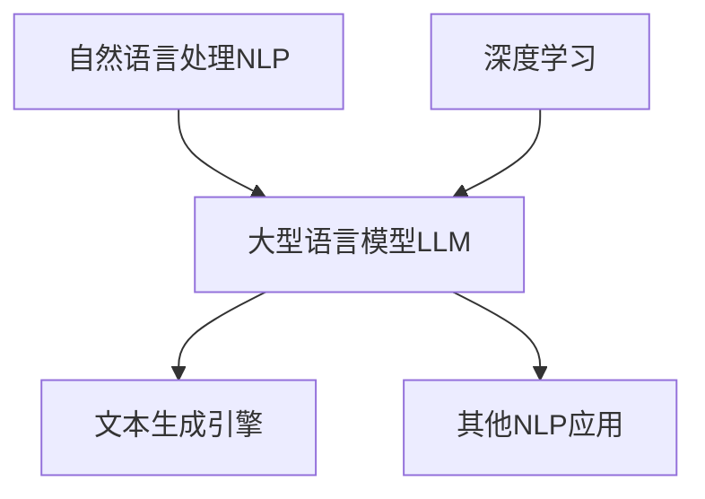
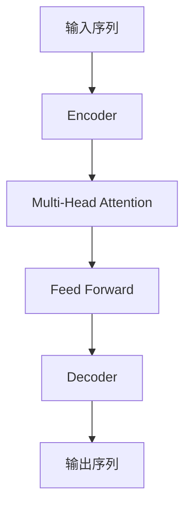

# 【大模型应用开发 动手做AI Agent】配置文本生成引擎大模型

## 1. 背景介绍

### 1.1 人工智能的飞速发展

近年来,人工智能(AI)技术的突飞猛进发展正在彻底改变着我们的生活和工作方式。大型语言模型(Large Language Model, LLM)作为人工智能的核心技术之一,已经在自然语言处理、内容生成、问答系统等领域展现出了令人惊叹的能力。

### 1.2 大模型的崛起

随着计算能力的不断提高和海量数据的积累,训练大规模神经网络成为可能。像GPT-3、BERT、DALL-E等大模型凭借其惊人的性能,在各个领域掀起了一股"大模型热潮"。这些模型不仅能够生成逼真的自然语言文本,还能够完成图像生成、代码生成等多种任务。

### 1.3 文本生成引擎的重要性

在当前的数字时代,高质量的文本内容对于信息传播、知识共享和内容创作至关重要。文本生成引擎作为LLM的一种应用,可以根据给定的提示自动生成连贯、流畅的文本,极大地提高了内容创作的效率。无论是新闻报道、营销文案,还是小说创作,文本生成引擎都可以发挥巨大的作用。

## 2. 核心概念与联系

### 2.1 自然语言处理(NLP)

自然语言处理是人工智能的一个重要分支,旨在使计算机能够理解和生成人类语言。NLP技术广泛应用于机器翻译、文本分类、情感分析、问答系统等领域。大型语言模型正是建立在NLP的基础之上,通过对大量文本数据进行训练,学习语言的规则和模式。

### 2.2 深度学习与神经网络

深度学习是机器学习的一个分支,它利用多层神经网络来模拟人脑的工作原理,从海量数据中自动学习特征表示和模式。大型语言模型通常采用Transformer等神经网络架构,通过自注意力机制捕捉长距离依赖关系,从而更好地理解和生成自然语言。



### 2.3 预训练与微调

大型语言模型通常采用两阶段训练策略:首先在大规模无标注语料库上进行预训练,学习通用的语言表示;然后针对特定的下游任务(如文本生成)进行微调,对模型进行进一步的专门化训练。这种预训练+微调的范式大大提高了模型的泛化能力和效率。

## 3. 核心算法原理具体操作步骤

### 3.1 Transformer架构

Transformer是大型语言模型中广泛采用的一种神经网络架构,它完全基于注意力机制,避免了传统循环神经网络的缺陷。Transformer由编码器(Encoder)和解码器(Decoder)两部分组成,能够有效捕捉输入序列中的长距离依赖关系。



1. 输入序列首先被Encoder编码为高维向量表示
2. 在Encoder中,Multi-Head Attention层对输入进行自注意力计算,捕捉序列内部的依赖关系
3. Feed Forward层对注意力输出进行非线性变换,提取更高层次的特征表示
4. Decoder利用Encoder的输出,结合自注意力和编码器-解码器注意力机制,生成目标输出序列

### 3.2 自回归生成

大型语言模型通常采用自回归(Autoregressive)的生成策略,即模型在生成下一个token时,会利用已生成的token序列作为条件。这种生成方式能够保证输出序列的连贯性和一致性。

1. 给定一个起始提示(Prompt),将其输入到模型中
2. 模型根据提示和已生成的token,预测下一个最可能的token
3. 将预测的token添加到输出序列中
4. 重复步骤2和3,直到达到预设的长度或生成终止标记

### 3.3 Top-K/Top-P采样

为了提高生成文本的多样性,避免重复和偏颇,通常会在解码过程中引入随机性。Top-K采样和Top-P采样是两种常用的随机采样方法:

- Top-K采样: 在每一步中,只从概率分布的前K个token中随机采样
- Top-P采样: 在每一步中,只从累积概率占比达到P的token中随机采样

这些采样方法可以平衡生成质量和多样性,产生更加自然流畅的文本输出。

### 3.4 微调策略

虽然大型语言模型在预训练阶段已经学习了通用的语言知识,但针对特定任务(如文本生成)进行微调训练仍然是必要的。常见的微调策略包括:

1. 仅微调模型的部分层(如Decoder)
2. 对整个模型进行微调,但使用较小的学习率
3. 采用层级微调策略,对不同层使用不同的学习率
4. 结合监督学习和无监督学习的多任务微调

合理的微调策略可以有效提升模型在特定任务上的性能表现。

## 4. 数学模型和公式详细讲解举例说明

### 4.1 注意力机制(Attention Mechanism)

注意力机制是Transformer等大型语言模型的核心,它能够自动捕捉输入序列中的重要信息,并据此计算出更加准确的输出表示。

在序列建模任务中,我们需要计算查询向量(Query) $\boldsymbol{q}$ 与一系列键向量(Key) $\{\boldsymbol{k}_1, \boldsymbol{k}_2, \cdots, \boldsymbol{k}_n\}$ 的相似度,并根据相似度分配对应的值向量(Value) $\{\boldsymbol{v}_1, \boldsymbol{v}_2, \cdots, \boldsymbol{v}_n\}$ 的权重,最终得到加权求和的注意力输出 $\boldsymbol{y}$:

$$\boldsymbol{y} = \sum_{i=1}^{n} \alpha_i \boldsymbol{v}_i$$

其中,注意力权重 $\alpha_i$ 通过查询向量 $\boldsymbol{q}$ 与键向量 $\boldsymbol{k}_i$ 的相似度计算得到:

$$\alpha_i = \mathrm{softmax}\left(\frac{\boldsymbol{q}^\top \boldsymbol{k}_i}{\sqrt{d_k}}\right)$$

$d_k$ 是键向量的维度,用于缩放点积值,防止过大的值导致softmax函数饱和。

### 4.2 多头注意力(Multi-Head Attention)

为了捕捉不同子空间的相关性,Transformer采用了多头注意力机制。具体来说,查询、键、值向量首先被线性投影到不同的子空间,然后在每个子空间内计算注意力,最后将所有子空间的注意力输出拼接起来:

$$\mathrm{MultiHead}(\boldsymbol{Q}, \boldsymbol{K}, \boldsymbol{V}) = \mathrm{Concat}(\mathrm{head}_1, \cdots, \mathrm{head}_h)\boldsymbol{W}^O$$

$$\mathrm{head}_i = \mathrm{Attention}(\boldsymbol{Q}\boldsymbol{W}_i^Q, \boldsymbol{K}\boldsymbol{W}_i^K, \boldsymbol{V}\boldsymbol{W}_i^V)$$

其中, $\boldsymbol{W}_i^Q \in \mathbb{R}^{d_\mathrm{model} \times d_k}$、$\boldsymbol{W}_i^K \in \mathbb{R}^{d_\mathrm{model} \times d_k}$、$\boldsymbol{W}_i^V \in \mathbb{R}^{d_\mathrm{model} \times d_v}$ 分别是查询、键、值的线性投影矩阵,用于将输入映射到对应的子空间;$\boldsymbol{W}^O \in \mathbb{R}^{hd_v \times d_\mathrm{model}}$ 是最终的线性变换矩阵,将多头注意力的输出拼接并映射回模型维度空间。

通过多头注意力机制,模型能够从不同的表示子空间中获取补充信息,提高了对输入序列的建模能力。

### 4.3 掩码自注意力(Masked Self-Attention)

在自回归生成任务中,为了保证模型不会利用将来的信息,需要对自注意力机制进行掩码操作。具体来说,在计算注意力权重时,我们将查询向量与其后续位置的键向量的点积置为负无穷,从而使注意力机制只能关注当前位置及之前的信息:

$$\alpha_{i,j} = \begin{cases}
\mathrm{softmax}\left(\frac{\boldsymbol{q}_i^\top \boldsymbol{k}_j}{\sqrt{d_k}}\right), &\text{if }i \geq j\\
-\infty, &\text{if }i < j
\end{cases}$$

通过这种掩码策略,模型在生成每个token时,只能利用已生成token的信息,而不会"窥视"将来的token,从而保证了生成的自然性和一致性。

### 4.4 生成概率(Generation Probability)

在自回归生成过程中,模型需要根据已生成的token序列 $\boldsymbol{x}_{<t}$ 预测下一个token $x_t$ 的概率分布 $P(x_t | \boldsymbol{x}_{<t})$。这个条件概率通常由一个线性层和softmax函数计算得到:

$$P(x_t | \boldsymbol{x}_{<t}) = \mathrm{softmax}(\boldsymbol{W}_\mathrm{vocab} \boldsymbol{h}_t + \boldsymbol{b}_\mathrm{vocab})$$

其中, $\boldsymbol{h}_t$ 是模型在时间步 $t$ 的隐状态向量,通过之前的自注意力层和前馈网络层计算得到; $\boldsymbol{W}_\mathrm{vocab} \in \mathbb{R}^{|V| \times d_\mathrm{model}}$ 和 $\boldsymbol{b}_\mathrm{vocab} \in \mathbb{R}^{|V|}$ 分别是词表嵌入矩阵和偏置向量,用于将隐状态向量映射到词表空间。

在生成过程中,我们可以根据这个概率分布采样或选取最大概率的token作为输出。通过不断迭代这个过程,最终即可生成完整的文本序列。

## 5. 项目实践:代码实例和详细解释说明

在本节中,我们将通过一个实际的代码示例,演示如何使用Hugging Face的Transformers库配置和微调一个文本生成模型。我们将使用GPT-2作为预训练模型,并在一个小型的新闻数据集上进行微调,最终训练出一个能够生成新闻文本的模型。

### 5.1 准备工作

首先,我们需要安装所需的Python库:

```bash
pip install transformers datasets
```

然后,导入必要的模块:

```python
from transformers import GPT2LMHeadModel, GPT2Tokenizer
from transformers import TextDataset, DataCollatorForLanguageModeling
from transformers import Trainer, TrainingArguments
from datasets import load_dataset
```

### 5.2 加载数据集

我们将使用Hugging Face的`datasets`库加载一个新闻数据集。这里以一个虚构的小型数据集`my_news_dataset`为例:

```python
dataset = load_dataset("my_news_dataset")
```

### 5.3 数据预处理

接下来,我们需要对数据进行一些预处理,包括tokenization和数据集格式转换:

```python
tokenizer = GPT2Tokenizer.from_pretrained("gpt2")

def encode(examples):
    return tokenizer(examples["text"], truncation=True, max_length=512, padding="max_length")

dataset = dataset.map(encode, batched=True, num_proc=4)
dataset = dataset.rename_column("input_ids", "labels")
dataset.set_format("torch")
```

### 5.4 加载预训练模型

现在,我们可以加载GPT-2的预训练模型:

```python
model = GPT2LMHeadModel.from_pretrained("gpt2")
```

### 5.5 定义训练参数

我们需要设置一些训练参数,如批大小、学习率、训练