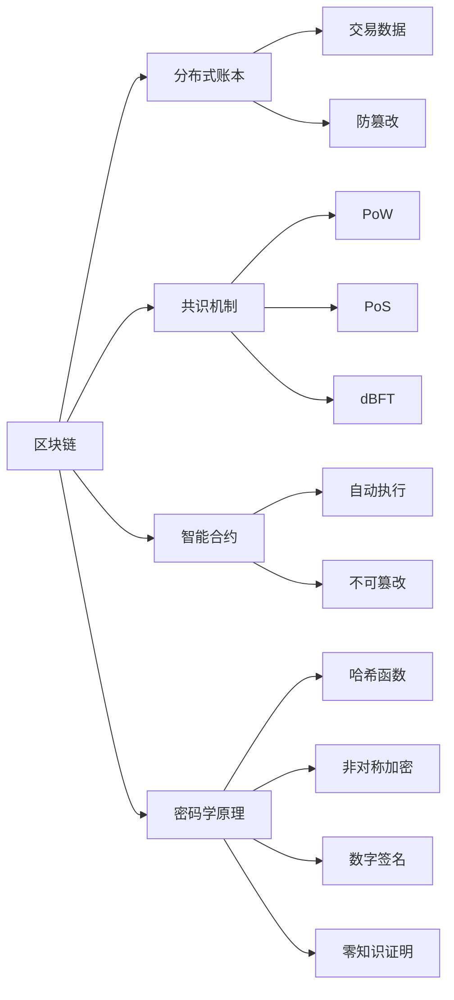

# 一个基于区块链技术的应用系统原型设计与实现

## 1. 背景介绍

### 1.1 区块链技术概述

区块链(Blockchain)是一种去中心化的分布式账本技术,通过密码学原理构建一个不可篡改、可追溯、高度透明的分布式系统。区块链技术最早由中本聪在2008年提出,并在2009年作为比特币的底层技术首次实现。区块链本质上是一个分布式数据库,具有去中心化、不可篡改、全程留痕、可以追溯、集体维护、公开透明等特点。

区块链技术自诞生以来发展迅速,已经从最初的数字货币领域扩展到金融、供应链、医疗、教育、知识产权保护等众多领域。区块链技术有望重塑商业模式,提升协作效率,降低信任成本。

### 1.2 区块链技术发展现状

目前,区块链技术发展迅速,已经从概念验证阶段进入到实际应用探索阶段。各国政府、金融机构、IT企业纷纷布局区块链,推动区块链技术落地应用。

根据区块链的应用场景和部署方式,区块链可以分为公有链、联盟链和私有链三种类型:

1. 公有链:任何人都可以参与的、完全去中心化的区块链,如比特币、以太坊等。
2. 联盟链:由多个机构共同参与维护的区块链,参与方通常在现实中具有一定的信任基础,如R3 Corda、Hyperledger Fabric等。 
3. 私有链:由单一机构部署并控制的区块链,可以理解为一个组织内部的分布式账本系统。

从技术成熟度来看,区块链技术目前还处于发展的初期阶段,在性能、安全性、隐私保护、监管等方面仍面临诸多挑战。未来区块链技术将朝着更高性能、更强安全性、更好隐私保护、支持监管等方向发展。

### 1.3 基于区块链的应用系统开发意义

区块链技术为应用系统开发带来了新的机遇。基于区块链构建应用系统,可以充分利用区块链的分布式账本、智能合约、不可篡改、可追溯等特性,实现应用系统的去中心化、降低信任成本、提升协作效率等目标。

基于区块链的应用系统具有广阔的应用前景,在金融、供应链、医疗、社交、游戏等领域都有巨大的潜力。通过设计和实现一个基于区块链的应用系统原型,可以探索区块链技术在实际应用中的实现方式、遇到的挑战以及解决思路,为未来进一步开发落地区块链应用奠定基础。

## 2. 核心概念与关联

### 2.1 分布式账本

分布式账本(Distributed Ledger)是区块链的核心概念之一。传统的账本系统通常采用中心化的方式,由一个中心化的机构来记录和维护所有的交易数据。而区块链采用分布式账本技术,交易数据被记录在多个节点上,每个节点都保存一份完整的账本数据。

在分布式账本中,一旦交易数据写入区块并被多数节点确认,就会被永久记录下来,且无法篡改。这种分布式存储和共识机制,确保了账本数据的一致性、可靠性和防篡改性。

### 2.2 共识机制

共识机制(Consensus Mechanism)是区块链系统的重要组成部分,用于在分布式系统中各个节点之间对交易的有效性达成一致。常见的共识机制有工作量证明(PoW)、权益证明(PoS)、授权拜占庭容错(dBFT)等。

不同的共识机制在安全性、性能、资源消耗等方面各有优缺点。设计区块链应用系统时,需要根据具体应用场景和需求,选择合适的共识机制。

### 2.3 智能合约

智能合约(Smart Contract)是一种基于区块链的、可自动执行的、不可篡改的计算机程序。智能合约将合约条款以程序代码的形式事先确定,一旦合约条件满足,就会自动触发执行,且执行结果会被永久记录在区块链上。

智能合约极大地提升了合约执行的效率和可信度,减少了对中心化可信第三方的依赖。智能合约在金融交易、供应链管理、知识产权保护等领域有广泛应用前景。

### 2.4 密码学原理

区块链技术大量使用了现代密码学原理,包括哈希函数、非对称加密、数字签名、零知识证明等。这些密码学技术保障了区块链系统的安全性、隐私性和不可篡改性。

- 哈希函数用于生成区块的唯一标识,实现快速校验区块数据是否被篡改。
- 非对称加密用于生成账户地址,保护账户隐私。
- 数字签名用于验证交易的真实性,防止伪造交易。
- 零知识证明用于在不泄露隐私信息的情况下,证明某个声明的真实性。

下图展示了区块链的核心概念以及它们之间的关联:

## 3. 核心算法原理与操作步骤

### 3.1 区块链数据结构

区块链本质上是由一系列区块按照时间顺序串联而成的链式数据结构。每个区块包含了一组交易数据、时间戳、前一个区块的哈希值等信息。区块头和区块体构成了完整的区块结构。

区块头包含了版本号、前一个区块哈希、梅克尔根、时间戳、难度目标等元数据。区块体则包含了一组经过验证的交易数据。

梅克尔树(Merkle Tree)是一种哈希二叉树,它可以高效地验证大规模数据的完整性。区块中的交易数据首先被哈希,然后两两配对进行哈希,生成新的哈希值,重复多轮直到最后生成一个根哈希,即为梅克尔根。梅克尔根被记录在区块头中,通过梅克尔根和梅克尔路径,可以快速验证某个交易是否包含在区块中。

### 3.2 工作量证明

工作量证明(Proof of Work,PoW)是比特币、以太坊等区块链项目采用的共识算法。PoW要求矿工节点投入算力来争夺记账权,保证区块链的安全性。

PoW的核心是哈希难题。系统会设定一个难度目标,要求矿工找到一个随机数(Nonce),使得区块头哈希值小于难度目标。由于哈希函数是单向的,只能通过穷举法来寻找合适的Nonce。

矿工节点首先准备好打包的交易数据,填充区块头其他字段,然后不断变换Nonce计算区块头哈希,直到满足难度要求。这个过程消耗大量算力,被形象地称为"挖矿"。

率先找到Nonce的矿工向全网广播区块,其他节点验证后将区块添加到本地区块链,矿工获得区块奖励和交易手续费。

PoW算法的安全性基于算力保证,攻击者要篡改区块链,需要持续投入超过51%的算力,经济成本极高。但PoW也存在能耗高、交易性能有限等问题。

### 3.3 权益证明

权益证明(Proof of Stake,PoS)是另一种主流的区块链共识算法,以持币数量和时间为权重来选择记账节点,不需要消耗大量算力挖矿。

PoS算法要求参与记账的节点锁定一定数量的代币作为权益质押,质押的代币数量越多,获得记账权的概率越大。记账节点通过检查交易的合法性、将交易打包成区块,并获得交易手续费作为奖励。

为了防止分叉攻击,PoS算法引入了"币龄"的概念,代币被锁定质押的时间越长,获得记账权的概率也越高。同时,如果记账节点有恶意行为,质押的代币将被没收,这种经济博弈保证了记账节点的诚实。

PoS相比PoW有更好的能效和性能,但在安全性、去中心化程度等方面仍有待进一步验证。

### 3.4 智能合约执行

智能合约是运行在区块链上的、具备特定功能的程序代码。以太坊率先支持图灵完备的智能合约,极大拓展了区块链的应用场景。

智能合约的执行依赖于区块链的虚拟机环境,以EVM(Ethereum Virtual Machine)为例,它是一个基于栈的虚拟机,支持一套简单的指令集。智能合约代码被编译为EVM字节码,部署到区块链上。

当一个交易调用智能合约时,区块链节点会执行EVM解释器,加载相应的合约字节码并执行。智能合约可以读取区块链状态、接收和转移代币、修改合约内部存储、调用其他合约等。

合约执行结果会被各节点独立验证,并最终达成共识,更新区块链状态。智能合约让区块链从单纯的分布式账本发展为可编程的价值转移平台。

## 4. 数学模型与公式详解

### 4.1 椭圆曲线加密

椭圆曲线加密(Elliptic Curve Cryptography,ECC)是区块链系统广泛使用的一种非对称加密算法,相比RSA等算法,ECC以较短的密钥长度达到了同等的安全强度。

椭圆曲线定义在有限域上,通常采用如下形式的韦尔斯特拉斯方程:

$y^2 = x^3 + ax + b$

其中,参数$a$,$b$满足条件$4a^3 + 27b^2 \neq 0$。

椭圆曲线上的点$(x,y)$以及一个称为"无穷远点"的特殊点$O$共同构成一个阿贝尔群。定义椭圆曲线上的点加法如下:

- $P+O=P$
- 若$P=(x,y)$,则$P$的逆元$-P$为$(x,-y)$,且$P+(-P)=O$
- 若$P=(x_1,y_1), Q=(x_2,y_2)$,且$P \neq \pm Q$,则$P+Q=(x_3,y_3)$,其中:

$$
\begin{aligned}
\lambda &= \frac{y_2-y_1}{x_2-x_1} \\
x_3 &= \lambda^2 - x_1 - x_2 \\ 
y_3 &= \lambda(x_1-x_3)-y_1
\end{aligned}
$$

- 若$P=Q$,则$2P=(x_3,y_3)$,其中:

$$
\begin{aligned}
\lambda &= \frac{3x_1^2+a}{2y_1} \\
x_3 &= \lambda^2 - 2x_1 \\ 
y_3 &= \lambda(x_1-x_3)-y_1
\end{aligned}
$$

基于椭圆曲线点加法,可以定义标量乘法$kP=P+P+\cdots+P$($k$次)。

椭圆曲线加密的私钥是一个随机整数$k$,公钥是$P$和$kP$,其中$P$为基点。已知$k$和$P$计算$kP$很容易,但已知$P$和$kP$求解$k$则是一个难题(椭圆曲线离散对数问题)。

椭圆曲线签名算法(ECDSA)基于椭圆曲线的单向特性,用私钥对消息哈希进行签名,公钥可以验证签名,但无法伪造。区块链中的交易签名、验签等广泛应用了ECC和ECDSA算法。

### 4.2 梅克尔树

梅克尔树通过递归哈希的方式,可以高效验证大规模数据的完整性和成员资格,在