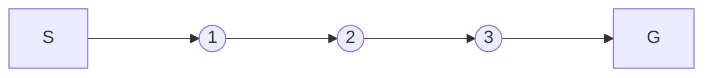

# 一切皆是映射：AI Q-learning价值迭代优化

## 1. 背景介绍
### 1.1 强化学习概述
#### 1.1.1 强化学习的定义与特点
强化学习(Reinforcement Learning, RL)是机器学习的一个重要分支,它主要关注如何基于环境而行动,以取得最大化的预期利益。不同于监督式学习由外部督导者指定目标,强化学习更加注重从与环境的交互中学习目标。在强化学习中,智能体(Agent)通过观察环境状态(State),并作出行动(Action),之后环境状态因智能体的行动而改变,同时智能体从环境获得奖励(Reward)。智能体的目标是找到一个最优策略,使得长期累积奖励最大化。

#### 1.1.2 强化学习的应用场景
强化学习在很多领域都有广泛应用,比如:
- 游戏:智能体通过大量尝试与环境交互,学习游戏策略,AlphaGo就是一个著名的例子。
- 机器人控制:通过强化学习,机器人可以学习到在复杂环境中的运动策略。
- 推荐系统:将推荐过程建模为马尔可夫决策过程,通过强化学习找到最优推荐策略。
- 自然语言处理:将对话、机器翻译等任务建模为序列决策问题,用强化学习求解。

### 1.2 Q-learning算法
#### 1.2.1 Q-learning的提出背景
Q-learning是一种非常经典和广泛使用的无模型(model-free)强化学习算法,由Watkins在1989年提出。它可以在不了解环境转移概率的情况下,通过与环境的交互学习到最优策略。Q-learning结合了动态规划的思想和时间差分学习,是一种异策略(off-policy)的时间差分(Temporal Difference, TD)控制算法。

#### 1.2.2 Q-learning的优势
相比其他强化学习算法,Q-learning具有以下优势:
- 无需环境模型:不需要知道状态转移概率和奖励函数,通过采样的方式估计Q值。
- 异策略学习:目标策略和行为策略可以不同,提高了探索的灵活性。
- 收敛性好:在一定条件下,Q-learning可以收敛到最优策略。
- 简单易实现:Q-learning的更新公式简洁,容易理解和编程实现。

## 2. 核心概念与联系
### 2.1 马尔可夫决策过程(MDP) 
马尔可夫决策过程是强化学习问题的标准形式化定义。一个MDP由状态集合S、动作集合A、转移概率P、奖励函数R和折扣因子γ组成,通常表示为一个五元组(S, A, P, R, γ)。

- 状态S:表示智能体所处的环境状态。
- 动作A:表示智能体在某状态下可以采取的行为。
- 转移概率P:状态转移矩阵,P(s'|s,a)表示在状态s下采取行动a后转移到状态s'的概率。
- 奖励函数R:R(s,a)表示智能体在状态s下采取行动a获得的即时奖励值。
- 折扣因子γ:γ∈[0,1],表示对未来奖励的衰减程度,γ越大,越重视长期利益。

MDP的目标是寻找一个最优策略π:S→A,使得智能体能够获得最大化的期望累积奖励。

### 2.2 值函数与贝尔曼方程
#### 2.2.1 状态值函数
状态值函数V(s)表示从状态s开始,遵循某一策略π,可以获得的期望累积奖励。
$$V^\pi(s)=\mathbb{E}[G_t|S_t=s]=\mathbb{E}[\sum_{k=0}^\infty \gamma^k R_{t+k+1}|S_t=s]$$

#### 2.2.2 动作值函数
动作值函数Q(s,a)表示在状态s下采取行动a,遵循某一策略π,可以获得的期望累积奖励。
$$Q^\pi(s,a)=\mathbb{E}[G_t|S_t=s,A_t=a]=\mathbb{E}[\sum_{k=0}^\infty \gamma^k R_{t+k+1}|S_t=s,A_t=a]$$

#### 2.2.3 贝尔曼方程
值函数满足贝尔曼方程(Bellman Equation),揭示了当前状态的值与后继状态的值之间的递归关系:
$$V^\pi(s)=\sum_a \pi(a|s) \sum_{s',r} p(s',r|s,a)[r+\gamma V^\pi(s')]$$
$$Q^\pi(s,a)=\sum_{s',r} p(s',r|s,a)[r+\gamma \sum_{a'} \pi(a'|s')Q^\pi(s',a')]$$

### 2.3 Q-learning的价值迭代优化
Q-learning算法基于值迭代的思想对动作值函数进行迭代更新,直到收敛到最优值函数Q*。
Q-learning的核心更新公式为:
$$Q(s_t,a_t) \leftarrow Q(s_t,a_t)+\alpha[r_{t+1}+\gamma \max_a Q(s_{t+1},a)-Q(s_t,a_t)]$$

其中α为学习率,r为即时奖励,γ为折扣因子。这个更新公式可以分为两部分理解:
- 目标值:$r_{t+1}+\gamma \max_a Q(s_{t+1},a)$,表示在状态$s_t$采取动作$a_t$后,获得即时奖励$r_{t+1}$,再加上下一状态$s_{t+1}$的最大Q值(表示未来的最优累积奖励)。
- 时间差分误差:$r_{t+1}+\gamma \max_a Q(s_{t+1},a)-Q(s_t,a_t)$,即目标值与当前值的差值,作为更新的梯度方向。

Q-learning算法以一定概率ϵ随机探索,以1-ϵ的概率采取Q值最大的动作,不断更新Q表,最终收敛得到最优策略。

## 3. 核心算法原理具体操作步骤
Q-learning算法的具体操作步骤如下:
1. 初始化Q表,对于所有的状态-动作对(s,a),令Q(s,a)=0。
2. 设定学习率α,折扣因子γ,探索概率ϵ。
3. 重复以下步骤,直到Q表收敛或达到一定的训练轮数:
   1) 初始化状态s
   2) 重复以下步骤,直到回合终止:
      - 在状态s下,以ϵ的概率随机选择动作a,否则选择Q(s,a)最大的动作。
      - 执行动作a,观察奖励r和下一状态s'。 
      - 根据Q-learning的更新公式更新Q(s,a):
        $$Q(s,a) \leftarrow Q(s,a)+\alpha[r+\gamma \max_{a'} Q(s',a')-Q(s,a)]$$
      - 令s←s'。
4. 输出最优策略π*:对于每个状态s,选择Q(s,a)最大的动作作为最优动作。

## 4. 数学模型和公式详细讲解举例说明
### 4.1 Q-learning的收敛性证明
Q-learning算法可以在一定条件下收敛到最优动作值函数Q*,下面给出简要证明。

假设学习率α满足:
$$\sum_{t=1}^\infty \alpha_t=\infty, \sum_{t=1}^\infty \alpha_t^2<\infty$$

定义Q-learning算法在时刻t的更新误差为:
$$\Delta_t=r_{t+1}+\gamma \max_a Q(s_{t+1},a)-Q(s_t,a_t)$$

根据Q-learning的更新公式,可以得到:
$$Q_{t+1}(s_t,a_t)=Q_t(s_t,a_t)+\alpha_t \Delta_t$$

令$\hat{Q}_t$为t时刻的估计值,$\mathbb{E}[\Delta_t|\hat{Q}_t]=\mathbb{E}[r_{t+1}+\gamma \max_a \hat{Q}_t(s_{t+1},a)-\hat{Q}_t(s_t,a_t)|\hat{Q}_t]$

可以证明$\hat{Q}_t$是一个收缩映射(contraction mapping),即对于任意两个估计值$\hat{Q}_t$和$\hat{Q}'_t$:
$$\|\mathbb{E}[\Delta_t|\hat{Q}_t]-\mathbb{E}[\Delta_t|\hat{Q}'_t]\| \leq \gamma \|\hat{Q}_t-\hat{Q}'_t\|$$

根据Banach不动点定理,收缩映射在完备度量空间中存在唯一不动点,因此$\hat{Q}_t$收敛到唯一的不动点Q*。

### 4.2 Q-learning在网格世界环境中的应用
考虑一个简单的网格世界环境,如下图所示:



- 状态空间S={1,2,3},初始状态为1,终止状态为G。
- 动作空间A={左,右},执行"左"会向左移动一格,执行"右"会向右移动一格。
- 奖励函数R:除了状态3执行"右"到达终止状态的奖励为1外,其他状态执行任何动作的奖励都为0。
- 折扣因子γ=0.9,学习率α=0.5。

我们用Q-learning算法求解这个环境的最优策略。初始化Q表如下:

|状态\动作|左  |右  |
|-------|----|----|
|1      |0   |0   |
|2      |0   |0   |
|3      |0   |0   |

假设前两轮探索过程如下:
- 第一轮:1->2->3->G,获得奖励序列(0,0,1)。
- 第二轮:1->2->1->2->3->G,获得奖励序列(0,0,0,0,1)。

根据Q-learning的更新公式,每一步更新Q表如下:
1. 第一轮:
   - Q(3,"右")←0+0.5×[1+0.9×max(0,0)-0]=0.5
   - Q(2,"右")←0+0.5×[0+0.9×max(0,0.5)-0]=0.225
   - Q(1,"右")←0+0.5×[0+0.9×max(0,0.225)-0]=0.10125
2. 第二轮:
   - Q(3,"右")←0.5+0.5×[1+0.9×max(0,0)-0.5]=0.75
   - Q(2,"右")←0.225+0.5×[0+0.9×max(0,0.75)-0.225]≈0.45
   - Q(1,"左")←0+0.5×[0+0.9×max(0.45,0)-0]≈0.2025
   - Q(2,"右")←0.45+0.5×[0+0.9×max(0,0.75)-0.45]≈0.5475
   - Q(1,"右")←0.10125+0.5×[0+0.9×max(0.5475,0)-0.10125]≈0.297

经过两轮探索后,Q表变为:

|状态\动作|左      |右     |
|-------|--------|-------|
|1      |0.2025  |0.297  |
|2      |0       |0.5475 |
|3      |0       |0.75   |

可以看到,Q值逐步向最优值收敛,最终得到最优策略为:在状态1选择"右",在状态2选择"右",在状态3选择"右"。这个结果也符合直观,即总是向右走到终止状态可以获得最大累积奖励。

## 5. 项目实践：代码实例和详细解释说明
下面给出一个使用Python实现Q-learning算法的简单示例代码:

```python
import numpy as np

# 定义网格世界环境
class GridWorld:
    def __init__(self):
        self.state_space = [1, 2, 3]  # 状态空间
        self.action_space = ['left', 'right']  # 动作空间
        self.q_table = np.zeros((len(self.state_space), len(self.action_space)))  # Q表初始化
        
    def step(self, state, action):
        if state == 3 and action == 'right':
            return 'terminal', 1
        else:
            return state + 1 if action == 'right' else state - 1, 0
        
    def choose_action(self, state, epsilon):
        if np.random.uniform() < epsilon:
            return np.random.choice(self.action_space)
        else:
            return self.action_space[np.argmax(self.q_table[state-1])]

# Q-learning算法训练
def q_learning(env,