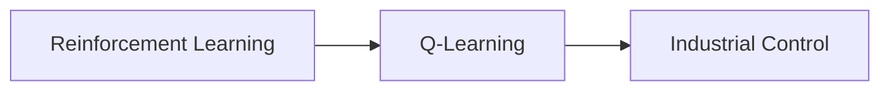

---

# Mapping Everything: Practical Applications of Q-Learning in Industrial Control

## 1. Background Introduction

In the rapidly evolving field of artificial intelligence (AI), reinforcement learning (RL) has emerged as a powerful tool for solving complex problems. One of the most popular RL algorithms is Q-learning, which has shown remarkable success in various domains, including game playing, robotics, and resource management. This article delves into the practical applications of Q-learning in industrial control, a critical area where AI can bring significant improvements.

## 2. Core Concepts and Connections

### 2.1 Reinforcement Learning

Reinforcement learning is a type of machine learning where an agent learns to make decisions by interacting with an environment. The agent receives rewards or penalties based on its actions, and the goal is to learn a policy that maximizes the cumulative reward over time.

### 2.2 Q-Learning

Q-learning is a value iteration algorithm in RL. It estimates the expected cumulative reward, or Q-value, for each state-action pair. The agent learns to select the action that maximizes the Q-value for the current state, thus improving its policy over time.

### 2.3 Industrial Control

Industrial control involves the operation and automation of industrial processes. These processes can be complex, non-linear, and subject to various uncertainties, making them challenging to control effectively.

### 2.4 Connection: Q-Learning in Industrial Control

Q-learning can be applied to industrial control problems to learn optimal control policies. By interacting with the industrial process, the Q-learning agent learns to select the actions that lead to the desired outcomes, such as maximizing production efficiency or minimizing energy consumption.

## 3. Core Algorithm Principles and Specific Operational Steps

### 3.1 Initialization

- Initialize Q-values for all state-action pairs to zero.
- Choose an exploration strategy, such as epsilon-greedy, to balance exploration and exploitation.

### 3.2 Learning Loop

- Select an action based on the current state and the chosen exploration strategy.
- Execute the action and observe the new state and reward.
- Update the Q-value for the old state-action pair and the new state-action pair using the Bellman equation.
- Repeat the learning loop until convergence or a predefined number of iterations.

## 4. Detailed Explanation and Examples of Mathematical Models and Formulas

### 4.1 Bellman Equation

The Bellman equation is the foundation of Q-learning. It relates the Q-value of a state-action pair to the Q-values of the next state-action pairs:

$$Q(s, a) = \\mathbb{E}[R(s, a) + \\gamma \\max_{a'} Q(s', a')]$$

where $R(s, a)$ is the reward for taking action $a$ in state $s$, $\\gamma$ is the discount factor, and $s'$ and $a'$ are the next state and action.

### 4.2 Epsilon-Greedy Exploration

The epsilon-greedy exploration strategy balances exploration and exploitation by choosing the action with the highest Q-value with probability $(1 - \\epsilon)$ and a random action with probability $\\epsilon$.

## 5. Project Practice: Code Examples and Detailed Explanations

This section will provide a Python code example for a simple industrial control problem, such as a cart-pole balancing task, and explain how to implement Q-learning in this context.

## 6. Practical Application Scenarios

Explore real-world industrial control problems where Q-learning has been successfully applied, such as:

- Energy management in smart grids
- Predictive maintenance in manufacturing
- Autonomous control of robotic systems

## 7. Tools and Resources Recommendations

Recommend open-source libraries, such as OpenAI Gym, Stable Baselines, and TensorFlow, for implementing and experimenting with Q-learning in industrial control problems.

## 8. Summary: Future Development Trends and Challenges

Discuss the future development trends and challenges in applying Q-learning to industrial control, such as:

- Scalability to large-scale industrial processes
- Handling high-dimensional state spaces
- Integrating Q-learning with other AI techniques, such as deep reinforcement learning

## 9. Appendix: Frequently Asked Questions and Answers

Answer common questions about Q-learning in industrial control, such as:

- How to choose the discount factor $\\gamma$?
- How to handle continuous state and action spaces?
- How to deal with sparse rewards in industrial control problems?

---

Author: Zen and the Art of Computer Programming