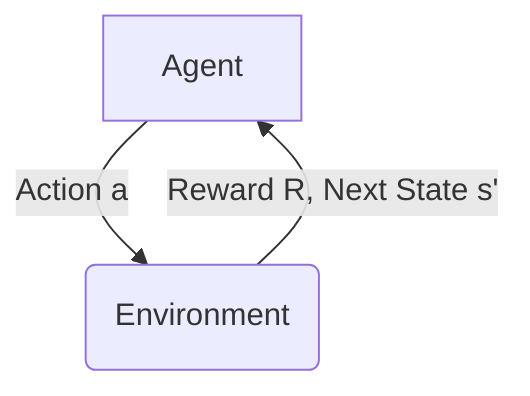
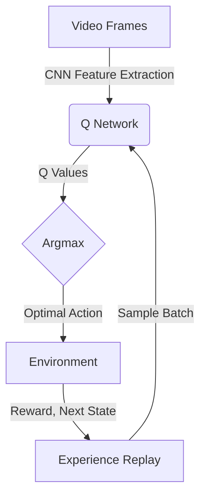

# 一切皆是映射：AI Q-learning在视频处理中的卓越表现

## 1.背景介绍

### 1.1 视频处理的重要性

在当今的数字时代,视频数据无处不在。无论是在线视频流媒体、安防监控录像,还是医学影像诊断、自动驾驶场景等,视频处理技术都扮演着至关重要的角色。有效地分析和理解视频内容,不仅可以为人类提供更好的视觉体验,还能为各种智能系统提供宝贵的视觉信息输入。

### 1.2 视频处理的挑战

然而,视频处理并非一蹴而就的简单任务。由于视频数据的高维度、动态变化和复杂多样的内容,很多传统的机器学习算法在处理视频时往往会遇到瓶颈。例如,如何准确地检测和跟踪运动目标?如何高效地压缩视频以减小存储和传输开销?如何自动生成视频内容的文字描述?这些都是视频处理面临的巨大挑战。

### 1.3 AI视频处理的兴起

近年来,人工智能(AI)技术的飞速发展为视频处理带来了全新的契机。特别是深度学习算法在计算机视觉、自然语言处理等领域取得了突破性进展,使得AI系统能够更加准确高效地处理视频数据。其中,强化学习(Reinforcement Learning)作为深度学习的一个重要分支,在视频处理领域中发挥着越来越重要的作用。

## 2.核心概念与联系

### 2.1 强化学习简介

强化学习是机器学习的一种重要范式,其核心思想是通过与环境进行交互,获取反馈信号(reward),并根据这些反馈信号不断调整策略(policy),最终学习到一个可以maximizing累积reward的最优策略。

在强化学习中,通常将问题建模为一个Markov决策过程(MDP),其中包含以下几个核心要素:

- 状态(State) $s$
- 动作(Action) $a$
- 奖励函数(Reward Function) $R(s, a)$
- 状态转移概率(State Transition Probability) $P(s' | s, a)$

智能体(Agent)在当前状态$s$下采取动作$a$,会获得即时奖励$R(s, a)$,并转移到下一个状态$s'$,其转移概率为$P(s' | s, a)$。智能体的目标是通过与环境不断交互,学习到一个最优策略$\pi^*(s)$,使得在该策略下的期望累积奖励最大化。

### 2.2 Q-learning算法

Q-learning是强化学习中最经典和最广泛使用的算法之一。它的核心思想是学习一个Action-Value函数$Q(s, a)$,用于估计在当前状态$s$下采取动作$a$,之后能获得的期望累积奖励。具体来说,Q-learning通过下面的Bellman方程进行迭代更新:

$$Q(s_t, a_t) \leftarrow Q(s_t, a_t) + \alpha \left[ r_t + \gamma \max_{a}Q(s_{t+1}, a) - Q(s_t, a_t) \right]$$

其中:

- $\alpha$是学习率
- $\gamma$是折扣因子
- $r_t$是在时刻$t$获得的即时奖励
- $\max_{a}Q(s_{t+1}, a)$是在下一状态$s_{t+1}$下能获得的最大期望累积奖励

通过不断更新$Q(s, a)$,最终可以收敛到最优的Action-Value函数$Q^*(s, a)$,从而得到最优策略$\pi^*(s) = \arg\max_a Q^*(s, a)$。

### 2.3 深度Q网络(DQN)

传统的Q-learning算法需要维护一个巨大的Q表来存储所有状态-动作对的Q值,这在处理高维视频数据时显然是不现实的。深度Q网络(Deep Q-Network, DQN)巧妙地将深度神经网络引入到Q-learning中,使用神经网络来逼近Q函数,从而能够高效地处理高维状态输入。

DQN的核心思想是使用一个卷积神经网络(CNN)来提取视频帧的特征,然后将这些特征输入到一个全连接网络中,输出对应每个动作的Q值。在训练过程中,通过minimizing下面的损失函数来更新网络参数:

$$L = \mathbb{E}_{(s, a, r, s')\sim D} \left[ \left( r + \gamma \max_{a'} Q(s', a'; \theta^-) - Q(s, a; \theta) \right)^2 \right]$$

其中:

- $D$是经验回放池(Experience Replay Buffer)
- $\theta$是当前网络参数
- $\theta^-$是目标网络参数(Target Network)

通过不断迭代训练,DQN可以逐步学习到一个较为准确的Q函数逼近,从而获得一个高效的策略来处理视频数据。

## 3.核心算法原理具体操作步骤

DQN算法在视频处理中的具体操作步骤如下:

1. **初始化**
   - 初始化一个带有随机权重的Q网络,用于逼近Q函数
   - 初始化一个目标Q网络,权重参数与Q网络相同,用于计算目标Q值
   - 初始化一个经验回放池(Experience Replay Buffer)$D$,用于存储智能体与环境交互的经验样本$(s, a, r, s')$

2. **观测初始状态**
   - 从视频中获取初始观测状态$s_0$,通常为一个视频帧序列

3. **选择动作**
   - 利用当前Q网络,计算每个可能动作$a$对应的Q值$Q(s_0, a; \theta)$
   - 根据一定的策略(如$\epsilon$-greedy策略)选择一个动作$a_0$

4. **执行动作并获取反馈**
   - 在环境中执行选择的动作$a_0$
   - 观测到环境的反馈,获得即时奖励$r_0$和下一个状态$s_1$
   - 将经验样本$(s_0, a_0, r_0, s_1)$存入经验回放池$D$

5. **采样并学习**
   - 从经验回放池$D$中随机采样一个批次的经验样本$(s, a, r, s')$
   - 计算目标Q值:$y = r + \gamma \max_{a'} Q(s', a'; \theta^-)$
   - 计算当前Q网络在$(s, a)$处的Q值:$Q(s, a; \theta)$
   - 计算损失函数:$L = \mathbb{E}_{(s, a, r, s')\sim D} \left[ \left( y - Q(s, a; \theta) \right)^2 \right]$
   - 使用梯度下降算法,minimizing损失函数$L$,更新Q网络参数$\theta$

6. **更新目标Q网络**
   - 每隔一定步数,将Q网络的参数$\theta$复制到目标Q网络参数$\theta^-$

7. **回到步骤3**
   - 重复步骤3-6,直到达到终止条件(如最大训练步数或收敛等)

通过上述迭代过程,DQN算法可以逐步学习到一个较为准确的Q函数逼近,从而获得一个高效的策略,用于处理视频数据并完成相应的任务。

## 4.数学模型和公式详细讲解举例说明

在DQN算法中,有几个关键的数学模型和公式需要重点讲解和举例说明。

### 4.1 Markov决策过程(MDP)

视频处理任务可以被建模为一个Markov决策过程(MDP),其核心要素包括:

- 状态(State)$s$:在视频处理中,状态通常表示为一个视频帧序列,如最近的$n$帧图像
- 动作(Action)$a$:智能体可以采取的动作,如对视频进行分类、目标检测、运动预测等
- 奖励函数(Reward Function)$R(s, a)$:对于给定的状态$s$和动作$a$,环境给出的即时奖励值
- 状态转移概率(State Transition Probability)$P(s' | s, a)$:在当前状态$s$下采取动作$a$,转移到下一个状态$s'$的概率

例如,在视频动作识别任务中:

- 状态$s$可以表示为最近的$n$帧视频图像
- 动作$a$可以是对视频进行不同动作类别的分类预测
- 奖励函数$R(s, a)$可以根据分类预测的准确度给出对应的奖励值
- 状态转移概率$P(s' | s, a)$可以表示为视频帧序列按时间推移的转移概率

通过建模为MDP,我们可以将视频处理任务转化为一个强化学习问题,利用强化学习算法(如Q-learning)来学习最优策略。

### 4.2 Q-learning算法

Q-learning算法的核心是学习一个Action-Value函数$Q(s, a)$,用于估计在当前状态$s$下采取动作$a$,之后能获得的期望累积奖励。具体来说,Q-learning通过下面的Bellman方程进行迭代更新:

$$Q(s_t, a_t) \leftarrow Q(s_t, a_t) + \alpha \left[ r_t + \gamma \max_{a}Q(s_{t+1}, a) - Q(s_t, a_t) \right]$$

其中:

- $\alpha$是学习率,控制着每次更新的步长大小
- $\gamma$是折扣因子,用于权衡即时奖励和未来奖励的重要性
- $r_t$是在时刻$t$获得的即时奖励
- $\max_{a}Q(s_{t+1}, a)$是在下一状态$s_{t+1}$下能获得的最大期望累积奖励

让我们用一个简单的例子来说明Q-learning的更新过程。假设我们有一个视频分类任务,其中:

- 状态$s_t$表示当前视频帧序列
- 动作$a_t$表示对视频进行不同类别的分类预测
- 奖励函数$R(s_t, a_t)$根据分类预测的准确度给出对应的奖励值,正确预测得到+1,错误预测得到-1
- 折扣因子$\gamma=0.9$,学习率$\alpha=0.1$

在时刻$t$,智能体观测到状态$s_t$,并采取动作$a_t$进行分类预测。假设预测正确,获得即时奖励$r_t=+1$,并转移到下一个状态$s_{t+1}$。此时,我们可以根据Bellman方程更新$Q(s_t, a_t)$:

$$Q(s_t, a_t) \leftarrow Q(s_t, a_t) + 0.1 \left[ +1 + 0.9 \max_{a}Q(s_{t+1}, a) - Q(s_t, a_t) \right]$$

通过不断迭代更新$Q(s, a)$,最终可以收敛到最优的Action-Value函数$Q^*(s, a)$,从而得到最优策略$\pi^*(s) = \arg\max_a Q^*(s, a)$。

### 4.3 深度Q网络(DQN)

传统的Q-learning算法需要维护一个巨大的Q表来存储所有状态-动作对的Q值,这在处理高维视频数据时显然是不现实的。深度Q网络(Deep Q-Network, DQN)巧妙地将深度神经网络引入到Q-learning中,使用神经网络来逼近Q函数,从而能够高效地处理高维状态输入。

DQN的核心思想是使用一个卷积神经网络(CNN)来提取视频帧的特征,然后将这些特征输入到一个全连接网络中,输出对应每个动作的Q值。在训练过程中,通过minimizing下面的损失函数来更新网络参数:

$$L = \mathbb{E}_{(s, a, r, s')\sim D} \left[ \left( r + \gamma \max_{a'} Q(s', a'; \theta^-) - Q(s, a; \theta) \right)^2 \right]$$

其中:

- $D$是经验回放池(Experience Replay Buffer),用于存储智能体与环境交互的经验样本$(s,