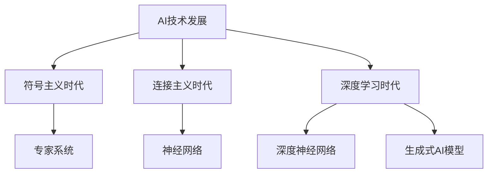
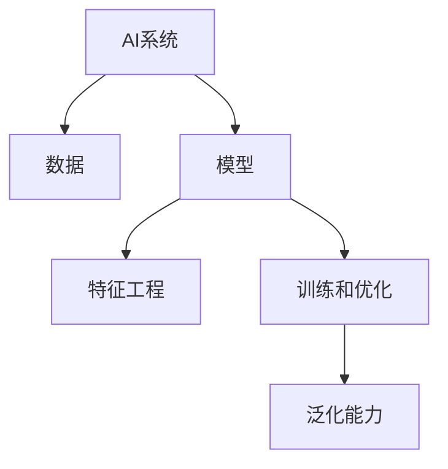
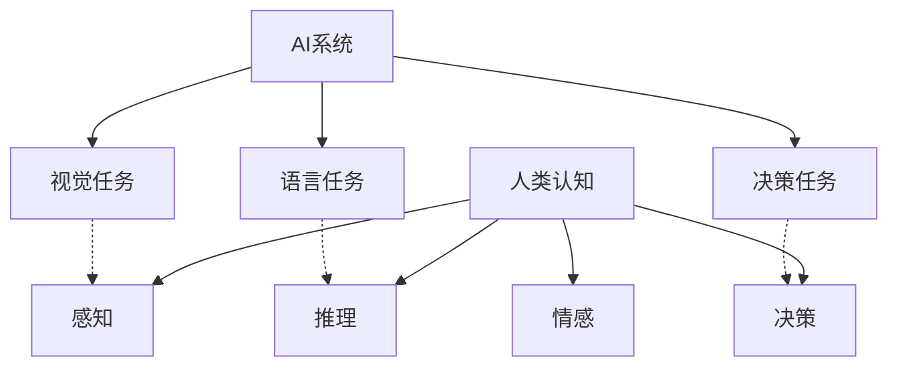

# 一切皆是映射：AI的伦理问题与未来挑战

## 1. 背景介绍

人工智能(AI)技术的快速发展正在深刻影响着我们的生活方式和社会结构。从语音助手到自动驾驶汽车,从医疗诊断到金融决策,AI系统正在无处不在地渗透到我们生活的各个领域。然而,随着AI技术的不断演进,一些重大的伦理问题也随之浮现,这些问题不仅关乎个人隐私和公平公正,更涉及到人类与机器之间的根本关系。

### 1.1 AI技术的发展历程

人工智能的概念可以追溯到20世纪50年代,当时一些先驱者提出了"思考的机器"的设想。经过几十年的发展,AI技术已经取得了长足的进步,尤其是在深度学习和神经网络等领域。现代AI系统能够通过大量数据的训练,学习并模拟人类的认知过程,并在特定任务上表现出超人的能力。

### 1.2 AI技术的应用领域

AI技术的应用范围已经遍及各个行业和领域,包括但不限于:

- 计算机视觉: 图像识别、目标检测、人脸识别等
- 自然语言处理: 机器翻译、语音识别、对话系统等
- 决策支持系统: 医疗诊断、金融风险评估、法律判决辅助等
- 机器人技术: 工业机器人、服务机器人、无人驾驶等
- 游戏AI: 国际象棋、围棋、电子游戏AI等

## 2. 核心概念与联系

### 2.1 AI系统的工作原理

现代AI系统通常采用机器学习和深度学习的方法,通过大量数据的训练,学习并模拟人类的认知过程。这种方法被称为"数据驱动"或"模型驱动"的方法,与传统的基于规则的方法形成鲜明对比。

AI系统的核心概念包括:

- **数据**: AI系统需要大量的数据进行训练,数据的质量和数量直接影响系统的性能。
- **模型**: AI系统通过机器学习算法构建数学模型,用于对输入数据进行处理和预测。
- **特征工程**: 从原始数据中提取有用的特征,是AI系统性能的关键步骤。
- **训练和优化**: 通过反复迭代,调整模型参数,使模型在训练数据上达到最优性能。
- **泛化能力**: 模型在新的未见数据上的表现能力,反映了模型的实际应用价值。

### 2.2 AI系统与人类认知的映射关系

尽管AI系统在某些特定任务上表现出色,但它们与人类认知之间存在着本质的差异。人类认知是一个复杂的、整体的过程,包括感知、推理、决策、情感等多个方面,而AI系统通常只专注于某一个特定任务。

然而,AI系统与人类认知之间也存在着一种映射关系。例如,深度神经网络在某种程度上模拟了人脑视觉皮层的工作原理,自然语言处理系统则模拟了人类语言理解和生成的过程。这种映射关系使得AI系统能够在特定领域展现出类似于人类的能力。

## 3. 核心算法原理具体操作步骤

### 3.1 监督学习

监督学习是机器学习中最常见的一种范式,它的目标是通过训练数据学习一个映射函数,使得给定新的输入数据,能够预测出正确的输出。

1. **数据准备**: 收集并准备训练数据,包括输入特征和对应的标签(输出)。
2. **数据预处理**: 对数据进行清洗、标准化、特征选择等预处理操作。
3. **模型选择**: 选择合适的机器学习模型,如线性回归、决策树、支持向量机等。
4. **模型训练**: 使用训练数据训练模型,优化模型参数,使模型在训练数据上达到最优性能。
5. **模型评估**: 使用测试数据评估模型的泛化能力,计算评估指标如准确率、精确率、召回率等。
6. **模型调优**: 根据评估结果,调整模型参数或选择不同的模型,重复训练和评估过程。
7. **模型部署**: 将最终模型应用于实际任务,进行预测或决策。

### 3.2 深度学习

深度学习是机器学习的一个子领域,它基于人工神经网络,通过多层非线性变换来学习数据的层次表示。深度学习模型具有强大的特征学习能力,能够自动从原始数据中提取有用的特征。

1. **数据准备**: 收集并准备训练数据,通常需要大量的数据。
2. **数据预处理**: 对数据进行归一化、增强等预处理操作。
3. **网络结构设计**: 设计合适的神经网络结构,如卷积神经网络(CNN)、循环神经网络(RNN)等。
4. **初始化参数**: 初始化网络权重和偏置参数。
5. **网络训练**: 使用优化算法(如梯度下降)训练网络参数,使网络在训练数据上达到最优性能。
6. **模型评估**: 使用测试数据评估网络的泛化能力。
7. **模型调优**: 根据评估结果,调整网络结构、超参数或训练策略。
8. **模型部署**: 将训练好的网络应用于实际任务。

### 3.3 强化学习

强化学习是机器学习的另一个重要范式,它通过与环境的交互,学习一个策略(policy),使得在给定环境下能够获得最大的累积奖励。

1. **定义环境和奖励函数**: 确定智能体所处的环境,以及环境中的状态、动作和奖励函数。
2. **初始化策略**: 初始化一个随机或基于先验知识的策略。
3. **交互与学习**: 智能体根据当前策略与环境交互,获得奖励,并根据奖励信号更新策略。
4. **策略评估**: 评估当前策略在环境中的表现,计算累积奖励。
5. **策略改进**: 根据评估结果,使用算法(如Q-Learning、策略梯度等)改进策略。
6. **策略收敛**: 重复交互、评估和改进过程,直到策略收敛为最优策略。
7. **策略部署**: 将学习到的最优策略应用于实际任务。

## 4. 数学模型和公式详细讲解举例说明

### 4.1 线性回归

线性回归是一种常见的监督学习算法,用于建立输入特征与目标变量之间的线性关系。给定一组训练数据 $\{(x_i, y_i)\}_{i=1}^N$,其中 $x_i$ 是输入特征向量,  $y_i$ 是目标变量,线性回归模型可以表示为:

$$y = w^Tx + b$$

其中 $w$ 是权重向量, $b$ 是偏置项。模型的目标是找到最优的 $w$ 和 $b$,使得预测值 $\hat{y}$ 与真实值 $y$ 之间的差异最小化。通常采用最小二乘法来优化模型参数:

$$\min_{w,b} \sum_{i=1}^N (y_i - w^Tx_i - b)^2$$

该优化问题有解析解,可以通过矩阵运算求解。线性回归模型简单易用,但只能捕捉线性关系,对于非线性数据需要进行特征工程或使用更复杂的模型。

### 4.2 逻辑回归

逻辑回归是一种用于分类任务的监督学习算法。它通过sigmoid函数将线性回归的输出值映射到 $(0,1)$ 区间,作为预测类别的概率。

对于二分类问题,给定训练数据 $\{(x_i, y_i)\}_{i=1}^N$,其中 $y_i \in \{0,1\}$,逻辑回归模型可以表示为:

$$\hat{y} = \sigma(w^Tx + b) = \frac{1}{1 + e^{-(w^Tx + b)}}$$

其中 $\sigma(\cdot)$ 是sigmoid函数。模型的目标是最大化训练数据的对数似然函数:

$$\max_{w,b} \sum_{i=1}^N [y_i \log \hat{y}_i + (1 - y_i) \log (1 - \hat{y}_i)]$$

通常采用梯度下降法或者其他优化算法来求解上述优化问题。对于多分类问题,可以使用softmax函数进行推广。

### 4.3 支持向量机

支持向量机(SVM)是一种有监督的机器学习算法,常用于分类和回归任务。SVM的基本思想是在高维空间中构造一个超平面,将不同类别的数据点分隔开,同时使得分隔超平面与最近的数据点之间的距离最大化。

对于线性可分的二分类问题,给定训练数据 $\{(x_i, y_i)\}_{i=1}^N$,其中 $y_i \in \{-1,1\}$,SVM的目标是找到一个超平面 $w^Tx + b = 0$,使得:

$$\begin{align*}
&\min_{w,b} \frac{1}{2}\|w\|^2\\
&\text{s.t. } y_i(w^Tx_i + b) \geq 1, \quad i=1,\ldots,N
\end{align*}$$

对于线性不可分的情况,可以引入软间隔变量和正则化项,将上述优化问题转化为:

$$\begin{align*}
&\min_{w,b,\xi} \frac{1}{2}\|w\|^2 + C\sum_{i=1}^N \xi_i\\
&\text{s.t. } y_i(w^Tx_i + b) \geq 1 - \xi_i, \quad i=1,\ldots,N\\
&\xi_i \geq 0, \quad i=1,\ldots,N
\end{align*}$$

其中 $\xi_i$ 是软间隔变量, $C$ 是正则化参数,用于控制模型的复杂度和误差惩罚之间的权衡。

### 4.4 神经网络

神经网络是一种受生物神经系统启发的机器学习模型,它由多个神经元(节点)和连接权重组成。神经网络具有强大的非线性映射能力,可以学习复杂的函数关系。

一个典型的前馈神经网络可以表示为:

$$\begin{align*}
h^{(1)} &= \sigma(W^{(1)}x + b^{(1)})\\
h^{(2)} &= \sigma(W^{(2)}h^{(1)} + b^{(2)})\\
&\vdots\\
y &= \sigma(W^{(L)}h^{(L-1)} + b^{(L)})
\end{align*}$$

其中 $x$ 是输入向量, $y$ 是输出向量, $h^{(l)}$ 是第 $l$ 层的隐藏层输出, $W^{(l)}$ 和 $b^{(l)}$ 分别是第 $l$ 层的权重矩阵和偏置向量, $\sigma(\cdot)$ 是非线性激活函数(如sigmoid、ReLU等)。

神经网络的训练过程是一个优化问题,目标是最小化损失函数(如均方误差或交叉熵损失)。通常采用反向传播算法计算梯度,然后使用优化算法(如梯度下降、Adam等)更新网络参数。

## 5. 项目实践: 代码实例和详细解释说明

为了更好地理解AI算法的实现细节,我们将通过一个实际的代码示例来演示如何构建和训练一