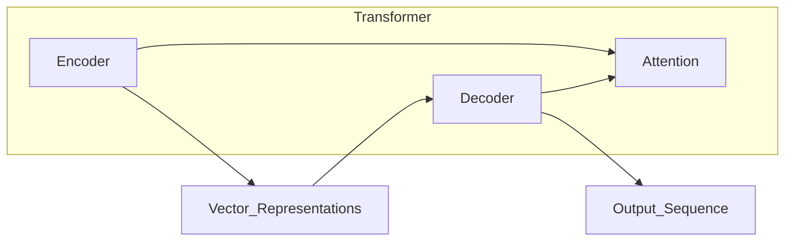
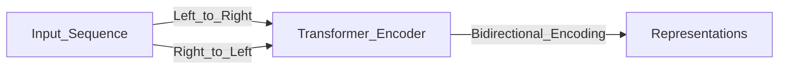
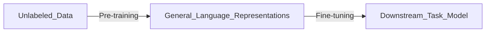
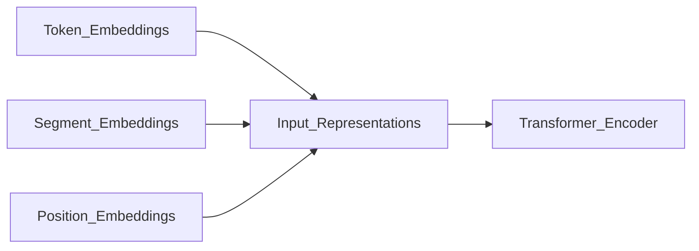
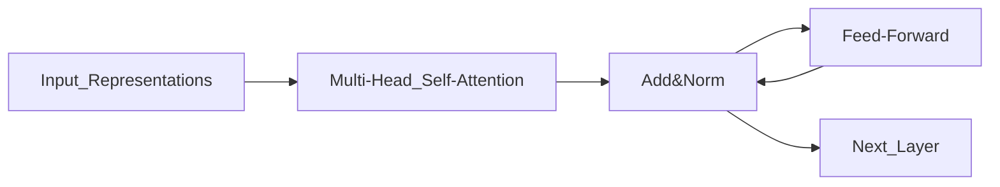
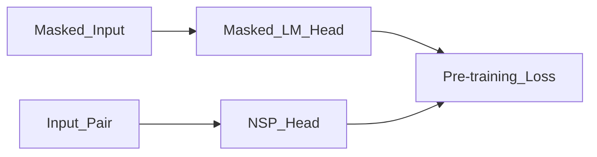
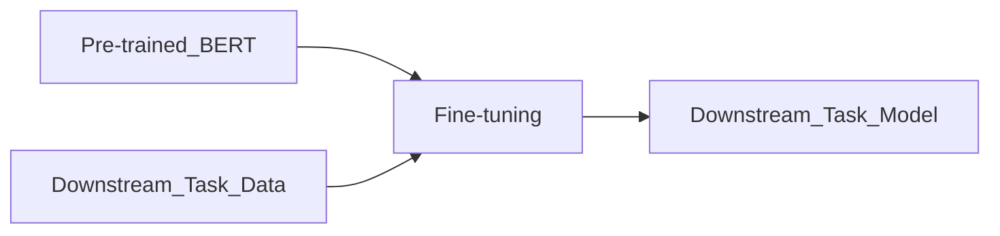

# 一切皆是映射：BERT模型原理及其在文本理解中的应用

## 1.背景介绍

### 1.1 自然语言处理的挑战

自然语言处理(Natural Language Processing, NLP)是人工智能领域的一个重要分支,旨在使计算机能够理解和生成人类语言。然而,自然语言的复杂性和多样性给NLP带来了巨大的挑战。

首先,自然语言存在着严重的歧义性。同一个词或句子在不同的上下文中可能有完全不同的含义。其次,自然语言具有复杂的语法结构和语义关系,需要深入理解才能正确解析。此外,自然语言中还存在大量的隐喻、双关语、俚语等特殊表达方式,这些都给NLP带来了极大的困难。

### 1.2 语言模型的发展

为了解决自然语言处理中的挑战,研究人员提出了各种语言模型。传统的基于统计的语言模型,如N-gram模型,通过计算词序列的概率来预测下一个词。但是,这种方法存在着固有的局限性,无法很好地捕捉长距离依赖关系和上下文信息。

随着深度学习技术的发展,神经网络语言模型(Neural Network Language Model, NNLM)应运而生。NNLM能够自动学习词与词之间的语义关系,并捕捉长距离依赖关系。然而,早期的NNLM仍然存在一些缺陷,如无法很好地处理长序列和大规模语料库。

### 1.3 BERT的诞生

2018年,谷歌的研究人员提出了BERT(Bidirectional Encoder Representations from Transformers)模型,这是一种全新的预训练语言表示模型。BERT的核心思想是利用大规模无标注语料进行预训练,学习通用的语言表示,然后在下游任务上进行微调(fine-tuning),从而获得出色的性能。

BERT的出现彻底改变了NLP领域,它不仅在多项自然语言理解任务上取得了state-of-the-art的成绩,而且为后续的语言模型研究指明了新的方向。本文将深入探讨BERT模型的原理,并介绍它在文本理解任务中的应用。

## 2.核心概念与联系

### 2.1 Transformer架构

BERT模型的核心是Transformer架构,这是一种全新的基于注意力机制(Attention Mechanism)的序列到序列(Seq2Seq)模型。与传统的基于RNN或CNN的模型不同,Transformer完全依赖于注意力机制来捕捉输入和输出之间的全局依赖关系,从而避免了长期依赖问题。

Transformer由编码器(Encoder)和解码器(Decoder)两个部分组成。编码器将输入序列映射为一系列连续的向量表示,而解码器则根据这些向量表示生成输出序列。在BERT中,只使用了Transformer的编码器部分。

### 2.2 自注意力机制

自注意力机制(Self-Attention Mechanism)是Transformer的核心部件。它允许模型在计算目标词的表示时,直接捕捉整个输入序列的信息,而不必依赖于序列的顺序。

具体来说,自注意力机制首先计算出查询向量(Query)、键向量(Key)和值向量(Value),然后通过计算查询向量与所有键向量的相似性得分,对值向量进行加权求和,从而获得目标词的表示。这种机制使得BERT能够有效地建模长距离依赖关系。

$$\mathrm{Attention}(Q, K, V) = \mathrm{softmax}\left(\frac{QK^T}{\sqrt{d_k}}\right)V$$

其中,Q、K、V分别表示查询、键和值向量,$d_k$是缩放因子。

### 2.3 双向编码器表示

BERT的一个关键创新是使用了双向编码器表示(Bidirectional Encoder Representations)。传统的语言模型只能从左到右或从右到左捕捉上下文信息,而BERT则同时考虑了左右两侧的上下文,从而获得了更加丰富的语义表示。

为了实现双向编码,BERT在输入序列的开头添加了一个特殊的[CLS]标记,用于表示整个序列的综合语义表示。同时,BERT还引入了一种新的预训练任务——下一句预测(Next Sentence Prediction),旨在捕捉句子与句子之间的关系。

### 2.4 预训练和微调

BERT采用了两阶段的训练策略:预训练(Pre-training)和微调(Fine-tuning)。

在预训练阶段,BERT使用大规模的无标注语料(如书籍、维基百科等)进行训练,学习通用的语言表示。预训练任务包括掩码语言模型(Masked Language Model)和下一句预测(Next Sentence Prediction)。

在微调阶段,BERT将预训练得到的模型参数作为初始化参数,在特定的下游任务上进行进一步的训练和优化,从而获得针对该任务的最佳模型。这种两阶段的训练策略使得BERT能够在下游任务上取得出色的性能,同时大大减少了训练所需的计算资源和数据量。

## 3.核心算法原理具体操作步骤

### 3.1 输入表示

在BERT中,输入序列由三个部分组成:标记嵌入(Token Embeddings)、分段嵌入(Segment Embeddings)和位置嵌入(Position Embeddings)。

1. **标记嵌入**:将每个单词映射为一个固定长度的向量表示。
2. **分段嵌入**:用于区分输入序列中的不同段落,如问题和答案。
3. **位置嵌入**:捕捉单词在序列中的位置信息。

这三个嵌入相加,即可得到每个单词的最终输入表示。

### 3.2 Transformer编码器

BERT使用了基于Transformer的编码器来捕捉输入序列的上下文信息。编码器由多个相同的层组成,每一层包含两个子层:多头自注意力机制(Multi-Head Self-Attention)和前馈神经网络(Feed-Forward Neural Network)。

1. **多头自注意力机制**:允许模型同时关注输入序列中的不同位置,捕捉长距离依赖关系。
2. **前馈神经网络**:对自注意力机制的输出进行进一步的非线性变换。

每个子层都使用了残差连接(Residual Connection)和层归一化(Layer Normalization),以提高模型的性能和稳定性。

### 3.3 预训练任务

BERT使用了两种预训练任务:掩码语言模型(Masked Language Model)和下一句预测(Next Sentence Prediction)。

1. **掩码语言模型**:随机选择输入序列中的15%的单词,将它们用特殊的[MASK]标记替换,然后让模型预测这些被掩码的单词。这种方式可以让BERT学习到双向的语言表示。
2. **下一句预测**:给定两个句子A和B,模型需要预测B是否为A的下一句。这个任务可以增强BERT对于句子之间关系的建模能力。

通过这两种预训练任务,BERT可以学习到丰富的语义和上下文信息,为下游任务的微调奠定基础。

### 3.4 微调

在完成预训练后,BERT可以通过微调(Fine-tuning)的方式应用于各种下游任务,如文本分类、问答系统、自然语言推理等。

微调的过程如下:

1. 将预训练好的BERT模型作为初始化参数。
2. 在特定的下游任务上进行进一步的训练,根据任务的目标函数优化模型参数。
3. 对于不同的任务,可能需要在BERT的输出上添加特定的输出层,如分类器或生成器。

由于BERT已经学习到了丰富的语言表示,因此在下游任务上只需要进行少量的微调,就可以获得出色的性能。

## 4.数学模型和公式详细讲解举例说明

### 4.1 自注意力机制

自注意力机制是BERT的核心部件,它允许模型在计算目标词的表示时,直接捕捉整个输入序列的信息。下面我们详细解释一下自注意力机制的数学原理。

给定一个长度为$n$的输入序列$X = (x_1, x_2, \dots, x_n)$,我们首先将每个输入$x_i$映射为一个维度为$d$的向量表示$h_i \in \mathbb{R}^d$。然后,我们将这些向量分别线性投影到查询(Query)、键(Key)和值(Value)空间,得到$Q_i, K_i, V_i \in \mathbb{R}^{d_k}$,其中$d_k$是投影维度。

$$Q_i = W_Q h_i, \quad K_i = W_K h_i, \quad V_i = W_V h_i$$

接下来,我们计算查询向量$Q_i$与所有键向量$K_j$的相似性得分,并通过softmax函数将其归一化为注意力权重$\alpha_{ij}$:

$$\alpha_{ij} = \frac{\exp(Q_i K_j^T / \sqrt{d_k})}{\sum_{l=1}^n \exp(Q_i K_l^T / \sqrt{d_k})}$$

其中,$\sqrt{d_k}$是一个缩放因子,用于防止内积过大导致梯度消失或爆炸。

最后,我们将注意力权重$\alpha_{ij}$与值向量$V_j$相乘,并对所有$j$求和,得到目标词$x_i$的注意力表示$z_i$:

$$z_i = \sum_{j=1}^n \alpha_{ij} V_j$$

通过这种方式,自注意力机制可以自适应地捕捉输入序列中任意两个位置之间的依赖关系,从而有效地建模长距离依赖。

### 4.2 多头自注意力机制

在实际应用中,BERT使用了多头自注意力机制(Multi-Head Self-Attention),它可以从不同的子空间捕捉不同的依赖关系。

具体来说,我们将查询、键和值向量分别线性投影到$h$个子空间,并在每个子空间中计算自注意力表示,然后将这些表示拼接起来,得到最终的多头自注意力表示:

$$\mathrm{MultiHead}(Q, K, V) = \mathrm{Concat}(head_1, \dots, head_h) W^O$$
$$\text{where} \quad head_i = \mathrm{Attention}(QW_i^Q, KW_i^K, VW_i^V)$$

其中,$W_i^Q, W_i^K, W_i^V$分别是第$i$个头的查询、键和值的线性投影矩阵,$W^O$是最终的线性变换矩阵。

通过多头自注意力机制,BERT可以从不同的子空间捕捉不同的依赖关系,从而获得更加丰富和全面的语义表示。

### 4.3 掩码语言模型

掩码语言模型(Masked Language Model)是BERT预训练的一个重要任务。它的目标是根据上下文预测被掩码的单词,从而学习到双向的语言表示。

具体来说,给定一个输入序列$X = (x_1, x_2, \dots, x_n)$,我们随机选择其中的15%的单词,并用特殊的[MASK]标记替换它们,得