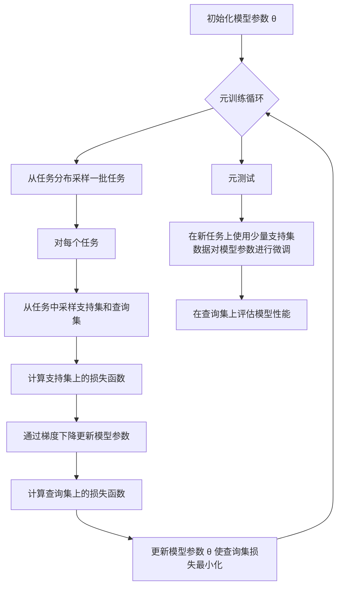

# 一切皆是映射：MAML算法原理与应用

## 1.背景介绍

在机器学习领域中,元学习(Meta-Learning)是一个新兴且极具潜力的研究方向。传统的机器学习算法往往需要大量的数据和计算资源来训练模型,并且在面对新的任务时,需要从头开始训练新的模型。而元学习的目标是设计一种通用的学习算法,使其能够快速适应新的任务,从而提高学习效率和泛化能力。

Meta学习的一个核心思想是"学习如何学习"(Learning to Learn),即在训练过程中不仅学习任务本身,还要学习如何快速获取新知识并应用于新任务。这种思路与人类学习的方式非常相似,人类往往能够利用以前的经验快速掌握新的知识和技能。

在这一背景下,Model-Agnostic Meta-Learning (MAML)算法应运而生,它提供了一种简单而有效的元学习框架,可以应用于各种类型的机器学习模型和任务。MAML算法的核心思想是通过对模型参数进行微调(Fine-Tuning),使模型能够快速适应新的任务,同时保留了在先前任务中学习到的有用知识。

### 1.1 MAML算法的应用场景

MAML算法可以应用于各种机器学习任务,包括但不限于:

- **少样本学习(Few-Shot Learning)**: 在只有少量标记数据的情况下,快速学习新的类别或概念。
- **持续学习(Continual Learning)**: 在不丢失之前学习到的知识的情况下,持续学习新的任务和概念。
- **强化学习(Reinforcement Learning)**: 快速适应新的环境和任务,提高策略的泛化能力。
- **多任务学习(Multi-Task Learning)**: 同时学习多个相关任务,提高模型的泛化性和鲁棒性。
- **领域自适应(Domain Adaptation)**: 将在一个领域学习到的知识迁移到另一个相关但不同的领域。

MAML算法的广泛应用前景使其成为当前机器学习研究的一个热点领域,吸引了众多学者和工程师的关注。

## 2.核心概念与联系

### 2.1 MAML算法的核心思想

MAML算法的核心思想可以概括为:在元训练(Meta-Training)阶段,通过对一系列不同的任务进行训练,学习到一个好的初始化参数,使得在元测试(Meta-Testing)阶段,只需要少量数据和少量梯度更新步骤,就可以快速适应新的任务。

该算法的关键在于,在元训练阶段,不仅要最小化每个任务的损失函数,还要最小化在少量梯度更新步骤后,新任务的损失函数。这种双重优化目标使得模型不仅能够在原始任务上表现良好,而且能够快速适应新的任务。

### 2.2 MAML算法与其他元学习算法的联系

MAML算法属于基于优化的元学习(Optimization-Based Meta-Learning)范畴,与其他一些著名的元学习算法有一定的联系和区别:

- **LSTM元学习器(LSTM Meta-Learner)**: 使用长短期记忆网络(LSTM)作为元学习器,通过观察任务数据和损失函数的变化来学习更新模型参数的策略。
- **无监督元学习(Unsupervised Meta-Learning)**: 在没有任务标签的情况下,通过学习数据的潜在表示来获取元知识。
- **在线元学习(Online Meta-Learning)**: 在线学习新任务的同时,持续更新元知识,实现持续学习。

相比其他算法,MAML算法具有以下优点:

1. **简单高效**: MAML算法的原理简单,计算开销较小,易于实现和部署。
2. **通用性强**: MAML算法可以应用于各种类型的模型和任务,具有很强的通用性。
3. **理论支持**: MAML算法有着坚实的理论基础,可以从优化的角度进行分析和解释。

## 3.核心算法原理具体操作步骤

MAML算法的核心思想是通过对模型参数进行微调(Fine-Tuning),使模型能够快速适应新的任务。具体的操作步骤如下:

1. **初始化**: 随机初始化模型参数 $\theta$。

2. **元训练(Meta-Training)循环**:
   a. 从任务分布 $p(\mathcal{T})$ 中采样一批任务 $\mathcal{T}_i$。
   b. 对于每个任务 $\mathcal{T}_i$:
      i. 从 $\mathcal{T}_i$ 中采样支持集(Support Set) $\mathcal{D}_i^{tr}$ 和查询集(Query Set) $\mathcal{D}_i^{val}$。
      ii. 计算支持集上的损失函数 $\mathcal{L}_{\mathcal{T}_i}(\theta)$。
      iii. 通过梯度下降更新模型参数:

$$
\theta_i' = \theta - \alpha \nabla_\theta \mathcal{L}_{\mathcal{T}_i}(\theta)
$$

其中 $\alpha$ 是学习率。
      iv. 计算查询集上的损失函数 $\mathcal{L}_{\mathcal{T}_i}(\theta_i')$。
   c. 更新模型参数 $\theta$,使查询集上的损失函数最小化:

$$
\theta \leftarrow \theta - \beta \nabla_\theta \sum_{\mathcal{T}_i \sim p(\mathcal{T})} \mathcal{L}_{\mathcal{T}_i}(\theta_i')
$$

其中 $\beta$ 是元学习率(Meta Learning Rate)。

3. **元测试(Meta-Testing)**: 在新的任务上,使用少量支持集数据对模型参数进行微调,即重复步骤2b(i-iii),然后在查询集上评估模型性能。

该算法的关键在于通过对查询集损失函数进行优化,使得模型不仅能够在支持集上表现良好,而且能够快速适应新的任务。这种双重优化目标使得MAML算法具有强大的泛化能力和快速适应能力。

### 3.1 MAML算法流程图

为了更好地理解MAML算法的工作原理,我们使用Mermaid流程图进行可视化说明:



在上述流程图中,我们可以清晰地看到MAML算法的两个主要阶段:元训练和元测试。在元训练阶段,算法通过对一系列任务进行训练,学习到一个好的初始化参数。在元测试阶段,算法利用这个初始化参数,只需要少量数据和少量梯度更新步骤,就可以快速适应新的任务。

## 4.数学模型和公式详细讲解举例说明

在上一节中,我们介绍了MAML算法的核心操作步骤,其中涉及到一些关键的数学公式。在这一节,我们将对这些公式进行详细的讲解和举例说明。

### 4.1 支持集和查询集

在MAML算法中,每个任务 $\mathcal{T}_i$ 都被分为两部分:支持集(Support Set) $\mathcal{D}_i^{tr}$ 和查询集(Query Set) $\mathcal{D}_i^{val}$。支持集用于计算损失函数并更新模型参数,而查询集用于评估模型在该任务上的性能。

例如,在一个图像分类任务中,支持集可能包含5张已标记的图像,而查询集可能包含15张未标记的图像。我们使用支持集中的图像和标签来训练模型,然后在查询集上评估模型的分类准确率。

### 4.2 梯度下降更新

在MAML算法的元训练阶段,我们需要对模型参数进行两次梯度下降更新。

第一次更新是在支持集上进行,公式如下:

$$
\theta_i' = \theta - \alpha \nabla_\theta \mathcal{L}_{\mathcal{T}_i}(\theta)
$$

其中 $\theta$ 是初始模型参数, $\alpha$ 是学习率, $\mathcal{L}_{\mathcal{T}_i}(\theta)$ 是任务 $\mathcal{T}_i$ 在支持集上的损失函数。这一步的目的是使模型在当前任务的支持集上表现良好。

第二次更新是在查询集上进行,公式如下:

$$
\theta \leftarrow \theta - \beta \nabla_\theta \sum_{\mathcal{T}_i \sim p(\mathcal{T})} \mathcal{L}_{\mathcal{T}_i}(\theta_i')
$$

其中 $\beta$ 是元学习率(Meta Learning Rate), $\mathcal{L}_{\mathcal{T}_i}(\theta_i')$ 是任务 $\mathcal{T}_i$ 在查询集上的损失函数,使用第一次更新后的参数 $\theta_i'$ 进行计算。这一步的目的是使模型不仅在当前任务的支持集上表现良好,而且能够快速适应新的任务,在查询集上也有良好的性能。

让我们以一个简单的线性回归问题为例,说明梯度下降更新的过程。假设我们有一个线性模型 $y = \theta_0 + \theta_1 x$,其中 $\theta_0$ 和 $\theta_1$ 是需要学习的参数。

在支持集上,我们可以计算均方误差损失函数:

$$
\mathcal{L}_{\mathcal{T}_i}(\theta) = \frac{1}{N} \sum_{(x_i, y_i) \in \mathcal{D}_i^{tr}} (y_i - (\theta_0 + \theta_1 x_i))^2
$$

通过对 $\theta_0$ 和 $\theta_1$ 进行梯度下降更新,我们可以得到新的参数 $\theta_0'$ 和 $\theta_1'$,使得模型在支持集上的预测误差最小化。

接下来,我们计算查询集上的损失函数:

$$
\mathcal{L}_{\mathcal{T}_i}(\theta_i') = \frac{1}{M} \sum_{(x_i, y_i) \in \mathcal{D}_i^{val}} (y_i - (\theta_0' + \theta_1' x_i))^2
$$

然后,我们对 $\theta_0$ 和 $\theta_1$ 进行第二次梯度下降更新,使查询集上的损失函数最小化。这一步的目的是使模型不仅在支持集上表现良好,而且能够泛化到查询集,从而提高模型的适应能力。

通过上述两次梯度下降更新,MAML算法可以学习到一个好的初始化参数,使得在新的任务上,只需要少量数据和少量梯度更新步骤,就可以快速适应该任务。

## 5.项目实践:代码实例和详细解释说明

为了更好地理解MAML算法的实现细节,我们将提供一个基于PyTorch的代码示例,并对关键部分进行详细解释。在这个示例中,我们将使用MAML算法来解决一个简单的正弦曲线拟合问题。

### 5.1 导入所需的库

```python
import torch
import torch.nn as nn
import numpy as np
import matplotlib.pyplot as plt
```

我们首先导入所需的库,包括PyTorch、NumPy和Matplotlib用于数据处理和可视化。

### 5.2 定义模型

```python
class SineModel(nn.Module):
    def __init__(self):
        super(SineModel, self).__init__()
        self.layer1 = nn.Linear(1, 40)
        self.layer2 = nn.Linear(40, 40)
        self.layer3 = nn.Linear(40, 1)

    def forward(self, x):
        x = torch.sin(x)
        x = self.layer1(x)
        x = torch.relu(x)
        x = self.layer2(x)
        x = torch.relu(x)
        x = self.layer3(x)
        return x
```

我们定义了一个简单的全连接神经网络模型`SineModel`来拟合正弦曲线。该模型由三