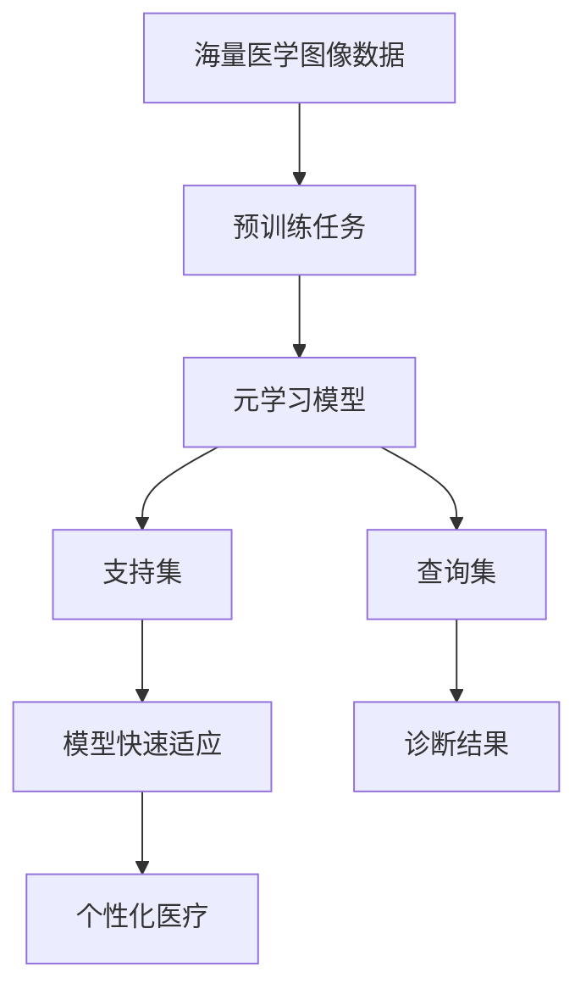

# 一切皆是映射：元学习在医疗图像分析中的突破

## 1. 背景介绍
### 1.1 医疗图像分析的重要性
医疗图像分析在现代医疗诊断和治疗中扮演着至关重要的角色。随着医学成像技术的不断发展,如X射线、CT、MRI和超声等,医疗图像数据呈现出爆炸式增长的趋势。这些图像数据蕴含着丰富的解剖结构、病理特征等关键医疗信息,如何有效地分析和利用这些图像数据,已成为医学界和人工智能领域的重要课题。

### 1.2 传统医疗图像分析方法的局限性
传统的医疗图像分析主要依赖于手工设计的图像特征和机器学习分类器。这类方法存在以下几个局限:

1. 特征工程困难:手工设计图像特征需要大量的领域知识和经验,对于不同的医学图像问题,需要设计不同的特征。

2. 泛化能力差:基于手工特征的方法泛化能力较差,难以适应不同的成像设备、成像协议等引起的图像变化。

3. 数据利用率低:传统方法难以充分利用海量医疗图像数据中蕴含的信息。

4. 可解释性不足:机器学习分类器一般是"黑盒"模型,诊断结果缺乏可解释性,难以被医生所接受。

### 1.3 深度学习的兴起
近年来,深度学习技术的兴起为医疗图像分析带来了新的突破。卷积神经网络(CNN)能够自动学习图像的层次化特征表示,在图像分类、分割、检测等任务上取得了远超传统方法的性能,受到了学术界和产业界的广泛关注。然而,深度学习在医疗图像分析中仍面临着标注数据稀缺、模型泛化能力不足等挑战。

### 1.4 元学习的引入
元学习(Meta-Learning),又称"学会学习"(Learning to Learn),是一种通过学习大量不同但相关任务的经验,来提高学习算法快速适应新任务的能力的机器学习范式。它在少样本学习、迁移学习、持续学习等场景中表现出优异的性能。将元学习思想引入医疗图像分析领域,有望突破现有深度学习方法的局限,实现医学图像分析模型的快速泛化和个性化。本文将重点探讨元学习在医疗图像分析中的应用和最新进展。

## 2. 核心概念与联系
### 2.1 元学习的定义与分类
元学习的目标是学习如何学习,即通过学习大量不同但相关的任务,总结出一种通用的学习策略或优化算法,从而能够在新任务上快速达到良好的性能。根据学习策略的不同,元学习可分为以下三类:

1. 基于度量的元学习(Metric-based Meta-Learning):通过学习任务间的相似性度量,实现对新样本的快速分类。代表方法有Siamese Networks, Matching Networks, Prototypical Networks等。

2. 基于模型的元学习(Model-based Meta-Learning):学习一个可快速适应新任务的模型参数初始化方法或优化算法。代表方法有MAML, Reptile, LEO等。

3. 基于优化的元学习(Optimization-based Meta-Learning):学习一个通用的优化算法,如元梯度下降(Meta-SGD),用于新任务的快速训练。

### 2.2 医学图像分析的特点与挑战
医学图像分析具有以下特点和挑战:

1. 数据稀缺:医学图像的标注需要专业医生的参与,获取大规模标注数据的成本很高。

2. 数据分布不平衡:不同疾病的发病率差异很大,罕见病的样本数量很少。

3. 图像变化大:不同医院、不同设备采集的图像在分辨率、对比度、噪声等方面存在较大差异。

4. 个体差异大:不同患者的解剖结构、病理特征有较大差异,需要模型具备个性化分析的能力。

### 2.3 元学习与医学图像分析的契合点
元学习通过学习任务间的共性,可以显著提高模型在新任务上的学习效率和泛化性能,非常适合医学图像分析领域。主要体现在:

1. 缓解标注数据稀缺:通过在大量相关任务上的学习,元学习模型能够在很少样本的情况下快速适应新的疾病诊断任务。

2. 提高模型泛化能力:元学习通过学习任务间的共性,可以提高模型对不同医院、不同设备的图像的泛化能力。

3. 实现个性化分析:元学习可以快速适应新患者的个性化特征,实现精准诊断和治疗。

下图展示了元学习在医学图像分析中的应用流程:



## 3. 核心算法原理具体操作步骤
本节以基于度量的元学习方法Prototypical Networks为例,详细介绍其核心算法原理和操作步骤。

### 3.1 Prototypical Networks原理
Prototypical Networks的核心思想是学习一个度量空间,使得同类样本聚集,异类样本分离。具体而言,它通过最小化支持集中每个类别样本到类别原型(prototype)的距离,来学习样本的嵌入表示。类别原型是支持集中同类样本嵌入的均值向量。对于一个查询样本,模型通过计算其嵌入与每个类别原型的距离,并将其分类为距离最近的类别。

### 3.2 算法步骤
1. 任务采样:从训练集中采样一个N-way K-shot任务,即随机选取N个类别,每个类别选取K个样本作为支持集,其余样本作为查询集。

2. 特征嵌入:将支持集和查询集中的样本通过卷积神经网络提取特征,得到嵌入向量。

3. 原型计算:对于支持集中的每个类别,计算其样本嵌入向量的均值,作为该类别的原型向量。

4. 距离计算:对于查询集中的每个样本,计算其嵌入向量与每个类别原型向量的欧氏距离。

5. 分类决策:将查询样本分类为距离其最近的类别。

6. 损失函数:采用交叉熵损失函数,最小化查询样本的预测概率与真实标签之间的差异。

7. 优化算法:采用Adam优化算法,通过反向传播更新模型参数。

### 3.3 算法伪代码
```python
# 输入:训练集D, 类别数N, 支持样本数K, 查询样本数Q
# 输出:训练后的模型参数θ

随机初始化模型参数θ
for each iteration do:
    从D中采样一个N-way K-shot任务T
    for each class n in T do:
        从T中采样K个支持样本和Q个查询样本
        计算支持样本的嵌入向量Sn
        计算类别原型cn=mean(Sn)
    end for
    for each query sample x in T do:
        计算x的嵌入向量zx
        计算zx与每个类别原型cn的欧氏距离dn
        计算x的预测概率px=softmax(-dn)
    end for
    计算查询样本的交叉熵损失L
    通过反向传播更新模型参数θ
end for
```

## 4. 数学模型和公式详细讲解举例说明
本节对Prototypical Networks中涉及的数学模型和公式进行详细讲解,并给出具体的例子说明。

### 4.1 特征嵌入
给定一个样本$x$,通过卷积神经网络$f_θ$提取其特征嵌入$z$:

$$z=f_θ(x)$$

其中$θ$为卷积神经网络的参数。

### 4.2 类别原型计算
对于支持集$S=\{(x_i,y_i)\}_{i=1}^{N×K}$,其中$y_i∈\{1,2,...,N\}$为样本的类别标签,类别原型$c_n$的计算公式为:

$$c_n=\frac{1}{K}\sum_{i=1}^{N×K}z_i⋅𝟙[y_i=n]$$

其中$z_i=f_θ(x_i)$为支持样本$x_i$的嵌入向量,$𝟙[⋅]$为指示函数。

例如,假设一个3-way 2-shot任务的支持集为:

$S=\{(x_1,1),(x_2,1),(x_3,2),(x_4,2),(x_5,3),(x_6,3)\}$

则类别原型为:

$c_1=\frac{1}{2}(z_1+z_2)$

$c_2=\frac{1}{2}(z_3+z_4)$

$c_3=\frac{1}{2}(z_5+z_6)$

### 4.3 距离计算与分类决策
对于一个查询样本$x$,模型首先计算其嵌入$z=f_θ(x)$,然后计算$z$与每个类别原型$c_n$的欧氏距离:

$$d_n=||z-c_n||^2$$

根据距离得到样本属于每个类别的概率:

$$p(y=n|x)=\frac{exp(-d_n)}{\sum_{i=1}^Nexp(-d_i)}$$

最终将样本分类为概率最大的类别:

$$\hat{y}=argmax_n p(y=n|x)$$

例如,对于一个查询样本$x$,假设其与3个类别原型的距离为:

$d_1=2.5, d_2=1.8, d_3=3.2$

则其属于每个类别的概率为:

$p(y=1|x)=0.21, p(y=2|x)=0.71, p(y=3|x)=0.08$

最终样本被分类为类别2。

### 4.4 损失函数
模型采用交叉熵损失函数,对于一个查询样本$x$及其真实标签$y$,损失函数定义为:

$$L=-log p(y|x)=-log\frac{exp(-d_y)}{\sum_{i=1}^Nexp(-d_i)}$$

其中$d_y$为查询样本嵌入与真实类别原型的距离。

在一个N-way K-shot任务中,查询集$Q=\{(x_j,y_j)\}_{j=1}^{N×Q}$,任务的总损失为:

$$L=\frac{1}{NQ}\sum_{j=1}^{N×Q}-log p(y_j|x_j)$$

模型通过最小化查询集的总损失来学习样本的特征嵌入。

## 5. 项目实践：代码实例和详细解释说明
本节给出了使用PyTorch实现Prototypical Networks的代码示例,并对关键部分进行了详细解释说明。

```python
import torch
import torch.nn as nn
import torch.nn.functional as F

# 卷积神经网络
class ConvNet(nn.Module):
    def __init__(self):
        super(ConvNet, self).__init__()
        self.conv1 = nn.Conv2d(1, 64, 3)
        self.conv2 = nn.Conv2d(64, 64, 3)
        self.conv3 = nn.Conv2d(64, 64, 3)
        self.conv4 = nn.Conv2d(64, 64, 3)
        self.fc = nn.Linear(64, 64)
        
    def forward(self, x):
        x = F.relu(self.conv1(x))
        x = F.max_pool2d(F.relu(self.conv2(x)), 2)
        x = F.relu(self.conv3(x))
        x = F.max_pool2d(F.relu(self.conv4(x)), 2)
        x = x.view(x.size(0), -1)
        x = self.fc(x)
        return x

# 原型网络    
class PrototypicalNet(nn.Module):
    def __init__(self):
        super(PrototypicalNet, self).__init__()
        self.encoder = ConvNet()
        
    def forward(self, support, query):
        # 提取支持集和查询集的特征
        support_features = self.encoder(support)
        query_features = self.encoder(query)
        
        # 计算类别原型
        prototypes = torch.mean(support_features.reshape(N, K, -1), dim=1)
        
        # 计算查询样本与原型的距离
        distances = torch.cdist(query_features, prototypes)