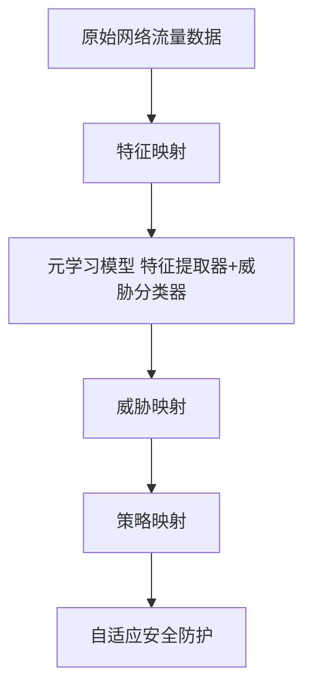

# 一切皆是映射：基于元学习的网络安全威胁检测

## 1.背景介绍
### 1.1 网络安全威胁检测的重要性
在当今高度互联的数字世界中,网络安全已成为一个至关重要的话题。随着网络攻击变得越来越复杂和频繁,传统的基于特征工程和规则的威胁检测方法已经难以应对新出现的威胁。因此,开发更加智能和自适应的网络安全威胁检测技术迫在眉睫。

### 1.2 元学习在网络安全中的应用前景
元学习(Meta-Learning)作为一种新兴的机器学习范式,通过学习如何学习(Learning to Learn)的方式,使模型能够快速适应新的任务和环境。将元学习引入网络安全领域,有望实现更加灵活、高效、鲁棒的威胁检测能力。本文将探讨如何利用元学习技术,构建一个基于映射(Mapping)思想的网络安全威胁检测框架。

## 2.核心概念与联系
### 2.1 元学习的定义与分类
元学习的核心思想是学习如何学习,即通过训练一个元模型(Meta-Model),使其能够快速适应新的任务或环境。根据学习方式的不同,元学习可以分为以下三类:

1. 基于度量的元学习(Metric-based Meta-Learning):通过学习一个度量函数,度量新样本与已知样本之间的相似性,从而实现快速分类。
2. 基于模型的元学习(Model-based Meta-Learning):通过学习一个可以快速适应新任务的模型初始化方法,实现快速fine-tuning。
3. 基于优化的元学习(Optimization-based Meta-Learning):通过学习一个优化算法,使模型能够在新任务上快速收敛。

### 2.2 映射的概念与网络安全威胁检测的关联
映射(Mapping)是指将一个集合中的元素与另一个集合中的元素建立对应关系的过程。在网络安全威胁检测中,我们可以将映射的概念应用于以下几个方面:

1. 特征映射:将原始网络流量数据映射到一个高维特征空间,提取更加抽象和鲁棒的特征表示。
2. 威胁映射:将未知威胁映射到已知威胁类别,实现威胁分类和检测。
3. 策略映射:将检测到的威胁映射到相应的防御策略,实现自适应的安全防护。

通过引入映射的概念,我们可以构建一个基于元学习的网络安全威胁检测框架,实现更加智能和自适应的威胁检测能力。

### 2.3 元学习与映射在网络安全威胁检测中的结合
将元学习与映射的概念结合起来,我们可以设计一个两阶段的网络安全威胁检测框架:

1. 元学习阶段:通过元学习算法,学习一个通用的特征提取器和威胁分类器,使其能够快速适应不同的网络环境和威胁类型。
2. 映射阶段:将元学习阶段学习到的模型应用于实际的网络安全威胁检测任务,通过特征映射、威胁映射和策略映射,实现智能化的威胁检测和防御。

下图展示了基于元学习和映射的网络安全威胁检测框架的整体架构:



## 3.核心算法原理具体操作步骤
### 3.1 基于度量的元学习算法
基于度量的元学习算法的核心是学习一个度量函数,用于度量新样本与已知样本之间的相似性。以下是基于度量的元学习算法的具体操作步骤:

1. 构建元训练集:从原始数据集中采样多个小规模的任务(Task),每个任务包含一个支持集(Support Set)和一个查询集(Query Set)。
2. 初始化度量函数:使用神经网络初始化度量函数,输入为两个样本,输出为它们之间的相似度得分。
3. 元训练过程:对于每个任务,使用支持集中的样本更新度量函数的参数,使其能够在查询集上达到较高的分类精度。
4. 元测试过程:在新的任务上,使用更新后的度量函数对查询集中的样本进行分类,评估模型的泛化能力。

### 3.2 基于模型的元学习算法
基于模型的元学习算法的核心是学习一个可以快速适应新任务的模型初始化方法。以下是基于模型的元学习算法的具体操作步骤:

1. 构建元训练集:从原始数据集中采样多个小规模的任务,每个任务包含一个支持集和一个查询集。
2. 初始化基础模型:使用神经网络初始化一个基础模型,用于特征提取和分类。
3. 元训练过程:对于每个任务,使用支持集中的样本对基础模型进行几步梯度下降,得到一个适应后的模型。
4. 元更新过程:使用查询集评估适应后的模型,计算损失函数,并通过元梯度下降更新基础模型的初始化参数。
5. 元测试过程:在新的任务上,使用更新后的基础模型进行few-shot学习,评估模型的泛化能力。

### 3.3 基于优化的元学习算法
基于优化的元学习算法的核心是学习一个优化算法,使模型能够在新任务上快速收敛。以下是基于优化的元学习算法的具体操作步骤:

1. 构建元训练集:从原始数据集中采样多个小规模的任务,每个任务包含一个训练集和一个验证集。
2. 初始化优化器:使用可学习的参数初始化一个优化器,如LSTM优化器。
3. 元训练过程:对于每个任务,使用优化器更新模型参数,并在验证集上评估模型性能。
4. 元更新过程:使用所有任务的验证损失,通过元梯度下降更新优化器的参数。
5. 元测试过程:在新的任务上,使用学习到的优化器对模型进行训练,评估模型的泛化能力。

## 4.数学模型和公式详细讲解举例说明
### 4.1 基于度量的元学习数学模型
在基于度量的元学习中,我们需要学习一个度量函数 $f_{\phi}(x_i, x_j)$,用于度量样本 $x_i$ 和 $x_j$ 之间的相似性。度量函数可以使用孪生网络(Siamese Network)来实现,其数学表达式为:

$$
f_{\phi}(x_i, x_j) = \sigma(g_{\phi}(x_i)^T g_{\phi}(x_j))
$$

其中,$g_{\phi}(\cdot)$ 表示特征提取器,$\sigma(\cdot)$ 表示 sigmoid 函数。

在元训练阶段,我们使用支持集 $S = \{(x_i, y_i)\}_{i=1}^{N}$ 来更新度量函数的参数 $\phi$,优化目标为:

$$
\min_{\phi} \sum_{i=1}^{N} \sum_{j=1}^{N} y_{ij} \log f_{\phi}(x_i, x_j) + (1 - y_{ij}) \log (1 - f_{\phi}(x_i, x_j))
$$

其中,$y_{ij} = 1$ 表示 $x_i$ 和 $x_j$ 属于同一类,$y_{ij} = 0$ 表示 $x_i$ 和 $x_j$ 属于不同类。

在元测试阶段,对于查询样本 $x_q$,我们使用更新后的度量函数对其进行分类:

$$
y_q = \arg\max_{k} \sum_{i=1}^{N} f_{\phi}(x_q, x_i) \mathbb{I}(y_i = k)
$$

其中,$\mathbb{I}(\cdot)$ 为指示函数。

### 4.2 基于模型的元学习数学模型
在基于模型的元学习中,我们需要学习一个基础模型 $f_{\theta}(\cdot)$,使其能够通过少量梯度下降步骤快速适应新任务。假设基础模型为一个神经网络,其参数为 $\theta$。

在元训练阶段,对于每个任务 $\mathcal{T}_i$,我们首先在支持集 $S_i$ 上对基础模型进行 $K$ 步梯度下降:

$$
\theta_i' = \theta - \alpha \nabla_{\theta} \mathcal{L}_{S_i}(f_{\theta})
$$

其中,$\alpha$ 为学习率,$\mathcal{L}_{S_i}(\cdot)$ 为在支持集 $S_i$ 上的损失函数。

然后,我们在查询集 $Q_i$ 上评估适应后的模型 $f_{\theta_i'}(\cdot)$,计算损失函数:

$$
\mathcal{L}_{Q_i}(f_{\theta_i'}) = \sum_{(x, y) \in Q_i} \ell(f_{\theta_i'}(x), y)
$$

最后,我们使用所有任务的查询集损失,通过元梯度下降更新基础模型的初始参数 $\theta$:

$$
\theta \leftarrow \theta - \beta \nabla_{\theta} \sum_i \mathcal{L}_{Q_i}(f_{\theta_i'})
$$

其中,$\beta$ 为元学习率。

在元测试阶段,对于新任务 $\mathcal{T}_j$,我们使用更新后的基础模型 $f_{\theta}(\cdot)$ 在支持集 $S_j$ 上进行few-shot学习,然后在查询集 $Q_j$ 上评估模型性能。

### 4.3 基于优化的元学习数学模型
在基于优化的元学习中,我们需要学习一个优化器 $g_{\phi}(\cdot)$,使其能够快速优化模型在新任务上的性能。假设优化器为一个LSTM网络,其参数为 $\phi$。

在元训练阶段,对于每个任务 $\mathcal{T}_i$,我们使用优化器 $g_{\phi}(\cdot)$ 更新模型参数 $\theta$:

$$
\theta_t = \theta_{t-1} - g_{\phi}(\nabla_{\theta} \mathcal{L}_{D_i^{tr}}(f_{\theta_{t-1}}), \phi_t)
$$

其中,$D_i^{tr}$ 为任务 $\mathcal{T}_i$ 的训练集,$\phi_t$ 为优化器的状态。

然后,我们在任务 $\mathcal{T}_i$ 的验证集 $D_i^{val}$ 上评估模型性能,计算损失函数:

$$
\mathcal{L}_{D_i^{val}}(f_{\theta_T}) = \sum_{(x, y) \in D_i^{val}} \ell(f_{\theta_T}(x), y)
$$

最后,我们使用所有任务的验证损失,通过元梯度下降更新优化器的参数 $\phi$:

$$
\phi \leftarrow \phi - \gamma \nabla_{\phi} \sum_i \mathcal{L}_{D_i^{val}}(f_{\theta_T})
$$

其中,$\gamma$ 为元学习率。

在元测试阶段,对于新任务 $\mathcal{T}_j$,我们使用学习到的优化器 $g_{\phi}(\cdot)$ 对模型进行训练,然后在测试集上评估模型性能。

## 5.项目实践：代码实例和详细解释说明
下面我们以基于模型的元学习算法MAML(Model-Agnostic Meta-Learning)为例,给出一个PyTorch代码实例,并对其进行详细解释说明。

```python
import torch
import torch.nn as nn
import torch.optim as optim
from torch.utils.data import DataLoader

class BaseModel(nn.Module):
    def __init__(self):
        super(BaseModel, self).__init__()
        self.encoder = nn.Sequential(
            nn.Conv2d(1, 64, 3, padding=1),
            nn.BatchNorm2d(64),
            nn.ReLU(inplace=True),
            nn.MaxPool2d(2, 2),
            nn.Conv2d(64, 64, 3, padding=1),
            nn.BatchNorm2d(64),
            nn.ReLU(inplace=True),
            nn.MaxPool2d(2, 2)
        )
        self.classifier = nn.Linear(64 * 7 * 7, 5)

    def forward(self, x):
        x = self.encoder(x)
        x = x.view