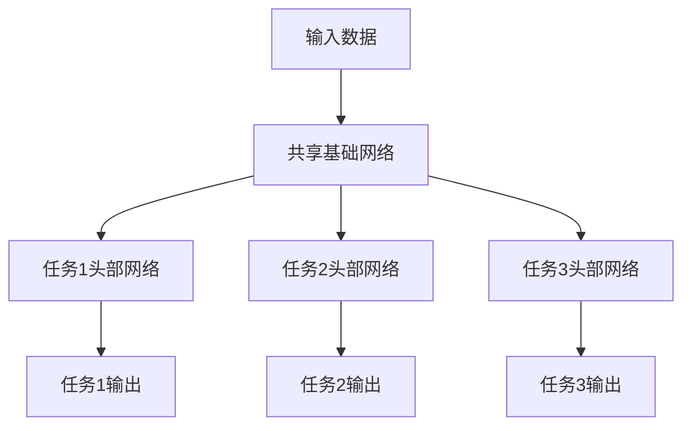

# 一切皆是映射：多任务学习与神经网络的协同训练

## 1.背景介绍

在过去的几年里，深度学习在各个领域取得了令人瞩目的成就,尤其是在计算机视觉、自然语言处理等领域。然而,传统的深度学习模型通常是为解决单一任务而设计的,这种方法虽然简单直接,但也存在一些明显的缺陷。例如,为不同的任务训练独立的模型会导致计算资源的浪费,同时也难以捕捉不同任务之间的相关性和共享知识。

为了解决这些问题,多任务学习(Multi-Task Learning, MTL)应运而生。多任务学习旨在同时学习多个相关任务,通过在不同任务之间共享表示和知识,提高模型的泛化能力和数据利用率。与传统的单任务学习相比,多任务学习具有以下优势:

1. **数据利用率提高**:通过在相关任务之间共享数据和特征表示,多任务学习可以更有效地利用有限的训练数据。
2. **泛化能力增强**:由于不同任务之间存在一定的相关性,多任务学习可以捕捉这些相关性,从而提高模型在每个单一任务上的泛化能力。
3. **知识迁移**:多任务学习可以实现知识在相关任务之间的迁移,从而提高模型在新任务上的适应能力。
4. **计算资源节省**:与训练多个独立模型相比,多任务学习只需训练一个共享模型,从而节省了计算资源。

### 1.1 多任务学习的发展历程

多任务学习的概念最早可以追溯到20世纪90年代,当时研究人员尝试在神经网络中引入多任务学习,以提高模型的性能和泛化能力。随着深度学习的兴起,多任务学习也获得了新的发展契机。近年来,多任务学习在计算机视觉、自然语言处理等领域取得了广泛的应用,展现出巨大的潜力。

### 1.2 多任务学习的挑战

尽管多任务学习具有诸多优势,但在实际应用中也面临一些挑战:

1. **任务相关性**:不同任务之间的相关性是多任务学习成功的关键,但如何量化和利用任务相关性仍然是一个挑战。
2. **任务权重平衡**:在多任务学习中,不同任务的重要性可能不同,如何合理分配任务权重以达到最佳性能是一个需要解决的问题。
3. **负迁移风险**:在某些情况下,不同任务之间的相关性可能会导致负面影响,即一个任务的学习会干扰另一个任务的性能,这被称为负迁移。
4. **计算复杂度**:随着任务数量的增加,多任务学习模型的计算复杂度也会显著增加,这对硬件资源的要求更高。

## 2.核心概念与联系

### 2.1 多任务学习的基本概念

多任务学习旨在同时学习多个相关任务,通过在不同任务之间共享表示和知识,提高模型的泛化能力和数据利用率。在多任务学习中,我们通常将多个相关任务合并为一个统一的模型,这个模型包含一个共享的基础网络和多个任务特定的头部网络。

在上图中,共享基础网络用于从输入数据中提取通用特征表示,而任务特定的头部网络则利用这些特征表示进行各自任务的预测。通过这种方式,不同任务之间可以共享知识和表示,从而提高模型的性能和泛化能力。

### 2.2 多任务学习的主要类型

根据任务之间的关系,多任务学习可以分为以下几种主要类型:

1. **硬参数共享(Hard Parameter Sharing)**:在这种方式下,不同任务共享整个网络的所有参数,包括共享基础网络和任务特定头部网络。这种方法简单直接,但也存在一些局限性,因为不同任务可能需要不同的特征表示。

2. **软参数共享(Soft Parameter Sharing)**:与硬参数共享不同,软参数共享允许不同任务拥有自己的参数,但这些参数受到一定约束,例如通过正则化项或者辅助损失函数来鼓励参数之间的相似性。这种方式更加灵活,但也增加了模型的复杂性。

3. **层级共享(Layer-wise Sharing)**:在这种方式下,不同任务共享网络的部分层,而不是整个网络。通常情况下,较低层次的网络层被共享,而较高层次的网络层则是任务特定的。这种方式兼顾了通用性和特定性,是一种常见的多任务学习架构。

4. **跨模态共享(Cross-modal Sharing)**:在某些情况下,不同任务可能涉及不同的输入模态(如图像、文本等),这时可以采用跨模态共享的方式,即不同模态之间共享部分网络层或特征表示。

5. **任务关系建模(Task Relation Modeling)**:除了共享参数和网络层之外,一些方法还尝试显式地建模任务之间的关系,例如通过注意力机制或门控机制来动态调节不同任务之间的知识流动。

### 2.3 多任务学习与迁移学习的关系

多任务学习与迁移学习(Transfer Learning)有一定的联系,但也存在明显的区别。

迁移学习旨在利用在源域(source domain)学习到的知识,来帮助目标域(target domain)的学习。这种方式通常是先在源域预训练一个模型,然后将这个模型的参数或特征表示迁移到目标域,用于初始化或fine-tuning。

而多任务学习则是同时学习多个相关任务,不存在明确的源域和目标域之分。多任务学习通过在不同任务之间共享表示和知识,提高模型的泛化能力和数据利用率。

虽然多任务学习和迁移学习有所不同,但它们也存在一些联系:

1. 在某些情况下,多任务学习可以被视为一种特殊的迁移学习,即将在一些辅助任务上学习到的知识迁移到主要任务上。
2. 一些多任务学习模型采用了类似于迁移学习的思路,即先在一些任务上预训练模型,然后将预训练的模型迁移到其他任务上进行fine-tuning。
3. 多任务学习和迁移学习都旨在提高模型的泛化能力和适应性,只是采用了不同的方式。

总的来说,多任务学习和迁移学习都是机器学习中的重要范式,它们在不同场景下发挥着重要作用,并且也存在一定的交叉和互补关系。

## 3.核心算法原理具体操作步骤

### 3.1 多任务学习的基本框架

多任务学习的基本框架可以概括为以下几个步骤:

1. **确定任务集合**:首先需要确定要同时学习的任务集合,这些任务应该具有一定的相关性,以便共享知识和表示。

2. **构建共享网络**:设计一个共享的基础网络,用于从输入数据中提取通用特征表示。这个网络可以是预训练模型,也可以是从头开始训练的网络。

3. **构建任务特定网络**:为每个任务设计一个任务特定的头部网络,用于利用共享基础网络提取的特征表示进行预测。这些头部网络可以共享部分参数,也可以完全独立。

4. **定义损失函数**:为每个任务定义一个损失函数,用于衡量预测结果与真实标签之间的差异。多任务学习的总损失函数通常是所有任务损失函数的加权和。

5. **训练模型**:使用反向传播算法同时优化共享基础网络和所有任务特定网络的参数,最小化总损失函数。在训练过程中,可以动态调整任务权重,以平衡不同任务的重要性。

6. **模型评估**:在测试集上评估模型在每个任务上的性能,并与单任务学习模型进行比较,验证多任务学习的有效性。

### 3.2 多任务学习的优化策略

为了提高多任务学习的性能,研究人员提出了一些优化策略,主要包括以下几种:

1. **任务权重调整**:由于不同任务的重要性可能不同,因此需要合理分配任务权重。一种常见的方法是根据每个任务的损失值动态调整权重,使得不同任务的损失值保持平衡。另一种方法是通过元学习或者反向传播来自动学习任务权重。

2. **辅助损失函数**:除了主要任务的损失函数之外,还可以引入一些辅助损失函数,用于鼓励不同任务之间的参数或表示相似性。常见的辅助损失函数包括正则化项、互信息损失等。

3. **注意力机制**:通过引入注意力机制,可以动态调节不同任务之间的知识流动,使得每个任务只关注与自己相关的知识。这种方式可以有效缓解负迁移的风险。

4. **层级共享策略**:除了共享整个基础网络之外,还可以采用更加灵活的层级共享策略,即不同任务共享网络的部分层,而不是整个网络。这种方式可以兼顾通用性和特定性。

5. **知识蒸馏**:知识蒸馏是一种常见的模型压缩和知识迁移技术,它可以应用于多任务学习中,将一个大型教师模型的知识迁移到一个小型的多任务学习模型中,从而提高模型的性能和效率。

6. **元学习**:元学习旨在学习一种通用的学习策略,可以应用于多任务学习中,自动学习任务之间的相关性和共享策略,从而提高模型的适应性和泛化能力。

### 3.3 多任务学习的评估指标

评估多任务学习模型的性能是一个重要的环节,常见的评估指标包括:

1. **单任务指标**:对于每个单一任务,可以使用该任务的标准评估指标,如分类任务的准确率、回归任务的均方根误差等。

2. **多任务综合指标**:由于多任务学习同时关注多个任务的性能,因此需要一些综合指标来衡量模型在所有任务上的整体表现。常见的综合指标包括:
   - 平均指标:计算所有任务指标的算术平均值或加权平均值。
   - 几何平均指标:计算所有任务指标的几何平均值,可以更好地平衡不同任务的重要性。
   - 排名指标:根据每个任务的指标对模型进行排名,然后计算所有任务排名的平均值或中位数。

3. **泛化能力指标**:多任务学习的一个重要目标是提高模型的泛化能力,因此可以在一些新的任务或数据集上评估模型的性能,以衡量其泛化能力。

4. **负迁移指标**:由于负迁移是多任务学习中需要关注的问题,因此可以设计一些指标来量化负迁移的程度,例如与单任务学习模型相比,多任务学习模型在某些任务上的性能下降程度。

5. **计算效率指标**:多任务学习模型通常比单任务学习模型更加复杂,因此需要关注模型的计算效率,包括训练时间、推理时间和内存占用等。

在实际应用中,需要根据具体场景和需求选择合适的评估指标,并综合考虑模型在不同指标上的表现,以全面评估多任务学习模型的优劣。

## 4.数学模型和公式详细讲解举例说明

### 4.1 多任务学习的数学形式化表示

为了更好地理解多任务学习的原理,我们可以将其形式化为一个数学模型。假设我们有 $K$ 个相关任务,每个任务都有自己的训练数据集 $\mathcal{D}_k = \