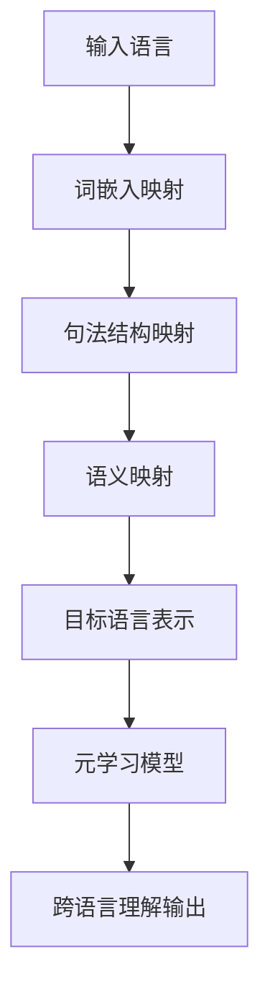

# 一切皆是映射：如何通过元学习实现AI的跨语言理解

## 1. 背景介绍
### 1.1 语言理解的挑战
#### 1.1.1 语言的多样性和复杂性
#### 1.1.2 跨语言理解的困难
#### 1.1.3 现有方法的局限性
### 1.2 元学习的兴起
#### 1.2.1 元学习的定义和特点  
#### 1.2.2 元学习在自然语言处理中的应用
#### 1.2.3 元学习在跨语言理解中的潜力

## 2. 核心概念与联系
### 2.1 映射的概念
#### 2.1.1 映射的数学定义
#### 2.1.2 映射在自然语言处理中的应用
#### 2.1.3 映射与跨语言理解的关系
### 2.2 元学习的核心思想
#### 2.2.1 学会学习的能力
#### 2.2.2 快速适应新任务的能力
#### 2.2.3 利用先验知识的能力
### 2.3 映射与元学习的结合
#### 2.3.1 利用映射实现语言间的转换
#### 2.3.2 利用元学习实现快速适应新语言
#### 2.3.3 映射与元学习的协同效应

## 3. 核心算法原理与具体操作步骤
### 3.1 基于映射的跨语言理解算法
#### 3.1.1 词嵌入映射
#### 3.1.2 句法结构映射
#### 3.1.3 语义映射
### 3.2 基于元学习的跨语言理解算法 
#### 3.2.1 模型无关的元学习算法
#### 3.2.2 基于度量的元学习算法
#### 3.2.3 基于优化的元学习算法
### 3.3 映射与元学习的融合算法
#### 3.3.1 元学习指导下的映射学习
#### 3.3.2 映射增强的元学习模型
#### 3.3.3 端到端的映射-元学习框架

## 4. 数学模型和公式详细讲解举例说明
### 4.1 词嵌入映射模型
#### 4.1.1 线性映射模型
#### 4.1.2 非线性映射模型 
#### 4.1.3 词嵌入映射模型的训练与优化
### 4.2 句法结构映射模型
#### 4.2.1 基于转移的句法映射模型
#### 4.2.2 基于树的句法映射模型
#### 4.2.3 句法结构映射模型的训练与优化
### 4.3 语义映射模型 
#### 4.3.1 基于注意力机制的语义映射模型
#### 4.3.2 基于图神经网络的语义映射模型
#### 4.3.3 语义映射模型的训练与优化
### 4.4 元学习模型
#### 4.4.1 MAML元学习模型
#### 4.4.2 Prototypical Networks元学习模型
#### 4.4.3 LSTM元学习模型

## 5. 项目实践：代码实例和详细解释说明
### 5.1 数据准备
#### 5.1.1 平行语料库的收集与处理
#### 5.1.2 词嵌入的预训练
#### 5.1.3 元学习数据集的构建
### 5.2 模型实现
#### 5.2.1 词嵌入映射模型的实现
#### 5.2.2 句法结构映射模型的实现
#### 5.2.3 语义映射模型的实现
#### 5.2.4 元学习模型的实现
### 5.3 模型训练与评估
#### 5.3.1 模型训练流程
#### 5.3.2 评估指标与方法
#### 5.3.3 实验结果分析与讨论

## 6. 实际应用场景
### 6.1 机器翻译
#### 6.1.1 低资源语言的机器翻译
#### 6.1.2 零样本机器翻译
#### 6.1.3 多语言机器翻译
### 6.2 跨语言信息检索
#### 6.2.1 跨语言文档检索
#### 6.2.2 跨语言问答系统
#### 6.2.3 跨语言命名实体识别
### 6.3 跨语言情感分析
#### 6.3.1 跨语言情感分类
#### 6.3.2 跨语言情感迁移
#### 6.3.3 跨语言情感推理

## 7. 工具和资源推荐
### 7.1 开源工具包
#### 7.1.1 Hugging Face Transformers
#### 7.1.2 Flair
#### 7.1.3 OpenNMT
### 7.2 预训练模型
#### 7.2.1 多语言BERT
#### 7.2.2 XLM
#### 7.2.3 LASER
### 7.3 数据资源
#### 7.3.1 OPUS平行语料库
#### 7.3.2 Tatoeba数据集
#### 7.3.3 WikiANN命名实体识别数据集

## 8. 总结：未来发展趋势与挑战
### 8.1 未来发展趋势
#### 8.1.1 大规模预训练模型的应用
#### 8.1.2 无监督跨语言表示学习
#### 8.1.3 跨模态跨语言理解
### 8.2 面临的挑战
#### 8.2.1 低资源语言的数据稀疏问题
#### 8.2.2 语言间差异带来的迁移困难
#### 8.2.3 模型的可解释性和可控性
### 8.3 展望
#### 8.3.1 探索更通用的语言理解模型
#### 8.3.2 融合知识图谱等结构化知识
#### 8.3.3 发展面向特定任务的跨语言理解技术

## 9. 附录：常见问题与解答
### 9.1 跨语言理解与多语言理解的区别
### 9.2 零样本学习与少样本学习在跨语言理解中的应用
### 9.3 跨语言理解中的负迁移问题如何解决
### 9.4 如何评估跨语言理解模型的泛化能力
### 9.5 跨语言理解技术在实际应用中的局限性

以上是利用映射和元学习实现跨语言理解的核心流程图。首先将输入语言通过词嵌入映射、句法结构映射和语义映射逐步转化为目标语言的表示，然后利用元学习模型快速适应新的语言理解任务，最终输出跨语言理解的结果。

映射和元学习的结合为跨语言理解提供了一种新的思路。传统的跨语言理解方法通常需要大量的平行语料进行训练，且难以适应低资源语言和零样本场景。而映射可以利用有限的监督数据学习语言间的转换关系，元学习则可以利用先验知识快速适应新的语言和任务。两者的结合可以大大提高跨语言理解的效率和泛化能力。

在实践中，我们可以先利用大规模多语言语料训练通用的语言理解模型，然后利用元学习在特定语言和任务上进行微调。同时，我们还可以利用映射学习语言间的词嵌入、句法结构和语义对齐关系，进一步提升跨语言迁移的效果。此外，还可以将知识图谱等结构化知识融入到跨语言理解中，增强模型的语义理解能力。

未来，跨语言理解技术将向着更加通用、高效、可解释的方向发展。我们需要探索更加先进的语言表示学习和迁移学习方法，同时也要关注低资源语言、负迁移等实际挑战。只有不断探索和创新，才能真正实现AI的跨语言理解，让机器真正理解不同语言背后的共同语义，推动自然语言处理技术的发展。

作者：禅与计算机程序设计艺术 / Zen and the Art of Computer Programming