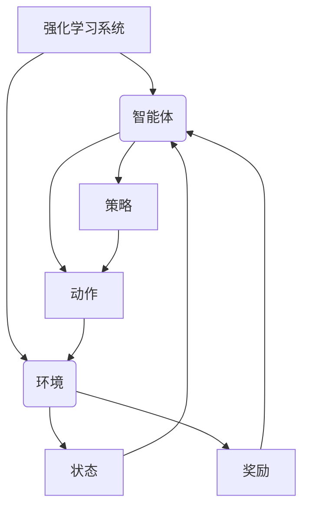
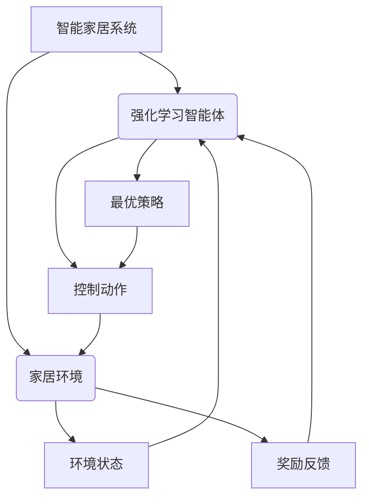

# 一切皆是映射：强化学习在智能家居系统中的应用：挑战与机遇

## 1. 背景介绍

### 1.1 智能家居系统的兴起

随着物联网、人工智能和大数据技术的快速发展,智能家居系统正在悄然改变我们的生活方式。智能家居系统旨在通过互联网将家中的各种智能设备连接起来,实现对家居环境的自动化控制和智能管理。用户可以通过智能手机应用程序、语音助手或其他控制终端,远程控制家中的照明、空调、安防、娱乐等设备,提高生活质量和能源利用效率。

### 1.2 智能家居系统面临的挑战

然而,智能家居系统在实现过程中面临着诸多挑战:

- **复杂的用户偏好**:不同用户对舒适度、能耗、隐私等方面有不同的偏好和需求,系统需要个性化地满足用户需求。
- **动态的环境变化**:家庭环境是一个动态变化的系统,用户活动、天气、能源价格等因素都会影响系统的最优控制策略。
- **设备异构性**:智能家居系统通常包含来自不同厂商的异构设备,这给设备之间的通信和协作带来了挑战。
- **隐私和安全风险**:智能家居系统涉及大量个人隐私数据,如何保护用户隐私和系统安全是一个重要问题。

### 1.3 强化学习在智能家居系统中的应用前景

为了应对上述挑战,强化学习(Reinforcement Learning)作为一种有前景的人工智能技术,在智能家居系统中的应用备受关注。强化学习是机器学习的一个重要分支,它通过与环境的交互来学习如何在给定情况下采取最优行动,以最大化预期的长期回报。与监督学习和无监督学习不同,强化学习不需要提前标注的训练数据,而是通过试错来学习,这使得它在处理复杂动态环境时具有独特的优势。

本文将探讨强化学习在智能家居系统中的应用,分析其面临的挑战和机遇,并介绍相关的核心概念、算法原理、数学模型、实践案例等,为读者提供全面的技术视角。

## 2. 核心概念与联系

### 2.1 强化学习基本概念

强化学习是一种基于奖赏或惩罚的学习方法,其核心思想是让智能体(Agent)通过与环境(Environment)的交互来学习如何采取最优行为策略(Policy),从而获得最大的长期累积奖励(Reward)。

强化学习系统通常由以下几个核心组件组成:

- **智能体(Agent)**: 执行动作并与环境交互的决策实体。
- **环境(Environment)**: 智能体所处的外部世界,包含智能体的当前状态。
- **状态(State)**: 描述当前环境的条件或情况的数据集合。
- **动作(Action)**: 智能体可以在当前状态下执行的操作。
- **奖励(Reward)**: 环境对智能体采取行动的反馈,可以是正值(奖励)或负值(惩罚)。
- **策略(Policy)**: 智能体在每个状态下选择动作的行为准则或映射函数。
- **价值函数(Value Function)**: 评估一个状态或状态-动作对的长期累积奖励的函数。

强化学习算法的目标是找到一个最优策略,使得在遵循该策略时,智能体可以获得最大的预期长期累积奖励。

### 2.2 马尔可夫决策过程

在强化学习中,环境通常被建模为一个马尔可夫决策过程(Markov Decision Process, MDP)。MDP是一种数学框架,用于描述一个完全可观测的、随机的决策过程。

一个MDP由以下几个要素组成:

- **状态集合(S)**: 环境中所有可能的状态的集合。
- **动作集合(A)**: 智能体在每个状态下可以采取的动作的集合。
- **转移概率(P)**: 描述在当前状态执行某个动作后,转移到下一个状态的概率分布。
- **奖励函数(R)**: 定义在每个状态下执行某个动作后获得的即时奖励。
- **折扣因子(γ)**: 用于权衡即时奖励和未来奖励的重要性。

在MDP中,智能体的目标是找到一个最优策略π*,使得在遵循该策略时,可以获得最大的预期长期累积奖励。这个预期长期累积奖励被称为状态价值函数(State-Value Function)或动作价值函数(Action-Value Function)。

$$
V^{π}(s) = \mathbb{E}_π\left[\sum_{t=0}^{\infty}\gamma^tR_{t+1}|S_t=s\right]
$$

$$
Q^{π}(s,a) = \mathbb{E}_π\left[\sum_{t=0}^{\infty}\gamma^tR_{t+1}|S_t=s, A_t=a\right]
$$

其中,π是智能体的策略,γ是折扣因子,R是奖励函数。状态价值函数V^π(s)表示在状态s下遵循策略π所能获得的预期长期累积奖励,动作价值函数Q^π(s,a)表示在状态s下执行动作a,然后遵循策略π所能获得的预期长期累积奖励。

### 2.3 强化学习在智能家居系统中的应用

在智能家居系统中,我们可以将整个家居环境建模为一个MDP:

- **状态(S)**: 描述家居环境的当前状态,包括室内温度、湿度、照明条件、用户位置、活动模式等。
- **动作(A)**: 智能家居系统可以执行的操作,如调节空调温度、开关灯光、控制窗帘等。
- **转移概率(P)**: 描述在当前状态下执行某个动作后,家居环境转移到下一个状态的概率分布。
- **奖励函数(R)**: 根据用户偏好设计的奖励函数,可以包括舒适度、能耗、隐私等多个目标。

智能家居系统的目标是通过强化学习算法,学习一个最优策略,在满足用户舒适度要求的同时,最小化能源消耗和隐私风险。

## 3. 核心算法原理具体操作步骤

强化学习算法可以分为基于价值函数(Value-Based)和基于策略(Policy-Based)两大类。本节将介绍两种经典算法的原理和具体操作步骤。

### 3.1 Q-Learning算法

Q-Learning是一种基于价值函数的强化学习算法,它直接学习动作价值函数Q(s,a),而不需要先学习状态价值函数V(s)。Q-Learning算法的核心思想是通过不断更新Q值表格,逐步逼近最优动作价值函数Q*(s,a)。

Q-Learning算法的具体操作步骤如下:

1. 初始化Q值表格,对所有状态-动作对赋予任意初始值。
2. 对于每个时间步:
   a. 观察当前状态s。
   b. 根据某种策略(如ε-贪婪策略)选择动作a。
   c. 执行动作a,观察到下一个状态s'和即时奖励r。
   d. 更新Q(s,a)的估计值:

$$
Q(s,a) \leftarrow Q(s,a) + \alpha\left[r + \gamma\max_{a'}Q(s',a') - Q(s,a)\right]
$$

   其中,α是学习率,γ是折扣因子。
3. 重复步骤2,直到收敛或达到停止条件。

在Q-Learning算法中,智能体通过不断探索和利用来更新Q值表格,最终收敛到最优动作价值函数Q*(s,a)。当Q值收敛后,智能体只需在每个状态s下选择Q(s,a)最大的动作a,就可以获得最优策略π*。

### 3.2 策略梯度算法

策略梯度算法是一种基于策略的强化学习算法,它直接学习最优策略π*,而不是通过学习价值函数来间接得到最优策略。策略梯度算法将策略π参数化为一个函数π(a|s;θ),其中θ是可学习的参数向量。

策略梯度算法的具体操作步骤如下:

1. 初始化策略参数θ。
2. 对于每个时间步:
   a. 观察当前状态s。
   b. 根据当前策略π(a|s;θ)采样动作a。
   c. 执行动作a,观察到下一个状态s'和即时奖励r。
   d. 计算累积奖励R。
   e. 更新策略参数θ:

$$
\theta \leftarrow \theta + \alpha\nabla_\theta\log\pi(a|s;\theta)R
$$

   其中,α是学习率,∇θ是对θ的梯度。
3. 重复步骤2,直到收敛或达到停止条件。

在策略梯度算法中,智能体通过采样轨迹来估计梯度,并沿着梯度方向更新策略参数θ,最终收敛到最优策略π*。与基于价值函数的算法相比,策略梯度算法可以直接学习最优策略,避免了价值函数近似的偏差,但是收敛速度通常较慢。

## 4. 数学模型和公式详细讲解举例说明

在强化学习中,数学模型和公式扮演着重要的角色,为算法提供了理论基础和数学支撑。本节将详细讲解一些核心的数学模型和公式,并给出具体的例子说明。

### 4.1 马尔可夫决策过程

如前所述,马尔可夫决策过程(MDP)是强化学习中的一个核心数学模型。MDP由一个五元组(S,A,P,R,γ)组成:

- S是状态集合
- A是动作集合
- P是状态转移概率函数,P(s'|s,a)表示在状态s下执行动作a后,转移到状态s'的概率
- R是奖励函数,R(s,a)表示在状态s下执行动作a后获得的即时奖励
- γ∈[0,1)是折扣因子,用于权衡即时奖励和未来奖励的重要性

在MDP中,我们的目标是找到一个最优策略π*,使得在遵循该策略时,可以获得最大的预期长期累积奖励,即:

$$
\pi^* = \arg\max_\pi V^\pi(s_0)
$$

其中,V^π(s)是状态价值函数,定义为:

$$
V^\pi(s) = \mathbb{E}_\pi\left[\sum_{t=0}^\infty\gamma^tR_{t+1}|S_0=s\right]
$$

即在状态s下遵循策略π所能获得的预期长期累积奖励。

为了计算状态价值函数V^π(s),我们可以使用Bellman方程:

$$
V^\pi(s) = \sum_{a\in A}\pi(a|s)\sum_{s'\in S}P(s'|s,a)\left[R(s,a) + \gamma V^\pi(s')\right]
$$

这个方程表示,状态s的价值函数等于在该状态下根据策略π选择动作a的概率,乘以执行动作a后获得即时奖励R(s,a)加上折扣后的下一个状态s'的价值函数V^π(s')的期望值。

**例子**:考虑一个简单的网格世界(GridWorld)环境,智能体的目标是从起点到达终点。每一步移动都会获得-1的惩罚,到达终点后获得+10的奖励。我们可以将这个环境建模为一个MDP:

- 状态S是智能体在网格中的位置
- 动作A是上下左右四个移动方向
- 转移概率P(s'|s,a)是在状态s下执行动作a后,到达状态s'的概率(如果移