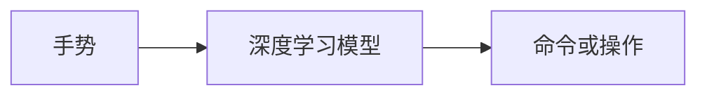

## 1.背景介绍

在当今的科技世界中，手势识别技术已经成为了一种重要的人机交互方式。无论是在游戏、虚拟现实、健康监测等领域，都离不开手势识别的应用。而深度学习模型，作为一种强大的机器学习方法，正被广泛应用于手势识别技术中，以提高其准确性和实用性。

## 2.核心概念与联系

手势识别技术的核心是将手势映射到特定的命令或操作。而深度学习模型则是实现这种映射的关键工具。深度学习模型通过学习大量的手势数据，能够理解并识别出各种复杂的手势，从而实现精确的手势识别。



## 3.核心算法原理具体操作步骤

深度学习模型的训练过程可以分为以下几个步骤：

1. 数据收集：收集大量的手势数据，包括手势的形状、位置、运动轨迹等信息。
2. 数据预处理：将收集的数据进行预处理，如归一化、降噪、特征提取等，以便于模型的训练。
3. 模型训练：使用预处理后的数据训练深度学习模型。训练过程中，模型会不断调整其参数，以最小化预测结果与真实结果之间的差距。
4. 模型测试：在训练完成后，使用未参与训练的数据测试模型的性能，以评估其准确性和泛化能力。
5. 模型应用：将训练好的模型应用于实际的手势识别任务中。

## 4.数学模型和公式详细讲解举例说明

深度学习模型的基础是神经网络。神经网络的每一层都由多个神经元组成，每个神经元都可以看作是一个简单的函数，它接收输入，进行计算，然后产生输出。神经元之间的连接具有权重，这些权重在训练过程中被调整，以使网络的输出尽可能接近于目标输出。

神经元的计算可以用下面的数学公式表示：

$$
y = f(\sum_{i=1}^{n} w_i x_i + b)
$$

其中，$x_i$ 是输入，$w_i$ 是权重，$b$ 是偏置，$f$ 是激活函数，$y$ 是输出。

## 5.项目实践：代码实例和详细解释说明

下面是一个使用 Python 和深度学习库 TensorFlow 实现的手势识别模型的示例。

```python
import tensorflow as tf
from tensorflow.keras.models import Sequential
from tensorflow.keras.layers import Dense

# 创建模型
model = Sequential()
model.add(Dense(64, activation='relu', input_shape=(10,)))
model.add(Dense(64, activation='relu'))
model.add(Dense(10, activation='softmax'))

# 编译模型
model.compile(loss='categorical_crossentropy',
              optimizer='adam',
              metrics=['accuracy'])

# 训练模型
model.fit(x_train, y_train, epochs=10, batch_size=32)

# 测试模型
score = model.evaluate(x_test, y_test, batch_size=32)
```

## 6.实际应用场景

手势识别技术广泛应用于各种场景，包括：

- 游戏：通过捕捉玩家的手势，实现游戏中的操作。
- 虚拟现实：通过识别用户的手势，实现虚拟世界中的交互。
- 健康监测：通过分析用户的手势，监测其健康状况。

## 7.工具和资源推荐

- TensorFlow：一个强大的深度学习库，提供了丰富的模型和工具，方便用户构建和训练模型。
- OpenCV：一个开源的计算机视觉库，提供了丰富的图像处理和特征提取工具。
- Leap Motion：一个手势识别设备，可以捕捉和识别用户的手势。

## 8.总结：未来发展趋势与挑战

随着深度学习技术的发展，手势识别的准确性和实用性将得到进一步提高。但同时，也面临着一些挑战，如如何处理复杂和模糊的手势，如何提高模型的泛化能力等。

## 9.附录：常见问题与解答

1. Q: 深度学习模型的训练需要多长时间？
   A: 这取决于许多因素，包括模型的复杂性、数据的数量和质量、硬件的性能等。

2. Q: 如何提高手势识别的准确性？
   A: 可以通过增加数据的数量和质量、优化模型的结构和参数、使用更强大的硬件等方法。

作者：禅与计算机程序设计艺术 / Zen and the Art of Computer Programming