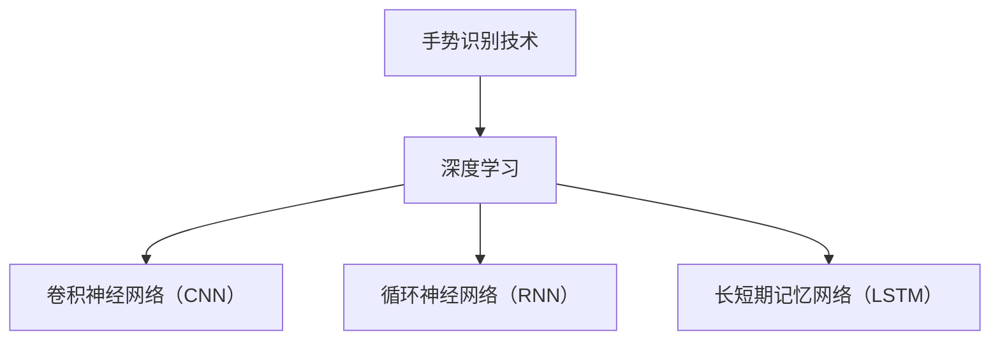
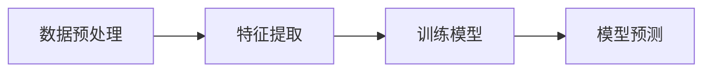

## 1.背景介绍

手势识别技术是计算机视觉领域的一大研究热点，它能够使计算机理解并识别人类的手势，从而实现人机交互。深度学习作为一种强大的机器学习方法，近年来在手势识别技术中的应用取得了显著的成果。本文将深入探讨深度学习在手势识别技术中的应用，以及如何使用深度学习模型进行手势识别。

## 2.核心概念与联系

手势识别技术的核心是通过对手势的识别，实现人机交互。而深度学习则是通过模拟人脑神经网络的方式，利用大量数据进行学习和训练，从而实现对手势的识别。

在深度学习模型中，常用的有卷积神经网络（CNN）、循环神经网络（RNN）和长短期记忆网络（LSTM）。这些模型都可以用于手势识别，但由于手势识别涉及到时序信息的处理，因此，RNN和LSTM在处理这类问题上更具优势。



## 3.核心算法原理具体操作步骤

手势识别技术中的深度学习模型的工作流程主要包括以下几个步骤：

1. 数据预处理：对输入的手势图像进行预处理，包括归一化、去噪等操作，以便于模型的训练和预测。
2. 特征提取：使用深度学习模型对预处理后的图像进行特征提取，这些特征包括手势的形状、位置、运动轨迹等。
3. 训练模型：将提取的特征输入到深度学习模型中进行训练，通过反向传播算法调整模型的参数，使模型在训练数据上的预测结果与真实结果的差距最小。
4. 模型预测：在模型训练完成后，可以将新的手势图像输入到模型中，模型会输出对应的预测结果。



## 4.数学模型和公式详细讲解举例说明

深度学习模型的基础是神经网络，神经网络由多个神经元组成，每个神经元都是一个简单的模型，其输出为输入的加权和经过一个非线性激活函数的结果。对于一个神经元，其输出$y$可以表示为：

$$ y = f(\sum_{i=1}^{n} w_ix_i + b) $$

其中，$x_i$是输入，$w_i$是对应的权重，$b$是偏置，$f$是激活函数。

对于手势识别问题，我们通常使用softmax函数作为输出层的激活函数，softmax函数可以将输出转化为概率分布，其公式为：

$$ softmax(x_i) = \frac{e^{x_i}}{\sum_{j=1}^{n} e^{x_j}} $$

在训练深度学习模型时，我们通常使用交叉熵损失函数，其公式为：

$$ H(y, \hat{y}) = -\sum_{i=1}^{n} y_i log(\hat{y_i}) $$

其中，$y$是真实标签，$\hat{y}$是模型的预测结果。

## 5.项目实践：代码实例和详细解释说明

下面给出一个使用Python和深度学习框架TensorFlow进行手势识别的简单示例：

```python
import tensorflow as tf
from tensorflow.keras import layers

# 构建模型
model = tf.keras.Sequential([
    layers.Conv2D(32, (3, 3), activation='relu', input_shape=(64, 64, 1)),
    layers.MaxPooling2D((2, 2)),
    layers.Conv2D(64, (3, 3), activation='relu'),
    layers.MaxPooling2D((2, 2)),
    layers.Flatten(),
    layers.Dense(64, activation='relu'),
    layers.Dense(10, activation='softmax')
])

# 编译模型
model.compile(optimizer='adam',
              loss='sparse_categorical_crossentropy',
              metrics=['accuracy'])

# 训练模型
model.fit(train_images, train_labels, epochs=5)

# 评估模型
test_loss, test_acc = model.evaluate(test_images, test_labels)
print('Test accuracy:', test_acc)
```

## 6.实际应用场景

手势识别技术在许多领域都有广泛的应用，例如游戏、虚拟现实、机器人控制等。深度学习模型能够提供高精度的手势识别，使得这些应用更加实用和便捷。

## 7.工具和资源推荐

- TensorFlow：一个强大的深度学习框架，提供了丰富的API和工具，适合深度学习新手和专家使用。
- Keras：一个基于Python的深度学习库，提供了简洁易用的API，适合快速原型设计和实验。
- OpenCV：一个开源的计算机视觉库，提供了许多图像处理和计算机视觉的算法和工具。

## 8.总结：未来发展趋势与挑战

手势识别技术和深度学习的结合是一个有广阔前景的研究方向。然而，也面临着一些挑战，例如如何处理复杂和模糊的手势，如何提高识别速度和精度等。随着深度学习技术的不断发展，相信这些问题都会得到解决。

## 9.附录：常见问题与解答

Q：深度学习模型训练时为什么需要大量的数据？
A：深度学习模型需要大量的数据来训练，因为模型需要从数据中学习到足够多的信息，才能对新的数据进行正确的预测。

Q：为什么选择RNN和LSTM进行手势识别？
A：RNN和LSTM能够处理时序信息，而手势识别问题往往涉及到手势的动态变化，因此RNN和LSTM更适合处理这类问题。

Q：深度学习模型训练时如何防止过拟合？
A：防止过拟合的方法有很多，常见的有早停法、正则化、Dropout等。

作者：禅与计算机程序设计艺术 / Zen and the Art of Computer Programming