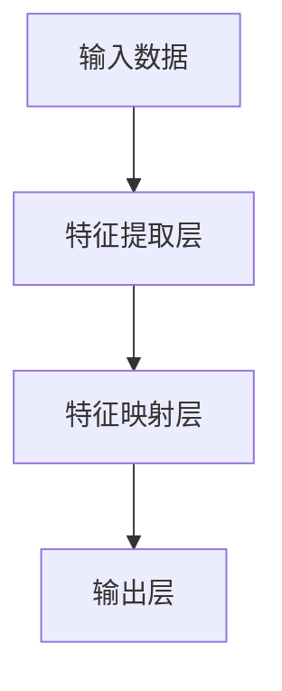
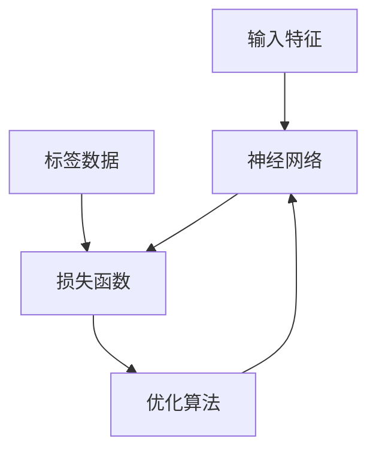
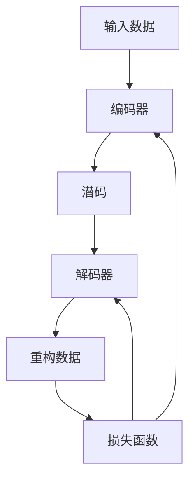
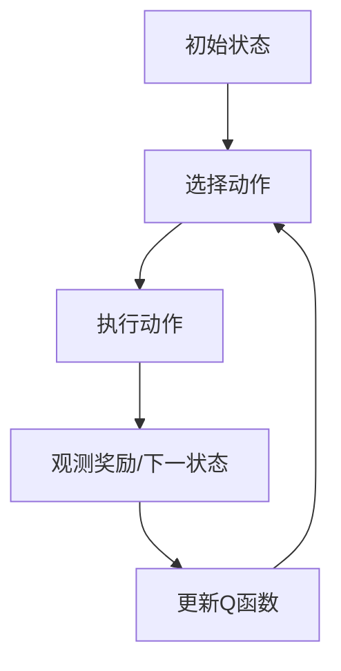

# 一切皆是映射：深度学习在航空航天中的挑战与机会

## 1. 背景介绍

### 1.1 航空航天的重要性

航空航天工业是一个高科技行业,对国家的经济发展和国防安全具有重要的战略意义。随着科技的不断进步,航空航天技术也在不断创新和发展。传统的航空航天系统设计和优化过程通常依赖于物理建模、数值模拟和实验测试,这些方法往往成本高昂、周期长且效率低下。

### 1.2 深度学习的兴起

近年来,深度学习作为一种有前景的人工智能技术,在计算机视觉、自然语言处理、语音识别等领域取得了突破性进展。深度学习能够自动从海量数据中学习特征表示,捕捉复杂的非线性映射关系,从而解决传统方法难以处理的问题。这使得深度学习在航空航天领域也展现出广阔的应用前景。

## 2. 核心概念与联系

### 2.1 深度学习基本概念

深度学习是一种基于表示学习的机器学习方法,它通过构建多层非线性变换网络,从原始输入数据中自动学习越来越抽象的特征表示。常见的深度学习模型包括卷积神经网络(CNN)、递归神经网络(RNN)、长短期记忆网络(LSTM)等。



### 2.2 深度学习与航空航天的联系

航空航天系统涉及复杂的物理过程,包括空气动力学、结构动力学、热传导、控制系统等,这些过程通常由一系列偏微分方程描述。深度学习能够从海量数据中学习这些复杂的映射关系,从而替代或辅助传统的物理建模和数值模拟方法,提高设计和优化的效率。

## 3. 核心算法原理具体操作步骤  

### 3.1 监督学习

监督学习是深度学习的一种主要范式,它基于已标注的训练数据(输入-输出对)来学习映射函数。在航空航天领域,监督学习可应用于以下场景:

1. **气动设计**:使用CFD(计算流体动力学)仿真数据训练神经网络,预测新的气动外形在不同工况下的气动性能。
2. **结构分析**:基于有限元分析数据训练神经网络,快速预测复杂结构在各种载荷下的应力/应变分布。
3. **轨迹预测**:利用历史飞行数据训练神经网络,预测飞行器在不同环境和控制输入下的运动轨迹。

#### 3.1.1 训练过程

1) 收集标注数据集,包括输入特征(如气动外形参数)和对应的输出标签(如空气动力系数)。
2) 构建神经网络模型,包括输入层、隐藏层和输出层。
3) 定义损失函数,衡量模型预测与真实标签的差异。
4) 使用优化算法(如梯度下降)迭代更新网络参数,最小化损失函数。



### 3.2 无监督学习

无监督学习则是从未标注的原始数据中自动发现潜在的模式和结构。在航空航天领域,无监督学习可应用于以下场景:

1. **异常检测**:使用自编码器等模型从正常数据中学习特征表示,检测新数据与正常模式的偏离程度。
2. **数据压缩**:利用自编码器或生成对抗网络(GAN)等模型,对高维数据(如CFD仿真结果)进行低维嵌入,减少存储和传输开销。
3. **模式发现**:通过聚类算法等无监督方法,从飞行数据中发现不同的飞行模式,为航线优化等提供参考。

#### 3.2.1 自编码器示例

1) 构建自编码器网络,包括编码器和解码器两部分。
2) 输入原始数据,编码器将其映射到低维潜码空间。
3) 解码器从潜码空间重构出原始数据的近似。
4) 最小化输入与重构数据的差异,作为网络的训练目标。



### 3.3 强化学习

强化学习则是一种基于反馈信号的学习范式,适用于序列决策问题。在航空航天领域,强化学习可应用于:

1. **智能控制**:训练智能体(Agent)根据当前状态作出最优控制决策,实现航天器的自主导航、着陆等任务。
2. **路径规划**:在考虑各种约束条件下,寻找最优的飞行路径。
3. **资源调度**:合理分配航天器的有限资源(如能量、带宽等),完成既定任务。

#### 3.3.1 Q-Learning算法

1) 初始化Q函数(状态-动作值函数)。
2) 智能体与环境交互,获得当前状态、执行动作、观察奖励和下一状态。
3) 根据观测更新Q函数,使其能够预测在当前状态执行某动作后的长期回报。
4) 基于更新后的Q函数,选择期望回报最大的动作执行。



## 4. 数学模型和公式详细讲解举例说明

深度学习算法通常涉及大量的数学模型和公式,下面将详细介绍其中的一些核心内容。

### 4.1 神经网络模型

神经网络是深度学习的基础模型,它由多层神经元组成,每个神经元对上一层输出进行加权求和,并通过非线性激活函数传递到下一层。

对于单个神经元,其数学表达式为:

$$
y = \phi\left(\sum_{i=1}^{n}w_ix_i + b\right)
$$

其中:
- $x_i$是第$i$个输入
- $w_i$是对应的权重参数
- $b$是偏置参数
- $\phi$是非线性激活函数,如Sigmoid、ReLU等

整个神经网络则是将多个这样的神经元层层叠加而成。以前馈神经网络为例,第$l$层的输出可表示为:

$$
\mathbf{y}^{(l)} = \phi\left(\mathbf{W}^{(l)}\mathbf{y}^{(l-1)} + \mathbf{b}^{(l)}\right)
$$

其中$\mathbf{W}^{(l)}$和$\mathbf{b}^{(l)}$分别是该层的权重矩阵和偏置向量。

### 4.2 损失函数

为了训练神经网络,需要定义一个损失函数(Loss Function)来衡量模型预测与真实标签之间的差异。常见的损失函数包括:

1. **均方误差(MSE)**:
   $$
   \mathcal{L}_{MSE}(\mathbf{y}, \hat{\mathbf{y}}) = \frac{1}{n}\sum_{i=1}^{n}(y_i - \hat{y}_i)^2
   $$

2. **交叉熵(Cross-Entropy)**:
   $$
   \mathcal{L}_{CE}(\mathbf{y}, \hat{\mathbf{y}}) = -\frac{1}{n}\sum_{i=1}^{n}\left[y_i\log\hat{y}_i + (1 - y_i)\log(1 - \hat{y}_i)\right]
   $$

其中$\mathbf{y}$是真实标签,$\hat{\mathbf{y}}$是模型预测值。训练过程旨在最小化这个损失函数。

### 4.3 优化算法

为了最小化损失函数,需要使用优化算法来更新神经网络的参数(权重和偏置)。最常用的优化算法是基于梯度下降的方法。

假设损失函数为$\mathcal{L}(\mathbf{W}, \mathbf{b})$,其中$\mathbf{W}$和$\mathbf{b}$分别是权重和偏置参数。梯度下降法通过计算损失函数关于参数的梯度,并沿着梯度的反方向更新参数:

$$
\mathbf{W} \leftarrow \mathbf{W} - \eta\frac{\partial\mathcal{L}}{\partial\mathbf{W}}\\
\mathbf{b} \leftarrow \mathbf{b} - \eta\frac{\partial\mathcal{L}}{\partial\mathbf{b}}
$$

其中$\eta$是学习率,控制更新的步长。

为了提高收敛速度和稳定性,还可以使用一些优化的变体算法,如动量梯度下降(Momentum)、RMSProp、Adam等。

### 4.4 正则化技术

为了防止神经网络过拟合,还需要采用一些正则化技术,包括:

1. **L1/L2正则化**:在损失函数中加入权重的L1或L2范数惩罚项,使得模型参数值趋于稀疏或较小。
   $$
   \mathcal{L}_{reg}(\mathbf{W}, \mathbf{b}) = \mathcal{L}(\mathbf{W}, \mathbf{b}) + \lambda\left\|\mathbf{W}\right\|_p
   $$
   其中$p=1$为L1正则化,$p=2$为L2正则化,$\lambda$控制正则化强度。

2. **dropout**:在训练过程中,随机将神经网络中的一部分神经元暂时移除,避免过度依赖于任何单个神经元。

3. **批归一化(Batch Normalization)**:对每一层的输入进行归一化处理,加快收敛并提高模型的泛化能力。

## 5. 项目实践:代码实例和详细解释说明

为了更好地理解深度学习在航空航天领域的应用,下面将通过一个具体的项目实践案例,展示如何使用Python及相关库(如PyTorch、TensorFlow等)构建并训练深度学习模型。

### 5.1 项目概述

本项目旨在使用深度学习技术预测飞机的升阻比。升阻比是衡量飞机气动性能的一个重要指标,传统方法通常需要进行大量的CFD仿真和风洞实验,耗时耗力。我们将基于CFD仿真数据训练一个神经网络模型,快速准确地预测给定气动外形参数下的升阻比。

### 5.2 数据准备

首先,我们需要准备训练数据集。这里使用NASA的开源数据集,包含16,500多个样本,每个样本由8个输入特征(描述飞机的几何参数)和2个输出标签(升阻比和阻力系数)组成。

```python
import pandas as pd

# 加载数据
data = pd.read_csv('data/train.csv')

# 查看数据集信息
print(data.info())
```

### 5.3 构建神经网络模型

接下来,使用PyTorch定义一个简单的全连接神经网络模型:

```python
import torch.nn as nn

class AerodynamicModel(nn.Module):
    def __init__(self, input_size, hidden_size, output_size):
        super().__init__()
        self.fc1 = nn.Linear(input_size, hidden_size)
        self.relu = nn.ReLU()
        self.fc2 = nn.Linear(hidden_size, output_size)

    def forward(self, x):
        out = self.fc1(x)
        out = self.relu(out)
        out = self.fc2(out)
        return out

# 实例化模型
model = AerodynamicModel(input_size=8, hidden_size=64, output_size=2)
```

### 5.4 训练模型

定义损失函数和优化器,然后进行训练:

```python
import torch.optim as optim

# 定义损失函数和优化器
criterion = nn.MSELoss()
optimizer = optim.Adam(model.parameters(), lr=0.001)

# 训练循环
for epoch in range(num_epochs):
    for inputs, labels in data_loader:
        # 前向传播
        outputs = model(inputs)
        loss = criterion(outputs, labels)

        # 反向传播和优化
        optimizer.zero_grad()
        loss.backward()
        optimizer.step()

    