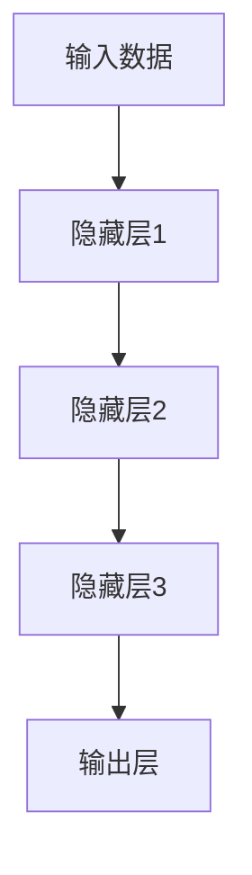
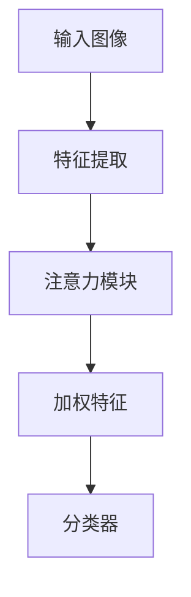
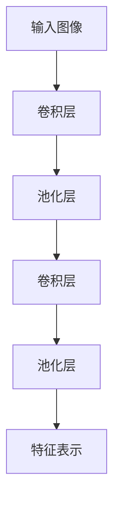
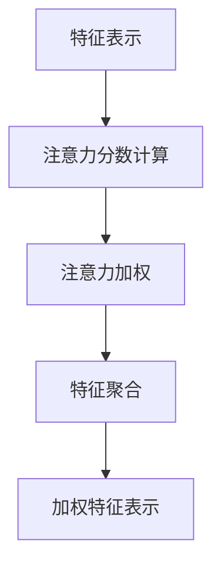

# 一切皆是映射：细粒度图像识别与深度神经网络

## 1.背景介绍

### 1.1 图像识别的重要性

在当今世界,图像数据无处不在。从社交媒体上的照片和视频到卫星遥感图像,从医疗诊断扫描到自动驾驶汽车的摄像头,图像数据已经成为现代社会不可或缺的一部分。因此,能够准确理解和解释图像内容的技术变得越来越重要。

图像识别技术的应用范围广泛,包括:

- 社交媒体内容理解和推荐
- 自动驾驶和机器人视觉
- 医疗诊断辅助
- 遥感图像分析
- 视频监控和安全
- 增强现实和虚拟现实

随着深度学习技术的不断发展,图像识别的准确性和效率也在不断提高,但对于一些细粒度的图像识别任务,传统的方法仍然存在一些挑战。

### 1.2 细粒度图像识别的挑战

细粒度图像识别是指对于一些具有细微差别的图像类别进行准确识别和区分。例如,识别不同品种的狗、鸟类或植物等。这些任务对于人类来说也是具有一定难度的,因为不同类别之间的差异往往很小,需要专业知识才能区分。

细粒度图像识别面临的主要挑战包括:

- 类内差异大于类间差异
- 关键识别特征占比较小
- 缺乏足够的标注数据
- 需要更强的泛化能力

传统的基于手工特征的图像识别方法很难应对这些挑战,因此需要更强大的深度学习模型来解决细粒度图像识别问题。

## 2.核心概念与联系

### 2.1 深度神经网络

深度神经网络(Deep Neural Networks, DNNs)是一种强大的机器学习模型,能够从大量数据中自动学习特征表示。它由多个隐藏层组成,每一层对输入数据进行非线性变换,从而学习到越来越抽象的特征表示。

深度神经网络在图像识别任务中表现出色,尤其是在大规模数据集上训练的模型,如ImageNet上训练的卷积神经网络(CNNs)。这些模型能够自动学习到多尺度、多层次的图像特征表示,大大提高了图像识别的准确性。

### 2.2 细粒度图像识别

细粒度图像识别任务通常需要模型能够捕捉图像中的细节特征,如物体的局部区域、纹理和细微差异等。为了解决这个问题,研究人员提出了多种深度学习模型和技术,包括:

- 注意力机制(Attention Mechanisms)
- 局部特征增强(Local Feature Enhancement)
- 元学习(Meta-Learning)
- 弱监督学习(Weakly Supervised Learning)

这些技术旨在引导模型关注图像中的关键区域,增强局部特征的表示能力,并提高模型的泛化能力。

### 2.3 注意力机制

注意力机制是一种重要的技术,它允许模型动态地聚焦于输入数据的不同部分,并根据当前任务的需求分配计算资源。在细粒度图像识别中,注意力机制可以帮助模型关注图像中的关键区域,如物体的特定部位或纹理细节。

注意力机制通常与卷积神经网络或其他深度模型结合使用,形成注意力模型。这些模型能够自适应地聚焦于输入图像的不同区域,提高对细节的敏感性,从而提高细粒度图像识别的性能。

### 2.4 局部特征增强

另一种解决细粒度图像识别问题的方法是局部特征增强。这种方法旨在通过特殊的网络结构或损失函数,增强模型对局部区域和细节特征的表示能力。

一些常见的局部特征增强技术包括:

- 双重注意力模块(Dual Attention Modules)
- 可变形卷积(Deformable Convolutions)
- 局部特征聚合(Local Feature Aggregation)

这些技术通过不同的方式,强化模型对局部区域的建模能力,从而提高对细粒度差异的敏感性。

### 2.5 元学习

元学习(Meta-Learning)是一种旨在提高模型泛化能力的技术。在细粒度图像识别任务中,由于训练数据的局限性,模型往往难以很好地泛化到新的类别或场景。

元学习通过在多个相关任务上训练,使模型能够学习到一种快速适应新任务的能力。这种能力对于细粒度图像识别任务尤为重要,因为它可以帮助模型更好地理解新类别之间的细微差异。

一些常见的元学习算法包括:

- 模型无关元学习(Model-Agnostic Meta-Learning, MAML)
- 原型网络(Prototypical Networks)
- 关系网络(Relation Networks)

通过元学习,模型可以更快地适应新的细粒度类别,提高泛化能力和识别精度。

### 2.6 弱监督学习

在细粒度图像识别任务中,获取大量高质量的标注数据是一个巨大的挑战。弱监督学习技术旨在利用更易获得的弱标注数据(如图像级标注或部分标注)来训练模型,减轻对大量精细标注数据的依赖。

一些常见的弱监督学习技术包括:

- 多实例学习(Multiple Instance Learning)
- 注意力传递(Attention Transfer)
- 对抗训练(Adversarial Training)

通过弱监督学习,模型可以从更广泛的数据源中学习,提高对细粒度差异的理解能力,同时降低了数据标注的成本。

## 3.核心算法原理具体操作步骤

在细粒度图像识别任务中,常见的深度学习模型包括卷积神经网络(CNNs)、注意力模型和元学习模型等。这些模型通常包含以下几个关键步骤:

### 3.1 特征提取

第一步是使用卷积神经网络或其他特征提取器从输入图像中提取特征表示。这些特征表示通常包含多尺度、多层次的图像信息,如边缘、纹理、形状等。

### 3.2 注意力机制

对于注意力模型,特征提取后的下一步是应用注意力机制,以聚焦于输入图像的关键区域。注意力机制通常包括以下步骤:

1. 计算注意力分数(Attention Scores):对于每个空间位置或特征通道,计算一个注意力分数,表示该位置或通道的重要性。

2. 注意力加权(Attention Weighting):使用注意力分数对特征表示进行加权,增强重要区域的特征响应。

3. 特征聚合(Feature Aggregation):将加权后的特征表示聚合成一个全局特征向量,用于后续的分类或回归任务。

### 3.3 局部特征增强

对于局部特征增强模型,特征提取后的下一步是应用特殊的网络结构或损失函数,以增强对局部区域和细节特征的建模能力。

一些常见的局部特征增强技术包括:

- 双重注意力模块:同时关注通道注意力和空间注意力,增强对局部特征的建模。
- 可变形卷积:通过学习卷积核的偏移,使卷积核能够自适应地聚焦于输入图像的关键区域。
- 局部特征聚合:显式地聚合局部区域的特征表示,增强对细节的建模能力。

### 3.4 元学习

对于元学习模型,特征提取后的下一步是应用元学习算法,以提高模型在新任务上的适应能力。

一些常见的元学习算法包括:

- 模型无关元学习(MAML):通过在多个任务上优化模型参数,使模型能够快速适应新任务。
- 原型网络:将每个类别表示为一个原型向量,新任务通过计算样本与原型的距离进行分类。
- 关系网络:学习样本之间的关系,并将这些关系知识迁移到新任务上。

### 3.5 分类或回归

最后一步是将加权特征表示或元学习模型的输出,输入到分类器或回归器中,得到最终的预测结果。

对于分类任务,常见的分类器包括全连接层、softmax层等。对于回归任务,则可以使用全连接层直接预测连续值。

### 3.6 模型训练

上述步骤构成了细粒度图像识别模型的前向传播过程。在训练阶段,模型通过反向传播算法和优化器(如SGD、Adam等)来更新网络参数,最小化损失函数(如交叉熵损失、三重损失等),从而逐步提高模型在训练数据上的性能。

在实际应用中,还需要进行数据增强、正则化、超参数调优等操作,以提高模型的泛化能力和鲁棒性。

## 4.数学模型和公式详细讲解举例说明

在细粒度图像识别任务中,常见的数学模型和公式包括:

### 4.1 卷积神经网络

卷积神经网络(Convolutional Neural Networks, CNNs)是深度学习中最常用的模型之一,它通过卷积操作和池化操作来提取图像的特征表示。

卷积操作可以用公式表示为:

$$
y_{ij} = \sum_{m}\sum_{n}x_{m,n}w_{ij,m,n} + b_{ij}
$$

其中,$$x_{m,n}$$表示输入图像的像素值,$$w_{ij,m,n}$$表示卷积核的权重,$$b_{ij}$$表示偏置项,$$y_{ij}$$表示输出特征图的像素值。

池化操作通常使用最大池化或平均池化,用于降低特征图的分辨率,同时保留关键特征。最大池化可以表示为:

$$
y_{ij} = \max\limits_{(m,n) \in R_{ij}}x_{m,n}
$$

其中,$$R_{ij}$$表示输入特征图上的池化区域。

通过多个卷积层和池化层的堆叠,CNN能够学习到多尺度、多层次的图像特征表示,从而提高图像识别的性能。

### 4.2 注意力机制

注意力机制是一种常见的技术,用于引导模型关注输入数据的关键区域。在细粒度图像识别中,注意力机制可以帮助模型聚焦于图像的局部区域和细节特征。

注意力分数的计算通常使用软注意力(Soft Attention)或硬注意力(Hard Attention)机制。软注意力使用加权求和的方式聚合特征,可以用公式表示为:

$$
y_i = \sum_{j}a_{ij}x_j
$$

其中,$$x_j$$表示输入特征,$$a_{ij}$$表示注意力分数,$$y_i$$表示加权特征。注意力分数$$a_{ij}$$通常由注意力模块计算得到,例如使用softmax函数:

$$
a_{ij} = \frac{e^{s_{ij}}}{\sum_{k}e^{s_{ik}}}
$$

其中,$$s_{ij}$$表示注意力分数的未归一化值。

硬注意力则是通过采样的方式选择关键区域,可以看作是一种确定性的注意力机制。

### 4.3 局部特征增强

局部特征增强技术旨在增强模型对局部区域和细节特征的建模能力。一种常见的方法是使用可变形卷积(Deformable Convolutions),它通过学习卷积核的偏移量,使卷积核能够自适应地聚焦于输入图像的关键区域。