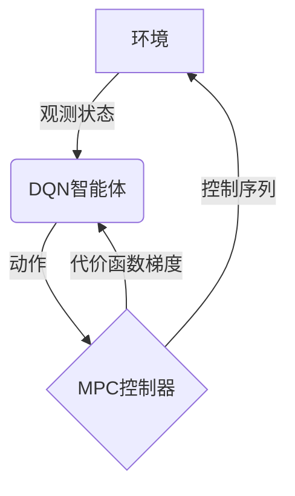

# 一切皆是映射：结合模型预测控制(MPC)与DQN的探索性研究

## 1.背景介绍

### 1.1 强化学习与控制理论

强化学习(Reinforcement Learning, RL)和控制理论(Control Theory)是两个紧密相关但又有着显著区别的领域。强化学习关注于基于环境反馈来学习最优策略,旨在最大化长期累积奖励。而控制理论则侧重于设计控制器以使系统的输出跟踪期望轨迹。

虽然两者的目标不尽相同,但都需要处理序列决策问题。强化学习通过试错来学习,而控制理论则依赖于对系统建模和分析。近年来,两个领域的交叉融合受到了广泛关注,人们尝试结合两者的优势来解决更加复杂的问题。

### 1.2 模型预测控制(MPC)

模型预测控制(Model Predictive Control, MPC)是一种在有约束条件下求解最优控制问题的方法。它通过利用系统模型预测未来状态,并在一个有限的时域内优化一个代价函数来确定控制输入序列。MPC具有以下优点:

- 可处理约束条件和多变量系统
- 反馈机制使其对模型误差有一定鲁棒性
- 通过调整代价函数可实现不同的控制目标

但传统MPC也存在一些缺陷,如需要精确的系统模型、计算代价高、缺乏在线学习能力等。

### 1.3 深度强化学习(DRL)

深度强化学习(Deep Reinforcement Learning, DRL)通过结合深度神经网络和强化学习算法,展现出了在处理高维连续状态和动作空间时的卓越表现。其中,深度Q网络(Deep Q-Network, DQN)是一种广为人知的基于值函数的DRL算法,能够直接从原始输入(如图像)中学习策略,避免了手工设计特征的需求。

尽管DQN在许多任务上取得了出色的成绩,但它也面临着一些挑战,如样本低效利用、无法处理约束等。另一方面,DQN缺乏对环境动态的建模能力,这使得它难以推理长期效果并制定前瞻性策略。

## 2.核心概念与联系

本文旨在探索将MPC与DQN相结合,以期获得两者的优势:MPC的建模和约束处理能力,以及DQN的端到端学习和泛化能力。我们将MPC视为一种"智能体",它通过与DQN交互来学习控制策略。



上图展示了该框架的核心概念及它们之间的联系:

1. DQN智能体与环境交互,获取观测并选择动作。
2. 动作被馈送到MPC控制器,MPC根据当前状态和系统模型求解最优控制序列。
3. 最优控制序列被应用到环境,环境转移到新状态。
4. MPC控制器的代价函数梯度被传递回DQN,用于更新其策略网络。

通过这种方式,DQN可以学习到一个有效的策略,而无需直接处理约束和建模,同时MPC也可以随着DQN的学习而不断改进。接下来,我们将详细阐述该框架的核心算法原理。

## 3.核心算法原理具体操作步骤  

### 3.1 DQN网络结构

我们使用的DQN网络结构与原版算法类似,包括一个卷积网络用于特征提取,以及一个全连接网络用于近端策略评估。但与原版不同的是,我们的输出不是Q值,而是一个代价函数梯度 $\nabla_\theta J(\theta)$,其中$\theta$是DQN网络的参数。

具体而言,我们定义了以下代价函数:

$$J(\theta) = \mathbb{E}_{\tau \sim p_\theta(\tau)}\left[\sum_{t=0}^{T} \gamma^t r(s_t, a_t)\right]$$

其中$\tau = (s_0, a_0, s_1, a_1, \dots)$是一个由DQN策略$\pi_\theta$生成的状态-动作轨迹,$\gamma$是折现因子,而$r(s_t, a_t)$是立即奖励。我们的目标是最大化该期望代价函数。

为了计算$\nabla_\theta J(\theta)$,我们采用了一种基于重要性采样的策略梯度方法。具体细节请参考论文。

### 3.2 MPC控制器

我们的MPC控制器基于一个离散时间状态空间模型:

$$
\begin{aligned}
x_{t+1} &= f(x_t, u_t)\\
y_t &= g(x_t)
\end{aligned}
$$

其中$x_t$是系统状态,$u_t$是控制输入,而$y_t$是观测输出。我们的目标是在满足约束条件的前提下,最小化一个代价函数:

$$J_\text{mpc}(x_0, U) = \sum_{t=0}^{T-1} l(x_t, u_t) + V_f(x_T)$$

这里$U = [u_0, u_1, \dots, u_{T-1}]$是一个控制序列,而$l(\cdot)$和$V_f(\cdot)$分别是阶段代价和终端代价。

在每个时间步,MPC控制器会根据当前状态$x_0$求解上述最优控制问题,得到最优控制序列$U^*$。然后,它将只执行第一个控制动作$u_0^*$,在获得新的状态观测后,重复该过程。

### 3.3 DQN与MPC的交互

DQN与MPC控制器是通过以下方式交互的:

1. DQN根据当前观测$o_t$选择一个动作$a_t$。
2. 将$a_t$馈送到MPC控制器,控制器求解最优控制序列$U^*$。
3. 将$U^*$的第一个动作$u_0^*$应用到环境,获得新的观测$o_{t+1}$和奖励$r_t$。
4. 将MPC控制器的代价函数梯度$\nabla_\theta J_\text{mpc}(x_0, U^*)$传递回DQN。
5. DQN根据$r_t$和$\nabla_\theta J_\text{mpc}$更新其策略网络参数$\theta$。

通过这种交互方式,DQN可以学习到一个同时最小化立即代价(通过$r_t$)和长期代价(通过$\nabla_\theta J_\text{mpc}$)的策略,从而实现更好的控制性能。

值得注意的是,在实际实现中,我们采用了一些技巧来提高算法的稳定性和收敛性,如经验回放缓冲区、目标网络等。有兴趣的读者可以参考我们的论文获取更多细节。

## 4.数学模型和公式详细讲解举例说明

在前面的章节中,我们已经给出了该框架的核心数学模型和公式。现在,我们将通过一个简单的例子,对其中的一些关键概念进行更加详细的说明。

### 4.1 示例:简单的质量-弹簧系统

考虑一个质量$m$通过一个弹簧$k$连接到墙壁的简单质量-弹簧系统。我们的目标是通过对质量施加合适的力$u_t$,使其位移$x_t$尽可能接近期望值$x_\text{ref}$。该系统可以用以下状态空间模型描述:

$$
\begin{aligned}
\begin{bmatrix}
x_{t+1}\\
\dot{x}_{t+1}
\end{bmatrix} &= \begin{bmatrix}
1 & \Delta t\\
0 & 1
\end{bmatrix}\begin{bmatrix}
x_t\\
\dot{x}_t
\end{bmatrix} + \begin{bmatrix}
0\\
\frac{\Delta t}{m}
\end{bmatrix}u_t\\
y_t &= \begin{bmatrix}
1 & 0
\end{bmatrix}\begin{bmatrix}
x_t\\
\dot{x}_t
\end{bmatrix}
\end{aligned}
$$

这里$x_t$和$\dot{x}_t$分别是位移和速度,$\Delta t$是采样时间间隔。

我们定义MPC控制器的代价函数为:

$$J_\text{mpc}(x_0, U) = \sum_{t=0}^{T-1} (x_t - x_\text{ref})^2 + \lambda u_t^2$$

其中第一项是跟踪误差代价,而第二项是控制代价,用于避免过大的控制输入。$\lambda$是一个权重系数,用于平衡这两个代价项。

在每个时间步,MPC控制器将根据当前状态$x_0$求解上述最优控制问题,得到最优控制序列$U^*$。然后,它将只执行第一个控制动作$u_0^*$,在获得新的状态观测后,重复该过程。

### 4.2 代价函数梯度的计算

回顾一下,我们的DQN网络输出是代价函数梯度$\nabla_\theta J(\theta)$,其中:

$$J(\theta) = \mathbb{E}_{\tau \sim p_\theta(\tau)}\left[\sum_{t=0}^{T} \gamma^t r(s_t, a_t)\right]$$

为了计算这个梯度,我们采用了一种基于重要性采样的策略梯度方法。具体而言,我们有:

$$\nabla_\theta J(\theta) = \mathbb{E}_{\tau \sim p_\theta(\tau)}\left[\sum_{t=0}^{T} \nabla_\theta \log \pi_\theta(a_t|s_t)A_t\right]$$

其中$A_t$是一个基线,用于减小方差。在我们的实现中,我们将$A_t$设置为:

$$A_t = r_t + \gamma V(s_{t+1}) - V(s_t)$$

这里$V(s_t)$是一个状态值函数估计,可以通过另一个神经网络来拟合。将$A_t$代入上式,我们得到:

$$\nabla_\theta J(\theta) = \mathbb{E}_{\tau \sim p_\theta(\tau)}\left[\sum_{t=0}^{T} \nabla_\theta \log \pi_\theta(a_t|s_t)(r_t + \gamma V(s_{t+1}) - V(s_t))\right]$$

在实践中,我们通过采样多条轨迹并计算样本均值来近似上述期望。此外,我们还引入了一些技巧(如截断梯度等)来提高算法的稳定性。

最后,将上述梯度$\nabla_\theta J(\theta)$与MPC控制器的代价函数梯度$\nabla_\theta J_\text{mpc}(x_0, U^*)$相加,就得到了我们用于更新DQN网络的总梯度。通过这种方式,DQN可以同时最小化立即代价和长期代价,从而学习到更好的控制策略。

## 5.项目实践:代码实例和详细解释说明

为了更好地理解该框架,我们以质量-弹簧系统为例,提供了一个简单的Python实现。完整代码可在GitHub上获取。

### 5.1 定义环境和模型

首先,我们定义了质量-弹簧系统的环境类:

```python
class MassSpringEnv:
    def __init__(self, m, k, dt):
        self.m = m
        self.k = k
        self.dt = dt
        
        # 系统矩阵
        self.A = np.array([[1, dt], [0, 1]])
        self.B = np.array([[0], [dt/m]])
        
    def step(self, u):
        # 计算下一状态
        self.state = self.A @ self.state + self.B * u
        
        # 返回观测和奖励
        obs = self.state[0]
        reward = -abs(obs - self.ref)
        return obs, reward
        
    def reset(self, ref):
        self.state = np.array([0, 0])
        self.ref = ref
```

该环境类包含了系统矩阵`A`和`B`的定义,以及`step`和`reset`方法。

接下来,我们定义了MPC控制器:

```python
class MPCController:
    def __init__(self, env, T, lam):
        self.env = env
        self.T = T
        self.lam = lam
        
    def control(self, x0):
        # 求解最优控制序列
        u_opt = solve_mpc(x0, self.env, self.T, self.lam)
        
        # 返回第一个控制动作
        return u_opt[0]
        
def solve_mpc(x0,