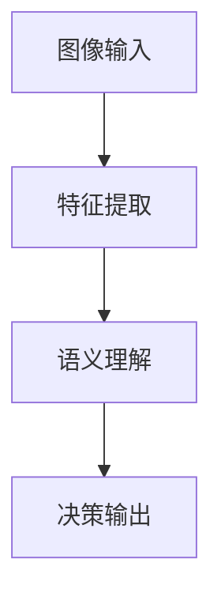

# 一切皆是映射：计算机视觉中的AI模型与应用

## 1. 背景介绍
### 1.1 计算机视觉的发展历程
### 1.2 人工智能在计算机视觉中的应用
### 1.3 映射思想在计算机视觉中的体现

## 2. 核心概念与联系 
### 2.1 计算机视觉的基本概念
#### 2.1.1 图像处理
#### 2.1.2 模式识别
#### 2.1.3 机器学习
### 2.2 映射思想在计算机视觉中的应用
#### 2.2.1 图像到特征的映射
#### 2.2.2 特征到语义的映射
#### 2.2.3 语义到决策的映射
### 2.3 AI模型在计算机视觉中的作用
#### 2.3.1 卷积神经网络(CNN)
#### 2.3.2 生成对抗网络(GAN) 
#### 2.3.3 视觉transformer(ViT)

## 3. 核心算法原理具体操作步骤
### 3.1 卷积神经网络(CNN)
#### 3.1.1 卷积层
#### 3.1.2 池化层
#### 3.1.3 全连接层
### 3.2 生成对抗网络(GAN)
#### 3.2.1 生成器
#### 3.2.2 判别器  
#### 3.2.3 对抗训练
### 3.3 视觉transformer(ViT) 
#### 3.3.1 图像分块
#### 3.3.2 位置编码
#### 3.3.3 多头注意力机制

## 4. 数学模型和公式详细讲解举例说明
### 4.1 卷积的数学原理
### 4.2 损失函数与优化算法
#### 4.2.1 交叉熵损失
#### 4.2.2 随机梯度下降
### 4.3 注意力机制的数学原理
#### 4.3.1 点积注意力
#### 4.3.2 加性注意力

## 5. 项目实践：代码实例和详细解释说明
### 5.1 使用CNN进行图像分类
### 5.2 使用GAN进行图像生成
### 5.3 使用ViT进行图像分割

## 6. 实际应用场景
### 6.1 自动驾驶中的目标检测与跟踪
### 6.2 医学影像分析与疾病诊断
### 6.3 智能安防中的人脸识别与行为分析

## 7. 工具和资源推荐
### 7.1 深度学习框架
#### 7.1.1 TensorFlow
#### 7.1.2 PyTorch
#### 7.1.3 Keras
### 7.2 开源数据集
#### 7.2.1 ImageNet
#### 7.2.2 COCO
#### 7.2.3 PASCAL VOC
### 7.3 预训练模型库
#### 7.3.1 TensorFlow Hub
#### 7.3.2 PyTorch Hub

## 8. 总结：未来发展趋势与挑战
### 8.1 计算机视觉的发展趋势 
#### 8.1.1 多模态融合
#### 8.1.2 小样本学习
#### 8.1.3 可解释性与鲁棒性
### 8.2 计算机视觉面临的挑战
#### 8.2.1 数据标注成本高
#### 8.2.2 模型泛化能力不足
#### 8.2.3 算法可解释性差

## 9. 附录：常见问题与解答
### 9.1 如何选择合适的CNN网络结构？
### 9.2 如何解决GAN训练不稳定的问题？  
### 9.3 如何提高ViT的训练效率？

计算机视觉是人工智能领域的一个重要分支，其核心目标是让计算机像人一样"看"世界，从图像或视频中提取有用的信息，进行分析和理解。近年来，随着深度学习技术的飞速发展，计算机视觉取得了令人瞩目的进展，在图像分类、目标检测、语义分割等任务上不断刷新着性能记录。

而支撑这一切的，是深度学习模型强大的特征学习和映射能力。卷积神经网络(CNN)通过逐层卷积和池化操作，将原始图像映射到高维特征空间，提取出图像的多尺度、多层次特征表示。生成对抗网络(GAN)则学习了真实图像的数据分布，将随机噪声向量映射成逼真的图像。视觉transformer(ViT)引入了自注意力机制，建立了图像区域之间的长程依赖关系，大大提升了视觉任务的性能上限。

从数学原理上看，卷积实际上是一种局部特征提取器，通过滑动窗口对图像进行加权求和，得到下一层特征图。损失函数则刻画了模型预测值与真实值之间的差异，优化算法通过最小化损失函数来更新模型参数，提高预测精度。注意力机制通过计算不同区域之间的相关性，为每个区域分配一个权重，使得模型能够更加关注图像中的关键信息。

在实际应用中，计算机视觉已经渗透到了各行各业。无人驾驶汽车利用视觉算法实时检测和跟踪车道线、交通标志、行人和其他车辆，确保行车安全。医学影像分析系统通过学习大量病例数据，辅助医生进行疾病诊断和预后评估。智慧城市的人脸识别和行为分析技术，为公共安全提供了有力保障。

展望未来，计算机视觉还有许多发展机遇和挑战。多模态融合、小样本学习、可解释性与鲁棒性等，都是亟待攻克的难题。同时，海量数据标注、模型泛化能力不足、算法黑盒化等问题，也限制了视觉技术的进一步应用。

总之，计算机视觉正在经历从"感知智能"到"认知智能"的跨越，人工智能模型和算法是其中的关键推动力。一切皆是映射，让我们一起见证这场"眼见为实"的革命吧！

作者：禅与计算机程序设计艺术 / Zen and the Art of Computer Programming