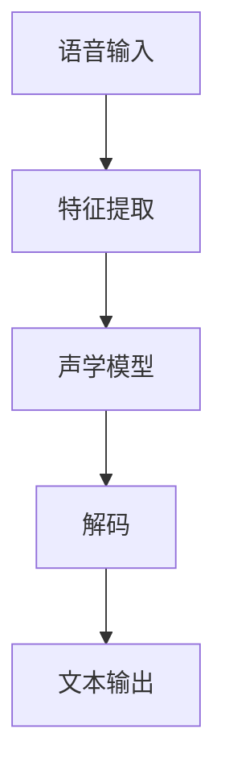
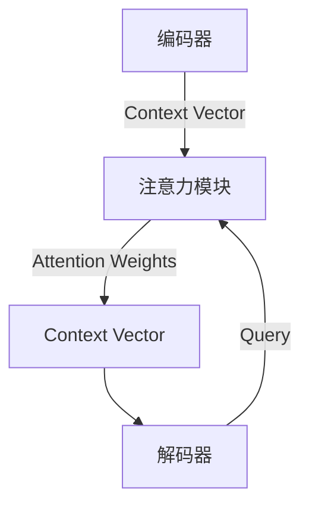

# 一切皆是映射：语音到文本的自然语言理解过程

## 1. 背景介绍

### 1.1 自然语言处理的重要性

在当今的数字时代,人机交互已经成为一种必不可少的技能。无论是智能手机、智能音箱还是聊天机器人,自然语言处理(NLP)技术都扮演着关键角色。NLP旨在使计算机能够理解和生成人类语言,从而实现自然、流畅的人机对话。

语音识别是NLP的一个重要分支,它将人类的语音转换为文本,为后续的自然语言理解和生成奠定基础。随着深度学习技术的不断进步,语音识别的准确率也在不断提高,为各种语音交互应用的发展铺平了道路。

### 1.2 语音识别系统的发展历程

早期的语音识别系统主要基于隐马尔可夫模型(HMM)和高斯混合模型(GMM),需要手工设计特征并对每个语音单元建模。这种方法存在一些局限性,如难以捕捉语音的长期依赖关系,且需要大量的领域知识。

近年来,随着深度学习技术的兴起,基于神经网络的端到端语音识别模型开始占据主导地位。这些模型能够自动从原始语音数据中学习特征表示,不需要手工设计特征,且能够更好地捕捉语音的长期依赖关系。

### 1.3 语音识别的挑战

尽管取得了长足的进步,语音识别仍然面临着一些挑战,例如:

- 噪音和重音:背景噪音和说话人的重音会影响识别准确率。
- 领域适应性:不同领域的语料库会导致识别效果差异较大。
- 资源匮乏:对于一些小语种来说,缺乏足够的训练数据。

## 2. 核心概念与联系

### 2.1 语音识别的基本流程

语音识别的基本流程如下:

1. **语音输入**: 获取原始语音信号。
2. **特征提取**: 从原始语音信号中提取有用的特征,如梅尔频率倒谱系数(MFCC)等。
3. **声学模型**: 建立语音特征和潜在语音单元(如音素)之间的映射关系。
4. **解码**: 根据声学模型的输出和语言模型,搜索出最可能的文本序列。
5. **文本输出**: 输出识别出的文本序列。

### 2.2 核心模型

语音识别系统的核心模型包括:

1. **声学模型**:
   - 传统方法:隐马尔可夫模型(HMM)、高斯混合模型(GMM)等。
   - 现代方法:基于深度神经网络的端到端模型,如时间延迟神经网络(TDNN)、卷积神经网络(CNN)、长短期记忆网络(LSTM)、 Transformer等。

2. **语言模型**:
   - N-gram模型:利用N个词的序列来估计下一个词的概率。
   - 神经语言模型:利用神经网络来建模语言的序列特征,如循环神经网络(RNN)、Transformer等。

3. **端到端模型**:
   - listened Attended Spell (LAS):基于注意力机制的编码器-解码器模型。
   - 基于 Transformer 的序列到序列模型:直接将语音特征映射到文本序列。

### 2.3 注意力机制

注意力机制是现代语音识别模型的关键技术之一。它允许模型在解码时,动态地关注输入序列的不同部分,从而更好地捕捉长期依赖关系。

1. **编码器**:将输入序列(如语音特征序列)编码为Context Vector。
2. **解码器**:根据当前状态生成Query,与Context Vector计算注意力权重。
3. **注意力模块**:根据Query和Context Vector计算注意力权重分布。
4. **Context Vector**:使用注意力权重对编码器输出进行加权求和,作为解码器的输入。

## 3. 核心算法原理具体操作步骤

### 3.1 特征提取

语音识别的第一步是从原始语音信号中提取有用的特征。常用的特征包括:

1. **MFCC(梅尔频率倒谱系数)**:
   - 步骤1:对语音信号进行预加重,增强高频部分的能量。
   - 步骤2:对预加重后的信号进行分帧和加窗。
   - 步骤3:对每帧语音信号做傅里叶变换,得到功率谱。
   - 步骤4:将功率谱映射到梅尔频率刻度上。
   - 步骤5:对梅尔频率谱取对数。
   - 步骤6:对梅尔对数功率谱做离散余弦变换,得到MFCC系数。

2. **PNCC(功率规范化遗传系数)**:
   - 步骤1:对语音信号进行预加重和分帧。
   - 步骤2:计算每帧的功率谱,并进行功率规范化。
   - 步骤3:对规范化后的功率谱进行积分平滑。
   - 步骤4:对平滑后的功率谱取对数。
   - 步骤5:对对数功率谱进行MFCC变换,得到PNCC系数。

3. **Filter Bank(滤波器组特征)**:
   - 步骤1:对语音信号进行预加重和分帧。
   - 步骤2:计算每帧的功率谱。
   - 步骤3:将功率谱映射到梅尔频率刻度上。
   - 步骤4:对梅尔频率谱做三角滤波器组积分,得到滤波器组特征。

### 3.2 声学模型

声学模型的目标是建立语音特征与潜在语音单元(如音素)之间的映射关系。常用的声学模型包括:

1. **HMM-GMM**:
   - 步骤1:使用高斯混合模型(GMM)对每个音素的状态进行建模。
   - 步骤2:使用隐马尔可夫模型(HMM)捕捉音素之间的时序关系。
   - 步骤3:使用前向-后向算法进行概率计算和参数估计。

2. **DNN-HMM**:
   - 步骤1:使用深度神经网络(DNN)对语音特征进行映射,得到音素后验概率。
   - 步骤2:使用HMM对音素序列进行建模,与传统HMM-GMM相似。

3. **CTC(连接性时间分类)**:
   - 步骤1:使用递归神经网络(如LSTM)对输入序列进行编码。
   - 步骤2:在编码器输出上添加一个blank标记,表示不输出。
   - 步骤3:使用CTC损失函数直接优化网络,使其能够生成正确的转录序列。

4. **Attention-Based Encoder-Decoder**:
   - 步骤1:使用编码器(如LSTM、Transformer)对输入序列进行编码。
   - 步骤2:使用带注意力机制的解码器对编码器输出进行解码,生成转录序列。
   - 步骤3:使用序列到序列的损失函数(如交叉熵)进行优化。

### 3.3 语言模型

语言模型的目标是估计一个词序列的概率,从而提高语音识别的准确性。常用的语言模型包括:

1. **N-gram模型**:
   - 步骤1:从大量文本数据中统计N个词的序列及其出现次数。
   - 步骤2:使用平滑技术(如加法平滑、Kneser-Ney平滑)估计未见词序列的概率。
   - 步骤3:在解码时,将N-gram概率与声学模型概率相结合,得到最终的词序列概率。

2. **神经语言模型**:
   - 步骤1:使用神经网络(如LSTM、Transformer)对历史词序列进行编码。
   - 步骤2:使用编码器的输出,预测下一个词的概率分布。
   - 步骤3:在解码时,将神经语言模型的概率与声学模型概率相结合。

3. **RNNLM(循环神经网络语言模型)**:
   - 步骤1:使用LSTM或GRU等递归神经网络对历史词序列进行编码。
   - 步骤2:使用编码器的最后一个隐藏状态,通过一个全连接层预测下一个词的概率分布。
   - 步骤3:在训练时,使用交叉熵损失函数对网络进行优化。

4. **Transformer语言模型**:
   - 步骤1:使用Transformer的编码器对历史词序列进行编码。
   - 步骤2:使用编码器的输出,通过掩码机制预测下一个词的概率分布。
   - 步骤3:在训练时,使用掩码语言模型(Masked LM)的损失函数对网络进行优化。

### 3.4 解码

解码是将声学模型和语言模型的输出综合起来,搜索出最可能的文本序列的过程。常用的解码算法包括:

1. **贪婪搜索**:
   - 步骤1:在每个时间步,选择声学模型输出概率最大的标签。
   - 步骤2:将选择的标签序列作为识别结果输出。

2. **束搜索(Beam Search)**:
   - 步骤1:维护一个候选路径集合(束宽度为B)。
   - 步骤2:在每个时间步,从候选路径集合中选取概率最大的B条路径,扩展到下一时间步。
   - 步骤3:重复步骤2,直到所有路径到达终止状态。
   - 步骤4:从终止状态的候选路径中,选择概率最大的路径作为识别结果。

3. **前缀束搜索(Prefix Beam Search)**:
   - 步骤1:维护一个候选前缀集合(束宽度为B)。
   - 步骤2:在每个时间步,从候选前缀集合中选取概率最大的B个前缀,扩展到下一时间步。
   - 步骤3:重复步骤2,直到遇到终止标记。
   - 步骤4:从终止前缀中,选择概率最大的路径作为识别结果。

4. **词束搜索(Word Beam Search)**:
   - 步骤1:维护一个候选词序列集合(束宽度为B)。
   - 步骤2:在每个时间步,从候选词序列集合中选取概率最大的B个词序列,扩展到下一个词。
   - 步骤3:重复步骤2,直到遇到终止标记。
   - 步骤4:从终止词序列中,选择概率最大的路径作为识别结果。

## 4. 数学模型和公式详细讲解举例说明

### 4.1 声学模型

#### 4.1.1 HMM-GMM模型

在HMM-GMM模型中,每个音素的每个状态都由一个高斯混合模型(GMM)来建模。GMM的概率密度函数如下:

$$
p(\mathbf{x}|\lambda) = \sum_{m=1}^M c_m \mathcal{N}(\mathbf{x}|\boldsymbol{\mu}_m, \boldsymbol{\Sigma}_m)
$$

其中:
- $\mathbf{x}$是观测向量(如MFCC特征)
- $M$是混合成分的数量
- $c_m$是第$m$个混合成分的权重,满足$\sum_{m=1}^M c_m = 1$
- $\mathcal{N}(\mathbf{x}|\boldsymbol{\mu}_m, \boldsymbol{\Sigma}_m)$是第$m$个混合成分的高斯分布密度,其中$\boldsymbol{\mu}_m$是均值向量,$\boldsymbol{\Sigma}_m$是协方差矩阵。

HMM用于捕捉音素之间的时序关系。设$\mathbf{X} = \{\mathbf{x}_1, \mathbf{x}_2, \ldots, \mathbf{x}_T\}$是一个观测序列,对应的隐状态序列为$\mathbf{Q} = \{q_1, q_2, \ldots, q_T\}$,则观测序列的概率可以表示为: