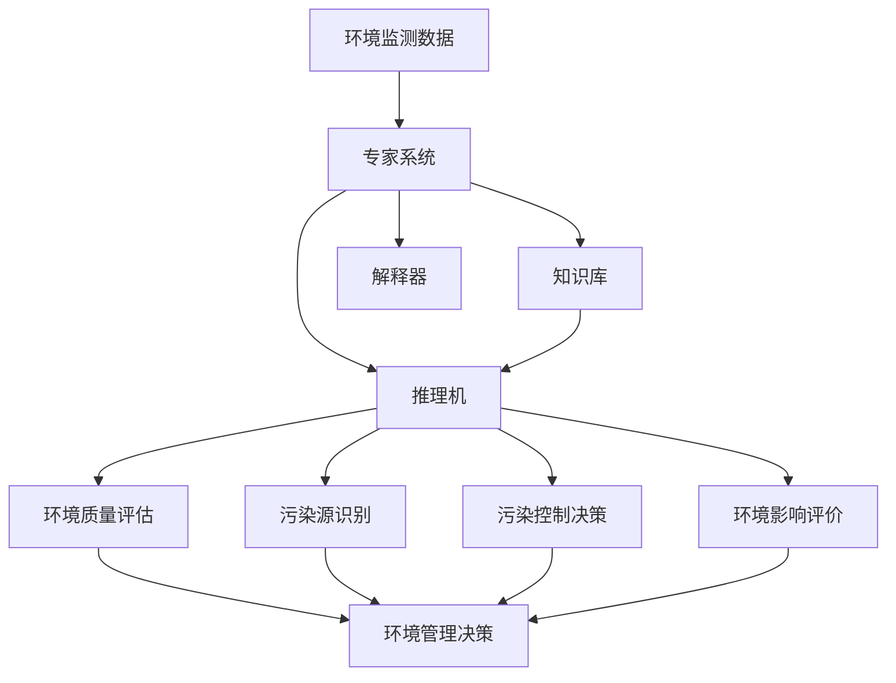

# 专家系统在环境保护领域的应用：环境监测与污染治理

## 1. 背景介绍

环境保护是当今世界面临的重大挑战之一。随着工业化和城市化进程的加快,环境污染问题日益严重,对人类健康和生态系统造成了巨大威胁。为了有效应对环境问题,迫切需要借助先进的科学技术手段。人工智能技术,特别是专家系统在环境监测和污染治理中展现出巨大的应用潜力。

专家系统是一种智能计算机程序,通过模拟人类专家的知识和推理过程,为特定领域的复杂问题提供解决方案。它综合运用人工智能、知识工程等技术,将专家的知识和经验转化为计算机可理解和执行的形式。在环境保护领域,专家系统可以辅助环境管理者进行环境质量评估、污染源识别、污染控制决策等任务,为科学有效的环境管理提供强大的技术支撑。

本文将重点探讨专家系统在环境监测与污染治理中的应用,阐述其核心概念、关键技术、实践案例以及未来发展趋势,为推动人工智能在生态环境保护领域的应用提供参考和启示。

## 2. 核心概念与联系

### 2.1 专家系统概述

专家系统是人工智能的一个重要分支,旨在通过知识表示和推理机制,模拟人类专家解决特定领域复杂问题的思维过程。它主要由知识库、推理机、解释器、知识获取和用户界面等组件构成。

- 知识库:存储专家的领域知识和经验,通常以规则、框架、语义网等形式表示。
- 推理机:根据知识库中的知识和用户输入,利用推理策略进行问题求解。
- 解释器:向用户解释系统的推理过程和结果,增强系统的可解释性和可信度。
- 知识获取:从专家、文献等渠道获取领域知识,并将其转化为知识库的表示形式。
- 用户界面:提供人机交互的渠道,接收用户输入,呈现系统输出。

### 2.2 环境监测与污染治理

环境监测是指对环境质量状况进行连续或定期的监视和测量,及时发现环境污染问题,为环境管理决策提供依据。它涉及大气、水体、土壤等环境要素的监测,以及污染物浓度、环境参数的测量分析。

污染治理则是针对已发生的环境污染采取的治理措施,包括污染源控制、污染物去除、生态修复等。它需要综合考虑污染特征、治理技术、成本效益等因素,制定科学合理的治理方案。

### 2.3 专家系统与环境保护的结合

将专家系统引入环境监测与污染治理领域,可以发挥其在知识表示、推理决策、解释说明等方面的优势,为环境管理提供智能化的辅助工具。具体而言:

1. 环境质量评估:利用专家知识库中的评估标准和规则,对环境监测数据进行分析评价,判断环境质量状况。

2. 污染源识别:通过对污染物特征、排放规律等知识的表示和推理,辅助识别潜在污染源,为污染溯源提供线索。

3. 污染控制决策:综合污染特征、治理技术、成本效益等因素,运用专家经验和优化算法,辅助制定污染治理方案。

4. 环境影响评价:利用专家知识对开发项目的环境影响进行预测和评估,为项目决策提供科学依据。

下图展示了专家系统在环境监测与污染治理中的应用框架:



## 3. 核心算法原理与具体操作步骤

专家系统的核心是知识表示与推理。常用的知识表示方法包括规则、框架、语义网等,而推理则分为正向推理和反向推理两种基本策略。

### 3.1 基于规则的知识表示与推理

#### 3.1.1 规则表示

规则是一种常见的知识表示形式,通过条件-动作对(IF-THEN)来描述领域知识。一条规则通常形如:

```
IF <condition> THEN <action>
```

其中`<condition>`为规则的触发条件,可以是事实或其他规则的组合;`<action>`为规则被触发后执行的操作,可以是结论或其他规则的触发。

例如,在水质评估领域,可以定义如下规则:

```
IF DO < 2 mg/L THEN Water_Quality IS Poor
IF 2 mg/L <= DO < 4 mg/L THEN Water_Quality IS Fair 
IF 4 mg/L <= DO < 6 mg/L THEN Water_Quality IS Good
IF DO >= 6 mg/L THEN Water_Quality IS Excellent
```

其中DO表示溶解氧浓度,Water_Quality为水质等级。

#### 3.1.2 正向推理

正向推理又称数据驱动推理,从已知事实出发,根据规则推导出新的结论或触发新的规则,直到得出最终结论。其基本步骤如下:

1. 将已知事实加入工作内存。
2. 匹配规则条件:检查规则库中每一条规则的条件部分,找出所有条件满足的规则。
3. 冲突消解:从满足条件的规则中选择一条规则触发。常见的冲突消解策略有优先级、特定性等。
4. 执行规则:将被触发规则的结论部分加入工作内存作为新的事实。
5. 重复步骤2-4,直到无法推导出新的事实或达到目标状态。

以水质评估为例,假设已知溶解氧浓度DO=3.5 mg/L,则推理过程如下:

1. 将事实`DO=3.5`加入工作内存。
2. 匹配规则条件,发现规则`IF 2 mg/L <= DO < 4 mg/L THEN Water_Quality IS Fair`条件满足。
3. 执行该规则,将`Water_Quality IS Fair`加入工作内存。
4. 无法继续推理,得出最终结论为水质等级Fair。

#### 3.1.3 反向推理

反向推理又称目标驱动推理,从待证明的结论(目标)出发,逆向寻找支持该结论的事实或规则,直到找到已知事实或无法继续推理。其基本步骤如下:

1. 将待证明的结论作为初始目标加入目标集。
2. 匹配规则结论:检查规则库中每一条规则的结论部分,找出所有与当前目标匹配的规则。
3. 选择规则:从匹配的规则中选择一条,将其条件部分作为新的子目标加入目标集。
4. 重复步骤2-3,直到所有子目标都在工作内存中找到支持或无法继续推理。
5. 回溯:如果当前路径无法找到支持,则回溯到上一个目标,尝试其他规则路径。

以污染源识别为例,假设待证明的结论为"工厂A是污染源",已知工厂A的废水排放量超标,则推理过程如下:

1. 将目标"工厂A是污染源"加入目标集。
2. 匹配规则,发现规则`IF 废水排放超标 THEN 是污染源`的结论与目标匹配。
3. 将该规则的条件部分"废水排放超标"作为新的子目标加入目标集。
4. 在工作内存中找到事实"工厂A废水排放超标",子目标得到支持。
5. 所有子目标都得到支持,证明了初始目标"工厂A是污染源"。

### 3.2 其他知识表示与推理方法

除了基于规则的方法,专家系统还可以采用其他知识表示与推理技术,如:

- 框架表示:将知识组织为层次化的框架结构,框架包含属性(slot)及其取值。适合表示结构化的概念和对象。
- 语义网表示:使用有向图表示概念及其关系,节点表示概念,边表示概念间的语义关系。适合表示领域本体和复杂关系。
- 基于案例推理:通过检索与当前问题相似的历史案例,利用案例的解决方案来解决新问题。适合经验型知识的表示和利用。
- 不确定推理:在知识和数据不完全确定的情况下进行推理,如贝叶斯网络、模糊逻辑、证据理论等。

## 4. 数学模型和公式详细讲解举例说明

在专家系统的构建过程中,常常需要借助数学模型和公式来描述领域知识和推理机制。下面以环境质量评估中的综合指数法为例,讲解其数学模型和计算公式。

### 4.1 综合指数法原理

综合指数法是一种常用的环境质量评估方法,通过选取多个代表性指标,赋予权重,加权求和得到综合评价指数,再根据指数值判断环境质量等级。其基本思路如下:

1. 指标选取:选择能够反映环境质量状况的代表性指标,如水质评估中的溶解氧、化学需氧量、氨氮等。
2. 指标归一化:由于不同指标的量纲和数值范围差异较大,需要进行归一化处理,将指标值统一到[0,1]区间。常用的归一化方法有:
   - 比值法:$x'=\frac{x}{x_{max}}$
   - 标准化法:$x'=\frac{x-\mu}{\sigma}$
3. 权重确定:根据指标的重要性,赋予不同的权重系数。常用的权重确定方法有:
   - 主观赋权法:如德尔菲法、层次分析法等,依据专家经验给出权重。
   - 客观赋权法:如熵权法、变异系数法等,根据指标数据的变异程度计算权重。
4. 加权求和:将归一化后的指标值与权重相乘,求和得到综合评价指数。
5. 等级判定:根据综合评价指数的数值,对照等级划分标准,判断环境质量等级。

### 4.2 数学模型与公式

设有$n$个评价指标,第$i$个指标的原始值为$x_i$,归一化后的值为$x'_i$,权重为$w_i$,综合评价指数为$S$。

1. 指标归一化公式:
   - 比值法:$x'_i=\frac{x_i}{x_{i,max}}$
   - 标准化法:$x'_i=\frac{x_i-\mu_i}{\sigma_i}$
   其中$x_{i,max}$为第$i$个指标的最大值,$\mu_i$和$\sigma_i$分别为第$i$个指标的均值和标准差。

2. 权重计算公式(以熵权法为例):
   - 计算第$i$个指标的熵值:$e_i=-\frac{1}{\ln n}\sum_{j=1}^n p_{ij}\ln p_{ij}$
   - 计算第$i$个指标的差异系数:$g_i=1-e_i$
   - 计算第$i$个指标的权重:$w_i=\frac{g_i}{\sum_{i=1}^n g_i}$
   其中$p_{ij}=\frac{x'_{ij}}{\sum_{j=1}^n x'_{ij}}$为第$i$个指标归一化后的第$j$个样本值的比重。

3. 综合评价指数计算公式:

$$S=\sum_{i=1}^n w_i \cdot x'_i$$

4. 等级划分标准示例:
   - $S\in[0,0.2)$:重度污染
   - $S\in[0.2,0.4)$:中度污染
   - $S\in[0.4,0.6)$:轻度污染
   - $S\in[0.6,0.8)$:良好
   - $S\in[0.8,1.0]$:优秀

### 4.3 举例说明

以水质评估为例,选取溶解氧(DO)、化学需氧量(COD)、氨氮(NH3-N)三个指标,对某河流断面的水质进行综合评价。

1. 原始数据:

| 指标    | 