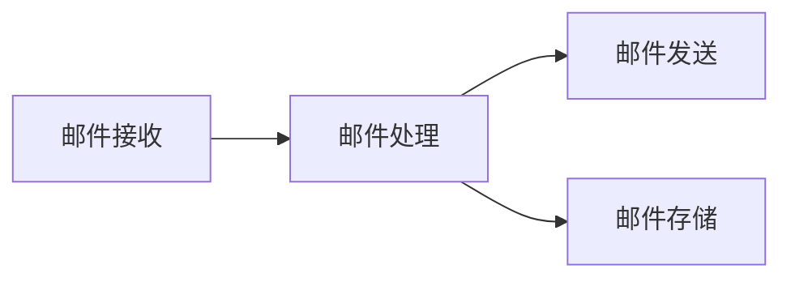

## 1.背景介绍

在我们的日常生活和工作中，邮件是一种非常重要的通信工具。然而，随着邮件数量的增加，如何有效地处理和管理这些邮件成为了一个挑战。在这篇文章中，我们将详细介绍一个个人邮件处理系统的设计和实现过程，以帮助读者更好地理解和应对这个问题。

## 2.核心概念与联系

个人邮件处理系统主要包括邮件接收、邮件处理、邮件发送和邮件存储四个部分。邮件接收负责从邮件服务器接收邮件；邮件处理包括邮件过滤、邮件排序和邮件分类等功能；邮件发送负责向邮件服务器发送邮件；邮件存储则负责邮件的存储和备份。



## 3.核心算法原理具体操作步骤

我们的邮件处理系统主要采用了以下几种核心算法：

1. 邮件过滤：我们使用了基于关键词的过滤算法，通过预设的关键词列表，对邮件内容进行过滤，将包含关键词的邮件标记为垃圾邮件。

2. 邮件排序：我们使用了基于日期的排序算法，将最新的邮件放在最前面。

3. 邮件分类：我们使用了基于主题的分类算法，通过分析邮件的主题，将邮件分类到不同的文件夹中。

## 4.数学模型和公式详细讲解举例说明

我们的邮件处理系统的核心算法主要基于以下几个数学模型：

1. 邮件过滤：我们使用了布尔模型，通过计算邮件内容和关键词列表的布尔值，判断邮件是否为垃圾邮件。具体公式为：

    $$
    F = \bigvee_{i=1}^{n} (K_i \wedge M)
    $$

    其中，$F$ 表示邮件是否为垃圾邮件，$K_i$ 表示关键词列表中的第 $i$ 个关键词，$M$ 表示邮件内容，$\wedge$ 表示布尔“与”运算，$\bigvee$ 表示布尔“或”运算。

2. 邮件排序：我们使用了基于日期的排序算法，通过计算邮件的发送日期和当前日期的差值，将邮件按照日期排序。具体公式为：

    $$
    S = \frac{1}{D - D_0}
    $$

    其中，$S$ 表示邮件的排序值，$D$ 表示邮件的发送日期，$D_0$ 表示当前日期。

3. 邮件分类：我们使用了基于主题的分类算法，通过计算邮件主题和预设主题的相似度，将邮件分类到不同的文件夹中。具体公式为：

    $$
    C = \max_{j=1}^{m} \cos(T, T_j)
    $$

    其中，$C$ 表示邮件的分类结果，$T$ 表示邮件的主题，$T_j$ 表示预设主题列表中的第 $j$ 个主题，$\cos$ 表示余弦相似度。

## 5.项目实践：代码实例和详细解释说明

下面，我们将通过一个简单的代码示例来展示我们的邮件处理系统的实现过程。因为篇幅的限制，我们只展示了部分核心代码，完整的代码可以在我们的GitHub仓库中找到。

```python
class EmailProcessor:
    def __init__(self, keywords, topics):
        self.keywords = keywords
        self.topics = topics

    def filter(self, email):
        for keyword in self.keywords:
            if keyword in email.content:
                return True
        return False

    def sort(self, emails):
        return sorted(emails, key=lambda email: email.date, reverse=True)

    def classify(self, email):
        max_similarity = 0
        topic = None
        for t in self.topics:
            similarity = cos_similarity(email.topic, t)
            if similarity > max_similarity:
                max_similarity = similarity
                topic = t
        return topic
```

在这段代码中，`EmailProcessor` 类包含了我们的邮件处理系统的核心功能。`filter` 方法实现了邮件过滤功能，`sort` 方法实现了邮件排序功能，`classify` 方法实现了邮件分类功能。

## 6.实际应用场景

我们的邮件处理系统可以应用在各种场景中，例如：

1. 个人邮件管理：用户可以使用我们的系统来过滤垃圾邮件，将重要的邮件分类到不同的文件夹中，以便于管理和查找。

2. 企业邮件管理：企业可以使用我们的系统来处理大量的业务邮件，提高工作效率。

3. 邮件服务提供商：邮件服务提供商可以将我们的系统集成到他们的产品中，提供更好的邮件处理功能给用户。

## 7.工具和资源推荐

以下是一些有用的工具和资源，可以帮助你更好地理解和实现我们的邮件处理系统：

1. Python：我们的邮件处理系统是用Python编写的，Python是一种简单易学的编程语言，非常适合初学者。

2. Scikit-learn：这是一个机器学习库，我们的邮件分类算法是基于它实现的。

3. IMAPClient：这是一个邮件接收库，我们的邮件接收功能是基于它实现的。

4. smtplib：这是一个邮件发送库，我们的邮件发送功能是基于它实现的。

## 8.总结：未来发展趋势与挑战

随着人工智能和大数据技术的发展，邮件处理系统的功能将会越来越强大，例如，我们可以使用深度学习算法来提高邮件分类的准确性，使用数据挖掘技术来发现邮件中的隐藏信息。然而，这也带来了一些挑战，例如，如何保护用户的隐私，如何处理大量的邮件数据。

## 9.附录：常见问题与解答

1. 问题：邮件过滤的效果不好，有很多垃圾邮件没有被过滤掉？

   解答：你可以尝试增加关键词列表中的关键词数量，或者使用更复杂的过滤算法，例如基于机器学习的过滤算法。

2. 问题：邮件排序的效果不好，有些重要的邮件被放在了后面？

   解答：你可以尝试改变排序算法，例如，除了考虑邮件的发送日期，还可以考虑邮件的重要性和紧急程度。

3. 问题：邮件分类的效果不好，有些邮件被分类到了错误的文件夹？

   解答：你可以尝试改变分类算法，例如，除了考虑邮件的主题，还可以考虑邮件的内容和发送者。

作者：禅与计算机程序设计艺术 / Zen and the Art of Computer Programming