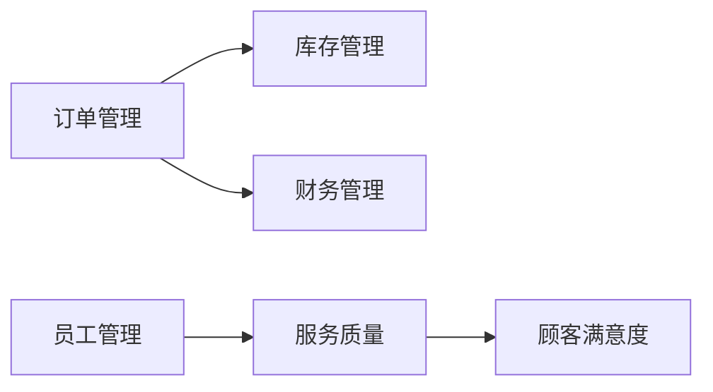

## 1.背景介绍

在当今社会，随着科技的快速发展，人们的生活节奏加快，对餐饮业的需求也日益增长。餐饮业作为服务业的重要组成部分，其管理模式的改进和升级已经成为了行业发展的必然趋势。特别是对于中小型饭店来说，一个有效的餐饮管理系统能够提高工作效率，减少人力资源的浪费，优化服务流程，提升顾客满意度，从而提高经营效益。

## 2.核心概念与联系

餐饮管理系统是一种信息化的管理工具，主要由订单管理、库存管理、员工管理、财务管理、顾客管理等模块组成。这些模块之间的联系紧密，相互影响。例如，订单管理模块会影响库存管理和财务管理，员工管理会影响服务质量和顾客满意度等。



## 3.核心算法原理具体操作步骤

餐饮管理系统的核心算法主要包括订单处理算法、库存管理算法、员工排班算法等。这些算法的实现都需要依赖数据库的支持，通过对数据库的查询、插入、删除、修改等操作来实现。

1. 订单处理算法：当顾客下单时，系统首先需要查询库存，如果库存充足，则生成订单，同时更新库存；如果库存不足，则提示顾客更换菜品或等待。
2. 库存管理算法：系统需要定时查询库存，如果某一菜品的库存低于设定的阈值，则自动向供应商下单，补充库存。
3. 员工排班算法：根据员工的工作时间和餐厅的营业时间，合理安排员工的工作班次，以保证餐厅的正常运营。

## 4.数学模型和公式详细讲解举例说明

在餐饮管理系统中，我们可以利用数学模型来优化库存管理和员工排班。例如，库存管理可以使用EOQ模型（经济订单量模型）来确定最佳的订货量，公式如下：

$$
Q = \sqrt{\frac{2DS}{H}}
$$

其中，$Q$表示最佳订货量，$D$表示年需求量，$S$表示每次订货的固定成本，$H$表示每单位产品的持有成本。

在员工排班方面，我们可以使用线性规划模型来优化员工的工作时间和休息时间，以达到最佳的工作效率。

## 5.项目实践：代码实例和详细解释说明

在实际项目中，我们可以使用Python的Django框架来实现餐饮管理系统。以下是一些主要功能的代码实例。

```python
# 订单处理
def handle_order(order):
    for item in order.items:
        product = Product.objects.get(id=item.product_id)
        if product.stock < item.quantity:
            raise Exception('库存不足')
        else:
            product.stock -= item.quantity
            product.save()
    order.status = '已处理'
    order.save()

# 库存管理
def check_stock():
    products = Product.objects.all()
    for product in products:
        if product.stock < product.reorder_point:
            create_purchase_order(product)

# 员工排班
def schedule_staff():
    staffs = Staff.objects.all()
    shifts = Shift.objects.all()
    for staff in staffs:
        shift = shifts[staff.id % len(shifts)]
        staff.shift = shift
        staff.save()
```

这些代码分别实现了订单处理、库存管理和员工排班的功能。在实际项目中，还需要考虑更多的细节，例如错误处理、事务管理等。

## 6.实际应用场景

餐饮管理系统可以广泛应用于各种中小型餐厅，例如快餐店、小吃店、餐饮连锁店等。通过实施餐饮管理系统，餐厅可以实现自动化、信息化的管理，提高工作效率，降低运营成本，提升顾客满意度。

## 7.工具和资源推荐

在实现餐饮管理系统时，我们推荐使用以下工具和资源：

1. Django：一个强大的Python Web开发框架，可以快速开发高质量的Web应用。
2. MySQL：一个开源的关系型数据库，适合处理大量的数据。
3. Bootstrap：一个前端开发框架，可以快速开发美观的界面。
4. Git：一个版本控制系统，可以方便的管理代码版本和协作开发。

## 8.总结：未来发展趋势与挑战

随着科技的发展，餐饮管理系统将会越来越智能化，例如通过AI技术预测菜品的需求，自动调整库存和员工排班；通过大数据分析优化菜单，提升顾客满意度；通过云计算实现多店铺的统一管理等。同时，餐饮管理系统也面临着一些挑战，例如如何保护顾客的隐私，如何应对网络安全的威胁等。

## 9.附录：常见问题与解答

1. Q：餐饮管理系统如何处理高峰期的订单？
   A：餐饮管理系统可以通过预测技术预测高峰期的需求，提前准备库存和员工，以应对高峰期的订单。

2. Q：餐饮管理系统如何保证数据的安全？
   A：餐饮管理系统应该采取一系列的安全措施，例如数据加密、备份、防火墙等，来保证数据的安全。

作者：禅与计算机程序设计艺术 / Zen and the Art of Computer Programming