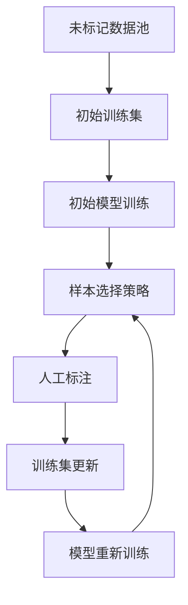

# 主动学习:让机器学习模型主动寻求最有价值的样本

## 1.背景介绍

在传统的机器学习过程中,我们通常需要收集大量的标记数据来训练模型。然而,获取高质量的标记数据往往是一项昂贵且耗时的工作。主动学习(Active Learning)作为一种有效的解决方案,可以显著减少标记数据的需求,从而降低成本和工作量。

主动学习的核心思想是让机器学习模型能够主动选择最有价值的未标记数据样本,并请求人工标注。通过迭代地选择最具信息量的样本进行标注和训练,模型可以在有限的标记数据下达到较高的性能。这种策略不仅节省了标注成本,还可以提高模型的泛化能力。

### 1.1 主动学习的优势

- **减少标注成本**: 主动学习可以显著降低获取标记数据所需的人力和时间成本。
- **提高数据效率**: 通过选择最有价值的样本,主动学习可以最大限度地利用有限的标记数据。
- **提高模型性能**: 由于训练数据的质量更高,主动学习往往可以获得比传统方法更好的模型性能。
- **适用于各种机器学习任务**: 主动学习可以应用于分类、回归、聚类等多种机器学习任务。

### 1.2 主动学习的挑战

- **样本选择策略**: 如何定义和量化样本的"价值",并设计有效的选择策略,是主动学习中的一个关键挑战。
- **探索与利用权衡**: 主动学习需要在探索未知区域(获取新信息)和利用已知信息(提高当前模型)之间寻求平衡。
- **计算复杂度**: 在大规模数据集上,评估每个样本的价值可能会带来高昂的计算开销。
- **噪声和异常值**: 主动学习对噪声和异常值更加敏感,需要设计鲁棒的策略来处理这些情况。

## 2.核心概念与联系

### 2.1 主动学习的基本流程

主动学习的基本流程如下:

1. **初始训练集**: 从未标记数据池中选择一小部分样本,并由人工标注,构建初始训练集。
2. **模型训练**: 使用初始训练集训练一个初始机器学习模型。
3. **样本选择**: 根据某种策略,从未标记数据池中选择一批最有价值的样本。
4. **人工标注**: 将选择的样本提交给人工标注。
5. **模型更新**: 使用新标记的样本更新训练集,重新训练模型。
6. **迭代**: 重复步骤3-5,直到达到预期的模型性能或耗尽标注预算。

### 2.2 样本选择策略

样本选择策略是主动学习中最关键的部分,决定了选择哪些样本进行标注。常见的策略包括:

1. **不确定性采样(Uncertainty Sampling)**: 选择模型预测最不确定的样本,如分类任务中概率值接近0.5的样本。
2. **查询策略(Query Strategies)**: 根据模型的输出和预测置信度,设计特定的查询策略来选择样本。
3. **密度加权(Density-Weighted)**: 结合样本的不确定性和数据分布密度,倾向于选择密集区域中的不确定样本。
4. **版本空间(Version Space)**: 选择能最大程度缩小版本空间(一组与训练数据一致的假设)的样本。
5. **期望模型变化(Expected Model Change)**: 选择能最大化模型参数变化或最小化期望误差的样本。

### 2.3 探索与利用权衡

主动学习需要在探索未知区域(获取新信息)和利用已知信息(提高当前模型)之间寻求平衡。这种权衡通常被称为"探索-利用困境"(Exploration-Exploitation Dilemma)。

- **探索**: 选择位于决策边界附近或高密度区域的样本,以获取新的信息和发现未知的模式。
- **利用**: 选择模型已经熟悉但仍存在一些不确定性的样本,以提高当前模型的性能。

平衡探索和利用的策略包括:

- **ε-贪婪(ε-Greedy)**: 以ε的概率随机探索,以(1-ε)的概率利用当前最优策略。
- **软max(Softmax)**: 根据样本的不确定性分数,使用软最大值函数来平衡探索和利用。
- **上下确信界(Upper Confidence Bound)**: 结合样本的不确定性和潜在回报,选择具有最高上确信界的样本。

## 3.核心算法原理具体操作步骤

### 3.1 不确定性采样(Uncertainty Sampling)

不确定性采样是最直观和常用的主动学习策略之一。其基本思想是选择模型预测最不确定的样本进行标注,从而最大化获取新信息的潜力。

对于二分类问题,可以使用以下策略:

1. **最小置信度(Least Confident)**: 选择模型预测概率最接近0.5的样本。
2. **最小边际(Smallest Margin)**: 选择正负类别概率差值最小的样本。

对于多分类问题,可以使用以下策略:

3. **最小置信度(Least Confident)**: 选择模型预测概率最小的样本。
4. **熵(Entropy)**: 选择预测概率分布的熵最大的样本。

算法步骤:

1. 初始化训练集 $D_l$ 和未标记数据池 $D_u$。
2. 在 $D_l$ 上训练初始模型 $f$。
3. 对于每个样本 $x \in D_u$,计算不确定性分数 $s(x)$。
4. 选择具有最高不确定性分数的样本子集 $S \subseteq D_u$。
5. 将 $S$ 提交给人工标注,得到标记样本集 $S_l$。
6. 更新训练集 $D_l = D_l \cup S_l$,更新未标记数据池 $D_u = D_u \setminus S_l$。
7. 在新的训练集 $D_l$ 上重新训练模型 $f$。
8. 重复步骤3-7,直到达到预期性能或耗尽标注预算。

### 3.2 查询策略(Query Strategies)

查询策略是一种更加灵活和通用的主动学习方法,它根据模型的输出和预测置信度,设计特定的查询函数来选择样本。常见的查询策略包括:

1. **最小期望熵(Minimum Expected Entropy)**: 选择能最小化预测熵的样本。
2. **最大期望误差(Maximum Expected Error)**: 选择预测误差期望值最大的样本。
3. **最佳vs次佳(Best vs Second Best)**: 选择最佳类别概率与次佳类别概率差值最小的样本。
4. **最大期望模型变化(Maximum Expected Model Change)**: 选择能最大化模型参数变化的样本。

算法步骤:

1. 初始化训练集 $D_l$ 和未标记数据池 $D_u$。
2. 在 $D_l$ 上训练初始模型 $f$。
3. 对于每个样本 $x \in D_u$,计算查询函数值 $q(x)$。
4. 选择具有最大查询函数值的样本子集 $S \subseteq D_u$。
5. 将 $S$ 提交给人工标注,得到标记样本集 $S_l$。
6. 更新训练集 $D_l = D_l \cup S_l$,更新未标记数据池 $D_u = D_u \setminus S_l$。
7. 在新的训练集 $D_l$ 上重新训练模型 $f$。
8. 重复步骤3-7,直到达到预期性能或耗尽标注预算。

### 3.3 密度加权策略(Density-Weighted Strategies)

密度加权策略不仅考虑样本的不确定性,还结合了数据分布的密度信息。这种策略倾向于选择位于高密度区域的不确定样本,从而获取对整个数据分布更有代表性的信息。

常见的密度加权策略包括:

1. **密度加权不确定性(Density-Weighted Uncertainty)**: 将不确定性分数乘以样本密度,选择加权分数最高的样本。
2. **密度加权查询策略(Density-Weighted Query Strategy)**: 将查询函数值乘以样本密度,选择加权分数最高的样本。

算法步骤:

1. 初始化训练集 $D_l$ 和未标记数据池 $D_u$。
2. 在 $D_l$ 上训练初始模型 $f$。
3. 对于每个样本 $x \in D_u$,计算不确定性分数或查询函数值 $s(x)$。
4. 估计每个样本的密度值 $p(x)$,通常使用核密度估计或最近邻方法。
5. 计算加权分数 $w(x) = s(x) \cdot p(x)$。
6. 选择具有最大加权分数的样本子集 $S \subseteq D_u$。
7. 将 $S$ 提交给人工标注,得到标记样本集 $S_l$。
8. 更新训练集 $D_l = D_l \cup S_l$,更新未标记数据池 $D_u = D_u \setminus S_l$。
9. 在新的训练集 $D_l$ 上重新训练模型 $f$。
10. 重复步骤3-9,直到达到预期性能或耗尽标注预算。

### 3.4 版本空间策略(Version Space Strategies)

版本空间策略基于一个版本空间(Version Space)的概念,即一组与当前训练数据一致的假设或模型。该策略旨在选择能最大程度缩小版本空间的样本,从而更快地收敛到正确的假设。

常见的版本空间策略包括:

1. **简单版本空间(Simple Version Space)**: 选择能最大化与当前版本空间不一致的样本。
2. **稳健版本空间(Robust Version Space)**: 选择能最大化与当前版本空间和邻近版本空间不一致的样本。

算法步骤:

1. 初始化训练集 $D_l$ 和未标记数据池 $D_u$。
2. 在 $D_l$ 上训练初始模型 $f$,并计算初始版本空间 $V_0$。
3. 对于每个样本 $x \in D_u$,计算与当前版本空间不一致的程度 $d(x, V_t)$。
4. 选择具有最大不一致程度的样本子集 $S \subseteq D_u$。
5. 将 $S$ 提交给人工标注,得到标记样本集 $S_l$。
6. 更新训练集 $D_l = D_l \cup S_l$,更新未标记数据池 $D_u = D_u \setminus S_l$。
7. 在新的训练集 $D_l$ 上重新训练模型 $f$,并计算新的版本空间 $V_{t+1}$。
8. 重复步骤3-7,直到达到预期性能或耗尽标注预算。

## 4.数学模型和公式详细讲解举例说明

### 4.1 不确定性采样的数学模型

对于二分类问题,我们可以使用以下不确定性度量:

1. **最小置信度(Least Confident)**:

$$
s_{LC}(x) = 1 - \max_{y \in \{0, 1\}} P(y|x; \theta)
$$

其中 $P(y|x; \theta)$ 表示模型在参数 $\theta$ 下,对于输入 $x$ 预测标签 $y$ 的概率。该度量选择模型预测概率最小(最不确定)的样本。

2. **最小边际(Smallest Margin)**:

$$
s_{SM}(x) = |P(y=1|x; \theta) - P(y=0|x; \theta)|
$$

该度量选择正负类别概率差值最小(最不确定)的样本。

对于多分类问题,我们可以使用以下不确定性度量:

3. **最小置信度(Least Confident)**:

$$
s_{LC}(x) = 1 - \max_{y \in \mathcal{Y}} P(y|x; \theta)
$$

其中 $\