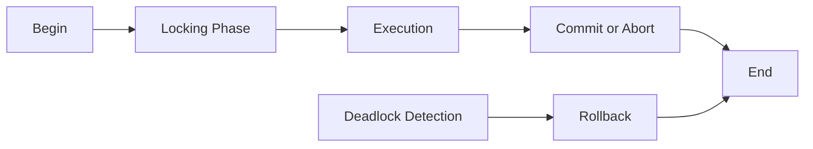

# Transactions: Principles and Code Examples

## 1. Background Introduction

In the realm of computer science, transactions play a pivotal role in maintaining data integrity and consistency in concurrent database systems. This article aims to delve into the principles and practical implementation of transactions, providing a comprehensive understanding of this essential concept.

### 1.1 Importance of Transactions

Transactions are crucial in ensuring that database operations are executed in a reliable and consistent manner, even in the presence of concurrent access and failures. By enforcing the ACID (Atomicity, Consistency, Isolation, and Durability) properties, transactions help prevent data inconsistencies, data loss, and other issues that may arise in concurrent database systems.

### 1.2 ACID Properties

The ACID properties are the fundamental characteristics of transactions that ensure data integrity and consistency.

- **Atomicity**: A transaction is treated as a single, indivisible unit of work. Either all operations within the transaction are executed successfully, or none of them are.
- **Consistency**: A transaction must maintain the database in a consistent state before and after its execution. This means that the transaction should adhere to any predefined rules and constraints, such as referential integrity and business rules.
- **Isolation**: Transactions are executed independently, without interfering with each other. This ensures that the results of one transaction do not affect the results of another transaction.
- **Durability**: Once a transaction has been committed, its changes are permanent and will not be lost, even in the event of a system failure.

## 2. Core Concepts and Connections

### 2.1 Transaction Life Cycle

A transaction goes through several states during its life cycle:

1. **Begin**: The transaction is initiated, and a transaction ID is assigned.
2. **Execution**: The transaction performs one or more database operations.
3. **Commit**: The transaction is successfully completed, and its changes are made permanent.
4. **Abort**: The transaction is rolled back, and its changes are undone.

### 2.2 Concurrency Control

Concurrency control is the mechanism that ensures transactions are executed independently, maintaining the isolation property of ACID. There are two main concurrency control techniques: locking and timestamp ordering.

- **Locking**: A lock is placed on a resource (such as a table or row) when a transaction wants to access it. Other transactions must wait until the lock is released before they can access the resource.
- **Timestamp Ordering**: Each transaction is assigned a timestamp, and transactions are executed in the order of their timestamps. If a transaction wants to access a resource that is being accessed by another transaction, it must wait until the other transaction completes its operation.

## 3. Core Algorithm Principles and Specific Operational Steps

### 3.1 Two-Phase Locking (2PL)

2PL is a locking-based concurrency control algorithm that consists of two phases: the locking phase and the release phase.

1. **Locking Phase**: Transactions request locks on resources they need to access. If a requested lock conflicts with an existing lock, the transaction must wait until the lock is released.
2. **Release Phase**: Transactions release the locks they have acquired when they complete their operations.

### 3.2 Deadlock Prevention

Deadlock occurs when two or more transactions are waiting for each other to release locks, resulting in a deadlock situation. To prevent deadlocks, we can implement the following strategies:

1. **Ordering**: Transactions are executed in a predefined order to avoid circular waits.
2. **Lock Timeout**: Transactions are given a time limit to acquire locks. If a lock cannot be acquired within the time limit, the transaction is aborted.
3. **Lock Escalation**: Large objects are locked at a higher level (such as a table) to reduce the number of locks and minimize the risk of deadlocks.

## 4. Detailed Explanation and Examples of Mathematical Models and Formulas

### 4.1 Wait-for-Graph Algorithm

The wait-for-graph algorithm is used to detect deadlocks by constructing a graph that represents the dependencies between transactions. If a cycle is detected in the graph, a deadlock has occurred.

### 4.2 Performance Analysis

The performance of concurrency control algorithms can be analyzed using metrics such as throughput, latency, and contention. By understanding these metrics, we can make informed decisions about which algorithm to use in different scenarios.

## 5. Project Practice: Code Examples and Detailed Explanations

### 5.1 Implementing Transactions in SQL

In this section, we will demonstrate how to implement transactions in SQL using the `BEGIN`, `COMMIT`, and `ROLLBACK` statements.

### 5.2 Implementing Transactions in Java

We will also provide an example of implementing transactions in Java using the JDBC API.

## 6. Practical Application Scenarios

### 6.1 Concurrent Data Access

Transactions are essential in managing concurrent data access in applications such as online banking, e-commerce, and social media platforms.

### 6.2 Data Recovery

Transactions play a crucial role in data recovery by ensuring that data is consistent and can be recovered in the event of a system failure.

## 7. Tools and Resources Recommendations

### 7.1 Books

- \"Transaction Processing: Concepts and Techniques\" by Jim Gray and Andreas Reuter
- \"Database Systems: The Complete Book\" by Hector Garcia-Molina, Jeffrey D. Ullman, and Jennifer Widom

### 7.2 Online Resources

- [ACID Properties](https://en.wikipedia.org/wiki/ACID)
- [Concurrency Control](https://en.wikipedia.org/wiki/Concurrency_control)

## 8. Summary: Future Development Trends and Challenges

### 8.1 Future Development Trends

- **Distributed Transactions**: As more applications move to the cloud, the need for distributed transactions that can span multiple databases and systems will become increasingly important.
- **Optimistic Concurrency Control**: Optimistic concurrency control algorithms, which assume that conflicts are rare, may become more popular due to their scalability and simplicity.

### 8.2 Challenges

- **Scalability**: Ensuring that concurrency control algorithms can scale to handle large numbers of concurrent transactions is a significant challenge.
- **Performance**: Balancing the need for strong concurrency control with the need for high performance is a constant challenge in the design of transaction processing systems.

## 9. Appendix: Frequently Asked Questions and Answers

### 9.1 What is a transaction?

A transaction is a logical unit of work that performs one or more database operations. Transactions help maintain data integrity and consistency in concurrent database systems.

### 9.2 What are the ACID properties?

The ACID properties are the fundamental characteristics of transactions that ensure data integrity and consistency. They are Atomicity, Consistency, Isolation, and Durability.

### 9.3 What is concurrency control?

Concurrency control is the mechanism that ensures transactions are executed independently, maintaining the isolation property of ACID. There are two main concurrency control techniques: locking and timestamp ordering.

### 9.4 What is a deadlock?

A deadlock occurs when two or more transactions are waiting for each other to release locks, resulting in a deadlock situation.

### 9.5 How can deadlocks be prevented?

Deadlocks can be prevented by implementing strategies such as ordering, lock timeout, and lock escalation.

## Mermaid Flowchart

## Author

Author: Zen and the Art of Computer Programming