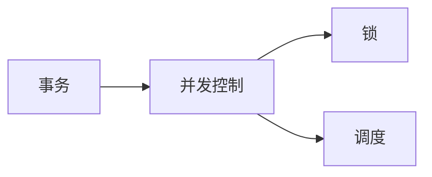

## 1.背景介绍

在数据库系统中，事务管理是一个核心的部分，主要负责确保数据的一致性和完整性。为了实现这个目标，数据库系统必须能够管理多个并发执行的事务，这就涉及到了并发控制技术。

并发控制技术是一种策略，用于管理在数据库中同时发生的多个事务，以防止它们相互干扰，导致数据不一致。这种技术的主要目标是确保事务的隔离性，即使在并发执行的情况下，每个事务也应该感觉到它是在单独执行。

## 2.核心概念与联系

并发控制主要涉及到以下几个核心概念：

- **事务**：一个事务是一个执行单元，它包含一系列的数据库操作（如插入、更新或删除）。事务应该具有ACID特性，即原子性、一致性、隔离性和持久性。
- **并发控制**：并发控制是一种策略，用于管理在数据库中同时发生的多个事务，以防止它们相互干扰，导致数据不一致。
- **锁**：锁是一种机制，用于控制对数据库对象的访问。根据需要，锁可以应用于一个数据项，一组数据项，或整个数据库。
- **调度**：调度是一个过程，它决定了事务的执行顺序。一个好的调度应该能够保证事务的隔离性，同时优化系统的性能。

这些概念之间的关系可以用以下的Mermaid流程图来表示：



## 3.核心算法原理具体操作步骤

并发控制的核心是锁定协议和调度算法。以下是这两种方法的基本步骤：

### 3.1 锁定协议

1. **请求锁**：当一个事务需要访问一个数据项时，它必须首先请求一个锁。如果该数据项已经被另一个事务锁定，那么请求的事务必须等待。
2. **持有锁**：一旦一个事务获得了一个锁，它就可以对相应的数据项进行操作。
3. **释放锁**：当一个事务完成了对一个数据项的操作，它应该立即释放该数据项的锁，以便其他事务可以访问。

### 3.2 调度算法

1. **选择事务**：调度器选择一个事务进行执行。选择的标准可以根据优先级，到达时间，或其他因素来确定。
2. **执行操作**：选定的事务执行其下一个操作。如果该操作需要访问一个被锁定的数据项，那么该事务必须等待。
3. **提交或回滚**：当一个事务完成了所有的操作，它可以提交，以使其对数据库的更改成为永久的。如果事务在执行过程中遇到错误，它可以回滚，以撤销其对数据库的更改。

## 4.数学模型和公式详细讲解举例说明

在并发控制中，我们通常使用以下的数学模型来描述和分析系统的性能：

- **吞吐量**：吞吐量是系统在单位时间内可以完成的事务数量。它可以用以下的公式来计算：

$$
吞吐量 = \frac{完成的事务数量}{时间}
$$

- **响应时间**：响应时间是一个事务从开始到完成所需要的时间。它可以用以下的公式来计算：

$$
响应时间 = \frac{总的等待时间 + 总的服务时间}{完成的事务数量}
$$

- **资源利用率**：资源利用率是系统资源被有效使用的比例。它可以用以下的公式来计算：

$$
资源利用率 = \frac{总的服务时间}{总的服务时间 + 总的等待时间}
$$

举个例子，假设我们有一个系统，每秒可以完成10个事务，每个事务的平均响应时间是0.1秒，那么该系统的吞吐量是10，响应时间是0.1秒，资源利用率是100%。

## 5.项目实践：代码实例和详细解释说明

以下是一个简单的并发控制的代码示例，使用Python编写：

```python
import threading

# 全局锁对象
lock = threading.Lock()

def transaction(id, operation):
    # 请求锁
    lock.acquire()
    try:
        # 执行操作
        print(f"Transaction {id} is {operation}.")
    finally:
        # 释放锁
        lock.release()

# 创建并启动多个事务
for i in range(10):
    threading.Thread(target=transaction, args=(i, "running")).start()
```

在这个代码中，我们创建了一个全局的锁对象，每个事务在执行操作之前都需要请求这个锁。如果锁已经被其他事务持有，那么该事务必须等待。当事务完成操作后，它会立即释放锁，以便其他事务可以获取。

## 6.实际应用场景

并发控制技术在许多实际应用中都有广泛的使用，例如：

- **在线银行系统**：在在线银行系统中，可能有多个用户同时访问和修改同一个账户的余额。为了保证数据的一致性，系统必须使用并发控制技术来管理这些并发的事务。

- **电子商务网站**：在电子商务网站中，可能有多个用户同时购买同一个商品。为了防止超卖的问题，系统必须使用并发控制技术来管理这些并发的订单处理事务。

- **航班预订系统**：在航班预订系统中，可能有多个用户同时预订同一个航班的座位。为了防止超售的问题，系统必须使用并发控制技术来管理这些并发的预订事务。

## 7.工具和资源推荐

以下是一些有关并发控制的工具和资源，可以帮助你更好地理解和应用这个技术：

- **数据库管理系统**：如MySQL，Oracle，SQL Server等，它们都提供了并发控制的功能，可以帮助你在实际的项目中应用这个技术。
- **教科书**：如《数据库系统概念》等，它们提供了详细的并发控制的理论知识和实例。
- **在线课程**：如Coursera，edX等，它们提供了许多关于数据库和并发控制的在线课程。

## 8.总结：未来发展趋势与挑战

随着云计算和大数据技术的发展，数据库系统需要处理越来越大的数据量和越来越高的并发请求。这就对并发控制技术提出了更高的要求。未来的并发控制技术需要能够支持分布式和并行处理，以提高系统的吞吐量和响应时间。

然而，实现高效的并发控制并不容易。它需要解决许多挑战，例如死锁，饥饿，以及数据一致性和性能之间的权衡等。因此，未来的并发控制技术需要更聪明的锁定协议和调度算法，以及更强大的硬件支持。

## 9.附录：常见问题与解答

1. **什么是并发控制？**
并发控制是一种策略，用于管理在数据库中同时发生的多个事务，以防止它们相互干扰，导致数据不一致。

2. **为什么需要并发控制？**
在数据库系统中，可能有多个事务同时访问和修改同一个数据项。如果没有并发控制，这些事务可能会相互干扰，导致数据不一致。

3. **如何实现并发控制？**
并发控制主要通过锁定协议和调度算法来实现。锁定协议用于控制对数据项的访问，调度算法用于决定事务的执行顺序。

4. **并发控制有哪些挑战？**
并发控制需要解决许多挑战，例如死锁，饥饿，以及数据一致性和性能之间的权衡等。

5. **并发控制有哪些应用？**
并发控制在许多实际应用中都有广泛的使用，例如在线银行系统，电子商务网站，航班预订系统等。

作者：禅与计算机程序设计艺术 / Zen and the Art of Computer Programming