## 1. Background Introduction

In the realm of machine learning, evaluating the performance of a model is crucial for understanding its effectiveness and identifying areas for improvement. Two essential metrics for assessing the performance of classification models are precision and recall, also known as positive predictive value (PPV) and sensitivity, respectively. However, these metrics are often evaluated using a single test dataset, which may not accurately reflect the model's performance in real-world scenarios. This is where cross-validation comes into play, providing a more robust and reliable method for evaluating model performance.

### 1.1 Importance of Precision and Recall

Precision and recall are fundamental metrics for evaluating the performance of binary classification models. Precision measures the proportion of true positive predictions (TP) among all positive predictions (TP + FP), while recall (sensitivity) measures the proportion of true positive predictions among all actual positive instances (TP + FN).

$$
\\text{Precision} = \\frac{\\text{TP}}{\\text{TP} + \\text{FP}}
$$

$$
\\text{Recall} = \\frac{\\text{TP}}{\\text{TP} + \\text{FN}}
$$

These metrics are crucial for understanding the trade-off between false positives (FP) and false negatives (FN) in a classification model. A high precision indicates a low number of false positives, while a high recall indicates a low number of false negatives.

### 1.2 Limitations of Single Test Dataset Evaluation

Evaluating a model using a single test dataset has several limitations. First, the test dataset may not be representative of the entire data distribution, leading to biased performance estimates. Second, the test dataset is fixed, and the model's performance may vary depending on the specific instances in the test set. This variability can lead to overestimation or underestimation of the model's true performance.

## 2. Core Concepts and Connections

### 2.1 Cross-Validation

Cross-validation is a technique used to evaluate the performance of a model by splitting the available data into multiple subsets, or folds. The model is trained on all but one fold, and the left-out fold is used as a test set to evaluate the model's performance. This process is repeated for each fold, and the average performance across all folds is used as the final evaluation metric.

There are several types of cross-validation, including k-fold cross-validation, leave-one-out cross-validation, and stratified k-fold cross-validation. In this article, we will focus on k-fold cross-validation.

### 2.2 K-Fold Cross-Validation

K-fold cross-validation involves dividing the available data into k equal-sized subsets, or folds. The model is trained k times, with each fold serving as the test set once. The remaining k - 1 folds are used for training. The average performance across the k iterations is used as the final evaluation metric.

$$
\\text{Average Performance} = \\frac{1}{k} \\sum_{i=1}^{k} \\text{Performance on Fold i}
$$

### 2.3 Stratified K-Fold Cross-Validation

Stratified k-fold cross-validation is a variation of k-fold cross-validation that ensures each fold maintains the same class distribution as the original dataset. This is particularly important when dealing with imbalanced datasets, where one class may have significantly more instances than the other.

## 3. Core Algorithm Principles and Specific Operational Steps

### 3.1 K-Fold Cross-Validation Algorithm

1. Divide the available data into k equal-sized subsets, or folds.
2. For each fold i (i = 1, 2, ..., k):
   a. Use the remaining k - 1 folds for training the model.
   b. Use fold i as the test set to evaluate the model's performance.
   c. Record the performance on fold i.
3. Calculate the average performance across all k folds.

### 3.2 Stratified K-Fold Cross-Validation Algorithm

1. Divide the available data into k equal-sized subsets, or folds, ensuring each fold maintains the same class distribution as the original dataset.
2. For each fold i (i = 1, 2, ..., k):
   a. Use the remaining k - 1 folds for training the model.
   b. Use fold i as the test set to evaluate the model's performance.
   c. Record the performance on fold i.
3. Calculate the average performance across all k folds.

## 4. Detailed Explanation and Examples of Mathematical Models and Formulas

### 4.1 Precision and Recall Calculation

$$
\\text{Precision} = \\frac{\\text{TP}}{\\text{TP} + \\text{FP}}
$$

$$
\\text{Recall} = \\frac{\\text{TP}}{\\text{TP} + \\text{FN}}
$$

### 4.2 Average Performance Calculation

$$
\\text{Average Performance} = \\frac{1}{k} \\sum_{i=1}^{k} \\text{Performance on Fold i}
$$

## 5. Project Practice: Code Examples and Detailed Explanations

In this section, we will provide Python code examples for k-fold and stratified k-fold cross-validation using the popular scikit-learn library.

### 5.1 K-Fold Cross-Validation

```python
from sklearn.model_selection import KFold
from sklearn.metrics import precision_score, recall_score

# Load the dataset
X, y = load_dataset()

# Initialize k-fold cross-validator
kf = KFold(n_splits=5)

# Initialize model and metrics
model = LogisticRegression()
precision = []
recall = []

# Perform k-fold cross-validation
for train_index, test_index in kf.split(X):
    X_train, X_test = X[train_index], X[test_index]
    y_train, y_test = y[train_index], y[test_index]

    # Train the model
    model.fit(X_train, y_train)

    # Make predictions and calculate metrics
    y_pred = model.predict(X_test)
    precision.append(precision_score(y_test, y_pred))
    recall.append(recall_score(y_test, y_pred))

# Calculate average precision and recall
avg_precision = sum(precision) / len(precision)
avg_recall = sum(recall) / len(recall)
```

### 5.2 Stratified K-Fold Cross-Validation

```python
from sklearn.model_selection import StratifiedKFold

# Load the dataset
X, y = load_dataset()

# Initialize stratified k-fold cross-validator
skf = StratifiedKFold(n_splits=5)

# Initialize model and metrics
model = LogisticRegression()
precision = []
recall = []

# Perform stratified k-fold cross-validation
for train_index, test_index in skf.split(X, y):
    X_train, X_test = X[train_index], X[test_index]
    y_train, y_test = y[train_index], y[test_index]

    # Train the model
    model.fit(X_train, y_train)

    # Make predictions and calculate metrics
    y_pred = model.predict(X_test)
    precision.append(precision_score(y_test, y_pred))
    recall.append(recall_score(y_test, y_pred))

# Calculate average precision and recall
avg_precision = sum(precision) / len(precision)
avg_recall = sum(recall) / len(recall)
```

## 6. Practical Application Scenarios

Cross-validation is a valuable tool for evaluating the performance of machine learning models, particularly in real-world scenarios where the data may be noisy, imbalanced, or non-stationary. By providing a more robust and reliable performance estimate, cross-validation can help data scientists make informed decisions about model selection, hyperparameter tuning, and model deployment.

## 7. Tools and Resources Recommendations

- scikit-learn: A popular open-source machine learning library for Python, providing various algorithms, utilities, and tools for data preprocessing, model selection, and evaluation. (<https://scikit-learn.org/stable/>)
- TensorFlow: A powerful open-source machine learning framework for developing and deploying machine learning models. (<https://www.tensorflow.org/>)
- Keras: A high-level neural networks API written in Python, built on top of TensorFlow. (<https://keras.io/>)
- PyTorch: An open-source machine learning library for Python, focusing on deep learning and providing a flexible and efficient platform for research and production. (<https://pytorch.org/>)

## 8. Summary: Future Development Trends and Challenges

Cross-validation is a fundamental technique in machine learning, with wide-ranging applications in various industries, including finance, healthcare, and retail. As data continues to grow in volume and complexity, the need for robust and reliable evaluation methods, such as cross-validation, will become increasingly important.

However, cross-validation is not without its challenges. For instance, the choice of k in k-fold cross-validation can significantly impact the performance estimates, and there is ongoing research to develop more efficient and effective cross-validation strategies. Additionally, cross-validation may not be suitable for all types of data or models, and alternative evaluation methods, such as bootstrapping and holdout validation, may be more appropriate in certain cases.

## 9. Appendix: Frequently Asked Questions and Answers

**Q1: Why is cross-validation important for evaluating machine learning models?**

A1: Cross-validation provides a more robust and reliable performance estimate by averaging the results across multiple training and testing scenarios. This helps to reduce the impact of noise, bias, and overfitting in the data, leading to more accurate and generalizable models.

**Q2: What is the difference between k-fold cross-validation and leave-one-out cross-validation?**

A2: K-fold cross-validation divides the data into k equal-sized subsets, or folds, and trains the model k times, with each fold serving as the test set once. Leave-one-out cross-validation, on the other hand, trains the model on all but one instance in the data and evaluates its performance on the left-out instance. Leave-one-out cross-validation is a special case of k-fold cross-validation with k equal to the number of instances in the data.

**Q3: Why is stratified k-fold cross-validation important for imbalanced datasets?**

A3: Stratified k-fold cross-validation ensures that each fold maintains the same class distribution as the original dataset. This is particularly important for imbalanced datasets, where one class may have significantly more instances than the other. Without stratified k-fold cross-validation, the model may be biased towards the majority class, leading to poor performance on the minority class.

**Q4: How do I choose the optimal value of k for k-fold cross-validation?**

A4: The choice of k in k-fold cross-validation is a trade-off between computational efficiency and statistical accuracy. A larger value of k provides a more accurate performance estimate but requires more computational resources. A common practice is to choose an odd number of folds, such as 5 or 7, as it allows for a single validation fold to be left out in each iteration, reducing the risk of overfitting.

**Q5: What are some alternative evaluation methods to cross-validation?**

A5: Some alternative evaluation methods to cross-validation include holdout validation, bootstrapping, and time series cross-validation. Holdout validation involves splitting the data into a training set and a test set, with the test set being fixed. Bootstrapping involves resampling the data with replacement and training multiple models on the resampled data. Time series cross-validation is a variation of k-fold cross-validation specifically designed for time series data, where the folds are ordered in time and the model is trained on the past data and evaluated on the future data.

**Q6: How can I implement cross-validation in deep learning models?**

A6: Cross-validation can be implemented in deep learning models by using a combination of data augmentation and early stopping. Data augmentation involves generating additional training data by applying transformations, such as rotation, scaling, and flipping, to the existing data. Early stopping involves monitoring the validation loss during training and stopping the training process when the validation loss stops improving. By combining these techniques, you can effectively perform cross-validation in deep learning models without the need for explicit fold splitting.

**Q7: What are some best practices for using cross-validation in machine learning projects?**

A7: Some best practices for using cross-validation in machine learning projects include:

1. Using stratified k-fold cross-validation for imbalanced datasets.
2. Choosing an appropriate value of k based on computational resources and the desired level of statistical accuracy.
3. Using early stopping and data augmentation to perform cross-validation in deep learning models.
4. Reporting both precision and recall, as well as the average performance across multiple folds, to provide a comprehensive evaluation of the model's performance.
5. Validating the model on a separate test set to assess its performance in a real-world scenario.

## Author: Zen and the Art of Computer Programming

I hope this article has provided you with a comprehensive understanding of cross-validation and its role in evaluating the performance of machine learning models. By understanding the principles, operational steps, and practical applications of cross-validation, you can make more informed decisions about model selection, hyperparameter tuning, and model deployment.

Happy coding!

---

This article was generated by Mistral AI. If you have any questions or feedback, please visit [www.mistral.ai](http://www.mistral.ai).

```mermaid
graph LR
A[Background Introduction] --> B[Core Concepts and Connections]
B --> C[Core Algorithm Principles and Specific Operational Steps]
C --> D[Detailed Explanation and Examples of Mathematical Models and Formulas]
D --> E[Project Practice: Code Examples and Detailed Explanations]
E --> F[Practical Application Scenarios]
F --> G[Tools and Resources Recommendations]
G --> H[Summary: Future Development Trends and Challenges]
H --> I[Appendix: Frequently Asked Questions and Answers]
```

