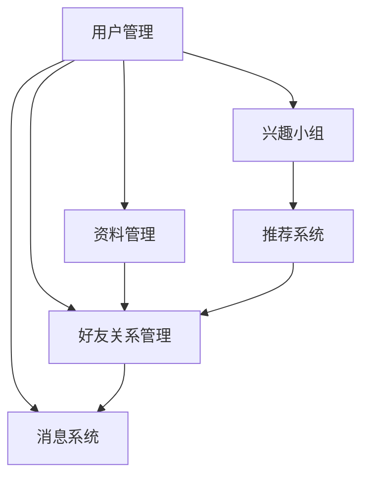

# 交友网站详细设计与具体代码实现

## 1.背景介绍

在当今社会中,人们的生活节奏越来越快,工作压力与生活压力也与日俱增。与此同时,人与人之间的交流和联系也变得越来越少。为了解决这个问题,交友网站应运而生。交友网站为用户提供了一个线上社交平台,让他们能够结识新朋友、分享生活点滴、谈情说爱等。

交友网站的核心功能是为用户提供一个安全、高效的社交环境,帮助他们建立新的社交圈。用户可以创建个人资料,上传照片和视频,查看其他用户的资料,发送好友请求,参与兴趣小组等。良好的用户体验和强大的社交功能是交友网站成功的关键因素。

## 2.核心概念与联系

交友网站涉及多个核心概念,包括用户管理、资料管理、好友关系管理、消息系统、兴趣小组、推荐系统等。这些概念相互关联,共同构建了交友网站的核心功能。

1. **用户管理**:用户是交友网站的核心,用户管理模块负责用户注册、登录、个人资料管理等功能。

2. **资料管理**:资料管理模块允许用户上传和管理个人照片、视频和其他多媒体资源。

3. **好友关系管理**:好友关系是交友网站的核心社交功能,该模块负责处理好友请求、好友列表管理等。

4. **消息系统**:消息系统允许用户实时通信,包括一对一私信和群聊功能。

5. **兴趣小组**:兴趣小组为用户提供一个基于共同爱好的社交圈,用户可以加入感兴趣的小组,与其他成员互动。

6. **推荐系统**:推荐系统根据用户的兴趣爱好、地理位置等信息,为用户推荐潜在的好友和感兴趣的小组。

这些核心概念紧密相连,共同构建了交友网站的完整功能。下面是这些概念之间的关系示意图:



## 3.核心算法原理具体操作步骤

交友网站的核心算法主要包括以下几个方面:

### 3.1 用户相似度计算

为了向用户推荐合适的好友和兴趣小组,交友网站需要计算用户之间的相似度。常用的相似度计算算法包括:

1. **基于内容的相似度计算**:根据用户的个人资料、兴趣爱好等信息,计算用户之间的相似程度。

2. **协同过滤算法**:根据用户之间的行为数据(如好友关系、小组加入情况等),计算用户之间的相似度。

3. **地理位置相似度**:根据用户的地理位置信息,计算用户之间的地理距离,用于推荐附近的好友和活动。

### 3.2 社交关系分析

社交关系分析算法用于挖掘用户之间的社交网络结构,发现潜在的社交圈和影响力用户。常用算法包括:

1. **社区发现算法**:基于图论中的社区发现算法,发现用户网络中的社交社区。

2. **中心性算法**:计算用户在社交网络中的中心性指标,如度中心性、介数中心性等,发现影响力用户。

3. **链路预测算法**:基于用户的社交网络结构,预测潜在的社交关系,为用户推荐新的好友。

### 3.3 推荐算法

推荐算法是交友网站的核心,用于为用户推荐合适的好友、兴趣小组和内容。常用算法包括:

1. **基于内容的推荐**:根据用户的个人资料和兴趣爱好,推荐相似的用户和小组。

2. **协同过滤推荐**:根据用户之间的行为相似度,推荐其他用户感兴趣的内容。

3. **混合推荐**:将基于内容和协同过滤的推荐算法相结合,提高推荐的准确性。

4. **上下文感知推荐**:考虑用户的上下文信息(如地理位置、时间等),提供个性化的推荐结果。

这些算法通常需要大量的用户数据作为输入,并且需要不断优化和调整以提高推荐的准确性和效率。

## 4.数学模型和公式详细讲解举例说明

在交友网站的设计和实现中,数学模型和公式扮演着重要的角色。以下是一些常用的数学模型和公式:

### 4.1 相似度计算

相似度计算是推荐系统和社交关系分析的基础。常用的相似度计算方法包括:

1. **余弦相似度**:

$$\text{sim}(x, y) = \frac{x \cdot y}{\|x\| \|y\|}$$

其中 $x$ 和 $y$ 是用户特征向量,点乘运算 $x \cdot y$ 表示两个向量的内积,分母部分是两个向量的范数乘积。

2. **皮尔逊相关系数**:

$$r_{xy} = \frac{\sum_{i=1}^{n}(x_i - \bar{x})(y_i - \bar{y})}{\sqrt{\sum_{i=1}^{n}(x_i - \bar{x})^2}\sqrt{\sum_{i=1}^{n}(y_i - \bar{y})^2}}$$

其中 $x_i$ 和 $y_i$ 分别表示第 $i$ 个样本的两个变量值,$\bar{x}$ 和 $\bar{y}$ 分别表示两个变量的均值。

3. **调整余弦相似度**:

$$\text{sim}(x, y) = \frac{x \cdot y}{\|x\| \|y\|} + \lambda \frac{|x \cap y|}{|x \cup y|}$$

其中第一项是标准的余弦相似度,第二项是两个向量的交集和并集的比值,用于调整相似度计算结果,$\lambda$ 是调节因子。

这些相似度计算方法广泛应用于推荐系统、社交网络分析等场景。

### 4.2 社交网络分析

社交网络分析中常用的数学模型和公式包括:

1. **度中心性**:

$$C_D(v) = \frac{deg(v)}{n-1}$$

其中 $deg(v)$ 表示节点 $v$ 的度数,即与其相连的边的数量,$n$ 是网络中节点的总数。度中心性反映了一个节点在网络中的重要程度。

2. **介数中心性**:

$$C_B(v) = \sum_{s \neq v \neq t}\frac{\sigma_{st}(v)}{\sigma_{st}}$$

其中 $\sigma_{st}$ 表示从节点 $s$ 到节点 $t$ 的最短路径数量,$\sigma_{st}(v)$ 表示经过节点 $v$ 的最短路径数量。介数中心性反映了一个节点在网络中的中介作用。

3. **PageRank算法**:

$$PR(v_i) = \frac{1-d}{N} + d \sum_{v_j \in M(v_i)} \frac{PR(v_j)}{L(v_j)}$$

其中 $PR(v_i)$ 表示节点 $v_i$ 的PageRank值,$M(v_i)$ 表示指向节点 $v_i$ 的节点集合,$L(v_j)$ 表示节点 $v_j$ 的出度,$d$ 是阻尼系数,通常取值 $0.85$,$N$ 是网络中节点的总数。PageRank算法用于计算网络中节点的重要性。

这些数学模型和公式为社交网络分析提供了强有力的支持,帮助我们更好地理解和挖掘社交网络中的结构和规律。

### 4.3 推荐系统

推荐系统中常用的数学模型和公式包括:

1. **协同过滤算法**:

$$\hat{r}_{ui} = \bar{r}_u + \frac{\sum_{v \in N(u,i)}(r_{vi} - \bar{r}_v)w_{uv}}{\sum_{v \in N(u,i)}|w_{uv}|}$$

其中 $\hat{r}_{ui}$ 表示对用户 $u$ 对项目 $i$ 的预测评分,$\bar{r}_u$ 和 $\bar{r}_v$ 分别表示用户 $u$ 和用户 $v$ 的平均评分,$N(u,i)$ 表示与用户 $u$ 有相似兴趣且已对项目 $i$ 评分的用户集合,$w_{uv}$ 表示用户 $u$ 和用户 $v$ 之间的相似度权重。

2. **矩阵分解**:

$$R \approx P^T Q$$

其中 $R$ 是用户-项目评分矩阵,$P$ 是用户特征矩阵,$Q$ 是项目特征矩阵。矩阵分解的目标是通过学习 $P$ 和 $Q$ 来最小化预测评分和实际评分之间的差异。

3. **深度学习推荐模型**:

$$\hat{y}_{ui} = f(x_u, x_i; \theta)$$

其中 $\hat{y}_{ui}$ 是对用户 $u$ 对项目 $i$ 的预测评分或点击概率,$x_u$ 和 $x_i$ 分别表示用户 $u$ 和项目 $i$ 的特征向量,$f$ 是深度神经网络模型,由参数 $\theta$ 确定。深度学习推荐模型通过端到端的训练来学习用户和项目的特征表示,提高推荐的准确性。

这些数学模型和公式为推荐系统提供了理论基础和实现方法,帮助我们更好地理解和构建高效的推荐算法。

## 5.项目实践:代码实例和详细解释说明

在本节中,我们将通过一个实际的代码示例,展示如何使用Python和相关库来实现一个简单的交友网站。

### 5.1 项目结构

```
friendship-website/
├── app.py
├── models/
│   ├── __init__.py
│   ├── user.py
│   ├── profile.py
│   ├── friendship.py
│   ├── message.py
│   └── group.py
├── utils/
│   ├── __init__.py
│   ├── database.py
│   ├── recommender.py
│   └── similarity.py
├── templates/
│   ├── base.html
│   ├── index.html
│   ├── login.html
│   ├── register.html
│   ├── profile.html
│   ├── friends.html
│   ├── messages.html
│   └── groups.html
├── static/
│   ├── css/
│   ├── js/
│   └── images/
└── requirements.txt
```

- `app.py`: Flask应用程序的入口点
- `models/`: 包含应用程序的数据模型
- `utils/`: 包含实用程序函数,如数据库操作、推荐算法等
- `templates/`: HTML模板文件
- `static/`: 静态文件,如CSS、JavaScript和图像
- `requirements.txt`: 项目依赖列表

### 5.2 数据模型

我们首先定义应用程序的数据模型。以下是一些核心模型:

**用户模型 (`models/user.py`)**:

```python
from datetime import datetime
from utils.database import db

class User(db.Model):
    id = db.Column(db.Integer, primary_key=True)
    username = db.Column(db.String(64), unique=True, nullable=False)
    email = db.Column(db.String(120), unique=True, nullable=False)
    password_hash = db.Column(db.String(128), nullable=False)
    profile = db.relationship('Profile', backref='user', uselist=False)
    friends = db.relationship('Friendship', foreign_keys='Friendship.user_id',
                              backref='user', lazy='dynamic')
    received_requests = db.relationship('Friendship', foreign_keys='Friendship.friend_id',
                                        backref='friend', lazy='dynamic')
    messages_sent = db.relationship('Message', foreign_keys='Message.sender_id',
                                    backref='sender', lazy='dynamic')
    messages_received = db.relationship('Message', foreign_keys='Message.recipient_id',
                                        backref='recipient', lazy='dynamic')
    groups = db.relationship('GroupMember', backref='user', lazy='dynamic')
    
    # ... (其他方法和属性)
```

**个人资料模型 (`models/profile.py`)**:

```python
from utils.database import db

class Profile(db.Model):
    id = db.Column(db.Integer, primary_key=True)
    user_id = db.Column(db.Integer, db.ForeignKey('user.id'))
    bio = db.Column(db.String(500))